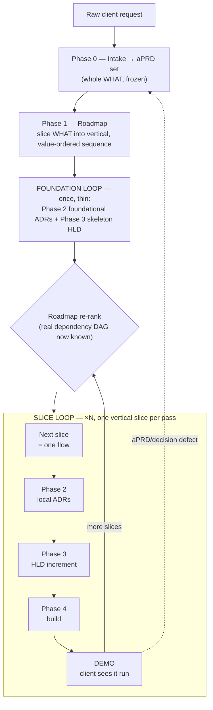
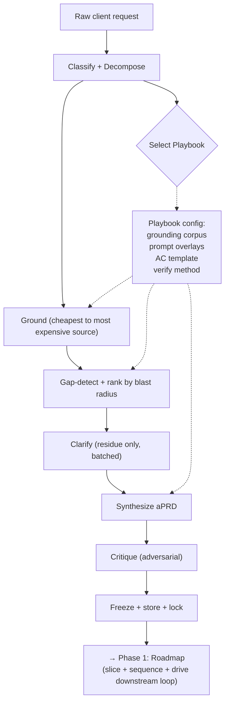
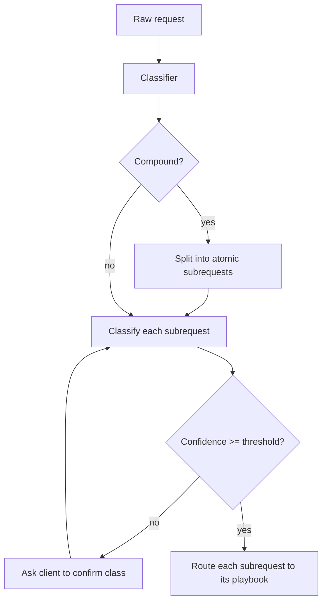
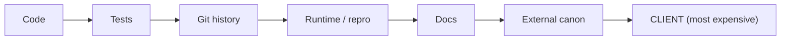
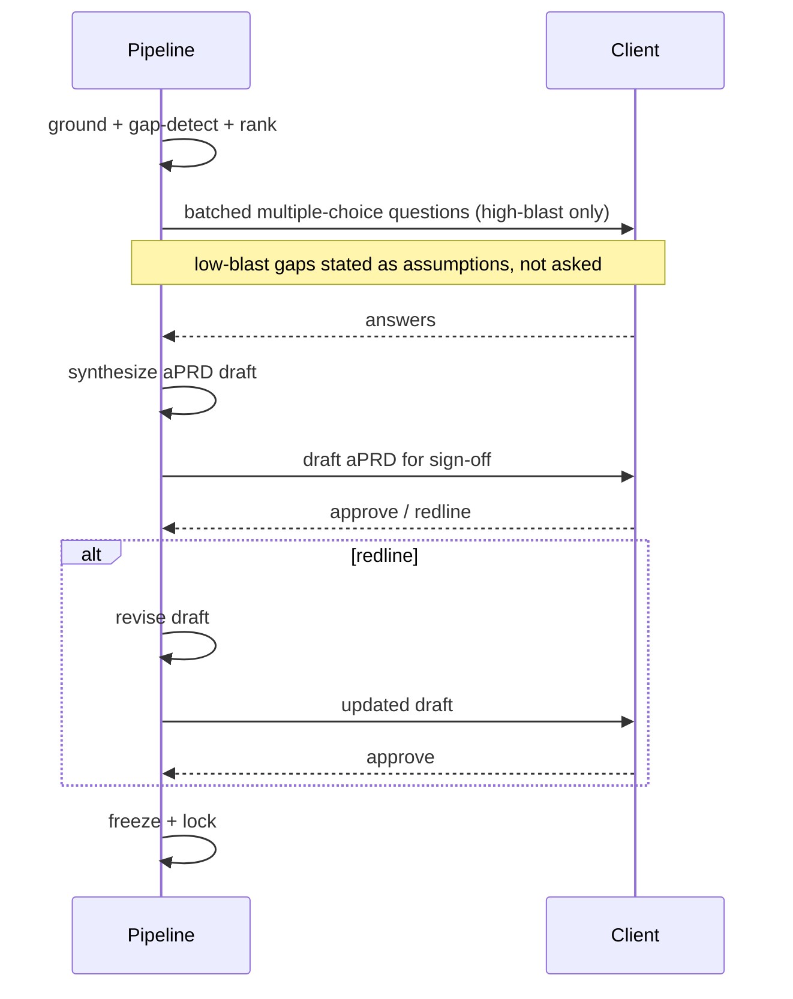
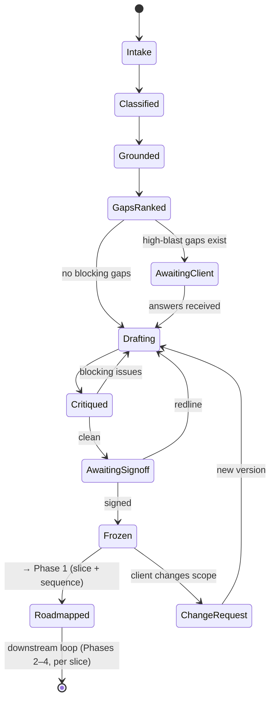
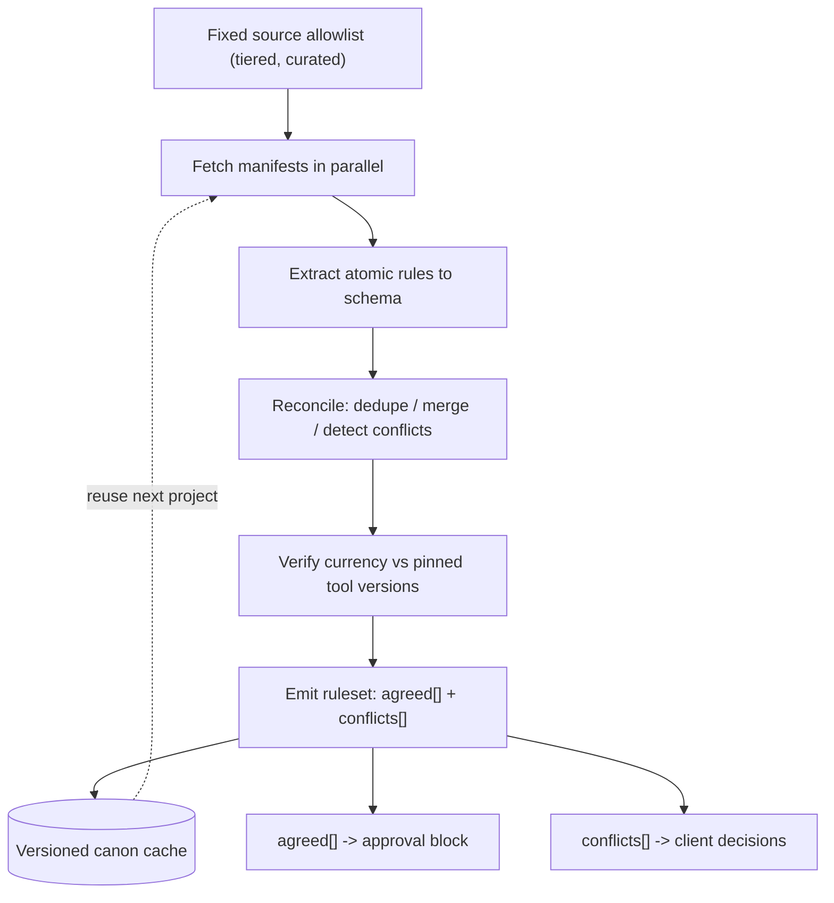
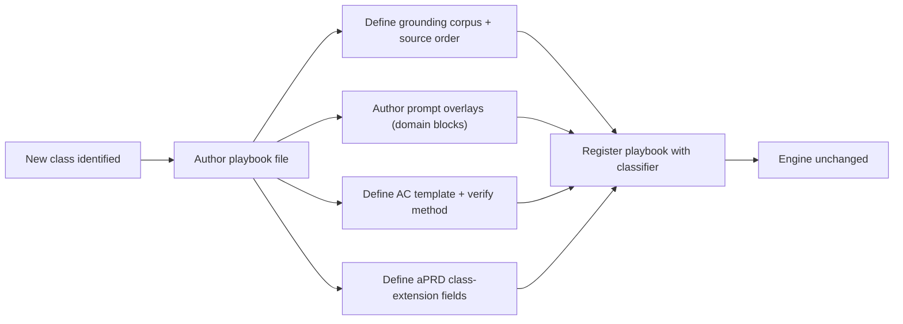

# Automated Delivery Pipeline — System Specification

| | |
|---|---|
| **Status** | Draft |
| **Version** | 0.3 |
| **Date** | 2026-06-06 |
| **Audience** | Engineers building the system; the agents executing it |
| **Scope** | The intake-to-delivery pipeline that turns any client request into verified software |

---

## 1. Purpose

Build a pipeline that converts **any** client request — vague, any class (new build, feature-add, bug fix, refactor, migration, perf, integration, investigation) — into **delivered, verified software**.

Three facts drive the whole design:

1. **Vague input is the normal case.** Clients don't know what they want until they see it. The request is a hypothesis, not a contract.
2. **"Done" is usually undefined.** Most delivery failures are failures to define "done" in testable terms before building.
3. **WHAT is mapped broad; HOW is built thin.** Knowing the whole WHAT up front is cheap and prevents architectural dead-ends. *Building* it whole is waterfall — the client sees nothing until the end. So Phase 0 captures the entire WHAT, then **Phase 1 (Roadmap)** slices it into vertical, demoable increments that the downstream design/build loop delivers one at a time.

The pipeline's job: compile vagueness into a **frozen, testable contract** (the aPRD), hand it to the roadmap to be sliced, then execute **one vertical slice at a time**. The build phase never sees the vagueness — it's been compiled away.

### 1.1 Goals

- Accept any request class through one entry point.
- Produce a machine-executable, human-verifiable contract before any code changes.
- Minimize expensive human (client) interaction without building the wrong thing.
- Make every downstream artifact traceable to a requirement.
- Feed a roadmap that slices the WHAT into vertical, demoable increments — never a big-bang build.
- Add new request classes without touching the engine.

### 1.2 Non-goals

- **Zero-question autonomy.** Impossible with vague input. Goal is *cheap* clarification, not none.
- **Reusing human PRDs as-is.** Prose PRDs are an *input* to extract from, not the executable contract.
- **A single mega-prompt.** Roles are separated for failure isolation and quality.
- **Building the whole WHAT at once.** The aPRD is broad by design but is *sliced before it is built*. Big-bang delivery is the waterfall this pipeline exists to avoid (see Phase 1 — Roadmap).

---

## 2. Core principles

These are load-bearing. Violating one breaks the system.

| # | Principle | Consequence if violated |
|---|---|---|
| P1 | Treat the request as a hypothesis, not a contract | Build the wrong thing confidently |
| P2 | "Done" is always a testable contract, never prose | Undefined done → infinite rework |
| P3 | One spine, swappable playbooks (strategy pattern) | Pipeline becomes branching spaghetti |
| P4 | The first gap to detect is the request **class** | Misroute → entire wrong pipeline runs |
| P5 | Exhaust cheap truth before expensive — **read before ask** | Burn client patience on answerable questions |
| P6 | Rank gaps by **blast radius**; ask only architecture/scope gaps | Either annoy client or build wrong |
| P7 | Client UX = recognition over recall (multiple-choice + defaults) | High friction, low completion |
| P8 | Frozen contract is immutable; change = new version + re-trigger | Silent scope creep corrupts the build |
| P9 | Stable IDs (R1, AC1, A1) thread spec → code → test | Lose traceability; can't trace drift |
| P10 | Adversarial critique before freeze | Residual ambiguity reaches build |
| P11 | LLM reconciles and verifies; it is **not** the source of truth | Stale/hallucinated facts ship |
| P12 | WHAT mapped broad, HOW built thin — the aPRD is sliced into vertical increments, never built whole | Big-bang waterfall; client sees nothing until the end |

---

## 3. Architecture overview

### 3.1 The whole pipeline — two loops, not one waterfall

The pipeline is **not** a single linear pass (that would be waterfall). It is one broad WHAT, then a thin **foundation loop** run once, then a **slice loop** run per vertical increment. Each slice ends in something the client can see run.



**Foundation is decided once and thin** (only what the first slice needs + obvious cross-slice invariants). **Everything else is built one vertical slice at a time** — each slice cuts through every layer it needs to become demoable. This is the structure that keeps the phase chain from collapsing into a waterfall; Phase 1 (Roadmap) is its controller.

### 3.2 The intake spine

One **spine** (written once) plus per-class **playbooks** (pluggable config). The spine runs every request. The playbook injects what differs.



**Spine** (invariant, Phase 0): classify, ground, gap-detect, clarify, synthesize, critique, freeze. Execution is downstream and **per slice** (Phases 2–4), driven by the roadmap.
**Playbook** (variant): grounding corpus, prompt overlays, AC template, verify method.

Test of correct abstraction: *adding a new request class must be adding a playbook file, never editing the engine.*

---

## 4. Request taxonomy & playbooks

Four axes shift per class. Everything else is shared.

| Class | Source of truth | Grounding action | Acceptance shape ("done") | Dominant risk |
|---|---|---|---|---|
| **Greenfield** | Client intent | Research **external** canon | New behavior is testable | Scope creep |
| **Feature-add** | Existing code + conventions + client intent | Read existing code/patterns first → ask residue → canon for new tech | New behavior testable; **no regression; matches conventions** | Regression; convention drift; integration break |
| **Bugfix** | Existing code + reproduction | Reproduce → localize → root-cause | Failing test now passes; **no regression** | Wrong root cause; regression |
| **Refactor** | **Current behavior** | Characterize; build safety net | Behavior **identical**; quality metric improved | Silent behavior change |
| **Migration** | Source + target contracts | Inventory + compatibility matrix | Parity across all; nothing breaks | Partial/hidden incompatibility |
| **Perf** | Current metrics | Profile; baseline | Metric ≥ target; behavior unchanged | Optimizing wrong thing; correctness loss |
| **Integration** | External API contract + our seams | Read API + read our code | Data flows end-to-end; failures handled | API misunderstood |
| **Investigation** | Reality (code/data/runtime) | Explore | Question answered **with evidence** | Answer without evidence |

### 4.1 The unifying insight — "done" is always a test; only its *generator* differs

```
Greenfield   →  generate tests from INTENT
Feature-add  →  generate tests for NEW behavior + REGRESSION tests for touched surface
Bugfix       →  generate a REPRODUCTION test (red → green)
Refactor     →  generate CHARACTERIZATION / golden tests from CURRENT behavior
Migration    →  generate PARITY tests (old output == new output)
Perf         →  generate a BENCHMARK with a threshold
Integration  →  generate end-to-end CONTRACT tests
Investigation→  evidence is the deliverable (no code AC)
```

The verify stage is universal *because* acceptance criteria are universal. That is why one spine accommodates every class.

---

## 5. Pipeline stages

### 5.1 Intake & Classify (+ decompose)

The first gap is the class itself. Real requests are often **compound** ("app crashes on upload, and while you're there make it faster and support PDFs" = bugfix + perf + feature). Decompose into atomic subrequests, classify each, route each.



- **Input:** raw request text + any attachments.
- **Output:** `{class, confidence, is_compound, subrequests[]}`.
- **Rule:** never guess the class silently. Low confidence or compound → confirm with client first.

### 5.2 Ground — exhaust cheap truth before expensive

Close gaps using the cheapest source that can. The client is the **most expensive** source (human latency). Read before ask; ask only the residue the codebase/runtime cannot answer.



This **flips stage order by class**:

- **Greenfield:** no code exists → ask client first, then research external canon.
- **Brownfield** (feature-add/bug/refactor/perf/integration): read code first (reproduce / root-cause / characterize per class) → then ask only the residue.

"Research" generalizes to: *close gaps from the cheapest available corpus.* Greenfield closes via external canon (§7); bugfix closes via code + reproduction. Same function, different corpus.

### 5.3 Gap detection & ranking

Find every place a competent engineer could build two different things. Rank by **blast radius**:

- **architecture** — changes structure / stack / deliverable → **must ask**
- **scope** — changes what's in/out → **must ask**
- **cosmetic** — safe to assume → **assume + announce, never ask**

- **Output:** ranked `gaps[]` with `{gap, interpretations[], blast_radius, reason}`.

### 5.4 Clarify — the client loop

Batched, minimal-touch, recognition over recall.



Rules: ≤ ~6 questions per batch, each multiple-choice with a recommended default; propose concrete options instead of open questions; one review gate on the draft; assume + announce everything low-blast.

### 5.5 Synthesize aPRD

Produce the contract (§6). Every requirement gets a binary, testable acceptance criterion. Every assumption traces to a gap. A requirement that cannot get a testable AC is flagged, not shipped.

### 5.6 Critique (adversarial)

A hostile-reviewer pass before freeze. Finds: requirements that could build two ways, ACs that aren't binary-testable, scope not bounded by OUT_OF_SCOPE. Emits blocking issues only; loops back to synthesize until clean.

### 5.7 Freeze

On client sign-off: render the immutable `aprd.frozen.md` + `aprd.lock` (content hash + signer + timestamp + version). After freeze, no edits — a scope change is a **new version** + change request that re-triggers affected downstream stages.

### 5.8 Hand off to the roadmap + downstream loop

Phase 0 ends at freeze. The frozen aPRD set is handed to **Phase 1 (Roadmap)**, which slices it into vertical increments and drives the downstream phases. Design (Phases 2–3), build (Phase 4), and verification happen **per slice**, not over the whole product at once. "Done" for a slice = its acceptance-criteria artifacts (AC tests / benchmarks / parity checks) pass **and** the client has seen it demoed. The build phase reads **only** the frozen aPRD (by R/AC id) and the slice's design — never the original vagueness.

### 5.9 Pipeline state machine



---

## 6. The aPRD artifact

The frozen spec — single source of truth every downstream agent reads. Structured and typed (not prose) so a machine can execute it; rendered readable so a client can sign it. Dual audience.

### 6.1 Schema — shared skeleton + class extensions

```yaml
# ALWAYS present
PROJECT:        <one line>
CLASS:          greenfield | feature-add | bugfix | refactor | migration | perf | integration | investigation
ENTITIES:       [ ... ]                 # data-model seeds
REQUIREMENTS:                           # numbered, atomic
  - id: R1
    text: <requirement>
CONSTRAINTS:    [ stack, scale, region, compliance ]
ASSUMPTIONS:                            # gap-fills, each traceable to a gap
  - id: A1
    text: <assumption>
    gap_ref: <gap id>
OUT_OF_SCOPE:   [ ... ]                 # explicit negative space
ACCEPTANCE:                             # binary, testable
  - id: AC1
    text: <observable pass/fail condition>
    req_ref: R1

# CLASS EXTENSIONS (only the matching block is added)
# feature-add:  INTEGRATION_SEAMS, REGRESSION_GUARD, CONVENTION_BASELINE
# bugfix:       REPRO_STEPS, ROOT_CAUSE, BLAST_RADIUS, REGRESSION_GUARD
# refactor:     BEHAVIOR_BASELINE, INVARIANTS, QUALITY_TARGET
# migration:    SOURCE_STATE, TARGET_STATE, COMPAT_MATRIX, ROLLBACK
# perf:         BASELINE_METRICS, TARGET_METRICS, WORKLOAD
# integration:  EXTERNAL_CONTRACT, OUR_SEAMS, FAILURE_MODES
# investigation:QUESTION, EVIDENCE_REQUIRED   # no code AC
```

### 6.2 Why this form

- **Acceptance criteria are the real payload** — they *are* the contract. Build = make AC pass. Test = verify AC. Without them "done" is undefined.
- **Assumptions logged, not buried** — audit trail; client challenges cheaply; wrong assumptions are traceable to the decision, not hidden in code.
- **Out-of-scope is load-bearing** — bounds the agent, stops gold-plating and creep.
- **Stable atomic IDs** — architecture cites R3, test cites AC2, commit cites both. Drift = any code not traceable to a requirement.
- **Atomic requirements are sliceable units** — Phase 1 (Roadmap) groups R*/AC* into vertical increments. Atomicity is what lets a slice cut cleanly through the stack; a monolithic requirement cannot be sliced vertically.

---

## 7. Research sub-pipeline (greenfield + feature-add canon grounding)

When grounding requires **external canon** (e.g. "follow TypeScript best practices"), this is not open-ended web search. It is **manifest mining + reconciliation**, because best practices already exist as code (lint rule configs, tsconfig bases). Fetch the authoritative manifests; the LLM reconciles and verifies but is never the source.



### 7.1 Source tiers

- **Tier 1 — canonical, machine-readable** (parse directly): tool rule configs, config bases, official docs.
- **Tier 2 — expert human** (extract opinions): style guides, reference books.
- **Tier 3 — empirical signal** (optional, expensive): configs from high-star OSS repos.

### 7.2 Efficiency levers

| Lever | Win |
|---|---|
| Bounded, curated allowlist | Kills web-search noise + latency |
| Fetch code/manifests, not prose | Ground truth, no summarization loss |
| **Cache the canon, version it** | Research once, reuse every project (biggest lever) |
| Parallel fetch | Wall-clock |
| LLM reconciles/verifies, never recalls | No stale or hallucinated rules |
| Verify against pinned tool versions | Output actually runs |

**The cache is the real efficiency answer.** First project pays full research cost; subsequent projects load `canon.vN.json` and fetch only deltas. Per-project research collapses to retrieval. **Verify stage is mandatory** — it catches hallucinated rule names and deprecated/superseded flags that training recall introduces.

This is the **first application of the canon lever**, reused at every downstream phase — slicing patterns (Phase 1), decision option-sets (Phase 2), reference architectures (Phase 3), coding scaffolds (Phase 4) — the system-wide efficiency engine.

---

## 8. Prompt library

Roles are separated. Each downstream role is the *same role* with a playbook-injected domain block + AC template — the engine is not rewritten per class.

**CLASSIFIER**
```
Classify request into: greenfield|feature-add|bugfix|refactor|migration|perf|integration|investigation.
Output {class, confidence, is_compound, subrequests[]}.
If compound: split into atomic subrequests, classify each.
If confidence < threshold: emit a clarifying question. Do not guess.
```

**EXTRACT**
```
Extract structure from the request.
Output JSON: {entities[], explicit_requirements[], implied_requirements[], stated_constraints[], unknowns[]}.
Do not invent requirements. Mark inferred items inferred:true. No prose.
```

**GAP-DETECT** (load-bearing)
```
Find ambiguity a competent engineer could resolve two different ways.
For each gap: {gap, interpretations[], blast_radius: architecture|scope|cosmetic, reason}.
Rank by blast_radius. architecture = changes structure/stack/deliverable. cosmetic = safe to assume.
Be adversarial. Assume the spec is a trap.
```

**QUESTION-GEN**
```
Input: gaps where blast_radius in [architecture, scope].
Produce <= 6 questions. Each MUST be multiple-choice with a recommended default marked.
Phrase for recognition, not recall. Never ask what can be safely assumed.
```

**SYNTHESIZE**
```
Produce the aPRD. Sections: PROJECT, CLASS, ENTITIES, REQUIREMENTS(R*), CONSTRAINTS,
ASSUMPTIONS(A*), OUT_OF_SCOPE, ACCEPTANCE(AC*) + the class-extension block.
Every AC binary/testable. Every assumption traceable to a gap.
If a requirement cannot get a testable AC, flag it; do not ship it.
```

**CRITIQUE** (adversarial)
```
You are a hostile reviewer. Find every requirement that could build two ways.
Find every AC that is not binary-testable. Find scope not bounded by OUT_OF_SCOPE.
Output blocking issues only.
```

**Research roles** (greenfield grounding): EXTRACT-RULES, RECONCILE, VERIFY — see §7.

**VERIFY-OUTPUT**
```
Execute the artifacts of "done" for this class (AC tests / benchmark / parity check).
Report pass/fail per AC id. On any fail, return to execute with the failing AC.
```

---

## 9. Client interaction model

- **Batch**, don't drip. Client attention is the scarce resource.
- **Multiple-choice > open-ended.** Offer options + a recommended default.
- **Propose, don't interrogate.** For canon approval, show the concrete list; client edits/deletes faster than they author.
- **One review gate** on the draft aPRD; sign-off = freeze.
- **Assume + announce** everything low-blast.

Principle: the autonomous promise is not *zero* questions — it is *cheap* questions. Two minutes of client time should remove the bulk of build risk.

---

## 10. Artifact storage & versioning

Everything in version control. The aPRD is the repository's root of truth.

```
project/
  .aprd/
    00-raw-request.md        # verbatim client input
    01-classification.json   # class + subrequests
    02-extraction.json
    03-grounding/            # code reads, repro logs, or research output
    04-gaps.json             # ranked
    05-questions.md
    06-answers.md
    07-assumptions.json      # traceable to gaps
    drafts/
      aprd.v1.md
      aprd.v2.md             # post-redline
    aprd.frozen.md           # SIGNED, immutable
    aprd.lock                # content hash + signer + timestamp + version
  ...                        # build output references aprd.frozen by R/AC id
```

**Rules**

- **Intermediates kept, append-only.** They are the audit trail: dispute resolution ("why build X?" → trace to `06-answers.md`), agent debugging, and run resumability.
- **Frozen aPRD is immutable.** Change = new version + change request + re-trigger of affected downstream stages. This is what stops silent scope creep.
- **Stable IDs everywhere.** Plan cites R3, test cites AC2, commit cites both — spec → code → test stays threaded.
- **Machine + human form.** JSON for agent stages; rendered Markdown for the client. The aPRD itself is structured Markdown serving both readers.
- **Lock file is the signature.** Tamper-evident contract.

---

## 11. Extensibility — adding a request class



A playbook is `{classifier hints, active stages, grounding corpus, prompt overlays, AC template, verify method, aPRD extension fields}`. If a new class forces an engine edit, the abstraction is wrong — fix the spine, not the playbook.

---

## 12. Failure modes & guardrails

| Failure mode | Guardrail |
|---|---|
| Build on assumptions (vague in, confident wrong out) | P1 + freeze gate; nothing executes pre-freeze |
| Misrouted request (wrong playbook) | Classifier confidence threshold + class confirmation |
| Compound request handled as one | Decompose into atomic subrequests before routing |
| Burned client patience | Read-before-ask; blast-radius filter; batched MCQ |
| Undefined "done" | Mandatory binary AC; requirement without AC is flagged |
| Residual ambiguity reaches build | Adversarial critique pass before freeze |
| Silent scope creep | Immutable frozen aPRD; change = new version |
| Stale / hallucinated research facts | Manifest mining + verify against pinned versions |
| Lost traceability | Stable IDs; build output cites R/AC |
| Refactor/migration changes behavior silently | Characterization/parity tests as the AC |
| Feature-add breaks existing behavior or drifts conventions | Regression guard + convention baseline as AC; brownfield read-first |
| Big-bang waterfall (client sees nothing until the end) | Roadmap slices WHAT vertically (Phase 1); foundation built once + thin, then slice-by-slice with a demo gate (P12) |

---

## 13. Glossary

- **aPRD** — agent-PRD. The frozen, typed, testable contract; the compiled output of intake.
- **Playbook** — per-class config plugged into the spine (corpus, prompts, AC template, verify method).
- **Spine** — the invariant pipeline written once and run for every request.
- **Blast radius** — how much an unresolved gap changes the build (architecture / scope / cosmetic).
- **Acceptance criterion (AC)** — a binary, testable statement defining part of "done."
- **Canon** — cached, versioned external best-practice ruleset used for greenfield grounding.
- **Grounding** — closing gaps from the cheapest capable source before asking the client.
- **Vertical slice** — a thin increment that cuts through every layer it needs to deliver one demoable, user-visible capability (opposite of a horizontal/by-layer cut). Defined and sequenced in Phase 1 (Roadmap).
- **Foundation loop / slice loop** — the once-only thin foundation pass (foundational ADRs + skeleton HLD) vs the per-slice design/build/demo loop; see Phase 1.

---

## 14. Open questions

- Threshold values: classifier confidence cutoff, max questions per batch.
- Canon cache invalidation policy (time-based vs tool-release-triggered).
- Human gate placement for high-risk brownfield changes (does freeze need a second reviewer?).
- Multi-subrequest sequencing: parallel vs dependency-ordered execution of decomposed compound requests.
- **Scope (resolved):** the pipeline terminates at an accepted STAGING demo (Phase 4 is terminal). Production release, client-environment handoff, and post-handoff rollback are out of scope.
