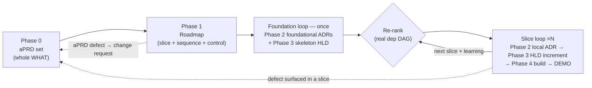
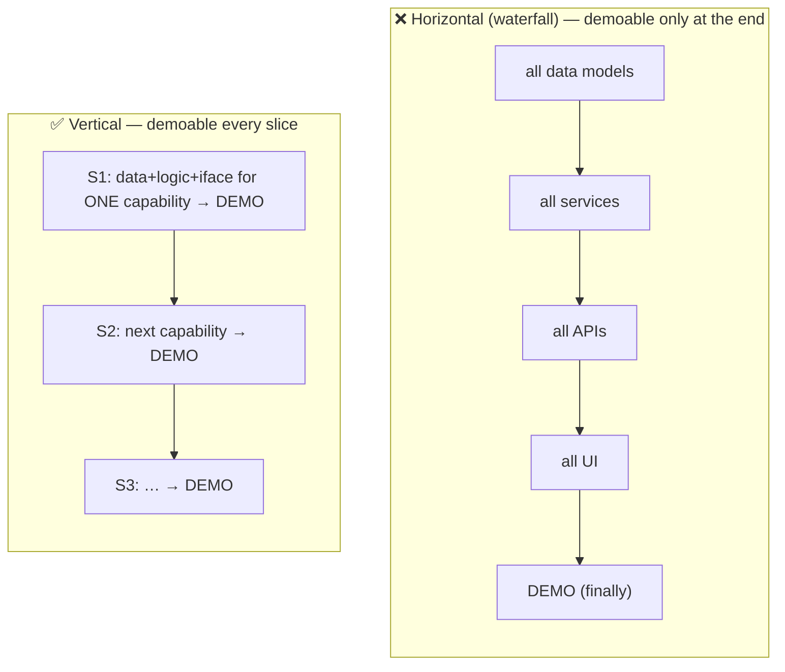
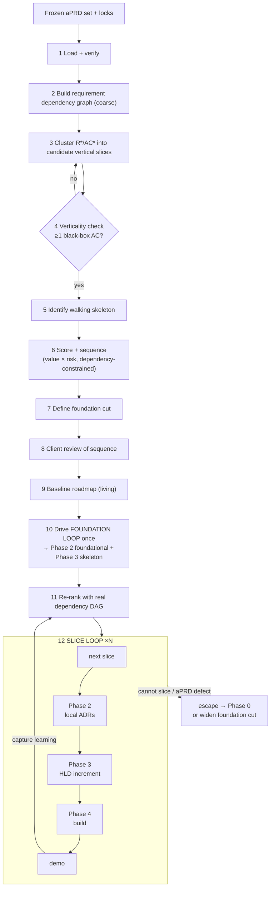
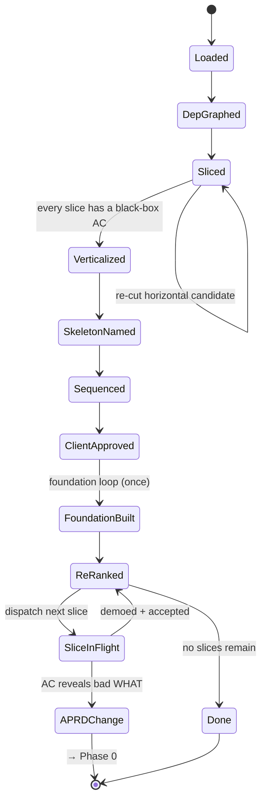
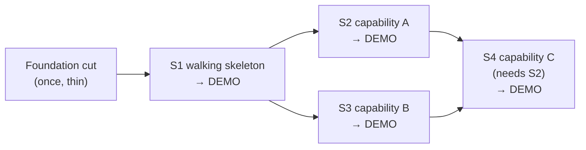
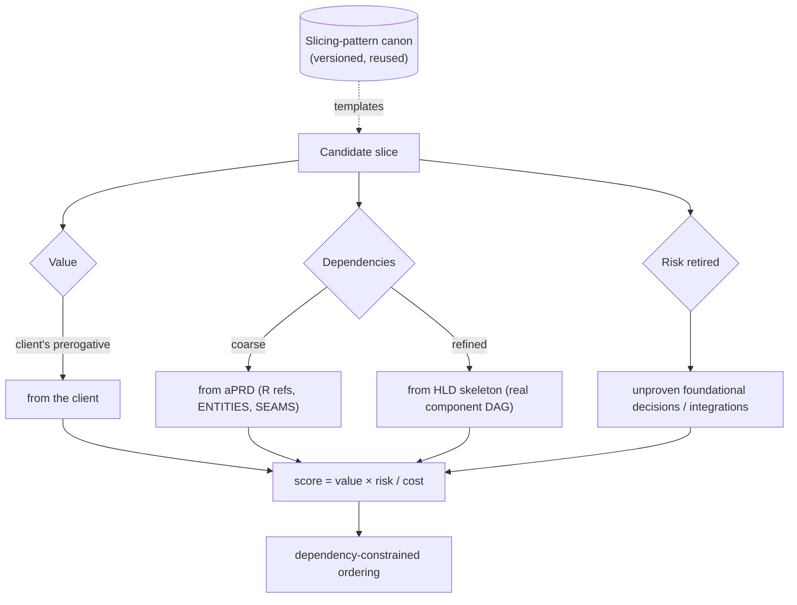
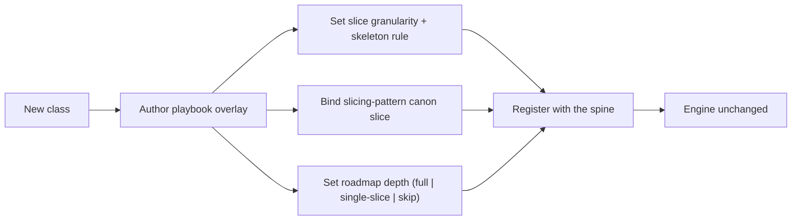

# Phase 1 — Automated Roadmap Pipeline (aPRD set → vertical slice sequence)

| | |
|---|---|
| **Status** | Draft |
| **Version** | 0.1 |
| **Date** | 2026-06-06 |
| **Audience** | Engineers building the system; the agents executing it |
| **Scope** | The stage that slices the frozen aPRD set into vertical, demoable increments, sequences them, and controls the foundation + slice delivery loops |
| **Predecessor** | Phase 0 — `00-automated-aprd-pipeline-spec.md` (produces the frozen aPRD set this phase slices) |

---

## 1. Purpose

Phase 0 froze the **whole WHAT**. Building it whole is waterfall — design every layer, build every layer, integrate at the end, and the client sees nothing until then. Phase 1 prevents that. It slices the WHAT into **vertical, demoable increments**, orders them by value and risk under dependency constraints, names the **walking skeleton**, and then acts as the **controller** that runs the downstream phases in two loops: a **foundation loop** (once, thin) and a **slice loop** (one vertical increment per pass).

Four facts drive the design:

1. **Horizontal slicing is waterfall.** Cutting by layer/artifact — all data models, then all services, then all UI; or all ADRs, then a full HLD, then build everything — defers all value to the end. Cutting **vertically** (one user-visible capability through every layer it needs) yields something demoable each pass.
2. **Not everything changes at slice speed.** Foundational decisions and the architectural skeleton are decided **once**; per-slice behavior is built **repeatedly**. The blast-radius lever (Phase 0 P6) sorts what is foundation from what is slice.
3. **A slice is vertical iff it has a passing black-box acceptance test.** A horizontal cut ("all DB tables") has no user-observable AC and cannot pass one. Phase 0's done-is-a-test contract (P2) is therefore the *enforcer* of verticality — no new machinery is needed.
4. **The roadmap is living, not frozen-once.** Slices reveal information — above all, the walking skeleton firms the real dependency graph. Re-rank the remaining slices each pass.

### 1.1 Goals

- Slice the frozen aPRD set into vertical increments — each demoable, each tracing to ≥1 AC.
- Sequence by value × risk, dependency-constrained; put the walking skeleton first.
- Define the **foundation cut** — the minimal foundational decisions + skeleton structure to build once, before slicing.
- Drive the foundation loop and dispatch slices through Phases 2–4; re-rank as slices complete and reveal information.
- Give the client the artifact they care about most: the order, and what they see first.

### 1.2 Non-goals

- **Designing or building.** Phase 1 decides *which slice, in what order*. Phases 2–4 decide HOW and build. It is a controller, not a designer.
- **Detailing the whole HOW up front.** Only the foundation cut is resolved before slicing; per-slice design/build is just-in-time.
- **Freezing the sequence forever.** The roadmap is versioned and *living* — it re-ranks on learning. (Completed-slice records are immutable; the *sequence* is not.)
- **A single mega-prompt.** Roles are separated for failure isolation and quality, as in Phase 0.

---

## 2. Where Phase 1 sits



- **Input:** the frozen aPRD set (`aprd.frozen.md` + `aprd.lock` per subrequest).
- **Output:** the **roadmap** — a vertical slice sequence + the foundation cut — plus per-slice dispatch into Phases 2–4 and continuous re-ranking.
- **Controller role:** Phase 1 does **not** end when the sequence is first drawn. It runs for the life of delivery: it triggers the foundation loop once, then dispatches each slice and re-ranks the remainder after every demo.

---

## 3. Core principles

Inherits Phase 0's P-series. These are the roadmap-specific additions; each is load-bearing.

| # | Principle | Consequence if violated | Echoes |
|---|---|---|---|
| RM1 | Slice **vertically**, never horizontally — each slice cuts through every layer it needs to be demoable | Waterfall; value only at the end | P2 |
| RM2 | A slice is valid **iff** it maps to ≥1 black-box, user-observable acceptance test (AC) | Horizontal cuts masquerade as progress | P2 |
| RM3 | **Two loops** — foundation (once, thin) vs slice (×N); split by blast radius | Re-decide foundations every slice, or big-bang the whole HOW | P6 |
| RM4 | First slice = **walking skeleton** — thinnest end-to-end path touching every foundational seam once | Integration risk discovered last, when it is most expensive | — |
| RM5 | Sequence by **value × risk, dependency-constrained** — riskiest-valuable first (after the skeleton) | Low-value or blocked work built first; risk deferred | P6 |
| RM6 | The roadmap is **living** — re-rank remaining slices as each completes and reveals information | A stale plan drives the build off a cliff | — |
| RM7 | A slice **is a flow** — its vertical path traverses the component graph along one flow F*, not across a layer | Slices drift back to horizontal (layer) cuts | — |
| RM8 | **WHAT broad, HOW thin** — detail each slice's design/build just-in-time | Premature full design = waterfall | P12 |
| RM9 | **Foundation is minimal** — decide only what the first slices + cross-slice invariants need; defer the rest to the slice that needs it | Over-decided up front (waterfall), or under-decided (slice blocked) | P6 |
| RM10 | **Slice size by INVEST** — smallest increment that is demoable AND delivers value or retires a named risk | Too big → mini-waterfall; too small → integration thrash | — |
| RM11 | Roadmap is a **controller**, not a builder — it drives loops and dispatches slices; it never designs or implements | Phase boundaries blur; the slicer starts deciding HOW | P3 |

---

## 4. What a slice is

A slice is a **vertical** increment: one user-visible capability, built through every layer it needs (data → logic → interface), demoable on its own. It is not a layer, a component, or a sprint of "backend work."

### 4.1 The unifying insight — verticality is a test property, not a judgment call

```
Horizontal cut   →  "all of layer X"               →  no user-observable AC      →  INVALID slice
Vertical cut     →  "one capability, end-to-end"    →  ≥1 black-box AC goes green  →  valid slice
Walking skeleton →  thinnest vertical cut that touches every foundational seam once  →  slice #1
```

The acceptance oracle from Phase 0 (P2) is the discriminator. A slice you **cannot write a passing black-box AC for is not vertical** — "all DB tables" has no user-facing pass/fail condition. No separate verticality machinery is needed: the same test that defines "done" defines "demoable." This is why slicing reuses the aPRD's `AC*` directly as the slice gate.

### 4.2 Slice catalog

| Kind | Purpose | Example |
|---|---|---|
| **walking_skeleton** | Prove the architecture composes end-to-end; retire integration risk first | One request flows ingress → domain → store → response; everything else hardcoded |
| **capability** | Deliver one user-visible capability | "User can reset their password" |
| **risk_spike** | Retire a specific named risk early | "Prove the third-party rate limit is survivable under expected load" |
| **hardening** | Pay non-functional debt a prior slice deferred | "Add the cache the latency NFR requires" |

### 4.3 Vertical vs horizontal



---

## 5. Pipeline stages

One **spine** (written once), per-class **playbook** overlays (§11) — identical philosophy to Phase 0.



### 5.1 Load & verify
Read the frozen aPRD set; verify each `aprd.lock` (tamper-evident). Assemble the full `R*` / `AC*` / `ENTITIES` / `CONSTRAINTS` inventory to be sliced.

### 5.2 Build the requirement dependency graph (coarse)
Derive a first-pass dependency graph from the aPRD alone: shared `ENTITIES`, `INTEGRATION_SEAMS`, explicit "R depends on R" references. This is **coarse** — the authoritative dependency DAG only exists after the HLD skeleton (§5.11). Good enough to sequence a provisional plan.

### 5.3 Cluster into candidate vertical slices
Group `R*`/`AC*` into candidate slices, each a coherent demoable capability. A slice pulls *some* of every layer it needs — never "all of one layer." Each candidate carries its `requirements`, its `acceptance` (the demo gate), value, and any named risk it retires.

### 5.4 Verticality check
Reject any candidate without ≥1 black-box, user-observable AC (§4.1) — that is a horizontal cut. Send it back to clustering to be re-cut or merged into a vertical neighbor. This gate is what mechanically prevents horizontal slicing.

### 5.5 Identify the walking skeleton
Find the thinnest end-to-end slice that touches **every foundational seam once** (ingress, domain, persistence, the primary external integration). It carries minimal behavior — its job is to prove the architecture composes and retire integration risk before any feature depth is built. This becomes slice #1.

### 5.6 Score & sequence
Order the remaining slices by **value × risk / cost**, constrained by the dependency graph (a slice never precedes one it depends on). Riskiest-and-most-valuable first; the skeleton always leads. Output the sequence + a one-line rationale per position.

### 5.7 Define the foundation cut
From slice-1 (the skeleton) + obvious cross-slice invariants, name the **minimum** to decide and build once:
- `foundational_decisions` → the categories Phase 2 must resolve in its **foundation pass** (style, stack, persistence, boundary strategy, the cross-cutting invariants).
- `skeleton_seams` → the contracts Phase 3 must establish in its **skeleton pass**.
Everything not in the cut is deferred to the slice that first needs it (RM9). The cut is deliberately thin — widening it later is cheaper than building the wrong foundation.

### 5.8 Client review of the sequence
Sequence is the client's prerogative — they are paying and they care intensely about what comes first. Present it recognition-over-recall (here is the order and the first demo; reorder?). One gate. (Contrast: the *decisions* and *structure* downstream are internal — see §9.)

### 5.9 Baseline the roadmap (living)
Version and store the roadmap. Unlike the aPRD/ADR/HLD, it is **not frozen-immutable** — it is a living, versioned plan. Re-ranks bump the version; the history is append-only. Completed-slice records, once accepted, are immutable.

### 5.10 Drive the foundation loop (once)
Dispatch the foundation cut: Phase 2 resolves the foundational ADRs; Phase 3 draws the skeleton HLD (component graph + foundational contracts + NFR mechanisms). This runs **once**. Its output is the frame every slice extends.

### 5.11 Re-rank with the real dependency DAG
The skeleton HLD yields the true component dependency graph (= build DAG). Replace the coarse graph from §5.2; re-rank the remaining slices against real dependencies before dispatching them.

### 5.12 Dispatch the slice loop (×N)
For each slice in order: Phase 3 extends the skeleton (HLD increment, emitting local ADRs via Phase 2), Phase 4 builds it against frozen contracts, verify (the slice's AC tests + design-layer tests), **demo**. After each demo: mark the slice accepted, capture learning (new dependencies, scope discoveries, risk outcomes), and re-rank the remainder (§5.11 loop).

### 5.13 Escape hatches
- **A capability cannot be cut into a demoable vertical slice** (its AC depends on un-built foundation): either fold the missing foundation into the cut / a skeleton extension, or re-slice.
- **A slice's AC reveals the aPRD is ambiguous or wrong:** change request → Phase 0 → new aPRD version → re-slice. Phase 1 never patches the WHAT.
- **A flood of mid-slice foundational surprises** = the foundation cut was too thin → re-open a foundation mini-pass (Phase 2 foundational) and tune the cut. This is the feedback the HLD spec's "local-ADR flood" signal feeds.

### 5.14 Pipeline state machine



---

## 6. The roadmap artifact

Dual audience: a machine-readable slice list downstream phases dispatch from; a rendered sequence + demo plan the client signs off.

### 6.1 Schema

```yaml
SLICES:
  - id: S1
    name: <demoable capability, one line>
    kind: walking_skeleton | capability | risk_spike | hardening
    requirements: [R1, R3]          # subset of aPRD R*
    acceptance:    [AC1, AC2]        # REQUIRED — the demo gate; proves verticality
    flow_ref:      F1                # the vertical path (bound once the HLD skeleton exists)
    value:         high | med | low  # from the client
    retires_risk:  <named risk | null>
    depends_on:    [ ]               # slice-level prerequisites
    demo:          <what the client will watch run>
    status:        planned | in_progress | demoed | accepted
FOUNDATION_CUT:
  foundational_decisions: [ <categories the first slices need> ]   # → Phase 2 foundation pass
  skeleton_seams:         [ <contracts the skeleton must establish> ] # → Phase 3 skeleton pass
  cross_slice_invariants: [ <auth model, error strategy, observability — decided once> ]
SEQUENCE: [S1, S2, S3, …]            # value/risk-ordered, dependency-legal, LIVING
COVERAGE: <every aPRD R* lands in >=1 slice>   # no requirement orphaned
VERSION:  <roadmap version; re-ranks bump it>
```

### 6.2 Example — slice sequence with dependencies



### 6.3 Why this form

- **Acceptance is the verticality proof.** A slice without a black-box AC is not a slice (RM2). Reusing the aPRD's `AC*` keeps the demo gate honest and traceable.
- **The sequence is living.** Re-ranking on learning is a feature, not drift (RM6). Versioning the plan (not freezing it) is the deliberate contrast with every other phase artifact.
- **Coverage prevents orphans.** Every `R*` must land in ≥1 slice, or it will never be built. Coverage is the slice-layer analog of Phase 0's requirement-completeness check.
- **The foundation cut is the anti-waterfall lever.** Naming the *minimum* to decide once is what lets the rest stay thin and incremental (RM8, RM9).

---

## 7. Grounding — value, dependency, and risk sourcing

Sequencing is a grounding problem: value, dependencies, and risk each come from the cheapest capable source.



- **Value is the one input the client owns.** Decisions (Phase 2) and structure (Phase 3) are internal, but *order* belongs to the client (§9).
- **Dependencies are coarse then refined.** The aPRD gives a first pass; the HLD skeleton gives the authoritative DAG — which is why the roadmap re-ranks after the foundation loop (§5.11). Same exploratory-sketch → baseline pattern the ADR↔HLD boundary uses.
- **The canon lever, second reuse.** Slicing patterns recur (auth-first, walking-skeleton-first, CRUD-per-entity, read-before-write). Cache reference slice plans per project archetype as versioned canon — the second application of the lever after Phase 0's best-practice canon (Phases 2–4 extend it: decision option-sets, reference architectures, coding scaffolds).

---

## 8. Prompt library

Roles separated, same as Phase 0. Each is the same role with a playbook-injected class block.

**SLICE-EXTRACT**
```
Input: the frozen aPRD set (R*, AC*, ENTITIES, CONSTRAINTS).
Cluster requirements into candidate VERTICAL slices: each is one user-visible
capability cutting through every layer it needs. Per slice:
{id, name, requirements:[R*], acceptance:[AC*], value, retires_risk, depends_on}.
Never group "all of one layer" — that is horizontal. Pull only what one capability needs.
```

**VERTICALITY-CHECK**
```
For each candidate slice, confirm >=1 acceptance criterion is black-box and
user-observable (a client could watch it pass). Reject any slice without one as a
horizontal cut; return it to be re-cut or merged. Output: valid[] + rejected[] with reason.
```

**SKELETON-IDENTIFY**
```
Find the thinnest end-to-end slice that touches every foundational seam once
(ingress, domain, persistence, primary integration) with minimal behavior.
This is the walking skeleton — slice #1. Output it + the seams it must establish.
```

**SEQUENCE**
```
Order slices by value × risk / cost, constrained by depends_on (no slice before its
prerequisite). Skeleton leads. Output the ordered sequence + one-line rationale per
position. Flag any dependency cycle as a slicing defect.
```

**FOUNDATION-CUT**
```
From the walking skeleton + cross-slice invariants, name the MINIMUM to decide and
build once: foundational_decisions (→ Phase 2) and skeleton_seams (→ Phase 3).
Defer everything else to the slice that first needs it. Bias thin — under-cut, not over-cut.
```

**RE-RANK**
```
Input: completed slices + their learnings + the real dependency DAG (from the HLD skeleton).
Re-order the remaining slices. Preserve dependency legality. Note any slice whose value or
risk changed and why. Do not thrash: re-order only on material new information.
```

**SEQUENCE-REVIEW** (client-facing)
```
Present the slice sequence as recognition-over-recall: the order, what the first demo shows,
and the value rationale. Offer reordering as multiple-choice, not an open prompt.
Capture the client's priority overrides.
```

---

## 9. Interaction & gate model

- **Client-facing — by design, unlike Phases 2–3.** The roadmap is where the client re-engages after sign-off, because **order is their prerogative**: what gets built first, what they see demoed, where value lands soonest.
- **One gate** on the initial sequence; subsequent re-ranks are surfaced as updates (and as a fresh demo each slice), not re-negotiated from scratch.
- **The phase symmetry:** Phase 0 client-facing (the WHAT), **Phase 1 client-facing (the order/WHEN)**, Phases 2–3 internal (the HOW), Phase 4 client-facing again at the demo (the RESULT). The client owns the what, the when, and sign-off on the result; the delivery team owns the how.
- **Defects route, not patch.** A bad WHAT goes back to Phase 0 (§5.13); the roadmap never silently reinterprets the contract.

Principle carried from Phase 0: cheap human touch, not zero. The client spends minutes ordering value, not hours specifying build.

---

## 10. Artifact storage & versioning

Sibling to `.aprd/`. The roadmap is the delivery plan's root of truth.

```
project/
  .aprd/                          # Phase 0 (frozen aPRDs)
  .roadmap/
    00-inputs.json                # loaded aPRD set + lock verification
    01-dep-graph.json             # requirement dependency graph (coarse → refined)
    02-slices.json                # candidate + accepted slices
    03-verticality.json           # check results (valid / rejected + reason)
    04-foundation-cut.json        # → Phase 2 foundational + Phase 3 skeleton
    roadmap.md                    # human-facing sequence + demo plan (living)
    roadmap.v1.json               # versioned snapshots; re-ranks bump the version
    roadmap.v2.json
    slice-log/                    # per-slice records: planned → demoed → accepted (immutable once accepted)
      S1-walking-skeleton.md
    roadmap.lock                  # current baseline: content hash + signer + version
```

**Rules**

- **The plan is living; the records are not.** The *sequence* re-ranks (versioned, append-only history). A *completed slice's* record is immutable once accepted — the audit trail of what was demoed and signed off.
- **Coverage is enforced.** Every aPRD `R*` must appear in ≥1 slice; an orphan requirement is a slicing defect.
- **Foundation cut is a contract** with Phases 2 and 3 — the explicit minimum to build once.
- **Machine + human form** — JSON slice list for dispatch; rendered Markdown sequence + demo plan for the client.
- **Lock = the current baseline signature** the foundation loop and slice loop dispatch against.

---

## 11. Extensibility — depth per class (playbook-toggled)

Roadmap depth scales with class blast radius, set by the same playbook driving Phase 0.

| Class | Phase 1 depth |
|---|---|
| **Greenfield / large feature-add** | Full roadmap — many slices, skeleton-first, full foundation cut |
| **Migration** | Slices = parity-by-module increments; skeleton = thinnest end-to-end migrated path |
| **Integration** | Slices = per-endpoint / per-flow; each demoable against the external API |
| **Bugfix / Perf / small refactor** | Single slice — the change is already a thin vertical increment; roadmap is trivial |
| **Investigation** | No slices; the investigation plan is the artifact (skip) |



If a new class forces an engine edit, the abstraction is wrong — fix the spine, not the playbook. (Same test as Phase 0.)

---

## 12. Failure modes & guardrails

| Failure mode | Guardrail |
|---|---|
| Horizontal slicing (by layer) | Verticality check (RM2); a slice needs a black-box AC or it is rejected |
| Big-bang waterfall | Two-loop split (RM3); foundation thin (RM9), then slice-by-slice with a demo gate |
| Foundation too thin (mid-slice surprises) | Re-rank + foundation gap escape (§5.13); local-ADR flood signal from Phase 3 |
| Foundation too thick (over-decided up front) | Cut covers only the first slices + invariants (RM9); bias thin |
| Slice too big (mini-waterfall) | INVEST sizing (RM10); split until demoable-and-small |
| Slice too small (integration thrash) | INVEST sizing (RM10); merge into a vertical neighbor |
| Sequence ignores dependencies (slice blocked) | Dependency-constrained ordering (RM5); cycle flagged as a defect |
| Integration risk discovered late | Walking skeleton first (RM4) retires it up front |
| Requirement never built (orphan) | Coverage check — every R* in ≥1 slice |
| Client surprised by order | Client gate on the sequence (§9) |
| Plan frozen too hard, can't adapt | Living, versioned roadmap (RM6); re-rank on learning |
| Roadmap starts deciding HOW | Controller-not-builder boundary (RM11); HOW belongs to Phases 2–4 |

---

## 13. Glossary

- **Vertical slice** — a thin increment cutting through every layer it needs to deliver one demoable capability. The unit Phase 1 emits and sequences.
- **Horizontal slice** — a by-layer cut (all data, all services, …) with no user-observable AC; the waterfall antipattern this phase rejects.
- **Walking skeleton** — the thinnest vertical slice that touches every foundational seam once; slice #1, retires integration risk.
- **Foundation loop / slice loop** — the once-only thin foundation pass (foundational ADRs + skeleton HLD) vs the per-slice design/build/demo loop.
- **Foundation cut** — the minimum to decide and build once before slicing; a contract with Phases 2 and 3.
- **Verticality check** — the gate that rejects any slice lacking a black-box AC.
- **INVEST** — slice-quality canon: Independent, Negotiable, Valuable, Estimable, Small, Testable.
- **Living roadmap** — a versioned, re-rankable sequence (not a frozen artifact); completed-slice records are immutable.
- **Demo gate** — a slice is done only when its AC passes *and* the client has seen it run.

---

## 14. Open questions

- **Slice granularity threshold** — how small is "demoable and small enough," and who calibrates it per class (mirrors Phase 0's classifier-confidence open question).
- **Foundation-cut sizing** — how much to decide once vs defer; the cut/defer threshold ties directly to Phase 2's foundational/local boundary.
- **Re-rank stability** — how to re-rank on learning without thrashing the plan every slice; minimum-material-change rule.
- **Value elicitation** — cheapest way to extract a value ranking from the client (MoSCoW? pairwise? buy-a-feature?).
- **Walking-skeleton scope** — how thin is too thin; it must touch every foundational seam, but how much behavior is the minimum to prove composition.
- **Shared-contract slices** — when two slices touch the same contract, the build-order + mock strategy (ties to Phase 3's contracts-frozen / parallel-build property).
- **Slice-level rollback** — semantics when a demoed slice is rejected by the client post-demo: re-slice, supersede, or revert.
