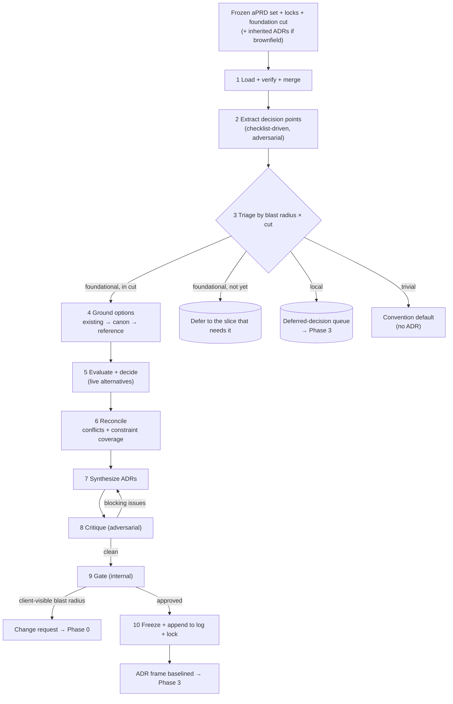
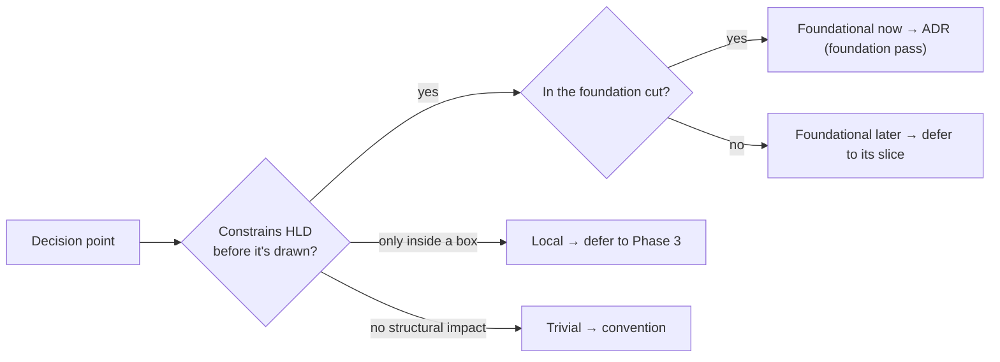
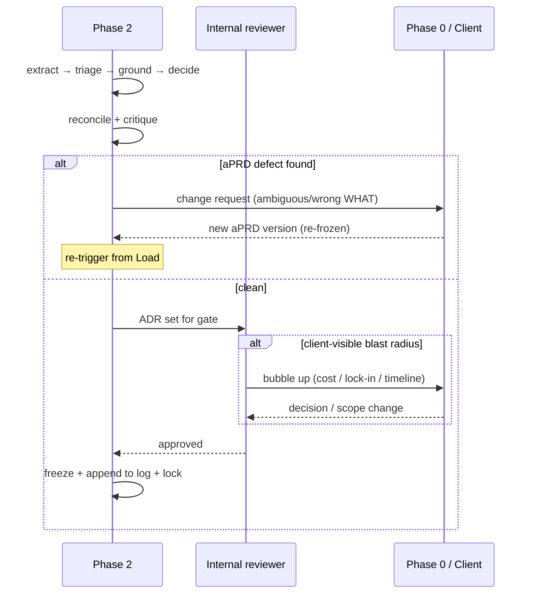
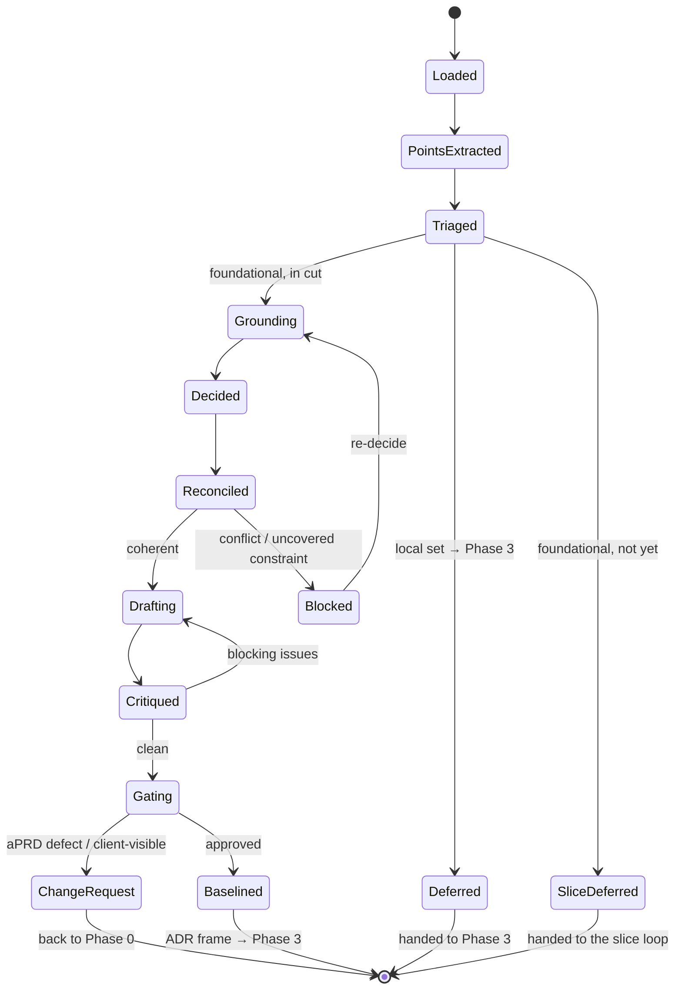
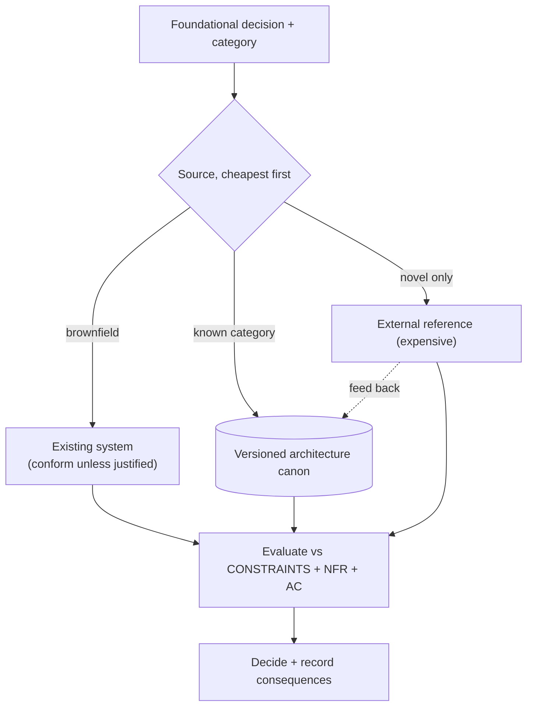
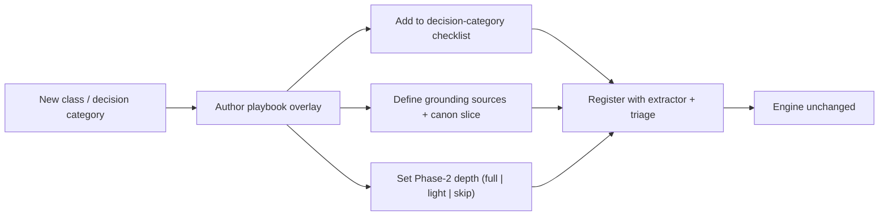

# Phase 2 — Automated Decision Pipeline (aPRD + Roadmap → ADRs)

| | |
|---|---|
| **Status** | Draft |
| **Version** | 0.3 |
| **Date** | 2026-06-06 |
| **Audience** | Engineers building system; agents executing it |
| **Scope** | Stage turns frozen aPRD set + roadmap foundation cut into coherent, traceable set of Architecture Decision Records |
| **Predecessors** | Phase 0 — `00-automated-aprd-pipeline-spec.md` (WHAT) · Phase 1 — `01-automated-roadmap-pipeline-spec.md` (slices + foundation cut) |

**Change log**
- **v0.3** (2026-06-09) — T10 economy cut (caveman register + AB8): killed banned hedge/filler words. Substance invariant. New version = the change request (P8); re-lock at next freeze.

---

## 1. Purpose

Phase 0 compiles vague client requests into **frozen aPRDs** — WHAT. Phase 1 (Roadmap) slices that into vertical increments, names **foundation cut**: minimum to decide and build once. Phase 2 consumes both, produces **ADRs** — WHY-this-HOW: architecturally-significant decisions, with live alternatives + consequences, settled *before* structure (HLD) drawn.

Three facts drive design:

1. **Decisions precede structure.** HLD is *consequence* of decisions, not source of them. Style, stack, persistence paradigm, boundary strategy determine which components even drawable. Draw first, justify later = ADR antipattern — produces reverse-engineered rationale + dead alternatives.
2. **aPRD does not say HOW.** Bounds solution (CONSTRAINTS, ACCEPTANCE) but leaves search space of valid architectures. Phase 2 collapses *foundational* part of that space into recorded, defensible decisions.
3. **Foundational ≠ everything up front.** Deciding whole product HOW before any slice ships = decision-layer waterfall. Roadmap foundation cut scopes Phase 2 to what **first slices + cross-slice invariants** need; later foundational needs decided when their slice activates.

So Phase 2 runs **two modes**:
- **Foundation pass** — once, the bulk: resolve foundational decisions in cut. Output = baselined frame skeleton HLD drawn inside.
- **Slice pass** — per slice, incremental: most per-slice decisions *local*, emitted as Phase 3 draws HLD increment; slice surfacing *missed foundational* decision triggers foundational ADR here (signals cut too thin).

### 1.1 Goals

- Resolve foundational decisions roadmap **foundation cut** requires — not whole product every decision up front.
- Record each with real alternatives + consequences; make every ADR traceable to aPRD elements that force it, every covered constraint accountable to decision.
- Keep decision-making internal; re-engage client only when decision has client-visible blast radius.
- Append local ADRs (emitted per slice) to single shared log; add new decision categories or request classes without touching engine.

### 1.2 Non-goals

- **Producing HLD.** Drawing components, interfaces, data model = **Phase 3**. Phase 2 sets frame; does not paint inside it.
- **Deciding whole product HOW up front.** Only foundation cut resolved in foundation pass. Later slice foundational need decided when that slice activates, not pre-emptively.
- **Resolving local decisions.** Decisions emerging only while drafting structure belong to Phase 3, emitted as local ADRs while it draws. Phase 2 parks them in deferred-decision queue.
- **Re-opening aPRD.** aPRD = read-only input. Defect found here becomes change request to Phase 0, never silent reinterpretation.
- **Single mega-prompt.** Roles separated for failure isolation + quality, exactly as Phases 0–1.

---

## 2. Where Phase 2 sits

```mermaid
flowchart LR
    P0["Phase 0<br/>aPRD set (WHAT)"] --> P1["Phase 1<br/>Roadmap"]
    P1 -->|foundation cut| FP["Phase 2 — FOUNDATION PASS (once)<br/>foundational ADRs → baselined frame"]
    FP --> P3["Phase 3<br/>HLD (skeleton → increments)"]
    FP --> LOG[("Shared ADR log<br/>append-only")]
    P3 -->|local ADRs (slice loop)| LOG
    P3 -.->|missed foundational decision| FP
    FP -. aPRD defect → change request .-> P0
    P3 -. aPRD defect .-> P0
```

- **Input:** frozen aPRD set (`aprd.frozen.md` + `aprd.lock` per subrequest), roadmap **foundation cut** (which foundational categories in play now), and — for brownfield — existing system ADRs (loaded or reverse-engineered).
- **Output:** append-only **ADR log** (foundational decisions, frozen) + **deferred-decision queue** (local forks handed to Phase 3).
- **Boundary rule:** Phase 2 foundation pass produces *foundational* ADRs scoped by cut. Phase 3 (HLD) appends *local* ADRs to same log as structure drawn, slice by slice. Log spans phases; Phase 2 seeds it.

---

## 3. Core principles

Inherits Phase 0 P-series + Phase 1 RM-series. These = decision-specific additions; each load-bearing.

| # | Principle | Consequence if violated | Echoes |
|---|---|---|---|
| D1 | Decisions precede structure — ADRs = **input** to HLD, not output | Reverse-engineered rationale; dead alternatives; ADR theater | — |
| D2 | Resolve **foundational** decisions only — and only those in roadmap **foundation cut**; local decisions defer to Phase 3 | Premature over-decision, or HLD blocked on missing frame | P6, RM9 |
| D3 | Every ADR carries **live alternatives** (≥2 real options + why-rejected) | No real decision made; cannot revisit cheaply | P10 |
| D4 | Every ADR traces to ≥1 aPRD element (R / AC / CONSTRAINT) | Untraceable ADR = unrequested architecture (gold-plating) | P9 |
| D5 | Every in-scope aPRD CONSTRAINT addressed by ADR or explicitly deferred | Silent architectural risk; constraint found violated in build | P9 |
| D6 | ADR log append-only; **supersede, never edit**; status = lifecycle | Decision history lost; can't tell current from historical | P8 |
| D7 | Options grounded cheapest-source-first: existing system → canon → reference. LLM reconciles, **not** source | Hallucinated or stale architecture patterns shipped | P5, P11 |
| D8 | Adversarial critique before accept (strawman + coverage checks) | Fake choices + uncovered constraints pass to HLD | P10 |
| D9 | aPRD read-only; defect → change request to Phase 0, never silent fix | Phase 2 silently re-scopes contract | P8 |
| D10 | Decision depth scales with class blast radius (playbook-toggled) | Bugfix drowns in ceremony, or greenfield under-decided | P3, P6 |
| D11 | **Two modes** — foundation pass (once, cut-scoped) + slice pass (per slice, incremental); never decide whole HOW up front | Decision-layer waterfall | RM3, RM8 |

---

## 4. Decision taxonomy

Extractor works from **checklist of foundational decision categories** — recognition over recall (P7). Open-ended "find the decisions" misses things; category list does not. Not every category fires for every project, and **roadmap foundation cut selects which fire *now*** (foundation pass) vs which wait for slice that needs them. Playbook (§11) selects which in play for the class.

| Category | Decides | Typical force (aPRD source) |
|---|---|---|
| **Architectural style** | monolith / modular monolith / services / event-driven | scale, team shape, CONSTRAINTS |
| **Tech stack** | language, runtime, framework | CONSTRAINTS (often pre-pinned → ADR records adoption + rationale) |
| **Persistence** | datastore paradigm; shared vs per-component | ENTITIES, scale, consistency needs |
| **Sync vs async** | request/response vs messaging/streaming | latency + throughput requirements |
| **Boundary strategy** | *how* modules cut (not boxes — that's HLD) | REQUIREMENTS clustering, domain seams |
| **API style** | REST / GraphQL / gRPC / events | INTEGRATION contracts, consumers |
| **Cross-cutting** | auth model, error strategy, observability, config/secrets | compliance, NFRs |
| **Deployment topology** | runtime, regions, scaling unit | region/compliance CONSTRAINTS |
| **Build/test strategy** | how "done" mechanically proven | ACCEPTANCE shape (done = test) |
| **Conformance (brownfield)** | conform to existing vs introduce new — *each deviation = one ADR* | existing system + new requirement |

### 4.1 The unifying insight — a decision is foundational iff it constrains the HLD before it is drawn; the cut says *when*

```
Foundational, in the cut  →  the first slices need it now        → ADR in the foundation pass
Foundational, not yet     →  a later slice will need it           → defer to that slice's pass
Local                     →  surfaces only while drawing a box    → defer to Phase 3 (emits a local ADR)
Trivial                   →  no structural blast radius           → convention default, no ADR
```

Same blast-radius triage Phase 0 used for *gaps* (P6) and Phase 1 used for *foundation vs slice* (RM9), now applied to *decisions* — with second axis (cut) deciding *when*. Triage keeps Phase 2 from either over-deciding (resolving things HLD should, or things only later slice needs) or under-deciding (leaving frame to chance).

---

## 5. Pipeline stages

One **spine** (written once), per-class **playbook** overlays (§11) — identical philosophy to Phases 0–1. Spine runs in full during **foundation pass**; in **slice pass** re-invoked only for rare foundational addition a slice surfaces (local decisions emitted by Phase 3).



### 5.1 Load, verify & merge
Read frozen aPRD set; verify each `aprd.lock` (tamper-evident). Load roadmap **foundation cut** — scopes which decision categories resolved now. For brownfield, load existing ADRs (or reverse-engineer baseline). Partition upcoming decision space into **global** (one decision serves whole set) and **scoped** (one subrequest). ADR log = **project-level, single monotonic sequence** — decisions cross-cut subrequests + slices, so numbering not per-aPRD.

### 5.2 Extract decision points
Walk aPRD set against §4 checklist. For each point competent architect could resolve ≥2 ways with structural blast radius, emit `{decision, category, forced_by:[refs], candidate_blast_radius}`. Adversarial: assume unstated decision hiding. Do **not** invent decisions aPRD does not force (= gold-plating at decision layer).

### 5.3 Triage by blast radius × cut
Classify each point **foundational | local | trivial** (§4.1), then for foundational, **in-cut | not-yet** against roadmap cut. In-cut foundational proceed; not-yet foundational defer to their slice; local → deferred queue (Phase 3); trivial → convention default, announced not decided. This = gate that scopes foundation pass.



### 5.4 Ground options
Per in-cut foundational decision, source candidate options **cheapest-first** (D7):
- **Existing system** (brownfield) — strongest constraint; conform unless deviation justified.
- **Cached architecture canon** — Phase 0 canon (§7 of Phase 0) extended to decision option-sets / trade-off profiles per decision category, versioned + reused.
- **External reference** — expensive; only for novel decisions absent from canon.

LLM evaluates + reconciles; never *recalls* option set as ground truth.

### 5.5 Evaluate & decide
Score options against aPRD CONSTRAINTS, ACCEPTANCE, cross-cutting NFRs. Pick one. Alternatives must be **live** — evaluated before choice committed, never strawmen written to justify foregone pick (D1, D3). Record consequences (positive, accepted cost, follow-on decisions enabled/constrained).

### 5.6 Reconcile
Decisions interact (event-driven constrains persistence; per-region constrains datastore). Detect:
- **Cross-decision conflicts** — two ADRs that cannot both hold.
- **Constraint violations** — any decision breaching aPRD CONSTRAINT (hard fail).
- **Coverage gaps** — any in-scope aPRD CONSTRAINT with no addressing ADR (D5). Bidirectional check: ADR→aPRD (traceable) and aPRD→ADR (covered).

### 5.7 Synthesize ADRs
Render each decision in canonical form (§6): machine-readable frontmatter + human Nygard body. Assign monotonic id. Append to log.

### 5.8 Critique (adversarial)
Hostile reviewer pass. Flags: strawman alternatives, ADRs tracing to no requirement, in-scope constraints with no ADR, ADRs contradicting one another, decisions that are *local* (over-decided), *unforced*, or *not-yet* (belong to later slice, not cut). Blocking issues loop back to synthesize.

### 5.9 Gate
Mostly **internal** — senior-agent or human reviewer for high-risk decisions. Client signed WHAT + ordered slices; HOW = delivery team domain. **Exception:** decision with **client-visible blast radius** (cost, vendor lock-in, timeline, data residency) bubbles up. If changes contract, routes back to Phase 0 as change request (§5.10). Keeps Phase 0 "cheap client interaction" promise.

### 5.10 Escape hatch — aPRD defect
If decision cannot be made because aPRD ambiguous or wrong (designing = gap-detector — cannot choose persistence if consistency requirements undefined), Phase 2 **cannot patch it.** Raise change request → Phase 0 issues new aPRD version → re-freeze → re-trigger (and Phase 1 may re-slice). Same rule as Phase 0 execution escape hatch; protects P8 across phases.



### 5.11 Pipeline state machine



---

## 6. The ADR artifact

Dual audience, like aPRD: machine-readable frontmatter so downstream agents parse without NLP; Nygard-format body so human can review + future maintainer understand *why*.

### 6.1 Format

```markdown
---
id: ADR-0007
title: Use PostgreSQL as the primary datastore
status: Accepted                 # Proposed | Accepted | Rejected | Superseded
date: 2026-06-06
class: greenfield
scope: global                    # global | <subrequest-id>
mode: foundation                 # foundation | slice  (which pass emitted it)
category: persistence
traces: [R3, R7, CONSTRAINT.scale, AC4]
supersedes: null
superseded_by: null
---

## Context
<The forces from the aPRD that make this decision necessary — the
requirements, constraints, and NFRs in tension. States the problem, not
the answer.>

## Decision
<The choice, stated in active voice. One decision per ADR.>

## Alternatives considered
- **DynamoDB** — <why it was a real candidate; why rejected (the consequence
  that ruled it out, traced to a constraint).>
- **SQLite** — <…>

## Consequences
- **Positive:** <…>
- **Accepted cost:** <the downside we are knowingly taking on>
- **Follow-on:** <decisions this enables or constrains; links to ADR ids or
  deferred-decision ids>
```

### 6.2 Why this form

- **Alternatives = proof decision was made.** ADR without real, evaluated options = statement, not decision. Alternatives block = evidence fork was live (D1, D3).
- **Traces make architecture accountable.** `traces` ties decision to requirements that forced it. ADR tracing to nothing = unrequested architecture; in-scope constraint traced by no ADR = unaddressed risk (D4, D5).
- **`mode` records which pass emitted it.** `slice`-mode foundational ADR = signal: foundation cut missed something (feedback to Phase 1; D11).
- **Status + supersede, never edit.** Decisions change; *record* of why we once chose differently itself valuable. Superseding (ADR-0019 supersedes ADR-0007) keeps trail; editing destroys it (D6).
- **Consequences forward-looking.** Tell Phase 3 what HLD must honor + what later decisions now constrained.

---

## 7. Decision grounding (option sourcing)

Where candidate options come from — decision-layer analog of Phase 0 research sub-pipeline. Not open-ended generation; **retrieval + reconciliation** against vetted sources.



### 7.1 The canon lever (third reuse)
Architecture decisions repeat across projects (same persistence + style trade-offs recur). Cache **decision option-sets + their trade-off profiles** as versioned canon. First project pays full reasoning cost; later projects retrieve `arch-canon.vN`, reason only about deltas. Per-project decision-making collapses toward retrieval — same efficiency win Phase 0 gets from best-practice canon, Phase 1 from slicing-pattern canon. LLM still verifies currency against pinned tool/platform versions (D7, mirrors Phase 0 P11).

---

## 8. Prompt library

Roles separated, same as Phases 0–1. Each = same role with playbook-injected category/domain block.

**DECISION-EXTRACT**
```
Input: the frozen aPRD set + the roadmap foundation cut.
Using the foundational decision-category checklist, find every point that a
competent architect could resolve >=2 ways with structural impact.
For each: {decision, category, forced_by:[R/AC/CONSTRAINT refs], candidate_blast_radius}.
Be adversarial: assume an unstated decision is hiding. Do NOT invent decisions
the aPRD does not force.
```

**TRIAGE**
```
Classify each decision point: foundational | local | trivial.
foundational = constrains the HLD before it is drawn.
  then split foundational by the foundation cut: in-cut (decide now) | not-yet (defer to its slice).
local = only surfaces while drawing structure -> defer to Phase 3.
trivial = no structural blast radius -> convention default.
Output only in-cut foundational points for resolution; emit the rest to their queues.
```

**OPTION-GEN**
```
Per in-cut foundational decision, produce >=2 REAL alternatives, sourced cheapest-first:
existing system -> architecture canon -> external reference.
No strawmen. Each option must be one a competent team would actually consider.
```

**EVALUATE-DECIDE**
```
Score options against the aPRD CONSTRAINTS, ACCEPTANCE, and cross-cutting NFRs.
Pick one. State consequences: positive, accepted cost, follow-on constraints.
Alternatives must read as live trade-offs, not justification for a foregone pick.
```

**RECONCILE**
```
Across the decision set, detect: cross-decision conflicts; any decision that
violates an aPRD CONSTRAINT; any in-scope CONSTRAINT addressed by no decision.
Output blocking conflicts and coverage gaps.
```

**SYNTHESIZE-ADR**
```
Render each decision as an ADR: frontmatter (id, title, status, date, class,
scope, mode, category, traces, supersedes/superseded_by) + body (Context, Decision,
Alternatives considered, Consequences). One decision per ADR. Assign monotonic id.
```

**CRITIQUE** (adversarial)
```
You are a hostile architecture reviewer. Flag: strawman alternatives; ADRs that
trace to no requirement; in-scope constraints with no ADR; ADRs that contradict each other;
decisions that are actually local (over-decided), unforced, or not-yet (belong to a later slice).
Output blocking issues only.
```

---

## 9. Interaction & gate model

- **Internal by default.** Decisions = delivery team domain; client signed WHAT (Phase 0) + ordered slices (Phase 1).
- **Bubble up only on client-visible blast radius** — cost, vendor lock-in, timeline, data residency. Present as recognition-over-recall choice (options + recommended default), same as Phase 0 client UX.
- **One internal gate** per ADR batch; high-risk decisions get senior reviewer.
- **Defects route, not patch.** aPRD ambiguity goes back to Phase 0 (§5.10), never resolved silently here.

Principle carried from Phase 0: autonomous promise = *cheap* human touch, not zero. Most decisions never reach client.

---

## 10. Artifact storage & versioning

Sibling to Phase 0 `.aprd/` + Phase 1 `.roadmap/`. Everything in version control; ADR log = project decision root of truth.

```
project/
  .aprd/                         # Phase 0 (frozen aPRDs)
  .roadmap/                      # Phase 1 (slices + foundation cut)
  .adr/
    00-inputs.json               # loaded aPRD set + foundation cut + lock verification
    01-decision-points.json      # extracted, with forced_by refs
    02-triage.json               # foundational(in-cut|not-yet) | local | trivial
    03-options/                  # per-decision option + evaluation working files
    04-conflicts.json            # reconcile output
    drafts/
      adr-0007.draft.md
    log/                         # ACCEPTED, immutable, append-only
      0001-modular-monolith.md
      0007-use-postgresql.md
      0019-supersede-0007-aurora.md
    adr-index.json               # machine index: id, status, mode, traces, supersedes
    deferred-decisions.json      # local forks handed to Phase 3 (drained per slice)
    adr.lock                     # log content hash + signer + timestamp + version
```

**Rules**

- **Intermediates kept, append-only** — audit trail. "Why this architecture?" traces to `03-options/` + ADR alternatives block.
- **Accepted ADRs immutable.** Change = new ADR superseding old (`superseded_by` set on old, `supersedes` on new). Never edit accepted record (D6).
- **Single monotonic numbering** across whole project — decisions cross-cut subrequests + slices.
- **Machine + human form** — frontmatter + index for agents; Nygard body for humans.
- **Lock = signature.** Tamper-evident baseline handed to Phase 3.
- **Deferred queue = contract with Phase 3** — local decisions Phase 2 deliberately did not make; drained incrementally, one slice at a time.

---

## 11. Extensibility — depth per class (playbook-toggled)

Decision depth scales with class blast radius (D10), set by same playbook driving Phases 0–1. Foundation pass resolves cut; slice pass adds incrementally.

| Class | Phase 2 depth (foundation pass) |
|---|---|
| **Greenfield / Migration / Integration** | Foundational ADRs for cut — style, stack, persistence, boundaries, topology that slice-1 + invariants need |
| **Large feature-add** | Foundational ADRs for *new* surface in cut; inherit rest from existing ADRs |
| **Bugfix / Perf / Small refactor** | Typically 0 ADRs; **one** only if fix moves boundary or reverses existing decision |
| **Investigation** | None — no structure to frame; investigation plan = artifact |



If new class forces engine edit, abstraction wrong — fix spine, not playbook. (Same test as Phases 0–1.)

---

## 12. Failure modes & guardrails

| Failure mode | Guardrail |
|---|---|
| ADR as afterthought (rationale reverse-engineered) | Decision-first ordering (D1); OPTION-GEN runs before EVALUATE-DECIDE |
| Strawman alternatives | Critique strawman check (D8); options sourced from grounding, not invented |
| Over-deciding (resolving local decisions early) | Blast-radius triage (D2); local → deferred queue |
| Deciding whole HOW up front (waterfall) | Foundation cut scopes foundation pass (D11); not-yet foundational deferred to its slice |
| Under-deciding (foundational left to implementation) | Coverage check (D5); in-scope constraint with no ADR flagged |
| Incoherent decision set | Reconcile stage detects cross-decision conflict |
| Unrequested architecture (gold-plating) | Trace requirement (D4); ADR with no `forced_by` flagged |
| aPRD defect patched silently | Escape hatch (D9, §5.10) — route to Phase 0, re-freeze |
| Decision drift after baseline | Append-only log; supersede never edit (D6) |
| Foundation cut too thin (slice-mode foundational ADRs pile up) | `mode: slice` foundational ADRs counted; signal back to Phase 1 to tune cut |
| Stale architecture patterns | Versioned canon + verify against pinned versions (D7) |
| Client surprised by cost/lock-in | Gate bubble-up on client-visible blast radius (§9) |
| Lost decision history | Single monotonic log; supersede chain preserves trail |

---

## 13. Glossary

- **ADR** — Architecture Decision Record. One architecturally-significant decision: context, decision, live alternatives, consequences. Frozen on acceptance.
- **Foundational decision** — one constraining HLD *before* it drawn. Only kind Phase 2 resolves.
- **Foundation pass / slice pass** — once-only resolution of cut vs per-slice incremental ADRs (mostly local, emitted by Phase 3).
- **Foundation cut** — roadmap named minimum of foundational decisions to resolve now; scopes foundation pass.
- **Local decision** — one surfacing only while drawing structure; deferred to Phase 3.
- **Decision point** — fork competent architect could resolve ≥2 ways; unit extractor emits.
- **Architecture canon** — cached, versioned option-sets + trade-off profiles per decision category, reused across projects.
- **Deferred-decision queue** — local forks Phase 2 deliberately leaves for Phase 3; contract between phases, drained per slice.
- **Supersede** — replace accepted ADR with new one, preserving old record (never edit in place).
- **forced_by / traces** — aPRD elements (R / AC / CONSTRAINT) making decision necessary.

---

## 14. Open questions

- **Foundation-cut coupling** — foundational-vs-local threshold now set jointly with Phase 1 foundation cut; who owns boundary, how `slice`-mode foundational ADR feeds back to re-tune it.
- **Canon miss policy** — budget + depth for external reference when decision category absent from canon.
- **Gate placement** — which decisions need human vs senior-agent sign-off; concrete thresholds for client bubble-up (cost %, lock-in horizon).
- **ADR sequencing within a set** — do global ADRs freeze before any scoped ADR? Dependency ordering among decisions themselves.
- **Mid-build supersession** — when Phase 3/4 forces reversal of frozen ADR, re-trigger semantics back through Phase 2 (and possibly Phase 1 re-slicing).
- **Reverse-engineering depth (brownfield)** — how much existing-system ADR to reconstruct before deciding, vs treat-as-given.
