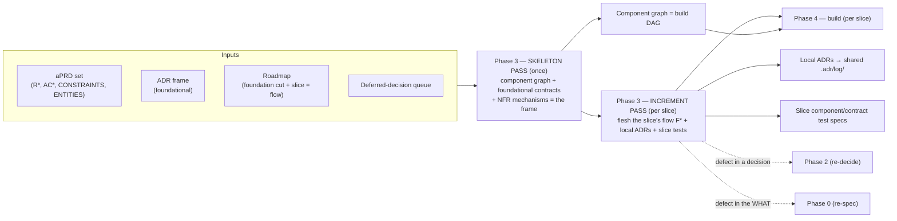
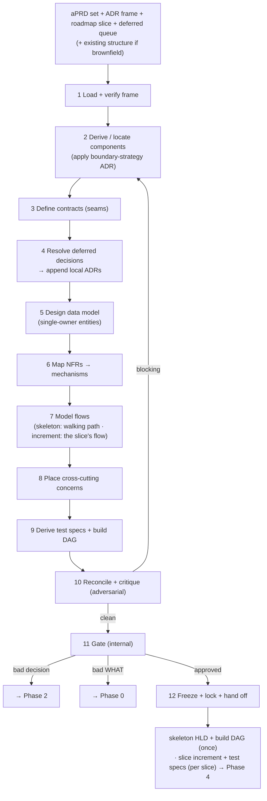
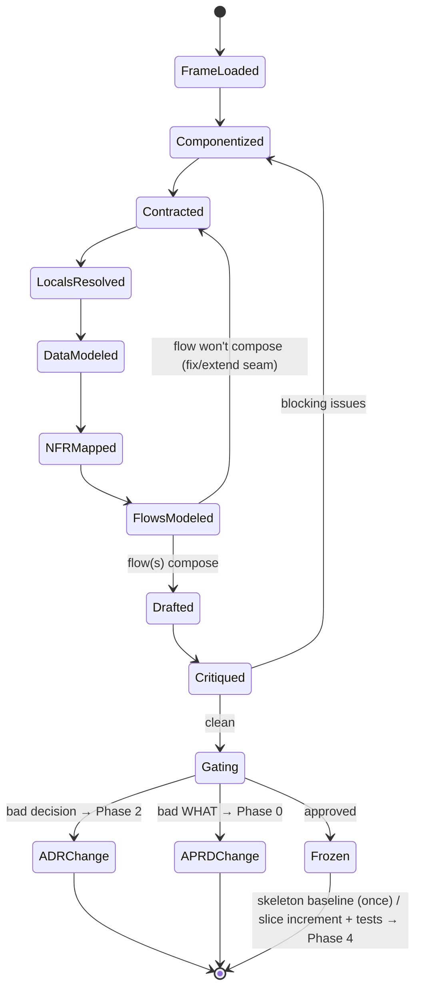
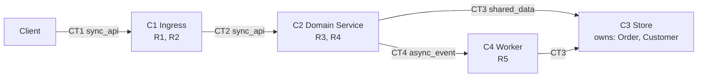
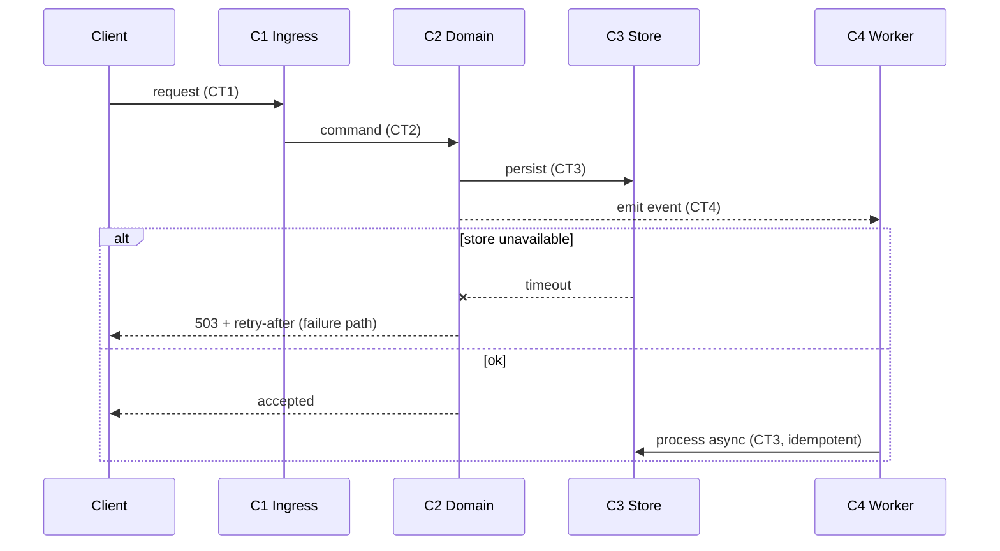
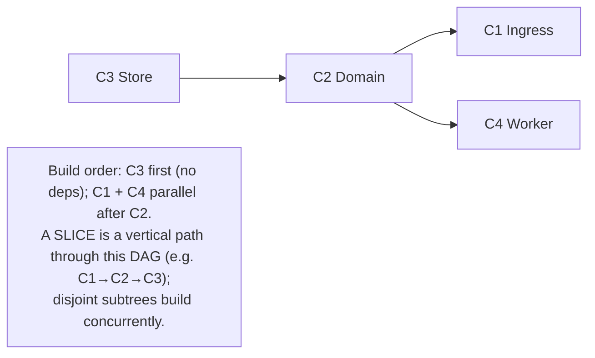
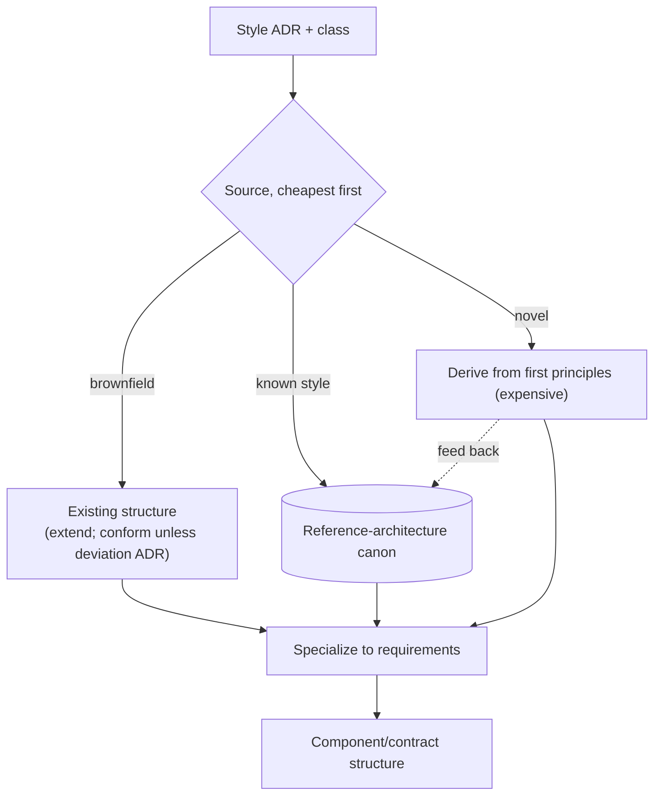
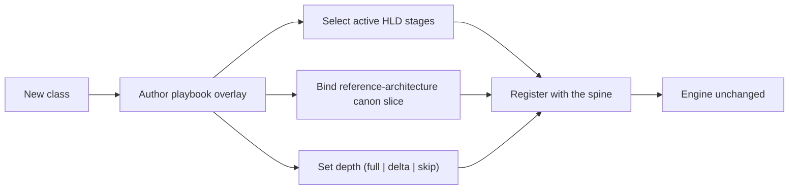

# Phase 3 — Automated Design Pipeline (ADRs + Roadmap → HLD)

| | |
|---|---|
| **Status** | Draft |
| **Version** | 0.2 |
| **Date** | 2026-06-06 |
| **Audience** | Engineers building the system; the agents executing it |
| **Scope** | The stage that turns the frozen aPRD set + ADR frame + roadmap into a High-Level Design — a skeleton drawn once, then extended one vertical slice at a time |
| **Predecessors** | Phase 0 — `00-automated-aprd-pipeline-spec.md` (WHAT) · Phase 1 — `01-automated-roadmap-pipeline-spec.md` (slices) · Phase 2 — `02-automated-adr-pipeline-spec.md` (WHY-this-HOW) |

---

## 1. Purpose

Phase 2 froze the **foundational decisions** — the frame. Phase 3 draws the structure **inside** that frame: components, the contracts between them, the data model, the critical flows, and the mechanisms that satisfy each non-functional requirement. The HLD is the contract Phase 4 implements against.

But the HLD is **not drawn all at once** — that is design-layer waterfall. It is drawn in **two modes**, mirroring the roadmap's two loops:

- **Skeleton pass** — once (foundation loop): the component graph + the foundational contracts + the NFR mechanisms + cross-cutting placement. This is the **frame every slice extends**, and it yields the full **build DAG**. The walking skeleton (slice #1) is the thinnest end-to-end path through it.
- **Increment pass** — per slice (slice loop): for the slice's **flow F***, flesh the components and contracts that flow touches, resolve the local decisions it forces (emitting local ADRs), model the flow, and derive the slice's design-layer tests. A slice **extends the frozen skeleton; it never redraws it.**

Three facts drive the design:

1. **Contracts are the load-bearing part of a design, not boxes.** What matters is the seams between components — interfaces, events, data contracts. Get the lines right and the boxes can be built in parallel by independent agents. Get them wrong and integration fails no matter how good each box is.
2. **The component graph is the build plan; a slice is a path through it.** The skeleton's component dependency graph *is* the build DAG. A vertical slice is one flow — a path through that DAG. Designing the structure, planning the build, and slicing vertically are the same act.
3. **Designing is the cheapest place to catch upstream defects.** Drawing forces a concreteness prose and decisions do not. A flow that won't compose, a requirement with no home, a decision that proves impossible — all surface here, before any code. Phase 3 is the last cheap gate.

### 1.1 Goals

- Draw a **skeleton** (component/contract frame + build DAG + NFR mechanisms) once, honoring every foundational ADR and the foundation cut.
- Extend it **per slice**: model the slice's flow, flesh the contracts it needs, emit the slice's design-layer test oracle.
- Make the contracts the primary artifact — explicit, testable, failure-aware — so Phase 4 builds slices in parallel against stable seams.
- Resolve the deferred local decisions a slice forces, recording each as a local ADR appended to the shared log.
- Map every NFR to a concrete structural mechanism.

### 1.2 Non-goals

- **Low-level / detailed design.** Class hierarchies, function signatures, and algorithms *inside* a component are decided at implementation time against the component's frozen contract. Phase 3 stops at the component boundary.
- **Drawing the whole HLD up front.** Only the skeleton is drawn once; component depth is filled per slice, just-in-time. Big-bang design is the waterfall the roadmap exists to prevent.
- **Re-deciding foundational architecture.** Style, stack, persistence are frozen ADRs. If the structure can't honor one, that's an ADR change request to Phase 2 — never a silent re-decision.
- **Writing code.** Phase 3 produces structure and test specs, not implementation. That is Phase 4.
- **A single mega-prompt.** Roles stay separated, as in Phases 0–2.

---

## 2. Where Phase 3 sits



- **Input:** frozen aPRD set, baselined ADR frame (`adr.lock` verified), the roadmap (foundation cut + the current slice as a flow), the deferred-decision queue, and — for brownfield — the existing system structure + its ADRs.
- **Output:** a frozen **skeleton HLD** (once) + per-slice **HLD increments**, the component/build DAG, component/contract test specs, and local ADRs appended to the shared `.adr/log/`.
- **Two escape targets:** Phase 3 can kick back to **Phase 2** (a foundational decision proves wrong/unbuildable) or **Phase 0** (the WHAT is revealed ambiguous). It never patches either silently.

---

## 3. Core principles

Inherits Phase 0's P-series, Phase 1's RM-series, and Phase 2's D-series. These are the design-specific additions.

| # | Principle | Consequence if violated | Echoes |
|---|---|---|---|
| H1 | **Contracts before components** — the seams are the load-bearing artifact | Components that don't compose; integration hell | — |
| H2 | HLD is **bounded by the ADR frame**; never silently re-decides foundational | Untracked decisions hidden in structure | D1, D6 |
| H3 | Drawing resolves local decisions; **each emits a local ADR** to the shared log | Local rationale lost; decisions untraceable | D3 |
| H4 | Every component traces to ≥1 R; every R lands in ≥1 component (**bidirectional**) | Orphan component = gold-plating; orphan R = unbuilt | D4, D5, P9 |
| H5 | Every NFR / CONSTRAINT maps to a concrete **mechanism** | Unmechanized NFR = silently unmet | D5 |
| H6 | **Flows validate contracts** — every critical path drawn end-to-end incl. failure paths | Contracts that look fine but don't compose | P10 |
| H7 | The **component graph (skeleton) is the build DAG**; a slice is a vertical path (flow) through it | Phase 4 can't parallelize; slices drift to horizontal cuts | RM7 |
| H8 | HLD emits the **design-layer test oracle** (component/contract tests) | Only black-box acceptance tests; integration untested | P2 |
| H9 | HLD is frozen/immutable; change = new version + re-trigger downstream | Silent structural drift corrupts the build | P8 |
| H10 | **Two escape targets** — bad WHAT→Phase 0, bad decision→Phase 2; never patch | Phase 3 silently re-scopes or re-decides | D9 |
| H11 | Decomposition depth scales with class blast radius (playbook-toggled) | Bugfix drowns in design, or greenfield under-structured | D10, P3 |
| H12 | LLM composes structure from the frame + reference canon; it is **not** the source | Hallucinated or off-frame architecture | P11, D7 |
| H13 | **Two modes** — skeleton pass (once: graph + foundational contracts) + increment pass (per slice: one flow) | Big-bang design waterfall, or skeleton redrawn per slice | RM3, D11 |
| H14 | A slice **extends the frozen skeleton**, never redraws it — an increment adds a vertical path through the established DAG | Structural churn; the build DAG keeps shifting under Phase 4 | RM7, H9 |

---

## 4. What an HLD contains

The boxes are the least interesting part. The artifact is mostly **contracts, flows, and the coverage matrix.**

| Element | Id | What it captures | Pass |
|---|---|---|---|
| **Component** | C* | A unit of responsibility; owns entities; traces to R* | skeleton (graph) + increment (depth) |
| **Contract** | CT* | A seam between components: kind, shape, failure modes | skeleton (foundational) + increment (slice-specific) |
| **Data model** | — | Logical entities + **single-owner** assignment to components | skeleton (foundational) + increment (slice entities) |
| **Flow** | F* | A critical path across components, with its failure variant; traces to R*/AC* | **increment (the slice = one flow)** |
| **NFR mechanism** | M* | A CONSTRAINT/NFR mapped to a concrete mechanism + the component(s) realizing it | skeleton (mostly) + increment (hardening) |
| **Cross-cutting** | — | Auth, error strategy, observability, config — placed per their ADRs | skeleton (once) |
| **Build DAG** | — | The component dependency graph = the parallel build plan | **skeleton (once)** |
| **Test specs** | — | Per contract and per flow: the design-layer test oracle | skeleton (frame) + increment (per slice) |

The **skeleton pass** produces the frame (component graph, foundational contracts, data ownership, NFR mechanisms, cross-cutting, the build DAG). Each **increment pass** adds one slice's flow, the contract/component depth that flow needs, and the slice's design-layer tests.

### 4.1 The unifying insight — design is executable-on-paper

A correct HLD can be *run in your head*: every critical flow traces a path through the contracts and arrives at its AC. A flow that cannot be drawn end-to-end is not a documentation gap — it is a **structural defect** (a missing or wrong contract). This is why flow modeling (§5.7) is a validation step, not decoration: it executes the contracts before any code exists. In increment mode, the slice's flow must compose against the **frozen skeleton contracts** — a flow that won't compose against the established seams reveals either a missing contract (extend) or a bad skeleton (escape).

---

## 5. Pipeline stages

One **spine**, per-class **playbook** overlays (§11) — identical philosophy to Phases 0–2. The spine runs in full during the **skeleton pass**; in the **increment pass** it runs scoped to one slice's flow, with flow modeling (§5.7) as the centerpiece.



### 5.1 Load & verify the frame
Read aPRD set, ADR frame (verify `adr.lock`), the roadmap (foundation cut for the skeleton pass; the current slice-as-flow for an increment pass), deferred-decision queue. For brownfield, load existing structure + ADRs — it is **given, not redrawn**. Assemble the constraint frame the design must satisfy.

### 5.2 Derive / locate components
**Skeleton:** apply the **boundary-strategy ADR** to cluster requirements into the full component graph. The ADR decided *how* to cut (by bounded context, by feature module, by layer); this stage produces the actual boxes + their dependency edges. Each component records `responsibility`, `owns_entities`, `traces:[R*]`. A component serving no R is gold-plating; drop it.
**Increment:** locate which existing skeleton components the slice's flow touches; add only components a new capability genuinely needs (and register their edges in the DAG).

### 5.3 Define contracts (the load-bearing stage)
For every seam, specify the contract: **kind** (sync request/response, async event, shared data), **shape** (schema reference), and **failure modes** (timeout, partial failure, retry/idempotency). Contracts are designed **before** component internals — this is what lets Phase 4 build components in parallel against stable seams (H1, H7). **Skeleton:** the foundational contracts. **Increment:** the contracts the slice's flow needs that the skeleton didn't already establish.

### 5.4 Resolve deferred decisions → local ADRs
Drain the relevant part of the deferred-decision queue from Phase 2. Each local fork that drawing forces (e.g., "split read/write model in component C3?") is resolved here and **recorded as a local ADR appended to the shared log** — the feedback loop Phase 2 promised (H3). In increment mode, drain only the forks **this slice** touches; mark each queue item resolved with its new ADR id. A *foundational* decision surfacing here (not just local) is the "thin cut" signal — escalate to Phase 2 (§5.11).

### 5.5 Design the data model
From `ENTITIES` (aPRD) + the persistence ADR. Logical model with **single-owner** assignment: each entity is owned by exactly one component; others access via that component's contract. No shared-write. **Skeleton:** foundational entities. **Increment:** entities a slice introduces. Ownership ambiguity is a boundary defect — fix §5.2/§5.3.

### 5.6 Map NFRs → mechanisms
Each CONSTRAINT/NFR (scale, latency, availability, compliance, residency) is assigned a concrete structural mechanism (cache, queue, read replica, partition, region pin) and the component(s) realizing it. Mostly a **skeleton** activity (cross-cutting NFRs decided once); a slice may add a **hardening** mechanism. An NFR with no mechanism is silently unmet (H5) — flag it.

### 5.7 Model flows
Draw each critical path as a sequence across components, **including the failure variant**. This executes the contracts on paper (§4.1).
- **Skeleton:** the walking-skeleton flow — the thinnest end-to-end path that touches every foundational seam once.
- **Increment:** **the slice itself is a flow F***. Modeling it is the heart of increment mode: trace the vertical path through the build DAG, confirm it composes against frozen skeleton contracts, name its failure path. A flow that cannot be drawn end-to-end reveals a missing/wrong contract → return to §5.3; if it reveals a bad decision or bad requirement → escape hatch (§5.11).

### 5.8 Place cross-cutting concerns
Auth model, error-handling strategy, observability, config/secrets — realized structurally per their ADRs (e.g., auth as a gateway component vs per-service middleware). A **skeleton** activity, decided once for all slices.

### 5.9 Derive test specs + build DAG
- **Test specs:** per contract (does the seam behave to shape + failure modes?) and per flow (does the path satisfy its AC?). This is the **design-layer oracle**, distinct from the aPRD acceptance oracle (H8). Two layers: acceptance tests (black-box, from aPRD) and component/contract tests (from HLD). **Increment** mode emits the current slice's specs.
- **Build DAG:** the component dependency graph, emitted **once in the skeleton pass** as Phase 4's parallel build plan (H7). Each slice activates a vertical path through it.

### 5.10 Reconcile & critique (adversarial)
Hostile reviewer pass. Checks:
- **Coverage both ways** — every R in scope lands in a component; every component traces to an R (H4).
- **NFR coverage** — every in-scope CONSTRAINT mechanized (H5).
- **Frame fidelity** — every ADR honored; no foundational decision silently violated or re-made (H2).
- **Skeleton fidelity (increment)** — the slice extends the frozen skeleton; it does not redraw established components/contracts (H14).
- **Contract testability** — every CT has a failure mode + a test spec.
- **Flow completeness** — every critical path (the slice's flow) drawn incl. failure (H6).
- **Queue drained** — every deferred decision the slice touches resolved or explicitly re-deferred with reason.

Blocking issues loop back to component derivation.

### 5.11 Gate & escape hatches
Internal gate (senior/human reviewer for high-blast structure). Two escapes:
- A **foundational decision** proves wrong or unbuildable → change request to **Phase 2** → new/superseding ADR → re-trigger (skeleton or the affected increment).
- The **WHAT** is revealed ambiguous (can't structure what isn't specified) → change request to **Phase 0** → new aPRD version → re-trigger downstream (Phase 1 may re-slice).

Never patch either upstream artifact in place (H10).

### 5.12 Freeze
On approval, render immutable artifacts (content hash + signer + timestamp + version). **Skeleton pass:** freeze `hld.skeleton.frozen.md` + the build DAG — the baseline every slice extends. **Increment pass:** freeze the slice's `hld.S<n>.frozen.md` + its test specs. Hand contracts, build DAG, and test specs to Phase 4. After freeze, change = new version + re-trigger of affected build units; a *skeleton* change ripples to all slices (so the skeleton stays thin — H14).

### 5.13 Pipeline state machine



---

## 6. The HLD artifact

Dual audience: machine-readable graph/schema for downstream agents; rendered Markdown + Mermaid for human review.

### 6.1 Schema

```yaml
# SKELETON (once) — the frame + build DAG
COMPONENTS:
  - id: C1
    responsibility: <one line>
    owns_entities: [ ... ]
    traces: [R1, R4]
CONTRACTS:
  - id: CT1
    between: [C1, C2]
    kind: sync_api | async_event | shared_data
    shape: <schema ref>
    failure_modes: [timeout, partial, retry-idempotent]
    traces: [R4]
DATA_MODEL:
  entities: [ ... ]
  ownership: { Entity: C1 }            # single owner
NFR_MECHANISMS:
  - id: M1
    nfr_ref: CONSTRAINT.latency
    mechanism: <cache / queue / replica / partition>
    realized_by: [C2]
CROSS_CUTTING:
  auth: <placement>
  errors: <strategy>
  observability: <placement>
BUILD_DAG:   <edges derived from CONTRACTS>

# INCREMENT (per slice) — one flow + the depth it needs
SLICE: S1
FLOWS:
  - id: F1
    slice: S1
    path: [C1, C2, C3]
    failure_path: <variant>
    traces: [R1, AC2]
CONTRACT_DELTAS: [ <new/extended CT* the flow needs> ]
TEST_SPECS:  <per CT and per F for this slice>
TRACES:      <R → AC → S → ADR → C → CT → F matrix>
```

### 6.2 Example — component view (skeleton)



### 6.3 Example — flow view (a slice; validates the contracts)



### 6.4 Component graph → build DAG → slice paths



The dependency edges (who depends on whose contract) yield the topological build order, established **once** in the skeleton pass. A **vertical slice is a path through this DAG** — Phase 4 builds the slice's path against frozen contracts, mocking the seams of components a later slice will flesh. Disjoint subtrees build in parallel; shared-contract components serialize. This DAG is exactly the orchestration input Phase 4 consumes (H7, RM7).

### 6.5 Why this form

- **Contracts are first-class and testable** — they are what Phase 4 builds against in parallel and what the design-layer tests verify (H1, H8).
- **Skeleton vs increment** — drawing the frame once and extending it per slice is what keeps design out of waterfall (H13, H14).
- **Single-owner data** — kills shared-write coupling, the most common source of integration bugs.
- **Flows are validation, not docs** — an undrawable flow is a structural defect found cheaply (H6).
- **Traces thread the whole pipeline** — `R → AC → S → ADR → C → CT → F → (code → test)`. Drift = any component, contract, or flow not traceable to a requirement.

---

## 7. Structure grounding

Where structure comes from — the design-layer analog of Phase 0's research and Phase 2's option grounding. **Retrieval + specialization**, not free invention.



- **Brownfield is a delta.** The HLD extends existing structure: new components + modified contracts + the `INTEGRATION_SEAMS` from the feature-add aPRD extension. Existing structure is loaded, not redrawn; each deviation requires a deviation ADR. (The skeleton/increment split is *native* to brownfield — the existing system *is* the skeleton.)
- **Reference-architecture canon** — the style ADR ("event-driven", "modular monolith") indexes a vetted reference skeleton; the HLD specializes it to the requirements. Fourth reuse of the canon lever (Phase 0 best-practices, Phase 1 slicing patterns, Phase 2 decision options, Phase 3 reference architectures), versioned and reused across projects.

---

## 8. Prompt library

Roles separated; each is the same role with a playbook-injected domain block.

**DERIVE-COMPONENTS**
```
Input: aPRD requirements + the boundary-strategy ADR (+ existing skeleton if increment mode).
Skeleton: cluster requirements into the full component graph per the ADR's cut + dependency edges.
Increment: locate the skeleton components the slice's flow touches; add only what a new capability needs.
Per component: {id, responsibility, owns_entities, traces:[R*]}. Every component traces to >=1 R.
```

**DEFINE-CONTRACTS**
```
For every seam, specify {id, between, kind, shape, failure_modes, traces}.
Design contracts before component internals. Every contract must state its failure modes.
Increment: define only the contracts the slice's flow needs beyond the frozen skeleton.
```

**RESOLVE-LOCAL** (emits ADR)
```
Input: deferred-decision queue (scoped to this slice in increment mode) + the emerging structure.
Resolve each local fork the design forces. Emit each as a local ADR (mode: slice)
appended to the shared log. Mark the queue item resolved with the new ADR id.
If a FOUNDATIONAL decision surfaces, do not resolve it locally — escalate to Phase 2.
```

**MODEL-DATA**
```
From ENTITIES + persistence ADR, produce the logical model with single-owner
assignment per entity. Flag any entity with ambiguous ownership as a boundary defect.
```

**MAP-NFR**
```
Per CONSTRAINT/NFR, assign a concrete structural mechanism and the realizing component(s).
Any NFR with no mechanism is flagged as unmet.
```

**MODEL-FLOWS**
```
Skeleton: draw the thinnest end-to-end walking-skeleton path touching every foundational seam.
Increment: draw THE slice as one flow F* across components, incl. the failure variant; confirm it
composes against the frozen skeleton contracts. A flow that cannot be drawn end-to-end is a
structural defect: name the missing/wrong contract (extend) or escalate (bad decision/WHAT).
```

**DERIVE-TESTS**
```
Per contract: a test of shape + failure modes. Per flow: a test that the path meets its AC.
This is the design-layer oracle, distinct from aPRD acceptance tests. Increment: this slice's specs.
```

**RECONCILE / CRITIQUE** (adversarial)
```
Hostile reviewer. Check: bidirectional R<->component coverage; every in-scope NFR mechanized;
every ADR honored (no silent re-decision); increment extends (not redraws) the frozen skeleton;
every contract testable with failure modes; the slice's flow drawn incl. failure; queue drained.
Output blocking issues only.
```

---

## 9. Interaction & gate model

- **Internal by default** — structure is the delivery team's domain; the client signed the WHAT (Phase 0) and ordered the slices (Phase 1), the team owns the HOW.
- **Senior/human reviewer** for high-blast structure (data ownership, public contracts, irreversible topology) — concentrated in the skeleton pass.
- **Two escape targets** (§5.11): bad decision → Phase 2; bad WHAT → Phase 0. Client is re-engaged only when an escape reaches Phase 0 and changes the contract.
- **Defects route, not patch** — preserves the immutability of every upstream frozen artifact.

---

## 10. Artifact storage & versioning

Sibling to `.aprd/`, `.roadmap/`, and `.adr/`. The HLD is the structural root of truth; local ADRs append to the **shared** `.adr/log/`.

```
project/
  .aprd/                          # Phase 0
  .roadmap/                       # Phase 1 (slices)
  .adr/                           # Phase 2 + appended local ADRs from Phase 3
    log/ 0021-split-read-write.md # local ADR (mode: slice) emitted during an HLD increment
    deferred-decisions.json       # items now marked resolved → ADR id
  .hld/
    00-inputs.json                # loaded frame + lock verification
    skeleton/                     # SKELETON PASS (once)
      components.json
      contracts.json
      data-model.json
      nfr-mechanisms.json
      cross-cutting.json
      hld.skeleton.frozen.md      # SIGNED, immutable baseline
      hld.skeleton.lock
      build-dag.json              # → Phase 4 orchestration input
    slices/                       # INCREMENT PASS (per slice)
      S1/
        flow.json
        contract-deltas.json
        hld.S1.frozen.md          # SIGNED increment
        hld.S1.lock
        test-specs/               # design-layer oracle → Phase 4
  ...
```

**Rules**

- **Skeleton frozen once; increments frozen per slice.** A skeleton change ripples to all slices, so the skeleton stays thin (H14); increments are additive.
- **HLD frozen is immutable.** Change = new version + re-trigger of affected build units. Stops structural drift (H9).
- **Local ADRs go to the shared log**, not a separate store — one decision history for the project (H3); each tagged `mode: slice`.
- **Build DAG + test specs are explicit handoff artifacts** to Phase 4 (H7, H8).
- **Stable IDs** — `C*`, `CT*`, `F*`, `M*` extend the `R*`/`AC*`/`ADR-*`/`S*` thread.
- **Lock = signature** — tamper-evident structural baseline.

---

## 11. Extensibility — depth per class (playbook-toggled)

Decomposition depth scales with class blast radius (H11), set by the same playbook driving Phases 0–2.

| Class | Phase 3 depth |
|---|---|
| **Greenfield / Migration** | Full skeleton + per-slice increments — components, contracts, data model, flows, NFR mechanisms |
| **Integration** | Contract-centric — external contract + our seams dominate; few new components; each slice = one integration flow |
| **Large feature-add** | Delta skeleton (existing system *is* the skeleton) + per-slice increments + integration seams |
| **Refactor** | Structure delta only — target structure + invariants; data model usually unchanged |
| **Bugfix / Perf** | Usually none; a flow or mechanism sketch only if the fix changes a seam |
| **Investigation** | None — no structure to design |



If a new class forces an engine edit, the abstraction is wrong — fix the spine, not the playbook. (Same test as Phases 0–2.)

---

## 12. Failure modes & guardrails

| Failure mode | Guardrail |
|---|---|
| Boxes designed before seams (integration hell) | Contracts-before-components (H1); DEFINE-CONTRACTS precedes internals |
| Whole HLD drawn up front (design waterfall) | Skeleton once + increments per slice (H13); only the frame is drawn eagerly |
| Skeleton redrawn / churned per slice | Increment extends, never redraws the frozen skeleton (H14) |
| Component with no requirement (gold-plating) | Bidirectional coverage (H4); orphan component flagged |
| Requirement with no home (unbuilt) | Bidirectional coverage (H4); orphan R flagged |
| NFR silently unmet | NFR→mechanism mapping (H5); unmechanized NFR flagged |
| Contracts that don't compose | Flow modeling executes contracts on paper (H6) |
| Shared-write coupling | Single-owner data model (§5.5) |
| Foundational decision re-made in structure | Frame-fidelity critique (H2); escape to Phase 2 instead |
| Foundational decision surfaces mid-increment | RESOLVE-LOCAL escalates to Phase 2 (thin-cut signal back to Phase 1) |
| Bad WHAT discovered, patched silently | Escape to Phase 0 (H10); never edit aPRD in place |
| Local decisions lost | Each resolved fork emits a local ADR to shared log (H3) |
| Phase 4 can't parallelize | Build DAG emitted from component graph in the skeleton pass (H7) |
| Slice drifts to a horizontal cut | A slice is a flow — a vertical path through the DAG (H7, RM7) |
| Integration untested | Design-layer test oracle emitted per slice (H8) |
| Structural drift after baseline | HLD frozen; change = new version (H9) |

---

## 13. Glossary

- **HLD** — High-Level Design. Components, contracts, data model, flows, and NFR mechanisms; the structure Phase 4 builds against. Stops at the component boundary (no LLD).
- **Skeleton pass / increment pass** — drawing the frame + build DAG once vs extending it one slice (one flow) at a time.
- **Skeleton HLD** — the component graph + foundational contracts + NFR mechanisms drawn once; the frame every slice extends.
- **Contract (CT)** — a specified seam between components: kind, shape, failure modes. The load-bearing artifact.
- **Component (C)** — a unit of responsibility owning entities and tracing to requirements.
- **Flow (F)** — a critical path across components, with failure variant; in increment mode, **a slice is a flow** — its on-paper execution validates the contracts.
- **NFR mechanism (M)** — the concrete structure that satisfies a non-functional requirement.
- **Build DAG** — the component dependency graph (skeleton); Phase 4's parallel build plan; a slice is a path through it.
- **Design-layer oracle** — component/contract tests derived from the HLD, distinct from aPRD acceptance tests.
- **Local ADR** — a decision crystallized while drawing structure; appended to the shared ADR log, tagged `mode: slice`.
- **Delta HLD** — a brownfield design expressed as changes to existing structure, not a redraw.

---

## 14. Open questions

- **Decomposition granularity** — how fine to cut components before deferring detail to implementation; threshold and who calibrates.
- **Contract format** — one IDL across kinds (OpenAPI + AsyncAPI + schema) vs per-kind; machine-checkable contract conformance.
- **Build-DAG cycles** — handling when component dependencies form a cycle (a boundary defect): auto-detect and kick back vs propose a break.
- **Skeleton stability** — how much an increment may extend the skeleton before the skeleton itself must be re-frozen (a skeleton change ripples to all slices); the threshold that keeps the skeleton thin.
- **Local ADR volume** — when a flood of local ADRs in an increment signals the skeleton / foundation cut was too thin (feedback to Phase 1 + Phase 2 to tune the cut).
- **Test-spec depth** — how much of the failure-path space the design-layer oracle must cover before handing to Phase 4.
- **HLD versioning vs ADR supersession** — when an HLD change forces an ADR change, the ordering and re-trigger semantics across Phases 2 ↔ 3.
