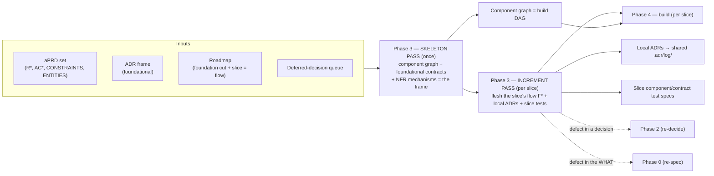
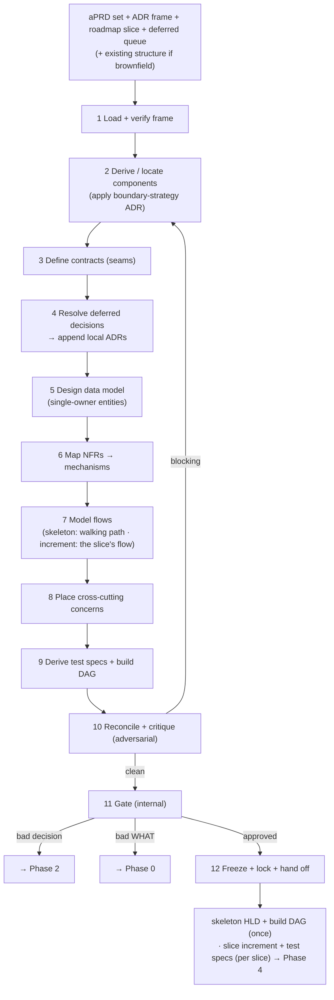
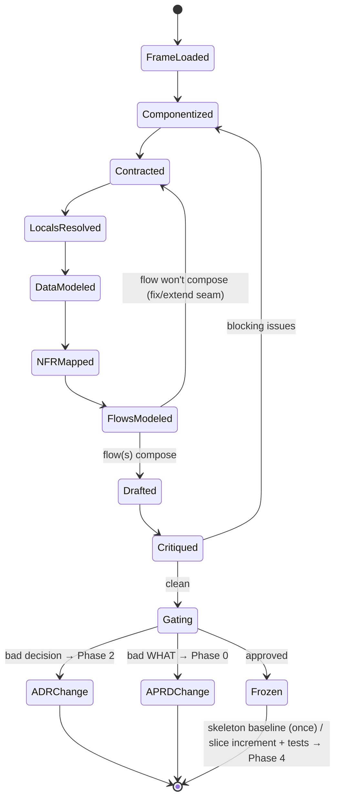
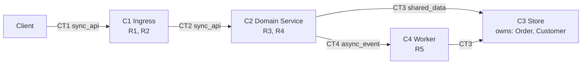
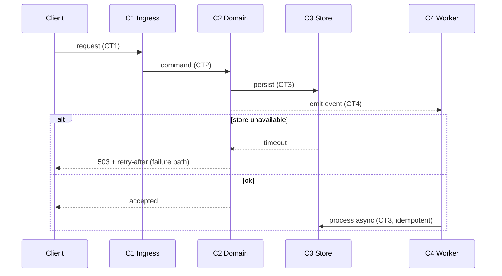
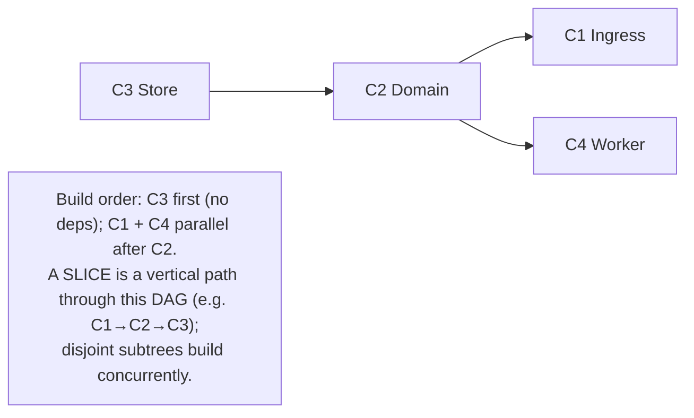
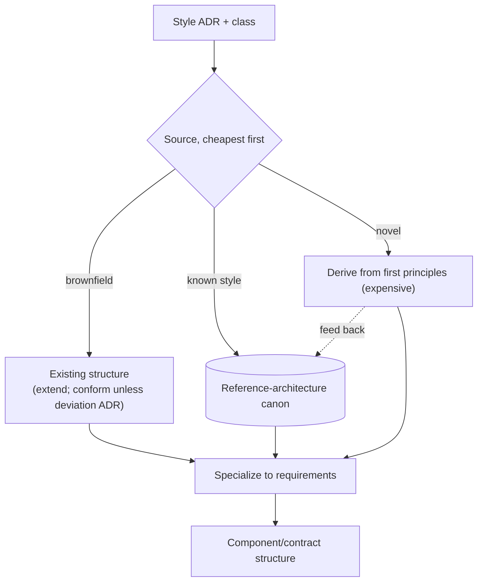
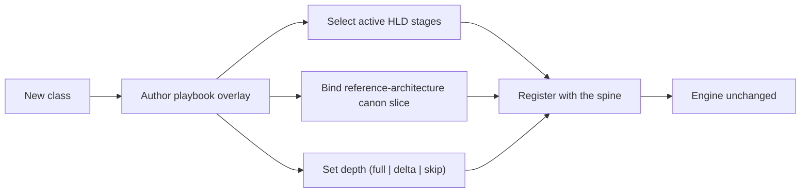

# Phase 3 — Automated Design Pipeline (ADRs + Roadmap → HLD)

| | |
|---|---|
| **Status** | Draft |
| **Version** | 0.3 |
| **Date** | 2026-06-06 |
| **Audience** | Engineers building system; agents executing it |
| **Scope** | Stage turns frozen aPRD set + ADR frame + roadmap into High-Level Design — skeleton drawn once, then extended one vertical slice at a time |
| **Predecessors** | Phase 0 — `00-automated-aprd-pipeline-spec.md` (WHAT) · Phase 1 — `01-automated-roadmap-pipeline-spec.md` (slices) · Phase 2 — `02-automated-adr-pipeline-spec.md` (WHY-this-HOW) |

**Change log**
- **v0.3** (2026-06-09) — economy cut (caveman register + AB8 + dedup): killed banned hedge/filler words, H14 skeleton-ripple rationale stated once (§5.10 home; §5.6 freeze cites it). Substance invariant. New version = the change request (P8); re-lock at next freeze.

---

## 1. Purpose

Phase 2 froze **foundational decisions** — frame. Phase 3 draws structure **inside** frame: components, contracts between them, data model, critical flows, mechanisms satisfying each non-functional requirement. HLD = contract Phase 4 implements against.

HLD **not drawn all at once** — that = design-layer waterfall. Drawn in **two modes**, mirroring roadmap's two loops:

- **Skeleton pass** — once (foundation loop): component graph + foundational contracts + NFR mechanisms + cross-cutting placement. This = **frame every slice extends**, yields full **build DAG**. Walking skeleton (slice #1) = thinnest end-to-end path through it.
- **Increment pass** — per slice (slice loop): for slice's **flow F***, flesh components + contracts that flow touches, resolve local decisions it forces (emit local ADRs), model flow, derive slice's design-layer tests. Slice **extends frozen skeleton; never redraws it.**

Three facts drive design:

1. **Contracts = load-bearing part of design, not boxes.** Seams between components matter — interfaces, events, data contracts. Get lines right, boxes built in parallel by independent agents. Get them wrong, integration fails no matter how good each box.
2. **Component graph = build plan; slice = path through it.** Skeleton's component dependency graph *is* build DAG. Vertical slice = one flow — path through that DAG. Designing structure, planning build, slicing vertically = same act.
3. **Designing = cheapest place to catch upstream defects.** Drawing forces concreteness prose + decisions do not. Flow that won't compose, requirement with no home, decision that proves impossible — all surface here, before any code. Phase 3 = last cheap gate.

### 1.1 Goals

- Draw **skeleton** (component/contract frame + build DAG + NFR mechanisms) once, honoring every foundational ADR + foundation cut.
- Extend it **per slice**: model slice's flow, flesh contracts it needs, emit slice's design-layer test oracle.
- Make contracts primary artifact — explicit, testable, failure-aware — so Phase 4 builds slices in parallel against stable seams.
- Resolve deferred local decisions a slice forces, record each as local ADR appended to shared log.
- Map every NFR to concrete structural mechanism.

### 1.2 Non-goals

- **Low-level / detailed design.** Class hierarchies, function signatures, algorithms *inside* a component decided at implementation time against component's frozen contract. Phase 3 stops at component boundary.
- **Drawing whole HLD up front.** Only skeleton drawn once; component depth filled per slice, on demand. Big-bang design = waterfall roadmap exists to prevent.
- **Re-deciding foundational architecture.** Style, stack, persistence = frozen ADRs. If structure can't honor one, that = ADR change request to Phase 2 — never silent re-decision.
- **Writing code.** Phase 3 produces structure + test specs, not implementation. That = Phase 4.
- **Single mega-prompt.** Roles stay separated, as in Phases 0–2.

---

## 2. Where Phase 3 sits



- **Input:** frozen aPRD set, baselined ADR frame (`adr.lock` verified), roadmap (foundation cut + current slice as flow), deferred-decision queue, and — for brownfield — existing system structure + its ADRs.
- **Output:** frozen **skeleton HLD** (once) + per-slice **HLD increments**, component/build DAG, component/contract test specs, local ADRs appended to shared `.adr/log/`.
- **Two escape targets:** Phase 3 can kick back to **Phase 2** (foundational decision proves wrong/unbuildable) or **Phase 0** (WHAT revealed ambiguous). Never patches either silently.

---

## 3. Core principles

Inherits Phase 0's P-series, Phase 1's RM-series, Phase 2's D-series. These = design-specific additions.

| # | Principle | Consequence if violated | Echoes |
|---|---|---|---|
| H1 | **Contracts before components** — seams = load-bearing artifact | Components that don't compose; integration hell | — |
| H2 | HLD **bounded by ADR frame**; never silently re-decides foundational | Untracked decisions hidden in structure | D1, D6 |
| H3 | Drawing resolves local decisions; **each emits local ADR** to shared log | Local rationale lost; decisions untraceable | D3 |
| H4 | Every component traces to ≥1 R; every R lands in ≥1 component (**bidirectional**) | Orphan component = gold-plating; orphan R = unbuilt | D4, D5, P9 |
| H5 | Every NFR / CONSTRAINT maps to concrete **mechanism** | Unmechanized NFR = silently unmet | D5 |
| H6 | **Flows validate contracts** — every critical path drawn end-to-end incl. failure paths | Contracts that look fine but don't compose | P10 |
| H7 | **Component graph (skeleton) = build DAG**; slice = vertical path (flow) through it | Phase 4 can't parallelize; slices drift to horizontal cuts | RM7 |
| H8 | HLD emits **design-layer test oracle** (component/contract tests) | Only black-box acceptance tests; integration untested | P2 |
| H9 | HLD frozen/immutable; change = new version + re-trigger downstream | Silent structural drift corrupts build | P8 |
| H10 | **Two escape targets** — bad WHAT→Phase 0, bad decision→Phase 2; never patch | Phase 3 silently re-scopes or re-decides | D9 |
| H11 | Decomposition depth scales with class blast radius (playbook-toggled) | Bugfix drowns in design, or greenfield under-structured | D10, P3 |
| H12 | LLM composes structure from frame + reference canon; **not** the source | Hallucinated or off-frame architecture | P11, D7 |
| H13 | **Two modes** — skeleton pass (once: graph + foundational contracts) + increment pass (per slice: one flow) | Big-bang design waterfall, or skeleton redrawn per slice | RM3, D11 |
| H14 | Slice **extends frozen skeleton**, never redraws it — increment adds vertical path through established DAG | Structural churn; build DAG keeps shifting under Phase 4 | RM7, H9 |

---

## 4. What an HLD contains

Boxes = least interesting part. Artifact mostly **contracts, flows, coverage matrix.**

| Element | Id | What it captures | Pass |
|---|---|---|---|
| **Component** | C* | Unit of responsibility; owns entities; traces to R* | skeleton (graph) + increment (depth) |
| **Contract** | CT* | Seam between components: kind, shape, failure modes | skeleton (foundational) + increment (slice-specific) |
| **Data model** | — | Logical entities + **single-owner** assignment to components | skeleton (foundational) + increment (slice entities) |
| **Flow** | F* | Critical path across components, with failure variant; traces to R*/AC* | **increment (slice = one flow)** |
| **NFR mechanism** | M* | CONSTRAINT/NFR mapped to concrete mechanism + component(s) realizing it | skeleton (mostly) + increment (hardening) |
| **Cross-cutting** | — | Auth, error strategy, observability, config — placed per their ADRs | skeleton (once) |
| **Build DAG** | — | Component dependency graph = parallel build plan | **skeleton (once)** |
| **Test specs** | — | Per contract + per flow: design-layer test oracle | skeleton (frame) + increment (per slice) |

**Skeleton pass** produces frame (component graph, foundational contracts, data ownership, NFR mechanisms, cross-cutting, build DAG). Each **increment pass** adds one slice's flow, contract/component depth that flow needs, slice's design-layer tests.

### 4.1 The unifying insight — design is executable-on-paper

Correct HLD can be *run in your head*: every critical flow traces path through contracts, arrives at its AC. Flow that cannot be drawn end-to-end = not documentation gap — = **structural defect** (missing or wrong contract). So flow modeling (§5.7) = validation step, not decoration: executes contracts before any code exists. In increment mode, slice's flow must compose against **frozen skeleton contracts** — flow that won't compose against established seams reveals either missing contract (extend) or bad skeleton (escape).

---

## 5. Pipeline stages

One **spine**, per-class **playbook** overlays (§11) — identical philosophy to Phases 0–2. Spine runs in full during **skeleton pass**; in **increment pass** runs scoped to one slice's flow, flow modeling (§5.7) = centerpiece.



### 5.1 Load & verify the frame
Read aPRD set, ADR frame (verify `adr.lock`), roadmap (foundation cut for skeleton pass; current slice-as-flow for increment pass), deferred-decision queue. For brownfield, load existing structure + ADRs — **given, not redrawn**. Assemble constraint frame design must satisfy.

### 5.2 Derive / locate components
**Skeleton:** apply **boundary-strategy ADR** to cluster requirements into full component graph. ADR decided *how* to cut (by bounded context, by feature module, by layer); this stage produces actual boxes + their dependency edges. Each component records `responsibility`, `owns_entities`, `traces:[R*]`. Component serving no R = gold-plating; drop it.
**Increment:** locate which existing skeleton components slice's flow touches; add only components a new capability genuinely needs (register their edges in DAG).

### 5.3 Define contracts (the load-bearing stage)
For every seam, specify contract: **kind** (sync request/response, async event, shared data), **shape** (schema reference), **failure modes** (timeout, partial failure, retry/idempotency). Contracts designed **before** component internals — so Phase 4 builds components in parallel against stable seams (H1, H7). **Skeleton:** foundational contracts. **Increment:** contracts slice's flow needs that skeleton didn't already establish.

### 5.4 Resolve deferred decisions → local ADRs
Drain relevant part of deferred-decision queue from Phase 2. Each local fork drawing forces (e.g., "split read/write model in component C3?") resolved here + **recorded as local ADR appended to shared log** — feedback loop Phase 2 promised (H3). In increment mode, drain only forks **this slice** touches; mark each queue item resolved with its new ADR id. *Foundational* decision surfacing here (not only local) = "thin cut" signal — escalate to Phase 2 (§5.11).

### 5.5 Design the data model
From `ENTITIES` (aPRD) + persistence ADR. Logical model with **single-owner** assignment: each entity owned by exactly one component; others access via that component's contract. No shared-write. **Skeleton:** foundational entities. **Increment:** entities a slice introduces. Ownership ambiguity = boundary defect — fix §5.2/§5.3.

### 5.6 Map NFRs → mechanisms
Each CONSTRAINT/NFR (scale, latency, availability, compliance, residency) assigned concrete structural mechanism (cache, queue, read replica, partition, region pin) + component(s) realizing it. Mostly **skeleton** activity (cross-cutting NFRs decided once); slice may add **hardening** mechanism. NFR with no mechanism = silently unmet (H5) — flag it.

### 5.7 Model flows
Draw each critical path as sequence across components, **including failure variant**. Executes contracts on paper (§4.1).
- **Skeleton:** walking-skeleton flow — thinnest end-to-end path touching every foundational seam once.
- **Increment:** **slice itself = flow F***. Modeling it = heart of increment mode: trace vertical path through build DAG, confirm it composes against frozen skeleton contracts, name its failure path. Flow that cannot be drawn end-to-end reveals missing/wrong contract → return to §5.3; if reveals bad decision or bad requirement → escape hatch (§5.11).

### 5.8 Place cross-cutting concerns
Auth model, error-handling strategy, observability, config/secrets — realized structurally per their ADRs (e.g., auth as gateway component vs per-service middleware). **Skeleton** activity, decided once for all slices.

### 5.9 Derive test specs + build DAG
- **Test specs:** per contract (does seam behave to shape + failure modes?) + per flow (does path satisfy its AC?). This = **design-layer oracle**, distinct from aPRD acceptance oracle (H8). Two layers: acceptance tests (black-box, from aPRD) + component/contract tests (from HLD). **Increment** mode emits current slice's specs.
- **Build DAG:** component dependency graph, emitted **once in skeleton pass** as Phase 4's parallel build plan (H7). Each slice activates vertical path through it.

### 5.10 Reconcile & critique (adversarial)
Hostile reviewer pass. Checks:
- **Coverage both ways** — every R in scope lands in a component; every component traces to an R (H4).
- **NFR coverage** — every in-scope CONSTRAINT mechanized (H5).
- **Frame fidelity** — every ADR honored; no foundational decision silently violated or re-made (H2).
- **Skeleton fidelity (increment)** — slice extends frozen skeleton; does not redraw established components/contracts (H14).
- **Contract testability** — every CT has failure mode + test spec.
- **Flow completeness** — every critical path (slice's flow) drawn incl. failure (H6).
- **Queue drained** — every deferred decision slice touches resolved or explicitly re-deferred with reason.

Blocking issues loop back to component derivation.

### 5.11 Gate & escape hatches
Internal gate (senior/human reviewer for high-blast structure). Two escapes:
- **Foundational decision** proves wrong or unbuildable → change request to **Phase 2** → new/superseding ADR → re-trigger (skeleton or affected increment).
- **WHAT** revealed ambiguous (can't structure what isn't specified) → change request to **Phase 0** → new aPRD version → re-trigger downstream (Phase 1 may re-slice).

Never patch either upstream artifact in place (H10).

### 5.12 Freeze
On approval, render immutable artifacts (content hash + signer + timestamp + version). **Skeleton pass:** freeze `hld.skeleton.frozen.md` + build DAG — baseline every slice extends. **Increment pass:** freeze slice's `hld.S<n>.frozen.md` + its test specs. Hand contracts, build DAG, test specs to Phase 4. After freeze, change = new version + re-trigger of affected build units (H14 governs skeleton-change blast radius).

### 5.13 Pipeline state machine



---

## 6. The HLD artifact

Dual audience: machine-readable graph/schema for downstream agents; rendered Markdown + Mermaid for human review.

### 6.1 Schema

```yaml
# SKELETON (once) — the frame + build DAG
COMPONENTS:
  - id: C1
    responsibility: <one line>
    owns_entities: [ ... ]
    traces: [R1, R4]
CONTRACTS:
  - id: CT1
    between: [C1, C2]
    kind: sync_api | async_event | shared_data
    shape: <schema ref>
    failure_modes: [timeout, partial, retry-idempotent]
    traces: [R4]
DATA_MODEL:
  entities: [ ... ]
  ownership: { Entity: C1 }            # single owner
NFR_MECHANISMS:
  - id: M1
    nfr_ref: CONSTRAINT.latency
    mechanism: <cache / queue / replica / partition>
    realized_by: [C2]
CROSS_CUTTING:
  auth: <placement>
  errors: <strategy>
  observability: <placement>
BUILD_DAG:   <edges derived from CONTRACTS>

# INCREMENT (per slice) — one flow + the depth it needs
SLICE: S1
FLOWS:
  - id: F1
    slice: S1
    path: [C1, C2, C3]
    failure_path: <variant>
    traces: [R1, AC2]
CONTRACT_DELTAS: [ <new/extended CT* the flow needs> ]
TEST_SPECS:  <per CT and per F for this slice>
TRACES:      <R → AC → S → ADR → C → CT → F matrix>
```

### 6.2 Example — component view (skeleton)



### 6.3 Example — flow view (a slice; validates the contracts)



### 6.4 Component graph → build DAG → slice paths



Dependency edges (who depends on whose contract) yield topological build order, established **once** in skeleton pass. **Vertical slice = path through this DAG** — Phase 4 builds slice's path against frozen contracts, mocking seams of components a later slice will flesh. Disjoint subtrees build in parallel; shared-contract components serialize. This DAG = exactly the orchestration input Phase 4 consumes (H7, RM7).

### 6.5 Why this form

- **Contracts first-class + testable** — what Phase 4 builds against in parallel + what design-layer tests verify (H1, H8).
- **Skeleton vs increment** — drawing frame once + extending it per slice keeps design out of waterfall (H13, H14).
- **Single-owner data** — kills shared-write coupling, most common source of integration bugs.
- **Flows = validation, not docs** — undrawable flow = structural defect found cheaply (H6).
- **Traces thread whole pipeline** — `R → AC → S → ADR → C → CT → F → (code → test)`. Drift = any component, contract, or flow not traceable to a requirement.

---

## 7. Structure grounding

Where structure comes from — design-layer analog of Phase 0's research + Phase 2's option grounding. **Retrieval + specialization**, not free invention.



- **Brownfield = delta.** HLD extends existing structure: new components + modified contracts + `INTEGRATION_SEAMS` from feature-add aPRD extension. Existing structure loaded, not redrawn; each deviation requires deviation ADR. (Skeleton/increment split *native* to brownfield — existing system *is* the skeleton.)
- **Reference-architecture canon** — style ADR ("event-driven", "modular monolith") indexes vetted reference skeleton; HLD specializes it to requirements. Fourth reuse of canon lever (Phase 0 best-practices, Phase 1 slicing patterns, Phase 2 decision options, Phase 3 reference architectures), versioned + reused across projects.

---

## 8. Prompt library

Roles separated; each = same role with playbook-injected domain block.

**DERIVE-COMPONENTS**
```
Input: aPRD requirements + the boundary-strategy ADR (+ existing skeleton if increment mode).
Skeleton: cluster requirements into the full component graph per the ADR's cut + dependency edges.
Increment: locate the skeleton components the slice's flow touches; add only what a new capability needs.
Per component: {id, responsibility, owns_entities, traces:[R*]}. Every component traces to >=1 R.
```

**DEFINE-CONTRACTS**
```
For every seam, specify {id, between, kind, shape, failure_modes, traces}.
Design contracts before component internals. Every contract must state its failure modes.
Increment: define only the contracts the slice's flow needs beyond the frozen skeleton.
```

**RESOLVE-LOCAL** (emits ADR)
```
Input: deferred-decision queue (scoped to this slice in increment mode) + the emerging structure.
Resolve each local fork the design forces. Emit each as a local ADR (mode: slice)
appended to the shared log. Mark the queue item resolved with the new ADR id.
If a FOUNDATIONAL decision surfaces, do not resolve it locally — escalate to Phase 2.
```

**MODEL-DATA**
```
From ENTITIES + persistence ADR, produce the logical model with single-owner
assignment per entity. Flag any entity with ambiguous ownership as a boundary defect.
```

**MAP-NFR**
```
Per CONSTRAINT/NFR, assign a concrete structural mechanism and the realizing component(s).
Any NFR with no mechanism is flagged as unmet.
```

**MODEL-FLOWS**
```
Skeleton: draw the thinnest end-to-end walking-skeleton path touching every foundational seam.
Increment: draw THE slice as one flow F* across components, incl. the failure variant; confirm it
composes against the frozen skeleton contracts. A flow that cannot be drawn end-to-end is a
structural defect: name the missing/wrong contract (extend) or escalate (bad decision/WHAT).
```

**DERIVE-TESTS**
```
Per contract: a test of shape + failure modes. Per flow: a test that the path meets its AC.
This is the design-layer oracle, distinct from aPRD acceptance tests. Increment: this slice's specs.
```

**RECONCILE / CRITIQUE** (adversarial)
```
Hostile reviewer. Check: bidirectional R<->component coverage; every in-scope NFR mechanized;
every ADR honored (no silent re-decision); increment extends (not redraws) the frozen skeleton;
every contract testable with failure modes; the slice's flow drawn incl. failure; queue drained.
Output blocking issues only.
```

---

## 9. Interaction & gate model

- **Internal by default** — structure = delivery team's domain; client signed WHAT (Phase 0) + ordered slices (Phase 1), team owns HOW.
- **Senior/human reviewer** for high-blast structure (data ownership, public contracts, irreversible topology) — concentrated in skeleton pass.
- **Two escape targets** (§5.11): bad decision → Phase 2; bad WHAT → Phase 0. Client re-engaged only when escape reaches Phase 0 + changes contract.
- **Defects route, not patch** — preserves immutability of every upstream frozen artifact.

---

## 10. Artifact storage & versioning

Sibling to `.aprd/`, `.roadmap/`, `.adr/`. HLD = structural root of truth; local ADRs append to **shared** `.adr/log/`.

```
project/
  .aprd/                          # Phase 0
  .roadmap/                       # Phase 1 (slices)
  .adr/                           # Phase 2 + appended local ADRs from Phase 3
    log/ 0021-split-read-write.md # local ADR (mode: slice) emitted during an HLD increment
    deferred-decisions.json       # items now marked resolved → ADR id
  .hld/
    00-inputs.json                # loaded frame + lock verification
    skeleton/                     # SKELETON PASS (once)
      components.json
      contracts.json
      data-model.json
      nfr-mechanisms.json
      cross-cutting.json
      hld.skeleton.frozen.md      # SIGNED, immutable baseline
      hld.skeleton.lock
      build-dag.json              # → Phase 4 orchestration input
    slices/                       # INCREMENT PASS (per slice)
      S1/
        flow.json
        contract-deltas.json
        hld.S1.frozen.md          # SIGNED increment
        hld.S1.lock
        test-specs/               # design-layer oracle → Phase 4
  ...
```

**Rules**

- **Skeleton frozen once; increments frozen per slice.** Skeleton change ripples to all slices, so skeleton stays thin (H14); increments additive.
- **HLD frozen = immutable.** Change = new version + re-trigger of affected build units. Stops structural drift (H9).
- **Local ADRs go to shared log**, not separate store — one decision history for project (H3); each tagged `mode: slice`.
- **Build DAG + test specs = explicit handoff artifacts** to Phase 4 (H7, H8).
- **Stable IDs** — `C*`, `CT*`, `F*`, `M*` extend `R*`/`AC*`/`ADR-*`/`S*` thread.
- **Lock = signature** — tamper-evident structural baseline.

---

## 11. Extensibility — depth per class (playbook-toggled)

Decomposition depth scales with class blast radius (H11), set by same playbook driving Phases 0–2.

| Class | Phase 3 depth |
|---|---|
| **Greenfield / Migration** | Full skeleton + per-slice increments — components, contracts, data model, flows, NFR mechanisms |
| **Integration** | Contract-centric — external contract + our seams dominate; few new components; each slice = one integration flow |
| **Large feature-add** | Delta skeleton (existing system *is* skeleton) + per-slice increments + integration seams |
| **Refactor** | Structure delta only — target structure + invariants; data model typically unchanged |
| **Bugfix / Perf** | Typically none; flow or mechanism sketch only if fix changes a seam |
| **Investigation** | None — no structure to design |



If new class forces engine edit, abstraction wrong — fix spine, not playbook. (Same test as Phases 0–2.)

---

## 12. Failure modes & guardrails

| Failure mode | Guardrail |
|---|---|
| Boxes designed before seams (integration hell) | Contracts-before-components (H1); DEFINE-CONTRACTS precedes internals |
| Whole HLD drawn up front (design waterfall) | Skeleton once + increments per slice (H13); only frame drawn eagerly |
| Skeleton redrawn / churned per slice | Increment extends, never redraws frozen skeleton (H14) |
| Component with no requirement (gold-plating) | Bidirectional coverage (H4); orphan component flagged |
| Requirement with no home (unbuilt) | Bidirectional coverage (H4); orphan R flagged |
| NFR silently unmet | NFR→mechanism mapping (H5); unmechanized NFR flagged |
| Contracts that don't compose | Flow modeling executes contracts on paper (H6) |
| Shared-write coupling | Single-owner data model (§5.5) |
| Foundational decision re-made in structure | Frame-fidelity critique (H2); escape to Phase 2 instead |
| Foundational decision surfaces mid-increment | RESOLVE-LOCAL escalates to Phase 2 (thin-cut signal back to Phase 1) |
| Bad WHAT discovered, patched silently | Escape to Phase 0 (H10); never edit aPRD in place |
| Local decisions lost | Each resolved fork emits local ADR to shared log (H3) |
| Phase 4 can't parallelize | Build DAG emitted from component graph in skeleton pass (H7) |
| Slice drifts to horizontal cut | Slice = flow — vertical path through DAG (H7, RM7) |
| Integration untested | Design-layer test oracle emitted per slice (H8) |
| Structural drift after baseline | HLD frozen; change = new version (H9) |

---

## 13. Glossary

- **HLD** — High-Level Design. Components, contracts, data model, flows, NFR mechanisms; structure Phase 4 builds against. Stops at component boundary (no LLD).
- **Skeleton pass / increment pass** — drawing frame + build DAG once vs extending it one slice (one flow) at a time.
- **Skeleton HLD** — component graph + foundational contracts + NFR mechanisms drawn once; frame every slice extends.
- **Contract (CT)** — specified seam between components: kind, shape, failure modes. Load-bearing artifact.
- **Component (C)** — unit of responsibility owning entities + tracing to requirements.
- **Flow (F)** — critical path across components, with failure variant; in increment mode, **slice = flow** — its on-paper execution validates contracts.
- **NFR mechanism (M)** — concrete structure satisfying a non-functional requirement.
- **Build DAG** — component dependency graph (skeleton); Phase 4's parallel build plan; slice = path through it.
- **Design-layer oracle** — component/contract tests derived from HLD, distinct from aPRD acceptance tests.
- **Local ADR** — decision crystallized while drawing structure; appended to shared ADR log, tagged `mode: slice`.
- **Delta HLD** — brownfield design expressed as changes to existing structure, not redraw.

---

## 14. Open questions

- **Decomposition granularity** — how fine to cut components before deferring detail to implementation; threshold + who calibrates.
- **Contract format** — one IDL across kinds (OpenAPI + AsyncAPI + schema) vs per-kind; machine-checkable contract conformance.
- **Build-DAG cycles** — handling when component dependencies form cycle (boundary defect): auto-detect + kick back vs propose break.
- **Skeleton stability** — how much increment may extend skeleton before skeleton itself must be re-frozen (skeleton change ripples to all slices); threshold keeping skeleton thin.
- **Local ADR volume** — when flood of local ADRs in increment signals skeleton / foundation cut too thin (feedback to Phase 1 + Phase 2 to tune cut).
- **Test-spec depth** — how much of failure-path space design-layer oracle must cover before handing to Phase 4.
- **HLD versioning vs ADR supersession** — when HLD change forces ADR change, ordering + re-trigger semantics across Phases 2 ↔ 3.
