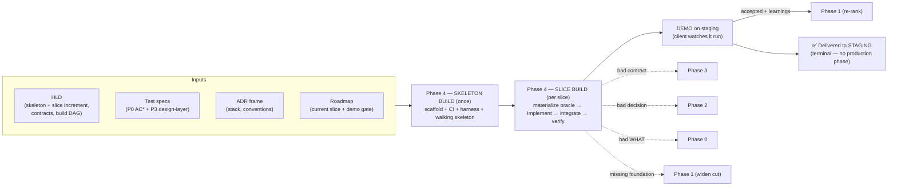
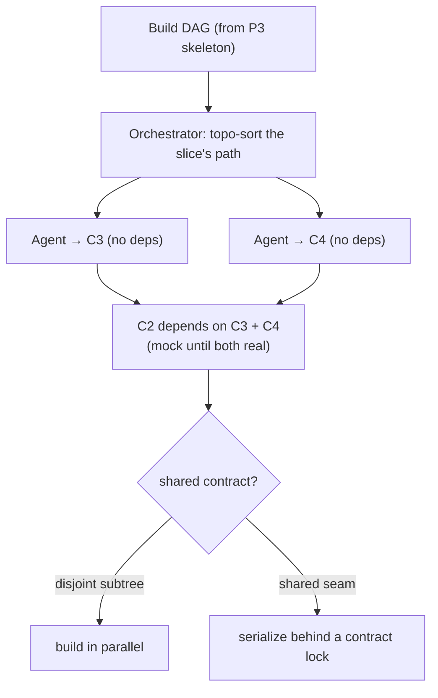
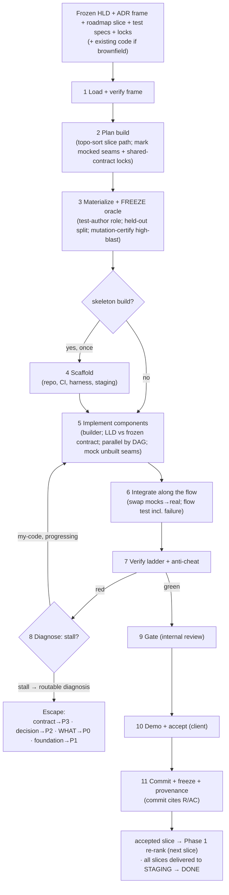
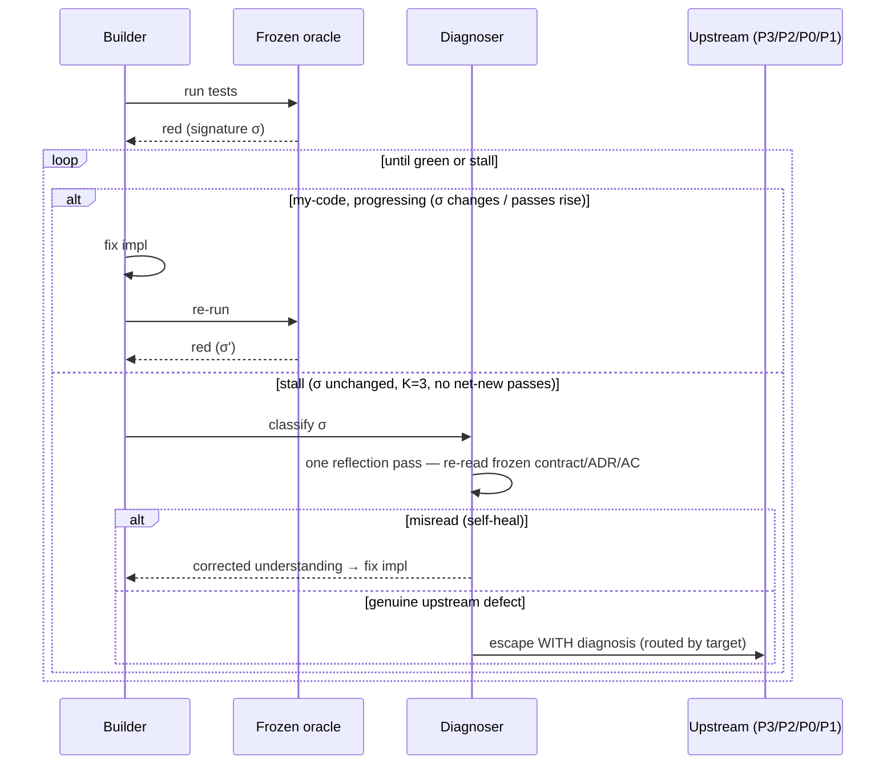
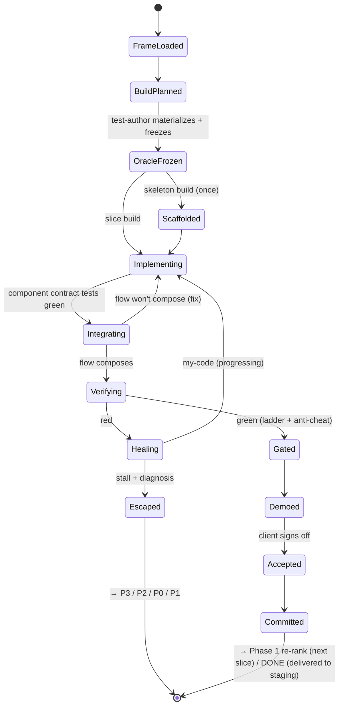
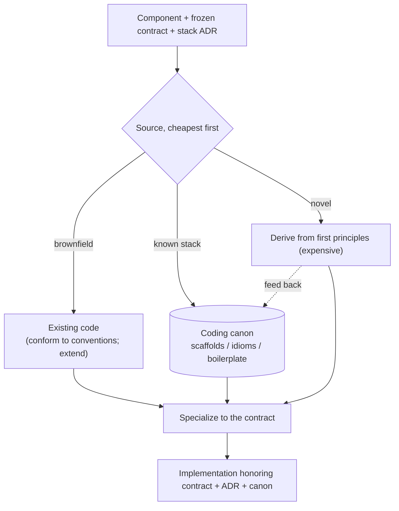
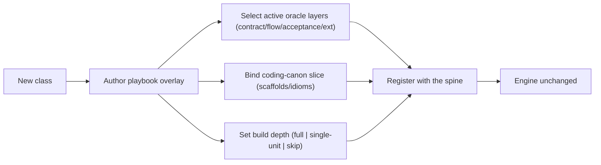

# Phase 4 — Automated Build Pipeline (HLD + oracle → verified running software)

| | |
|---|---|
| **Status** | Draft |
| **Version** | 0.2 |
| **Date** | 2026-06-06 |
| **Audience** | Engineers building system; agents executing it |
| **Scope** | Stage turning frozen HLD (skeleton + slice increments) + pre-authored test oracle into verified, demoable running software — one vertical slice at a time |
| **Predecessors** | Phase 0 — `00-automated-aprd-pipeline-spec.md` (WHAT) · Phase 1 — `01-automated-roadmap-pipeline-spec.md` (slices) · Phase 2 — `02-automated-adr-pipeline-spec.md` (WHY-this-HOW) · Phase 3 — `03-automated-hld-pipeline-spec.md` (structure + contracts + test specs) |
| **Terminal** | Phase 4 **terminal phase** — system delivers verified software to STAGING (demo-accepted). Production release / rollback / handoff **out of scope** (§1.2) |

**Change log**
- **v0.2** (2026-06-09) — T10 economy cut (caveman register + AB8): killed banned hedge/filler words. Substance invariant. New version = the change request (P8); re-lock at next freeze.

---

## 1. Purpose

Phase 3 froze structure — components, contracts, build DAG — and *specs* for test oracle. Phase 4 = paper becomes product: implements each component against frozen contract, makes pre-authored oracle go green, delivers running slice client watches demo. Only phase emitting executable software, and — by design — only phase that **cannot define own "done."**

Three facts drive design:

1. **"Done" inherited, not authored.** Every prior phase compiled piece of contract; by Phase 4 "done" already exists as executable tests — acceptance `AC*` (Phase 0) + design-layer contract/flow specs (Phase 3). Build not "decide what done is and reach it" — it = "make pre-existing oracle green against frozen contracts." Phase 4 zero acceptance authority. That = what makes it *verifiable*, not self-certifying.
2. **Contract = unit of both parallelism and doneness.** Phase 3 froze seams, so components built by independent agents in parallel — each against its contract, mocking seams of components not yet built. Component done iff its contract tests pass with deps mocked. Build DAG = build plan; vertical slice = path through it (cashing in H1/H7).
3. **Builder must not grade own work.** Agent writing both test and impl turns red green by weakening either side. So oracle materialized from frozen specs by *separate* role and frozen *before* implementation; builder makes it pass but cannot edit it. Needing to edit test = **escape signal, not edit.**

So Phase 4 runs **two modes**, mirroring roadmap's two loops:

- **Skeleton build** — once: scaffold repo, CI, test harness, demo/staging target; build walking skeleton end-to-end with stub behavior. Proves architecture *runs*, not only composes on paper. Every slice reuses this harness.
- **Slice build** — per slice: implement slice's path through build DAG against frozen contracts, materialize-then-pass its oracle, integrate, demo.

### 1.1 Goals

- Implement each slice's components against frozen Phase 3 contracts; make full inherited oracle pass.
- Materialize executable oracle from frozen specs via **separate test-author role**, frozen before implementation.
- Build DAG in parallel where structure allows; serialize only on shared contracts.
- Deliver demoable running artifact per slice; close **demo gate** with client.
- Close traceability thread: every commit cites R/AC it satisfies.
- Resolve low-level design inside each component — only phase where LLD lives.
- Route defects up (contract→Phase 3, decision→Phase 2, WHAT→Phase 0, missing foundation→Phase 1); never patch upstream.

### 1.2 Non-goals

- **Authoring acceptance.** Phase 4 executes oracle; does not define "done." Editing frozen test forbidden — it = escape.
- **Production release / handoff.** Phase 4 **terminal phase**: ends at *accepted demo on STAGING*; that verified staging build = system's final deliverable. Production release, rollback, handoff to client's environment **out of scope** — deliberate boundary, not deferred phase. (If system later extended past staging, that = new phase; nothing here hands off to one.)
- **Re-deciding structure or decisions.** Contracts + ADRs = frozen input. Contract that cannot be built = change request to Phase 3, never silent redesign.
- **Building whole product at once.** Only skeleton built eagerly; everything else per-slice, on demand. Big-bang integration = waterfall roadmap exists to prevent.
- **Single mega-prompt.** Roles stay separated for failure isolation + quality, exactly as Phases 0–3.

---

## 2. Where Phase 4 sits



- **Input:** frozen HLD (skeleton + current slice's increment, incl. contracts + build DAG), inherited test specs (Phase 0 `AC*` + Phase 3 design-layer), ADR frame (stack, conventions, conformance), roadmap's current slice + demo gate, coding canon, and — brownfield — existing codebase.
- **Output:** verified, demoable running software for slice on STAGING; frozen build record + provenance; commits closing ID thread; learnings handed back to Phase 1. Accepted staging build = system's **final deliverable** — no downstream production phase.
- **Four escape targets:** contract that cannot be built → Phase 3; decision that proves unbuildable → Phase 2; `WHAT` revealed ambiguous → Phase 0; missing foundation slice needs → Phase 1. Phase 4 never patches upstream frozen artifact.

---

## 3. Core principles

Inherits Phase 0's P-series, Phase 1's RM-series, Phase 2's D-series, Phase 3's H-series. These = build-specific additions; each load-bearing.

| # | Principle | Consequence if violated | Echoes |
|---|---|---|---|
| B1 | **"Done" inherited** — Phase 4 makes pre-authored oracle green; no acceptance authority | Self-certifying build; agent declares own success | P2, RM2 |
| B2 | **Build DAG, not monolith** — independent components build parallel against frozen contracts, mocking unbuilt seams | No parallelism; integration deferred to big bang | H7, RM7 |
| B3 | **Contract = unit of doneness** — component done iff its contract tests pass with deps mocked | "Done" becomes subjective; integration breaks late | H1 |
| B4 | **Oracle frozen before impl; builder cannot edit it** — test-author role ≠ builder role | Builder weakens test to pass; nothing verified | P10, P11 |
| B5 | **Need to change frozen test / contract / decision / WHAT = escape, not edit** | Silent re-scope or re-decision hidden in code | D9, H10, P8 |
| B6 | **Escape on stall, not count** — diagnose→act; escape only with routable diagnosis | Infinite retry (thrash) or premature false escapes | — |
| B7 | **Adversarial verify before demo** — held-out cases, property tests, semantic critique, mutation-certified oracle; depth scales with blast radius | Cheating (hardcode/overfit) reaches client as "passing" | P10, D8 |
| B8 | **LLD lives here and only here** — internals decided against frozen contract at implementation time | Design leaks up into Phase 3, or internals undesigned | (P3 §1.2) |
| B9 | **Two modes** — skeleton build once (scaffold + harness + walking skeleton) + slice build ×N | Big-bang build waterfall, or harness rebuilt each slice | RM3, H13 |
| B10 | **Demo gate closes slice** — AC green *and* client saw it run; hand learnings to Phase 1 | "Done" without proof client values it; stale roadmap | RM6 |
| B11 | **Code grounded from coding canon + existing code; LLM composes, not source** | Hallucinated boilerplate; convention drift | P11, H12 |
| B12 | **Commit closes ID thread** — every commit cites R/AC; untraceable code = drift | Lost traceability; gold-plating ships unnoticed | P9 |
| B13 | **Build/verify depth scales with class blast radius** (playbook-toggled) | Bugfix drowns in ceremony, or greenfield under-verified | P3, D10, H11 |

---

## 4. Build unit & verification stack

Build unit = **component implemented against frozen contract**, verified bottom-up through layered oracle, integrated along flow. Implementation = least interesting part; **oracle + escape discipline** = artifact.

### 4.1 Unifying insight — builder has no authority over "done"

```
Author "done"?  →  NO. The oracle was frozen upstream (AC* from P0, CT/F specs from P3).
Build           →  make the frozen oracle green against frozen contracts.
Component done  →  iff its contract tests pass with dependencies mocked.
Slice done      →  iff its flow + acceptance tests pass AND the client saw it demo.
Edit a test?    →  forbidden. Needing to = escape (contract / decision / WHAT is wrong).
```

Every other phase could argue its output was good. Builder only argues pre-existing, *separately authored* oracle went green. This = structural property turning "agent says it works" into "independent oracle says it works" — and why test-author role (§5.3) must be distinct from builder (§5.5).

### 4.2 Verification ladder

| Layer | Id source | Authored by | Proves | When run |
|---|---|---|---|---|
| **Contract test** | `CT*` | test-author, from P3 spec | seam honors shape + failure modes | per component (deps mocked) |
| **Flow test** | `F*` | test-author, from P3 spec | vertical path composes incl. failure | per slice (integration) |
| **Acceptance test** | `AC*` | test-author, from P0 spec | user-observable behavior (black-box) | per slice (demo gate) |
| **Regression guard** | feature/bug ext | inherited suite + P0 ext | nothing previously green went red | per slice (brownfield) |
| **Benchmark** | perf ext | test-author, from P0 ext | NFR metric ≥ target | per slice / hardening |
| **Parity** | migration ext | test-author, from P0 ext | old output == new output | per slice |

All six **inherited** — Phase 4 authors none, only materializes them to executable form (§5.3) and runs them. Class playbook (§11) selects which layers fire.

### 4.3 Parallel by contract, serial by sharing



Disjoint subtrees build concurrently; component whose contract two slices share serializes behind lock held by orchestrator. Unbuilt deps **mocked at contract** — frozen seam = exactly the mock specification, so mock + real implementation interchangeable by construction. This = H1/H7 payoff cashed in: contracts-frozen is what makes parallel agent build safe.

---

## 5. Pipeline stages

One **spine** (written once), per-class **playbook** overlays (§11) — identical philosophy to Phases 0–3. Spine runs full during **skeleton build** (plus scaffold stage, §5.4); in **slice build** runs scoped to one slice's path, skipping scaffold.



### 5.1 Load & verify frame
Read frozen HLD (skeleton + this slice's increment), verify `hld.lock`, `adr.lock`, `aprd.lock` (tamper-evident). Load build DAG, slice's contracts, inherited test specs, ADR frame (stack, conventions, conformance), data model, NFR mechanisms, coding canon. Brownfield: load existing codebase — it = **given, extended, not redrawn** (conform to its conventions; regression guard mandatory).

### 5.2 Plan build
Topologically sort slice's path through build DAG. Mark each seam **real** (dep already built in prior slice) or **mocked** (unbuilt or later-slice dep). Flag any component whose contract shared with another slice — serializes behind orchestrator-held **contract lock** (§4.3). Output build plan: ordered, parallelizable component set + mock/lock map.

### 5.3 Materialize & freeze oracle (test-author role)
Role **distinct from builder** turns frozen specs into executable tests: contract tests (from `CT*`), flow test (from `F*`), acceptance tests (from `AC*`), plus class extension (regression / benchmark / parity). Two anti-cheat measures baked in here:
- **Held-out split** — acceptance inputs split into *visible* set builder may see and *held-out* set only gate runs. Hardcoding visible set fails held-out set (B7).
- **Mutation certification** — for high-blast components (auth, money, data integrity), test suite mutation-tested *once, here*, to certify it kill-strong before any impl exists. Mutation tests **oracle**, not impl, so cost paid once and amortized across every build and retry (§7.1).

Oracle then **frozen** (`oracle.lock`, signed by test-author role). Starts fully red — nothing implemented yet. Red-first = point: builder's only job = turn this exact, immutable oracle green.

### 5.4 Scaffold (skeleton build only)
Once, in skeleton build: create repo, CI, test harness, demo/staging target; wire walking skeleton end-to-end with stub behavior so harness runs and skeleton flow green-on-stubs. Establishes build/test/demo infrastructure every later slice reuses. Skipped entirely in slice builds.

### 5.5 Implement components (builder role)
For each component in plan — parallel where DAG allows — builder does **only LLD in whole pipeline**: design component's internals (classes, functions, algorithms) against its *frozen contract*, write code honoring ADR frame + coding canon, mock seams of unbuilt deps. Run component's contract tests; iterate red→green under self-heal/escape budget (§5.8). Contract = wall: internals free, seam fixed.

### 5.6 Integrate along flow
As deps land, swap their mocks for real implementations and run slice's **flow test, incl. failure variant**. Flow that composed on paper (Phase 3) but won't compose in code reveals contract-reality mismatch → return to §5.5, or escape to Phase 3 if contract itself wrong (§5.8).

### 5.7 Verify (ladder + anti-cheat)
Run full verification ladder (§4.2): contract + flow + acceptance (visible **and** held-out) + class extension + NFR-mechanism checks (each `M*` from HLD must be wired, not only present in design). Then adversarial anti-cheat pass: **semantic diff critique** (flag literals matching fixtures, empty catch-alls, stub branches, complexity below what requirement implies) and **property tests** for logic-bearing components. Oracle already mutation-certified at freeze (§5.3). All-green across applicable layers = bar.

### 5.8 Self-heal vs escape
Red→green discipline. On any red, **diagnose before retrying** — classify failure as `my-code | contract | decision | WHAT | missing-foundation`.

- **Escape on stall, not count.** *Stall* = K consecutive attempts (default **K = 3**) with *same failure signature* and *no net-new passing tests*. Escape only on stall.
- **Reset budget on progress** — if failure signature changes or pass-count rises, build converging; keep going. Budget counts stalls, not iterations.
- **Hard ceiling** (~10 total iterations / wall-clock) backstops oscillation — flip-flop between two red states itself = stall.
- **Flaky gate first** — re-run red 2–3× before counting it; non-deterministic failure quarantined and harness fixed, never escaped on.
- **One reflection pass before escaping** — on stall, re-read frozen contract/ADR/AC once. Most common false escape = *misread* spec (self-heal) masquerading as wrong spec.
- **Escape carries diagnosis.** Escape routes to its target (Phase 3/2/0/1) *with reason*. Escape without routable diagnosis = builder bug, not upstream defect — consistent with "defects route, not patch."



### 5.9 Gate & escape hatches
Internal code-review gate (senior/human reviewer for high-blast components). Four escape targets (§2): bad contract → Phase 3 (new/superseding HLD increment), bad decision → Phase 2 (superseding ADR), bad WHAT → Phase 0 (new aPRD version → Phase 1 may re-slice), missing foundation → Phase 1 (widen foundation cut). Never patch upstream frozen artifact in place (B5).

### 5.10 Demo & accept
Produce running demo artifact and let client watch slice run — this = Phase 1's demo gate (B10). Acceptance criteria green = necessary but not sufficient; slice done only when client *seen it run* and accepted it. On acceptance: mark slice accepted, capture learnings (new deps discovered, risk outcomes, scope surprises), hand them to Phase 1 controller to re-rank remaining slices.

### 5.11 Commit & freeze
Tag slice build, write provenance (which builder/test-author agents, which oracle, which upstream locks it built against), close ID thread: every commit cites R/AC it satisfies. Slice's code becomes baseline later slices build on. After acceptance, slice's demo/acceptance record immutable.

### 5.12 Pipeline state machine



---

## 6. Build artifact

Dual audience, like every phase artifact: machine-readable build record + provenance for orchestration and audit; human-readable demo + PR for review.

### 6.1 Schema

```yaml
SLICE: S1
MODE:  skeleton | slice
BUILD_UNITS:
  - component: C1
    implements_contract: [CT1, CT2]
    traces: [R1, AC2]                 # closes the thread R→…→C→CT→commit
    mocked_deps: [C3]                 # seams not yet real
    status: planned | building | green | blocked
ORACLE:                              # materialized from frozen specs, then FROZEN
  contract_tests:   [CT1.test, CT2.test]
  flow_test:        F1.test
  acceptance_tests: { visible: [AC2.v], held_out: [AC2.h] }   # train/test split
  class_ext:        [regression | benchmark | parity]
  mutation_certified: [C_high]       # high-blast components only
  oracle_lock:      <hash + test-author + version>            # frozen pre-impl
VERIFICATION:
  contract: pass
  flow:     pass
  acceptance: pass                   # visible + held-out
  regression: pass                   # brownfield
  nfr:      { latency: pass }        # every M* actually wired
ANTI_CHEAT:
  held_out: pass
  semantic_critique: clean
  property: pass
DEMO:
  artifact:    <staging url / recording / trace>
  accepted_by: <client>
  accepted_at: <timestamp>           # record immutable once accepted
LEARNINGS: [ <new deps, risk outcomes, scope surprises> ]    # → Phase 1 re-rank
PROVENANCE:
  builder_agent:     <id>
  test_author_agent: <id>            # distinct from builder (B4)
  built_against:     { hld.lock, adr.lock, aprd.lock, oracle.lock }
COMMITS: [ { sha: <…>, traces: [R1, AC2] } ]
```

### 6.2 Example — slice build record (abridged)

```yaml
SLICE: S2            # "User can reset their password"
MODE:  slice
BUILD_UNITS:
  - { component: C1, implements_contract: [CT1], traces: [R7, AC9], status: green }
  - { component: C2, implements_contract: [CT2, CT5], traces: [R7, R8, AC9], mocked_deps: [C4], status: green }
ORACLE:
  acceptance_tests: { visible: [AC9.v], held_out: [AC9.h] }
  oracle_lock: sha256:9f1a… (test-author@v3)
VERIFICATION: { contract: pass, flow: pass, acceptance: pass, regression: pass }
DEMO: { artifact: "https://staging/…/reset", accepted_by: client, accepted_at: 2026-06-06T15:04Z }
LEARNINGS: ["C4 (email gateway) rate-limits at 5/min → risk_spike candidate next"]
COMMITS: [ { sha: a1b2c3, traces: [R7, AC9] } ]
```

### 6.3 Why this form

- **`oracle_lock` = proof builder did not grade itself** — authored and frozen by separate role before any implementation (B4). Artifact that makes build verifiable.
- **Held-out split = structural anti-cheat** — hardcoding visible set fails gate; overfitting caught by construction, nearly for free (B7).
- **`built_against` pins exact upstream locks** — tamper-evident, resumable, and audit answer to "why is code like this?" traces straight up chain.
- **Commits cite R/AC** — closes full thread `R → AC → S → ADR → C → CT → F → commit → test`. Any code not traceable to requirement = drift (B12).
- **`LEARNINGS` feed Phase 1** — demo closes slice loop and triggers re-rank (B10); build = richest source of real dependency and risk information.

---

## 7. Code grounding

Where code comes from — build-layer analog of Phase 0's research, Phase 2's option grounding, Phase 3's structure grounding. **Retrieval + specialization**, not free generation.



- **Brownfield = delta.** New code extends existing codebase and matches its conventions (convention baseline from feature-add aPRD extension). Existing code loaded, not rewritten; regression guard protects what already green.
- **Canon lever — fifth and final reuse.** Coding canon = scaffolds, project templates, idiom libraries, lint/format configs per stack + framework (same best-practice canon Phase 0 mined, now applied at code layer). First project pays full scaffolding cost; later projects retrieve `code-canon.vN` and generate *against templates*, not blank files. Joins Phase 0 (best practices), Phase 1 (slicing patterns), Phase 2 (decision options), Phase 3 (reference architectures): **canon lever now spans all five phases — system-wide efficiency engine.** LLM specializes canon to contract; never source of truth (B11).

---

## 8. Prompt library

Roles separated, same as Phases 0–3. Each = same role with playbook-injected stack/domain block. **Test-author** and **builder** deliberately different roles (B4).

**BUILD-PLAN**
```
Input: the slice's path through the frozen build DAG + the contract map.
Topologically order the components. Mark each seam real (dep already built) or mocked.
Flag shared-contract components for serialization behind a lock.
Output {ordered_components[], mock_map, lock_set}.
```

**MATERIALIZE-ORACLE** (test-author — NOT the builder)
```
Input: frozen specs — CT* + F* (Phase 3) and AC* (Phase 0) + class extension.
Produce executable tests for each layer. Split acceptance inputs into {visible, held_out}.
For high-blast components, mutation-test the suite to certify it is kill-strong.
Freeze the oracle (oracle.lock). The suite must start fully red. Do not implement anything.
```

**IMPLEMENT** (builder — cannot edit the oracle)
```
Input: one component + its FROZEN contract + ADR frame + coding canon (+ existing code if brownfield).
Design the internals (LLD) against the contract; write code honoring the ADR + canon; mock unbuilt seams.
Run the component's contract tests; iterate red→green under the self-heal budget.
You may NOT modify any test. Needing to = emit an escape with a diagnosis.
```

**INTEGRATE**
```
As dependencies become real, replace their mocks and run the slice's flow test incl. the failure variant.
A flow that will not compose against real components is a contract-reality mismatch:
fix the implementation, or escape to Phase 3 if the contract itself is wrong.
```

**DIAGNOSE** (self-heal vs escape)
```
On a red, classify the failure: my-code | contract | decision | WHAT | missing-foundation.
Escape only on STALL (K=3 same-signature attempts, no net-new passing tests), never on raw count.
Reset on progress. Re-run flaky reds 2–3× first. Do one reflection pass (re-read frozen inputs) before escaping.
An escape MUST carry a routable diagnosis to its target phase.
```

**VERIFY-OUTPUT**
```
Run the full ladder: contract + flow + acceptance (visible + held_out) + class extension + NFR-mechanism checks.
Report pass/fail per layer and per AC id. On any fail, return to the self-heal loop with the failing id.
Confirm every M* (NFR mechanism) is actually wired, not merely present in design.
```

**CRITIQUE** (adversarial anti-cheat)
```
Hostile reviewer of the diff vs the contract. Flag: literals matching test fixtures (hardcoding);
empty catch-alls hiding failure-mode tests; stub branches; complexity below what the requirement implies;
any code tracing to no requirement (gold-plating). Output blocking issues only.
```

**DEMO-GEN**
```
Produce the running demo artifact for the slice per its class (UI click-through / API trace / benchmark chart).
It must show the slice's AC passing in a way a non-engineer client can watch and accept.
```

---

## 9. Interaction & gate model

- **Internal by default for build itself** — HOW + its implementation = delivery team's domain; client signed WHAT (Phase 0) and ordered slices (Phase 1).
- **Client re-engaged at demo gate** — Phase 4 rejoins client, like Phase 1. **Phase symmetry completes**: client owns WHAT (Phase 0), WHEN/order (Phase 1), confirms running RESULT (Phase 4 demo); team owns HOW (Phases 2–3) and building. Demo = recognition-over-recall — client *watches it run* and accepts, does not author.
- **Senior/human code review** for high-blast components (auth, money, data integrity, public contracts).
- **Defects route, not patch** (§5.9) — preserves immutability of every upstream frozen artifact.

Principle carried from Phase 0: cheap human touch, not zero. Client spends minutes accepting working demo, not hours reviewing code.

---

## 10. Artifact storage & versioning

Sibling to `.aprd/`, `.roadmap/`, `.adr/`, `.hld/`. Build record = delivery's execution root of truth; source it produces lives in project repo.

```
project/
  .aprd/                          # Phase 0
  .roadmap/                       # Phase 1 (slices)
  .adr/                           # Phase 2 (+ local ADRs from Phase 3)
  .hld/                           # Phase 3 (skeleton + increments)
  .build/
    00-inputs.json                # loaded frame + lock verification (hld/adr/aprd)
    skeleton/                     # SKELETON BUILD (once)
      scaffold/                   # repo, CI, harness, staging target
      walking-skeleton.md
      build-record.json
    slices/                       # SLICE BUILD (×N)
      S1/
        build-plan.json
        oracle/                   # materialized executable tests — FROZEN pre-impl
          contract/  flow/  acceptance/
          oracle.lock             # hash + test-author + version
        verification.json         # ladder results + anti-cheat
        demo/                     # artifact + acceptance record (immutable once accepted)
        build-record.json         # provenance, learnings, commits
        build.lock                # slice build signature
    code-canon.vN/                # cached scaffolds/idioms (reused across projects)
  src/  …                         # the actual source repo; commits cite R/AC
```

**Rules**

- **Oracle frozen before implementation.** `oracle.lock` written by test-author role and immutable; builder runs against it and never edits it (B4).
- **Skeleton built once; slices additive.** Harness + walking skeleton = baseline every slice extends; skeleton-level change re-triggers and ripples to all slices, so skeleton stays thin (H14).
- **Demo/acceptance records immutable once accepted** — audit trail of what client signed off (mirrors Phase 1's slice-log).
- **Provenance pins frozen locks.** Every build record names exactly which `hld/adr/aprd/oracle` locks it built against — tamper-evident and resumable.
- **Commits close thread.** Every commit cites R/AC; untraceable code = drift (B12, P9).
- **Defects route up, recorded as change requests** — never patch frozen upstream artifact (B5).

---

## 11. Extensibility — depth per class (playbook-toggled)

Build/verify depth scales with class blast radius (B13), set by same playbook driving Phases 0–3.

| Class | Phase 4 depth |
|---|---|
| **Greenfield** | Full — skeleton build (scaffold + harness + walking skeleton) + per-slice build against new contracts |
| **Large feature-add** | No scaffold (harness exists); per-slice build into existing code; regression guard mandatory; conform to conventions |
| **Bugfix** | Single unit — make reproduction test green; regression guard; typically no new component |
| **Refactor** | Behavior-frozen — characterization/golden tests = oracle; implementation changes while oracle stays green throughout |
| **Migration** | Parity-gated — parity tests = oracle; per-module slice build; old == new |
| **Perf** | Benchmark-gated — optimize until benchmark ≥ target, behavior tests stay green |
| **Integration** | Contract-test-gated — per-endpoint/flow build against external contract; failure modes mandatory |
| **Investigation** | None — no software to build; evidence = deliverable (skipped) |



If new class forces engine edit, abstraction wrong — fix spine, not playbook. (Same test as Phases 0–3.)

---

## 12. Failure modes & guardrails

| Failure mode | Guardrail |
|---|---|
| Builder grades own work (weak test + matching code) | Oracle frozen pre-impl by separate test-author role; builder cannot edit it (B4) |
| Cheating — hardcode / overfit to tests | Held-out cases + property tests + semantic critique; mutation-certified oracle for high-blast (B7) |
| Boxes compose on paper but not in code | Flow test incl. failure path at integration (B2/B3); contract mismatch → escape Phase 3 |
| Build can't parallelize | Build DAG; disjoint subtrees parallel, mock unbuilt seams (B2) |
| Shared-contract race / merge conflict | Build orchestrator + contract lock; shared components serialize (§4.3) |
| Infinite retry / thrash | Escape on stall, not count; hard-ceiling backstop (B6) |
| False escape (spec misread as spec-wrong) | One reflection pass re-reading frozen inputs before escaping (B6) |
| Escape with no diagnosis | Escape must carry routable diagnosis or it = builder bug (B6) |
| Flaky test mistaken for real red | Flaky gate — re-run 2–3× before counting or escaping |
| Contract patched to fit code | Frozen contract; change = escape to Phase 3, never edit (B5) |
| NFR mechanism designed but not wired | NFR-mechanism checks in verification ladder (§5.7); closes H5 |
| Regression in brownfield | Regression guard in oracle; inherited suite must stay green |
| Untraceable code (gold-plating / drift) | Commit cites R/AC; untraceable code flagged (B12) |
| Big-bang integration (waterfall) | Skeleton built once + per-slice build with demo gate (B9) |
| LLD ambiguity or design leaking up into Phase 3 | LLD lives in Phase 4 against frozen contract (B8); structure stops at component boundary |
| Ships to prod prematurely | Phase 4 terminal at STAGING demo; production release explicitly out of scope (§1.2) |

---

## 13. Glossary

- **Build unit** — component implemented against frozen contract; atom Phase 4 builds and verifies.
- **Inherited oracle** — executable tests defining "done," authored upstream (AC* from Phase 0, contract/flow specs from Phase 3); Phase 4 runs it, never defines it.
- **Test-author role / builder role** — deliberately separated roles that materialize-and-freeze oracle vs implement against it (B4).
- **`oracle.lock`** — frozen, signed test suite written before implementation; builder cannot edit it.
- **Held-out set** — acceptance inputs gate runs but builder never sees; structural anti-overfit lever.
- **Mutation-certified oracle** — test suite proven kill-strong by mutation testing once at freeze; mutation tests *oracle*, not impl.
- **Build orchestrator** — drives DAG traversal; runs disjoint subtrees in parallel and serializes shared-contract components behind lock.
- **Self-heal loop** — diagnose→act red→green cycle; escapes on stall, not count.
- **Stall** — K consecutive attempts with same failure signature and no net-new passing tests; escape trigger.
- **Escape (four targets)** — route defect up: contract→Phase 3, decision→Phase 2, WHAT→Phase 0, missing foundation→Phase 1. Never patch upstream.
- **Skeleton build / slice build** — scaffold + harness + walking skeleton once vs implement one slice's path per pass.
- **Demo gate** — slice done only when its AC passes *and* client has seen it run.
- **Coding canon** — cached scaffolds, idioms, configs per stack; fifth and final reuse of canon lever.
- **LLD** — low-level design (component internals); decided in Phase 4 against frozen contract, only phase it lives in.
- **Provenance** — record of which agents built what, against which frozen upstream locks; audit + resume key.

---

## 14. Open questions

- **Oracle materialization fidelity** — how faithfully executable test generated from Phase 3 spec; when spec too thin to materialize (feedback to Phase 3's test-spec-depth open question).
- **Held-out generation** — how to generate held-out cases same-distribution-but-unguessable, and who validates split fair.
- **Mutation budget** — which components cross "high-blast" line for mutation certification; cost ceiling per project.
- **Stall tuning** — right `K` and hard-ceiling values per class, and whether they should be learned from build telemetry rather than fixed.
- **Parallel-agent merge** — concrete locking/merge protocol for shared-contract components (optimistic vs pessimistic); ties to Phase 1/3's shared-contract open question.
- **Skeleton stability under build** — when slice build reveals scaffolded harness/skeleton wrong, re-scaffold ripple cost (ties to Phase 3's skeleton-stability open question).
- **LLD persistence** — whether component internals captured as artifacts or live only as code + tests; brownfield LLD reconstruction depth.
- **Demo fidelity per class** — what "client sees it run" means concretely (UI vs API trace vs benchmark chart); how far demo-gen can be automated.
- **Non-deterministic acceptance** — handling inherently non-deterministic ACs (timing, external services) in frozen oracle without flakiness.
