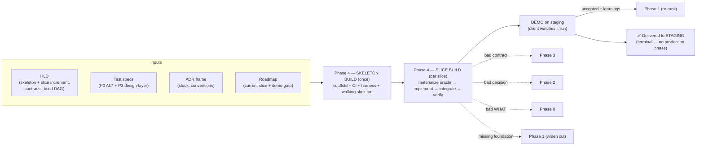
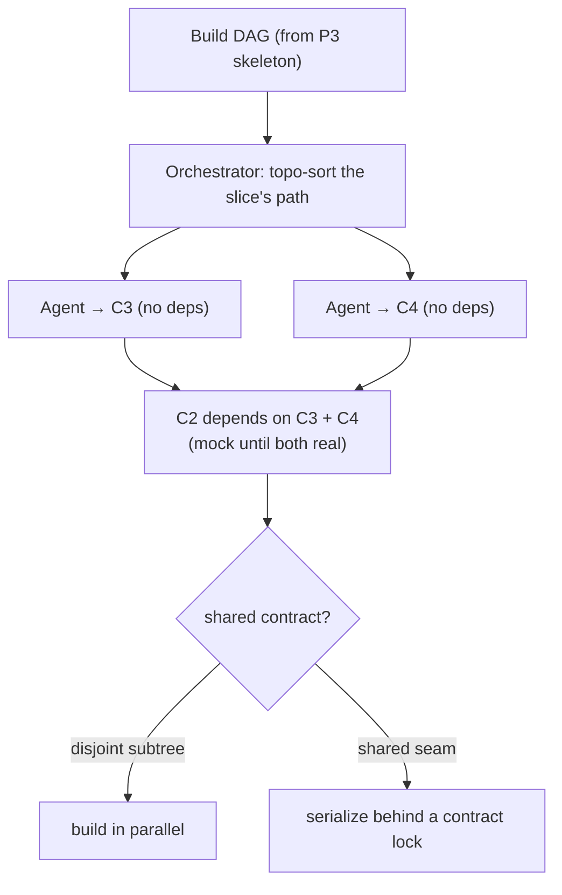
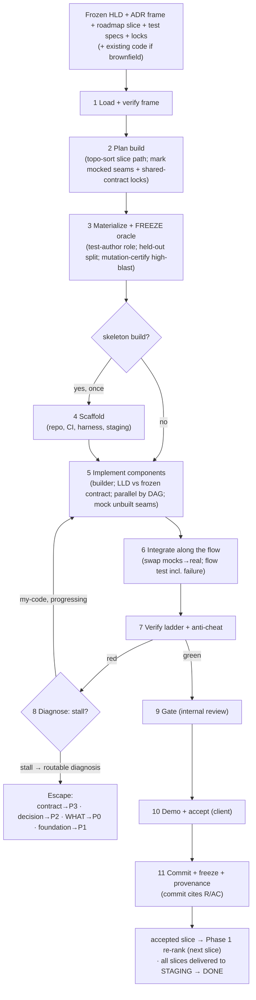
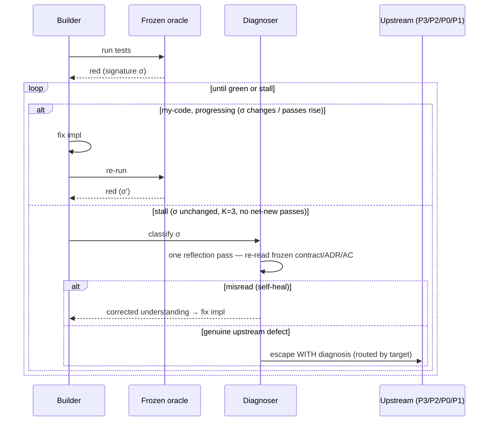
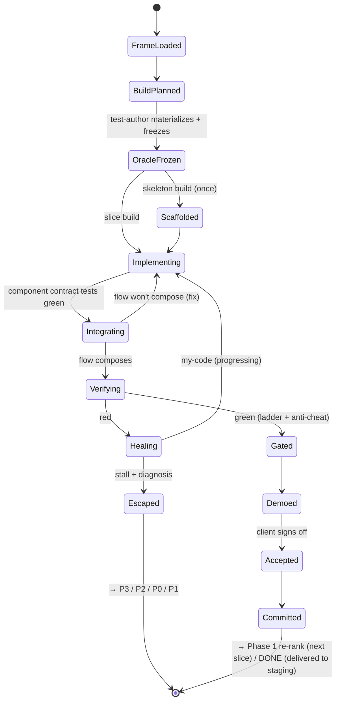
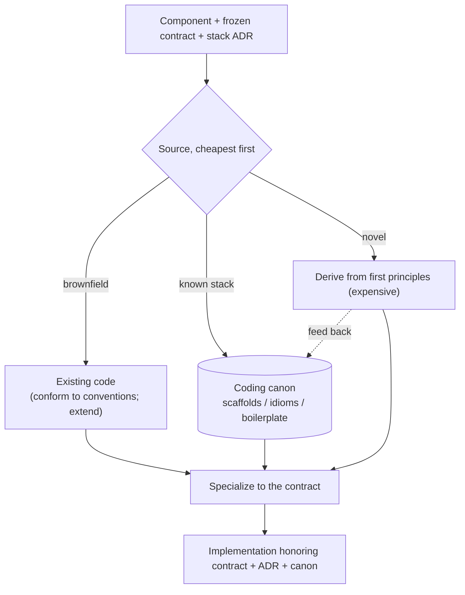
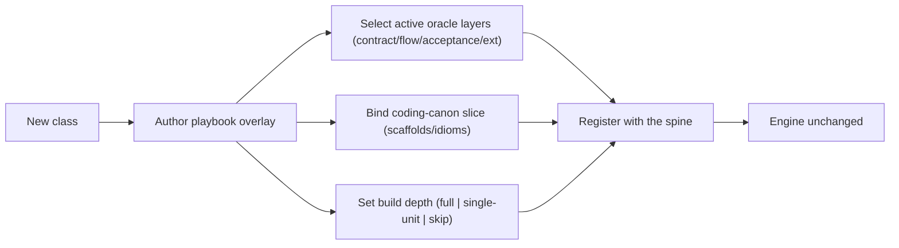

# Phase 4 — Automated Build Pipeline (HLD + oracle → verified running software)

| | |
|---|---|
| **Status** | Draft |
| **Version** | 0.1 |
| **Date** | 2026-06-06 |
| **Audience** | Engineers building the system; the agents executing it |
| **Scope** | The stage that turns the frozen HLD (skeleton + slice increments) and the pre-authored test oracle into verified, demoable running software — one vertical slice at a time |
| **Predecessors** | Phase 0 — `00-automated-aprd-pipeline-spec.md` (WHAT) · Phase 1 — `01-automated-roadmap-pipeline-spec.md` (slices) · Phase 2 — `02-automated-adr-pipeline-spec.md` (WHY-this-HOW) · Phase 3 — `03-automated-hld-pipeline-spec.md` (structure + contracts + test specs) |
| **Terminal** | Phase 4 is the **terminal phase** — the system delivers verified software to STAGING (demo-accepted). Production release / rollback / handoff is **out of scope** (§1.2) |

---

## 1. Purpose

Phase 3 froze the structure — components, contracts, the build DAG — and the *specs* for the test oracle. Phase 4 is where paper becomes product: it implements each component against its frozen contract, makes the pre-authored oracle go green, and delivers a running slice the client watches demo. It is the only phase that emits executable software, and — by design — the only phase that **cannot define its own "done."**

Three facts drive the design:

1. **"Done" is inherited, not authored.** Every prior phase compiled a piece of the contract; by Phase 4 "done" already exists as executable tests — acceptance `AC*` (Phase 0) plus design-layer contract/flow specs (Phase 3). Build is not "decide what done is and reach it" — it is "make a pre-existing oracle green against frozen contracts." Phase 4 has zero acceptance authority. That is precisely what makes it *verifiable* rather than self-certifying.
2. **The contract is the unit of both parallelism and doneness.** Because Phase 3 froze the seams, components can be built by independent agents in parallel — each against its contract, mocking the seams of components not yet built. A component is done iff its contract tests pass with its dependencies mocked. The build DAG is therefore the build plan, and a vertical slice is a path through it (cashing in H1/H7).
3. **The builder must not grade its own work.** An agent that writes both the test and the implementation can turn red green by weakening either side. So the oracle is materialized from frozen specs by a *separate* role and frozen *before* implementation; the builder can make it pass but cannot edit it. Needing to edit a test is an **escape signal, not an edit.**

So Phase 4 runs in **two modes**, mirroring the roadmap's two loops:

- **Skeleton build** — once: scaffold the repository, CI, the test harness, and the demo/staging target; build the walking skeleton end-to-end with stub behavior. Proves the architecture *runs*, not just composes on paper. Every slice reuses this harness.
- **Slice build** — per slice: implement the slice's path through the build DAG against frozen contracts, materialize-then-pass its oracle, integrate, and demo.

### 1.1 Goals

- Implement each slice's components against frozen Phase 3 contracts; make the full inherited oracle pass.
- Materialize the executable oracle from frozen specs via a **separate test-author role**, frozen before implementation.
- Build the DAG in parallel where structure allows; serialize only on shared contracts.
- Deliver a demoable running artifact per slice; close the **demo gate** with the client.
- Close the traceability thread: every commit cites the R/AC it satisfies.
- Resolve low-level design inside each component — the only phase where LLD lives.
- Route defects up (contract→Phase 3, decision→Phase 2, WHAT→Phase 0, missing foundation→Phase 1); never patch upstream.

### 1.2 Non-goals

- **Authoring acceptance.** Phase 4 executes the oracle; it does not define "done." Editing a frozen test is forbidden — it is an escape.
- **Production release / handoff.** Phase 4 is the **terminal phase**: it ends at an *accepted demo on STAGING*, and that verified staging build is the system's final deliverable. Production release, rollback, and handoff to the client's environment are **out of scope** — a deliberate boundary, not a deferred phase. (If the system is later extended past staging, that is a new phase; nothing here hands off to one.)
- **Re-deciding structure or decisions.** Contracts and ADRs are frozen input. A contract that cannot be built is a change request to Phase 3, never a silent redesign.
- **Building the whole product at once.** Only the skeleton is built eagerly; everything else is per-slice, just-in-time. Big-bang integration is the waterfall the roadmap exists to prevent.
- **A single mega-prompt.** Roles stay separated for failure isolation and quality, exactly as in Phases 0–3.

---

## 2. Where Phase 4 sits



- **Input:** the frozen HLD (skeleton + the current slice's increment, including contracts and the build DAG), the inherited test specs (Phase 0 `AC*` + Phase 3 design-layer), the ADR frame (stack, conventions, conformance), the roadmap's current slice + demo gate, the coding canon, and — for brownfield — the existing codebase.
- **Output:** verified, demoable running software for the slice on STAGING; a frozen build record + provenance; commits that close the ID thread; learnings handed back to Phase 1. The accepted staging build is the system's **final deliverable** — there is no downstream production phase.
- **Four escape targets:** a contract that cannot be built → Phase 3; a decision that proves unbuildable → Phase 2; a `WHAT` revealed ambiguous → Phase 0; a missing foundation the slice needs → Phase 1. Phase 4 never patches an upstream frozen artifact.

---

## 3. Core principles

Inherits Phase 0's P-series, Phase 1's RM-series, Phase 2's D-series, and Phase 3's H-series. These are the build-specific additions; each is load-bearing.

| # | Principle | Consequence if violated | Echoes |
|---|---|---|---|
| B1 | **"Done" is inherited** — Phase 4 makes a pre-authored oracle green; it has no acceptance authority | Self-certifying build; the agent declares its own success | P2, RM2 |
| B2 | **Build the DAG, not the monolith** — independent components build in parallel against frozen contracts, mocking unbuilt seams | No parallelism; integration deferred to a big bang | H7, RM7 |
| B3 | **Contract is the unit of doneness** — a component is done iff its contract tests pass with dependencies mocked | "Done" becomes subjective; integration breaks late | H1 |
| B4 | **Oracle frozen before implementation; the builder cannot edit it** — test-author role ≠ builder role | Builder weakens the test to pass; nothing is verified | P10, P11 |
| B5 | **Need to change a frozen test / contract / decision / WHAT = escape, not edit** | Silent re-scope or re-decision hidden in code | D9, H10, P8 |
| B6 | **Escape on stall, not on count** — diagnose→act; escape only with a routable diagnosis | Infinite retry (thrash) or premature false escapes | — |
| B7 | **Adversarial verify before demo** — held-out cases, property tests, semantic critique, mutation-certified oracle; depth scales with blast radius | Cheating (hardcode/overfit) reaches the client as "passing" | P10, D8 |
| B8 | **LLD lives here and only here** — internals decided against the frozen contract at implementation time | Design leaks up into Phase 3, or internals go undesigned | (P3 §1.2) |
| B9 | **Two modes** — skeleton build once (scaffold + harness + walking skeleton) + slice build ×N | Big-bang build waterfall, or the harness rebuilt each slice | RM3, H13 |
| B10 | **Demo gate closes the slice** — AC green *and* the client saw it run; hand learnings to Phase 1 | "Done" without proof the client values it; stale roadmap | RM6 |
| B11 | **Code grounded from coding canon + existing code; the LLM composes, it is not the source** | Hallucinated boilerplate; convention drift | P11, H12 |
| B12 | **Commit closes the ID thread** — every commit cites R/AC; untraceable code is drift | Lost traceability; gold-plating ships unnoticed | P9 |
| B13 | **Build/verify depth scales with class blast radius** (playbook-toggled) | Bugfix drowns in ceremony, or greenfield under-verified | P3, D10, H11 |

---

## 4. The build unit & the verification stack

A build unit is a **component implemented against a frozen contract**, verified bottom-up through a layered oracle and integrated along a flow. The implementation is the least interesting part; the **oracle and the escape discipline** are the artifact.

### 4.1 The unifying insight — the builder has no authority over "done"

```
Author "done"?  →  NO. The oracle was frozen upstream (AC* from P0, CT/F specs from P3).
Build           →  make the frozen oracle green against frozen contracts.
Component done  →  iff its contract tests pass with dependencies mocked.
Slice done      →  iff its flow + acceptance tests pass AND the client saw it demo.
Edit a test?    →  forbidden. Needing to = escape (contract / decision / WHAT is wrong).
```

Every other phase could argue its output was good. The builder only argues that a pre-existing, *separately authored* oracle went green. This is the structural property that turns "the agent says it works" into "an independent oracle says it works" — and it is why the test-author role (§5.3) must be distinct from the builder (§5.5).

### 4.2 The verification ladder

| Layer | Id source | Authored by | Proves | When run |
|---|---|---|---|---|
| **Contract test** | `CT*` | test-author, from P3 spec | the seam honors shape + failure modes | per component (deps mocked) |
| **Flow test** | `F*` | test-author, from P3 spec | the vertical path composes incl. failure | per slice (integration) |
| **Acceptance test** | `AC*` | test-author, from P0 spec | user-observable behavior (black-box) | per slice (demo gate) |
| **Regression guard** | feature/bug ext | inherited suite + P0 ext | nothing previously green went red | per slice (brownfield) |
| **Benchmark** | perf ext | test-author, from P0 ext | NFR metric ≥ target | per slice / hardening |
| **Parity** | migration ext | test-author, from P0 ext | old output == new output | per slice |

All six are **inherited** — Phase 4 authors none of them, it only materializes them to executable form (§5.3) and runs them. The class playbook (§11) selects which layers fire.

### 4.3 Parallel by contract, serial by sharing



Disjoint subtrees build concurrently; a component whose contract two slices share is serialized behind a lock held by the orchestrator. Unbuilt dependencies are **mocked at the contract** — the frozen seam is exactly the mock specification, so a mock and the real implementation are interchangeable by construction. This is the H1/H7 payoff cashed in: contracts-frozen is what makes parallel agent build safe.

---

## 5. Pipeline stages

One **spine** (written once), per-class **playbook** overlays (§11) — identical philosophy to Phases 0–3. The spine runs in full during the **skeleton build** (plus the scaffold stage, §5.4); in the **slice build** it runs scoped to one slice's path, skipping scaffold.



### 5.1 Load & verify the frame
Read the frozen HLD (skeleton + this slice's increment), verify `hld.lock`, `adr.lock`, and `aprd.lock` (tamper-evident). Load the build DAG, the slice's contracts, the inherited test specs, the ADR frame (stack, conventions, conformance), the data model, the NFR mechanisms, and the coding canon. For brownfield, load the existing codebase — it is **given, extended, not redrawn** (conform to its conventions; regression guard is mandatory).

### 5.2 Plan the build
Topologically sort the slice's path through the build DAG. Mark each seam **real** (a dependency already built in a prior slice) or **mocked** (an unbuilt or later-slice dependency). Flag any component whose contract is shared with another slice — it serializes behind an orchestrator-held **contract lock** (§4.3). Output a build plan: the ordered, parallelizable component set + the mock/lock map.

### 5.3 Materialize & freeze the oracle (test-author role)
A role **distinct from the builder** turns the frozen specs into executable tests: contract tests (from `CT*`), the flow test (from `F*`), acceptance tests (from `AC*`), plus the class extension (regression / benchmark / parity). Two anti-cheat measures are baked in here:
- **Held-out split** — acceptance inputs are split into a *visible* set the builder may see and a *held-out* set only the gate runs. Hardcoding the visible set fails the held-out set (B7).
- **Mutation certification** — for high-blast components (auth, money, data integrity), the test suite is mutation-tested *once, here*, to certify it is kill-strong before any implementation exists. Mutation tests the **oracle**, not the impl, so the cost is paid once and amortized across every build and retry (§7.1).

The oracle is then **frozen** (`oracle.lock`, signed by the test-author role). It starts fully red — nothing is implemented yet. Red-first is the point: the builder's only job is to turn this exact, immutable oracle green.

### 5.4 Scaffold (skeleton build only)
Once, in the skeleton build: create the repository, CI, the test harness, and the demo/staging target; wire the walking skeleton end-to-end with stub behavior so the harness runs and the skeleton flow is green-on-stubs. This establishes the build/test/demo infrastructure every later slice reuses. Skipped entirely in slice builds.

### 5.5 Implement components (builder role)
For each component in the plan — in parallel where the DAG allows — the builder does the **only LLD in the whole pipeline**: design the component's internals (classes, functions, algorithms) against its *frozen contract*, write code honoring the ADR frame and the coding canon, and mock the seams of unbuilt dependencies. Run the component's contract tests; iterate red→green under the self-heal/escape budget (§5.8). The contract is the wall: internals are free, the seam is fixed.

### 5.6 Integrate along the flow
As dependencies land, swap their mocks for the real implementations and run the slice's **flow test, including its failure variant**. A flow that composed on paper (Phase 3) but will not compose in code reveals a contract-reality mismatch → return to §5.5, or escape to Phase 3 if the contract itself is wrong (§5.8).

### 5.7 Verify (ladder + anti-cheat)
Run the full verification ladder (§4.2): contract + flow + acceptance (visible **and** held-out) + the class extension + the NFR-mechanism checks (each `M*` from the HLD must be actually wired, not just present in design). Then the adversarial anti-cheat pass: **semantic diff critique** (flag literals matching fixtures, empty catch-alls, stub branches, complexity below what the requirement implies) and **property tests** for logic-bearing components. The oracle was already mutation-certified at freeze (§5.3). All-green across the applicable layers is the bar.

### 5.8 Self-heal vs escape
The red→green discipline. On any red, **diagnose before retrying** — classify the failure as `my-code | contract | decision | WHAT | missing-foundation`.

- **Escape on stall, not on count.** A *stall* is K consecutive attempts (default **K = 3**) with the *same failure signature* and *no net-new passing tests*. Escape only on stall.
- **Reset the budget on progress** — if the failure signature changes or the pass-count rises, the build is converging; keep going. The budget counts stalls, not iterations.
- **Hard ceiling** (~10 total iterations / wall-clock) backstops oscillation — a flip-flop between two red states is itself a stall.
- **Flaky gate first** — re-run a red 2–3× before counting it; a non-deterministic failure is quarantined and the harness fixed, never escaped on.
- **One reflection pass before escaping** — on stall, re-read the frozen contract/ADR/AC once. The most common false escape is a *misread* spec (a self-heal) masquerading as a wrong spec.
- **Escape carries a diagnosis.** An escape routes to its target (Phase 3/2/0/1) *with the reason*. An escape without a routable diagnosis is a builder bug, not an upstream defect — consistent with "defects route, not patch."



### 5.9 Gate & escape hatches
Internal code-review gate (senior/human reviewer for high-blast components). Four escape targets (§2): bad contract → Phase 3 (new/superseding HLD increment), bad decision → Phase 2 (superseding ADR), bad WHAT → Phase 0 (new aPRD version → Phase 1 may re-slice), missing foundation → Phase 1 (widen the foundation cut). Never patch an upstream frozen artifact in place (B5).

### 5.10 Demo & accept
Produce the running demo artifact and let the client watch the slice run — this is Phase 1's demo gate (B10). The acceptance criteria being green is necessary but not sufficient; the slice is done only when the client has *seen it run* and accepted it. On acceptance: mark the slice accepted, capture learnings (new dependencies discovered, risk outcomes, scope surprises), and hand them to the Phase 1 controller to re-rank the remaining slices.

### 5.11 Commit & freeze
Tag the slice build, write provenance (which builder/test-author agents, which oracle, which upstream locks it built against), and close the ID thread: every commit cites the R/AC it satisfies. The slice's code becomes the baseline later slices build on. After acceptance the slice's demo/acceptance record is immutable.

### 5.12 Pipeline state machine



---

## 6. The build artifact

Dual audience, like every phase artifact: a machine-readable build record + provenance for orchestration and audit; a human-readable demo + PR for review.

### 6.1 Schema

```yaml
SLICE: S1
MODE:  skeleton | slice
BUILD_UNITS:
  - component: C1
    implements_contract: [CT1, CT2]
    traces: [R1, AC2]                 # closes the thread R→…→C→CT→commit
    mocked_deps: [C3]                 # seams not yet real
    status: planned | building | green | blocked
ORACLE:                              # materialized from frozen specs, then FROZEN
  contract_tests:   [CT1.test, CT2.test]
  flow_test:        F1.test
  acceptance_tests: { visible: [AC2.v], held_out: [AC2.h] }   # train/test split
  class_ext:        [regression | benchmark | parity]
  mutation_certified: [C_high]       # high-blast components only
  oracle_lock:      <hash + test-author + version>            # frozen pre-impl
VERIFICATION:
  contract: pass
  flow:     pass
  acceptance: pass                   # visible + held-out
  regression: pass                   # brownfield
  nfr:      { latency: pass }        # every M* actually wired
ANTI_CHEAT:
  held_out: pass
  semantic_critique: clean
  property: pass
DEMO:
  artifact:    <staging url / recording / trace>
  accepted_by: <client>
  accepted_at: <timestamp>           # record immutable once accepted
LEARNINGS: [ <new deps, risk outcomes, scope surprises> ]    # → Phase 1 re-rank
PROVENANCE:
  builder_agent:     <id>
  test_author_agent: <id>            # distinct from builder (B4)
  built_against:     { hld.lock, adr.lock, aprd.lock, oracle.lock }
COMMITS: [ { sha: <…>, traces: [R1, AC2] } ]
```

### 6.2 Example — a slice build record (abridged)

```yaml
SLICE: S2            # "User can reset their password"
MODE:  slice
BUILD_UNITS:
  - { component: C1, implements_contract: [CT1], traces: [R7, AC9], status: green }
  - { component: C2, implements_contract: [CT2, CT5], traces: [R7, R8, AC9], mocked_deps: [C4], status: green }
ORACLE:
  acceptance_tests: { visible: [AC9.v], held_out: [AC9.h] }
  oracle_lock: sha256:9f1a… (test-author@v3)
VERIFICATION: { contract: pass, flow: pass, acceptance: pass, regression: pass }
DEMO: { artifact: "https://staging/…/reset", accepted_by: client, accepted_at: 2026-06-06T15:04Z }
LEARNINGS: ["C4 (email gateway) rate-limits at 5/min → risk_spike candidate next"]
COMMITS: [ { sha: a1b2c3, traces: [R7, AC9] } ]
```

### 6.3 Why this form

- **`oracle_lock` is the proof the builder did not grade itself** — authored and frozen by a separate role before any implementation (B4). It is the artifact that makes the build verifiable.
- **The held-out split is structural anti-cheat** — hardcoding the visible set fails the gate; overfitting is caught by construction, nearly for free (B7).
- **`built_against` pins the exact upstream locks** — tamper-evident, resumable, and the audit answer to "why is the code like this?" traces straight up the chain.
- **Commits cite R/AC** — closes the full thread `R → AC → S → ADR → C → CT → F → commit → test`. Any code not traceable to a requirement is drift (B12).
- **`LEARNINGS` feed Phase 1** — the demo closes the slice loop and triggers re-rank (B10); the build is the richest source of real dependency and risk information.

---

## 7. Code grounding

Where code comes from — the build-layer analog of Phase 0's research, Phase 2's option grounding, and Phase 3's structure grounding. **Retrieval + specialization**, not free generation.



- **Brownfield is a delta.** New code extends the existing codebase and matches its conventions (the convention baseline from the feature-add aPRD extension). Existing code is loaded, not rewritten; the regression guard protects what is already green.
- **The canon lever — fifth and final reuse.** Coding canon is scaffolds, project templates, idiom libraries, and lint/format configs per stack + framework (the same best-practice canon Phase 0 mined, now applied at the code layer). The first project pays full scaffolding cost; later projects retrieve `code-canon.vN` and generate *against templates*, not blank files. This joins Phase 0 (best practices), Phase 1 (slicing patterns), Phase 2 (decision options), and Phase 3 (reference architectures): **the canon lever now spans all five phases — the system-wide efficiency engine.** The LLM specializes the canon to the contract; it is never the source of truth (B11).

---

## 8. Prompt library

Roles separated, same as Phases 0–3. Each is the same role with a playbook-injected stack/domain block. The **test-author** and **builder** are deliberately different roles (B4).

**BUILD-PLAN**
```
Input: the slice's path through the frozen build DAG + the contract map.
Topologically order the components. Mark each seam real (dep already built) or mocked.
Flag shared-contract components for serialization behind a lock.
Output {ordered_components[], mock_map, lock_set}.
```

**MATERIALIZE-ORACLE** (test-author — NOT the builder)
```
Input: frozen specs — CT* + F* (Phase 3) and AC* (Phase 0) + class extension.
Produce executable tests for each layer. Split acceptance inputs into {visible, held_out}.
For high-blast components, mutation-test the suite to certify it is kill-strong.
Freeze the oracle (oracle.lock). The suite must start fully red. Do not implement anything.
```

**IMPLEMENT** (builder — cannot edit the oracle)
```
Input: one component + its FROZEN contract + ADR frame + coding canon (+ existing code if brownfield).
Design the internals (LLD) against the contract; write code honoring the ADR + canon; mock unbuilt seams.
Run the component's contract tests; iterate red→green under the self-heal budget.
You may NOT modify any test. Needing to = emit an escape with a diagnosis.
```

**INTEGRATE**
```
As dependencies become real, replace their mocks and run the slice's flow test incl. the failure variant.
A flow that will not compose against real components is a contract-reality mismatch:
fix the implementation, or escape to Phase 3 if the contract itself is wrong.
```

**DIAGNOSE** (self-heal vs escape)
```
On a red, classify the failure: my-code | contract | decision | WHAT | missing-foundation.
Escape only on STALL (K=3 same-signature attempts, no net-new passing tests), never on raw count.
Reset on progress. Re-run flaky reds 2–3× first. Do one reflection pass (re-read frozen inputs) before escaping.
An escape MUST carry a routable diagnosis to its target phase.
```

**VERIFY-OUTPUT**
```
Run the full ladder: contract + flow + acceptance (visible + held_out) + class extension + NFR-mechanism checks.
Report pass/fail per layer and per AC id. On any fail, return to the self-heal loop with the failing id.
Confirm every M* (NFR mechanism) is actually wired, not merely present in design.
```

**CRITIQUE** (adversarial anti-cheat)
```
Hostile reviewer of the diff vs the contract. Flag: literals matching test fixtures (hardcoding);
empty catch-alls hiding failure-mode tests; stub branches; complexity below what the requirement implies;
any code tracing to no requirement (gold-plating). Output blocking issues only.
```

**DEMO-GEN**
```
Produce the running demo artifact for the slice per its class (UI click-through / API trace / benchmark chart).
It must show the slice's AC passing in a way a non-engineer client can watch and accept.
```

---

## 9. Interaction & gate model

- **Internal by default for the build itself** — the HOW and its implementation are the delivery team's domain; the client signed the WHAT (Phase 0) and ordered the slices (Phase 1).
- **Client re-engaged at the demo gate** — Phase 4 rejoins the client, like Phase 1. The **phase symmetry completes**: the client owns the WHAT (Phase 0), the WHEN/order (Phase 1), and confirms the running RESULT (Phase 4 demo); the team owns the HOW (Phases 2–3) and the building. The demo is recognition-over-recall — the client *watches it run* and accepts, they do not author.
- **Senior/human code review** for high-blast components (auth, money, data integrity, public contracts).
- **Defects route, not patch** (§5.9) — preserves the immutability of every upstream frozen artifact.

Principle carried from Phase 0: cheap human touch, not zero. The client spends minutes accepting a working demo, not hours reviewing code.

---

## 10. Artifact storage & versioning

Sibling to `.aprd/`, `.roadmap/`, `.adr/`, and `.hld/`. The build record is the delivery's execution root of truth; the source it produces lives in the project repo.

```
project/
  .aprd/                          # Phase 0
  .roadmap/                       # Phase 1 (slices)
  .adr/                           # Phase 2 (+ local ADRs from Phase 3)
  .hld/                           # Phase 3 (skeleton + increments)
  .build/
    00-inputs.json                # loaded frame + lock verification (hld/adr/aprd)
    skeleton/                     # SKELETON BUILD (once)
      scaffold/                   # repo, CI, harness, staging target
      walking-skeleton.md
      build-record.json
    slices/                       # SLICE BUILD (×N)
      S1/
        build-plan.json
        oracle/                   # materialized executable tests — FROZEN pre-impl
          contract/  flow/  acceptance/
          oracle.lock             # hash + test-author + version
        verification.json         # ladder results + anti-cheat
        demo/                     # artifact + acceptance record (immutable once accepted)
        build-record.json         # provenance, learnings, commits
        build.lock                # slice build signature
    code-canon.vN/                # cached scaffolds/idioms (reused across projects)
  src/  …                         # the actual source repo; commits cite R/AC
```

**Rules**

- **Oracle frozen before implementation.** `oracle.lock` is written by the test-author role and is immutable; the builder runs against it and never edits it (B4).
- **Skeleton built once; slices additive.** The harness + walking skeleton are the baseline every slice extends; a skeleton-level change re-triggers and ripples to all slices, so the skeleton stays thin (H14).
- **Demo/acceptance records immutable once accepted** — the audit trail of what the client signed off (mirrors Phase 1's slice-log).
- **Provenance pins the frozen locks.** Every build record names exactly which `hld/adr/aprd/oracle` locks it built against — tamper-evident and resumable.
- **Commits close the thread.** Every commit cites R/AC; untraceable code is drift (B12, P9).
- **Defects route up, recorded as change requests** — never patch a frozen upstream artifact (B5).

---

## 11. Extensibility — depth per class (playbook-toggled)

Build/verify depth scales with class blast radius (B13), set by the same playbook that drives Phases 0–3.

| Class | Phase 4 depth |
|---|---|
| **Greenfield** | Full — skeleton build (scaffold + harness + walking skeleton) + per-slice build against new contracts |
| **Large feature-add** | No scaffold (harness exists); per-slice build into existing code; regression guard mandatory; conform to conventions |
| **Bugfix** | Single unit — make the reproduction test green; regression guard; usually no new component |
| **Refactor** | Behavior-frozen — characterization/golden tests are the oracle; implementation changes while the oracle stays green throughout |
| **Migration** | Parity-gated — parity tests are the oracle; per-module slice build; old == new |
| **Perf** | Benchmark-gated — optimize until the benchmark ≥ target, behavior tests stay green |
| **Integration** | Contract-test-gated — per-endpoint/flow build against the external contract; failure modes mandatory |
| **Investigation** | None — no software to build; evidence is the deliverable (skipped) |



If a new class forces an engine edit, the abstraction is wrong — fix the spine, not the playbook. (Same test as Phases 0–3.)

---

## 12. Failure modes & guardrails

| Failure mode | Guardrail |
|---|---|
| Builder grades its own work (weak test + matching code) | Oracle frozen pre-impl by a separate test-author role; builder cannot edit it (B4) |
| Cheating — hardcode / overfit to tests | Held-out cases + property tests + semantic critique; mutation-certified oracle for high-blast (B7) |
| Boxes compose on paper but not in code | Flow test incl. failure path at integration (B2/B3); contract mismatch → escape Phase 3 |
| Build can't parallelize | Build the DAG; disjoint subtrees parallel, mock unbuilt seams (B2) |
| Shared-contract race / merge conflict | Build orchestrator + contract lock; shared components serialize (§4.3) |
| Infinite retry / thrash | Escape on stall, not count; hard-ceiling backstop (B6) |
| False escape (spec misread as spec-wrong) | One reflection pass re-reading frozen inputs before escaping (B6) |
| Escape with no diagnosis | Escape must carry a routable diagnosis or it is a builder bug (B6) |
| Flaky test mistaken for a real red | Flaky gate — re-run 2–3× before counting or escaping |
| Contract patched to fit code | Frozen contract; change = escape to Phase 3, never edit (B5) |
| NFR mechanism designed but not wired | NFR-mechanism checks in the verification ladder (§5.7); closes H5 |
| Regression in brownfield | Regression guard in the oracle; the inherited suite must stay green |
| Untraceable code (gold-plating / drift) | Commit cites R/AC; untraceable code flagged (B12) |
| Big-bang integration (waterfall) | Skeleton built once + per-slice build with a demo gate (B9) |
| LLD ambiguity or design leaking up into Phase 3 | LLD lives in Phase 4 against the frozen contract (B8); structure stops at the component boundary |
| Ships to prod prematurely | Phase 4 is terminal at the STAGING demo; production release is explicitly out of scope (§1.2) |

---

## 13. Glossary

- **Build unit** — a component implemented against a frozen contract; the atom Phase 4 builds and verifies.
- **Inherited oracle** — the executable tests defining "done," authored upstream (AC* from Phase 0, contract/flow specs from Phase 3); Phase 4 runs it, never defines it.
- **Test-author role / builder role** — the deliberately separated roles that materialize-and-freeze the oracle vs implement against it (B4).
- **`oracle.lock`** — the frozen, signed test suite written before implementation; the builder cannot edit it.
- **Held-out set** — acceptance inputs the gate runs but the builder never sees; the structural anti-overfit lever.
- **Mutation-certified oracle** — a test suite proven kill-strong by mutation testing once at freeze; mutation tests the *oracle*, not the impl.
- **Build orchestrator** — drives DAG traversal; runs disjoint subtrees in parallel and serializes shared-contract components behind a lock.
- **Self-heal loop** — the diagnose→act red→green cycle; escapes on stall, not count.
- **Stall** — K consecutive attempts with the same failure signature and no net-new passing tests; the escape trigger.
- **Escape (four targets)** — route a defect up: contract→Phase 3, decision→Phase 2, WHAT→Phase 0, missing foundation→Phase 1. Never patch upstream.
- **Skeleton build / slice build** — scaffold + harness + walking skeleton once vs implement one slice's path per pass.
- **Demo gate** — a slice is done only when its AC passes *and* the client has seen it run.
- **Coding canon** — cached scaffolds, idioms, and configs per stack; the fifth and final reuse of the canon lever.
- **LLD** — low-level design (component internals); decided in Phase 4 against the frozen contract, the only phase it lives in.
- **Provenance** — the record of which agents built what, against which frozen upstream locks; the audit + resume key.

---

## 14. Open questions

- **Oracle materialization fidelity** — how faithfully an executable test can be generated from a Phase 3 spec; when a spec is too thin to materialize (feedback to Phase 3's test-spec-depth open question).
- **Held-out generation** — how to generate held-out cases that are same-distribution-but-unguessable, and who validates the split is fair.
- **Mutation budget** — which components cross the "high-blast" line for mutation certification; the cost ceiling per project.
- **Stall tuning** — the right `K` and hard-ceiling values per class, and whether they should be learned from build telemetry rather than fixed.
- **Parallel-agent merge** — the concrete locking/merge protocol for shared-contract components (optimistic vs pessimistic); ties to Phase 1/3's shared-contract open question.
- **Skeleton stability under build** — when a slice build reveals the scaffolded harness/skeleton is wrong, the re-scaffold ripple cost (ties to Phase 3's skeleton-stability open question).
- **LLD persistence** — whether component internals are captured as artifacts or live only as code + tests; brownfield LLD reconstruction depth.
- **Demo fidelity per class** — what "the client sees it run" means concretely (UI vs API trace vs benchmark chart); how far demo-gen can be automated.
- **Non-deterministic acceptance** — handling inherently non-deterministic ACs (timing, external services) in a frozen oracle without flakiness.
