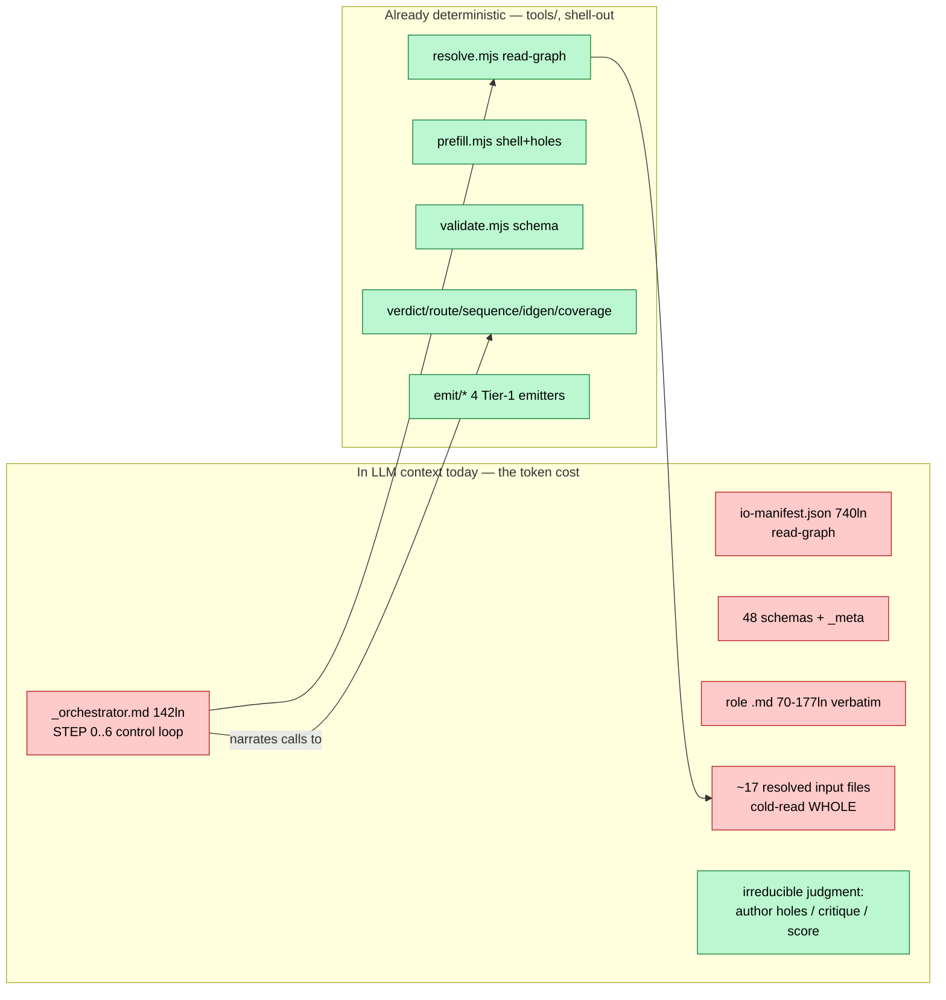
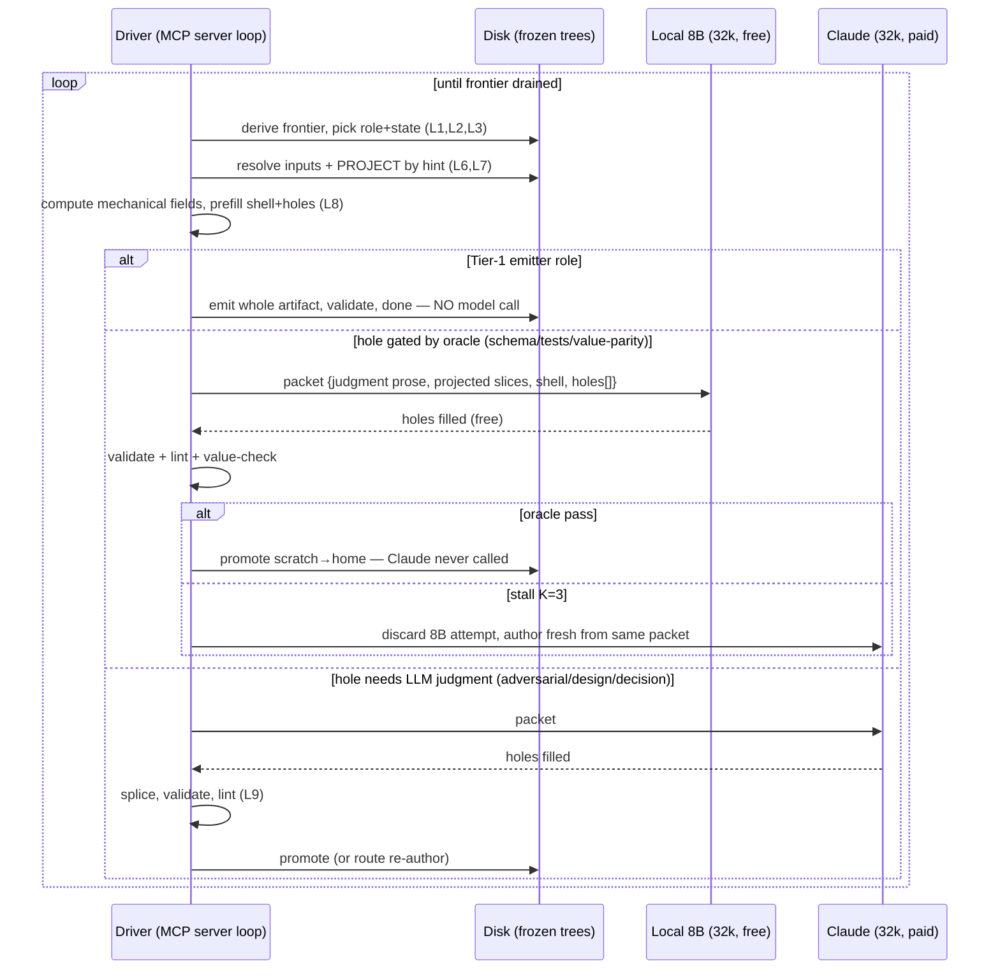
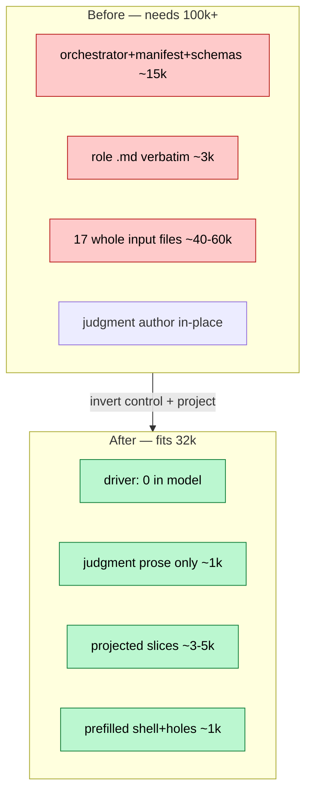
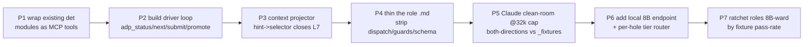

# 00 — Token-Efficiency Analysis: Run ADP on a Two-Tier Model Fleet / 32k

> Scope: review engine, find every deterministic decision still riding in LLM context, propose moving them behind an MCP ("ADP Powers", Kiro-Powers shape). Today's floor: SOTA + 100k.
> **Two model tiers behind the MCP:**
> - **Local self-hosted 8B** — the MCP talks to it DIRECTLY (zero Claude tokens). Fills every hole whose output is **deterministically gated** (schema + tests + value-parity + det-lint). Free retries.
> - **Claude (`claude-haiku-4-5` default, Sonnet escalation)** — fills the irreducible-judgment holes (adversarial / design / decision) the oracle can't gate.
>
> **32k cap stays** for BOTH tiers — the constraint under test; the per-step packet is model-agnostic, so an 8B hole and a Claude hole carry the identical context shape.
> **Objective: offload as much as possible to local 8B → cut Claude-token spend, zero quality loss.** Per-hole routing + the full per-role triage live in [01-8b-offload.md](01-8b-offload.md); THIS doc covers the architecture that makes the split possible.
> Register: caveman. Verdict first, evidence after.

---

## 1. Verdict

System ALREADY half-done. Deterministic spine exists (`tools/det/*`, `tools/io/resolve.mjs`, `schemas/`, Tier-1 emitters) — D24–D27/CR-002 pulled verdict/route/seq/id/coverage/IO-resolution/4 emitters out of the prose. Good bones.

But the spine is **shell-out tools an LLM chooses to call**. The *choosing* — the control loop, mode dispatch, guard eval, input assembly, gate sequencing — still lives in LLM context as prose (`_orchestrator.md` 142 ln, `io-manifest.json` 740 ln, role `.md` 70–177 ln each, 48 schemas). And the step-runner **cold-reads whole input files** (~17 files / IMPLEMENT step). That prose + those files = the 100k floor.

**Fix = invert control + split the fleet.** Stop letting the LLM drive + read. Bake the loop, the IO, the schema-shaping, the gates into an MCP server ("ADP Powers"). Server drives; server reads + **projects** inputs to only what the step needs; server calls a model as a **hole-filler function** with a minimal packet — and **routes each hole to the cheapest tier that can be trusted**: local 8B when the output is deterministically gated, Claude when only judgment can verify it (criterion + triage in [01](01-8b-offload.md)). LLM context per step collapses from "orchestrator + manifest + schemas + 17 whole files + role prompt" to "tiny driver + role judgment prose + prefilled shell + projected slices" — fits 32k on either tier.

Two wins stack: **(a) context** drops ~10× per step (fits 32k), **(b) Claude tokens** drop further because the gated majority of hole-fills run on the local 8B for free.

Not a rewrite. Spine modules become MCP tool bodies unchanged (P3 — engine invariant holds). Net-new = the **driver loop** + **context projector** + a **per-hole tier router**. Everything else already passes its own selftest.

---

## 2. Where the system stands (deterministic vs LLM, today)



Green-in-DET = solved (CR-002). Red-in-LLM = the residual leak. JUDGE (green) = irreducible — must stay LLM, but should be the ONLY thing in LLM context.

### 2.1 The leak, itemized

| # | Deterministic logic still in LLM context | Where it lives now | Token weight |
|---|---|---|---|
| L1 | Control loop STEP 0–6 (derive frontier, pick, dispatch, gate seq, promote) | `_orchestrator.md` prose, LLM-executed | high (loaded every run) |
| L2 | Frontier derivation: scan sentinels, schema-validate, class-discriminator | STEP 0 prose | high |
| L3 | Branch enforce (cases A–E), auto-reconcile, ledger-prune | STEP 0.0/0.1/0.1b prose | med |
| L4 | Mode dispatch (`scan disk → SLICE-BUILD vs SKELETON-BUILD`) | inside each role .md (IMPLEMENT §MODE DISPATCH) | med × every role |
| L5 | Guard / `escapes:` eval ("lock missing OR status!=frozen OR …") | role frontmatter, LLM-evaluated | med × every role |
| L6 | Input resolution + the 740-ln read-graph | `io-manifest.json` (when LLM reasons over it) | high |
| L7 | **Whole-file cold reads of resolved inputs** | step-runner reads 17 files raw | **highest** |
| L8 | Schema knowledge (shape of 48 output artifacts) | `schemas/` + inline schema prose | high |
| L9 | Gate verdict sequencing (Layer1 lint→Layer2 audit→Layer3 sim, short-circuit) | STEP 4 prose | med |

L7 dominates. One IMPLEMENT step resolves to (measured, `resolve.mjs IMPLEMENT mode=skeleton-build scope=skeleton`): 6 ADR bodies + components/contracts/data-model JSON + oracle.json + 3 test files + build-plan + locks = ~17 files. Runner ingests all whole. The io-manifest **already declares per-input hints** ("R*=responsibilities/trace, E*=owned entities", "CT* for your seams") — the projection selector exists but is unused; the runner reads the whole file anyway.

---

## 3. Proposal — "ADP Powers" MCP (bake logic, invert control)

Kiro-Powers shape: package a capability behind a stable tool interface so the agent **calls** the procedure instead of **carrying** it. Here: wrap the whole spine + a driver loop as one MCP server. Role prompts go thin (judgment only); procedure lives server-side.

### 3.1 Control inversion — model fleet becomes hole-filler functions



Neither model sees: orchestrator, io-manifest, schemas, whole input files, mode-dispatch, guards, gate sequencing. Each sees only: the holes it must fill + the slices it needs to fill them. That is the 32k enabler — model-agnostic, so the local 8B and Claude run the **identical packet**. The gate decides WHO fills it (§4 + [01](01-8b-offload.md)).

### 3.2 Tool surface (verbs the driver + any harness calls)

| Tool | Wraps (existing) | Returns | Kills leak |
|---|---|---|---|
| `adp_status` | STEP 0 + sentinel scan | derived frontier tally + next role | L1,L2 |
| `adp_next` | STEP 0–2 + resolve + project + prefill | **step packet** (below) | L1–L8 |
| `adp_emit` | `tools/det/emit/*` | whole Tier-1 artifact, validated | L1 (no model at all) |
| `adp_submit` | prefill splice + validate + lint + value-check | gate verdict + route | L9 |
| `adp_promote` | STEP 6 atomic move + cleanup | new frontier | L1 |
| `adp_verdict`/`_route`/`_sequence`/`_idgen`/`_coverage` | `tools/det/*` (as-is) | decision only | (already) |
| `adp_guard` | `escapes:` predicate eval over disk | tripped? + which | L5 |
| `adp_branch` | STEP 0.0/0.1/0.1b | branch action / HALT | L3 |
| `adp_route_tier` | per-hole tier table (01 §3–4) | `local-8b` \| `claude` per hole | (saves Claude tokens) |

**Step packet** (`adp_next` output — the ONLY thing the model gets):
```
{ role, state{mode,class,slice,scope,pass},
  judgment_prose,          // role .md minus dispatch/guards/schema-prose (server resolved those)
  inputs[]{path, slice},   // PROJECTED: only hint-named fields, not whole file
  shell,                   // prefilled schema shell, mechanical fields filled
  holes[]{pointer, hint},  // the free-text leaves to author
  output_path, schemaId }
```

### 3.3 Context projection — the new piece (closes L7)

Today `resolve.mjs` returns paths; runner reads whole files. Add a **projector**: the io-manifest `hint` per input becomes a field-selector. `adp_next` reads the file server-side, slices to the hinted fields, ships the slice. Example: IMPLEMENT's `contracts.json` hint = "CT* for your seams" → ship only the CT* rows on this component's seams, drop the rest. 740-ln manifest, 200-ln contracts → a few rows.

Projection rules live in code (extend io-manifest entries with optional `project:` selector; default = whole file when none). Deterministic, selftestable, both-directions like the rest of the spine.

---

## 4. The three tiers — who fills what

"Move ALL deterministic logic" ≠ "move everything". After the server takes the deterministic work, the remaining hole-fills split by **what can be trusted to verify them** (full criterion + per-role triage in [01](01-8b-offload.md)):

| Tier | Fills | Gated by | Cost |
|---|---|---|---|
| **Server (code)** | control loop, IO, projection, mechanical fields, Tier-1 emitters, gate sequencing | itself (deterministic) | zero model |
| **Local 8B** | holes whose output is machine-gated: build-phase authoring (IMPLEMENT/MATERIALIZE/INTEGRATE), extraction, render, **narration holes in every role** | schema + frozen tests + value-parity + det-lint | **zero Claude** |
| **Claude** | irreducible judgment: adversarial reads (CRITIQUE/GAP-DETECT/ECONOMY-AUDIT), design/decision authoring, value verdict on judgment-heavy output, STALL-vs-misread diagnosis | LLM judgment (no det oracle) | paid |

Decisive rule (why the 8B row is safe, why offloading the Claude row isn't): **offload to 8B iff a deterministic oracle gates the output, so Claude never reads it to trust it.** A failed 8B attempt costs only local compute; on stall the server discards it and Claude authors fresh (clean-room intact — no doubling). Goal: Claude context = irreducible-judgment holes + nothing else; local 8B carries the gated majority for free.

---

## 5. Token budget — before / after (one IMPLEMENT step, rough)



| Item | Before (in model) | After (in model) |
|---|---|---|
| Control loop / manifest / schemas | ~15k | 0 (server) |
| Role prompt | ~3k verbatim | ~1k judgment-only |
| Inputs | ~40–60k whole | ~3–5k projected |
| Schema shaping | model knows shape | shell handed in |
| **Per-step model context** | **60–80k** | **~6–8k** |

Headroom: even ×2 safety, one step < 16k ≪ 32k on either tier. Multi-turn judgment + tool round-trips fit. (Claude ships a larger native window than 32k — the 32k cap is enforced by us, the constraint under test, not a model limit; the local 8B is the genuine 32k floor.)

**Second axis — Claude tokens (the offload win).** Per-step context is flat ~6–8k regardless of tier; what changes is WHO pays. Build phase = the call mass (per-component, repeated, retried), and it's test-gated → runs on the free local 8B. Effective Claude saving ≈ (offloadable call share) × (8B pass-rate); ~70% × ~80% ≈ **~55% Claude-token cut, zero quality loss** (every output still oracle-gated). Derivation in [01 §1–2](01-8b-offload.md).

---

## 6. Migration path (phased, low-risk, reuses spine)



- **P1** — zero logic change: `verdict/route/sequence/idgen/coverage/validate/prefill/resolve/emit` already pure + selftested → expose as MCP tools. Lowest risk.
- **P2** — driver loop = `_orchestrator.md` STEP 0–6 transcribed to code. Move L1/L2/L3/L9. Branch + ledger + frontier are pure git/fs.
- **P3** — projector (L7, the context win). Extend io-manifest with `project:` selectors; default whole-file keeps back-compat.
- **P4** — role `.md` keeps judgment prose only; dispatch/guards/schema-prose deleted (server owns them). Re-verify each via the SAME oracle (`_fixtures/`, both-directions) — engine bar unchanged.
- **P5** — prove the **context** win on Claude (`claude-haiku-4-5`) at the 32k cap, single tier. Acceptance = known-good PASS + planted-defect FAIL, every step ≤ 32k. One config flip in Claude Code / Kiro, no infra.
- **P6** — prove the **Claude-token** win: wire the local 8B endpoint + the per-hole tier router ([01 §3–4](01-8b-offload.md)). Start with narration holes + IMPLEMENT (most-gated, free retries).
- **P7** — ratchet roles Claude→8B as each clears its `_fixtures/` pass-rate threshold (both-directions still hold); demote on regression. Same oracle bar as everything else.

Invariant guard (engine-unchanged): if wiring any model/tier forces a spine edit, abstraction leaked → fix spine once, never special-case the model. Model + tier = launcher params, like workspace-root.

---

## 7. Risks / open

- **Two axes, isolate them** — context (does 32k suffice?) vs capability (can the tier author it?). P5 tests context on Claude alone; P6+ adds the 8B capability question. A fail at P6 tells you which bit: if Claude passed the same hole at P5, it's 8B capability, not context.
- **8B pass-rate is the offload economics** (not quality — quality is oracle-gated either way). Low pass-rate → most calls escalate to Claude → small saving, still zero quality loss. Measure per-role on `_fixtures/` before trusting; IMPLEMENT on a green-test oracle is best-case, free-form extraction shakier. Ratchet (P7), don't big-bang.
- **Production has no goldens.** Value-parity gates 8B offload in fixtures; in a live `/deliver` run the gate is schema + ID-thread + tests-green + the **downstream adversarial Claude role** (GAP-DETECT/CRITIQUE). So extraction offloaded to 8B leans on that Claude adversary as backstop — keep the adversary on Claude. ([01 §5](01-8b-offload.md).)
- **Escalation must discard + re-author**, never hand Claude the 8B mess — preserves clean-room + avoids input-token bloat from a bad draft.
- **Projection correctness** — over-slice = starve the model (missing fact). Under-slice = no savings. Projector needs both-directions selftest (planted "need a dropped field" must FAIL) like every spine module.
- **MCP host parity** — Kiro `invoke_sub_agent` quirks (C1/C2 in adapter) recur; the driver replaces sub-agent dispatch with direct model calls, simplifying. Confirm self-hosted MCP host supports the call shape.
- **Determinism of the driver** — must stay disk-derived + idempotent + resume-safe (D20). Driver is code now, so this gets easier, not harder.
- **Two consumers, one server** — `/evolve` (self-host) + `/deliver` (generic) share the driver; keep it command-agnostic (D35). The packet shape is identical for both.

---

## 8. Bottom line

Spine already proves the thesis: deterministic decisions belong in code. CR-002 moved the *decisions*; it left the *driving + reading* in the prose. Finish the job — invert control into an MCP "ADP Powers" server that drives the loop, projects inputs, and **routes each hole to the cheapest trustworthy tier**: local self-hosted 8B (MCP-direct, free) for the deterministically-gated majority, Claude (`claude-haiku-4-5` default, Sonnet escalation) for the irreducible-judgment minority. Two wins: per-step context drops ~10× (clears 32k on either tier), and ~55% of Claude tokens move to free local compute at zero quality loss (every output still oracle-gated). Reuses the existing, selftested spine; net-new is one driver + one projector + one per-hole tier router; verified on the same `_fixtures/` oracle. Next: P1 (wrap modules) → P5 (prove context on Claude) → P6 (wire 8B endpoint, measure IMPLEMENT pass-rate on `greenfield-clean`). Triage + economics: [01-8b-offload.md](01-8b-offload.md).
