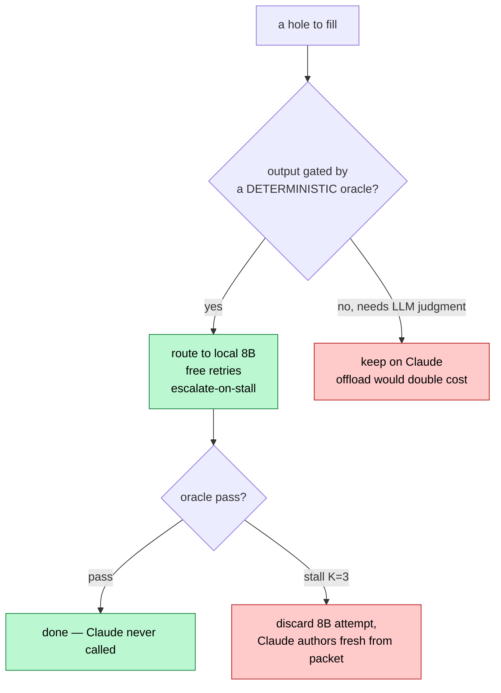
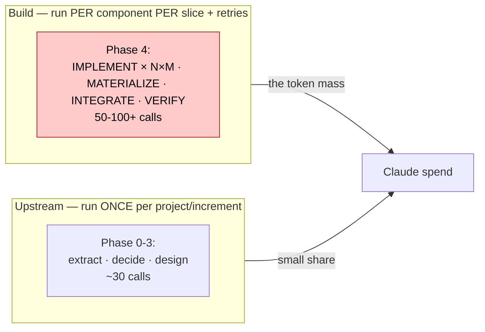
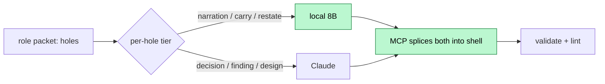
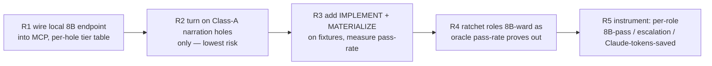

# 01 — 8B Offload Triage: What the MCP Routes to Local, What Stays on Claude

> Follow-on to [00-analysis.md](00-analysis.md). 00 = invert control into the "ADP Powers" MCP, call a model only to fill holes. THIS = which hole-fills the MCP routes to a **self-hosted 8B it talks to directly** (zero Claude tokens) vs which stay on Claude (Haiku/Sonnet).
> Objective: offload as much as possible to local → cut Claude-code token spend, zero quality loss.
> Register: caveman. Criterion first, triage after.

---

## 1. The decisive criterion (read this before the table)

**Offload a hole-fill to the local 8B IFF its output is gated by a DETERMINISTIC oracle** — schema-valid (`validate.mjs`) + value/behavior check (golden value-parity in fixtures, frozen tests green in build, det-lint clean) — so **Claude never reads it to trust it**.

Why this and not "is the task easy":
- Local 8B = free (own infra) + zero Claude tokens. Failed 8B attempt costs **only local compute**, not Claude.
- If the output is machine-gated, the spine accepts/rejects it with NO Claude call. 8B tries → oracle judges → pass = done (Claude untouched), fail = retry or escalate.
- If the output can ONLY be judged by an LLM (adversarial/design roles), then "8B drafts, Claude judges" makes Claude read it anyway → **you pay Claude regardless + added latency**. Offloading there is net-negative.

The spine ALREADY has this safety net: frozen oracle + `escape on STALL` (IMPLEMENT Rule 5, K=3) + route-upstream. That mechanism is exactly what makes 8B offload safe — a bad 8B fill can't ship, it can only retry-free or escalate.

**Escalation is clean, not doubling:** on stall the MCP DISCARDS the 8B attempt and has Claude author fresh from the same packet (clean-room preserved). 8B's failure cost zero Claude tokens. So:

> effective Claude saving = (offloadable call share) × (8B pass-rate)

70% of calls offloadable × 80% 8B pass-rate ≈ **56% Claude-token cut**, zero quality loss (oracle gates every output).

---

## 2. Where the token mass is (offload there, not at the prestige roles)

Per-call context is now flat (~6–8k, doc-00). So token spend ≈ **call count**. Call count is lopsided:

The prestige judgment roles (OPTION-GEN, EVALUATE-DECIDE, DERIVE-COMPONENTS, CRITIQUE) are **few-shot + low-frequency** — keeping them on Claude costs little. The **build-phase authoring** is per-unit + repeated + retried — it IS the bill. And build-phase output is **test-gated** → prime 8B territory. The criterion (§1) and the mass (§2) point the same way: **offload the build phase.**

---

## 3. Per-role triage

**Class A — deterministically gated → OFFLOAD to local 8B** (default-8B, escalate-on-stall):

| Role | Gate that lets Claude skip reading it | Note |
|---|---|---|
| **IMPLEMENT / IMPLEMENT-BUGFIX** | frozen contract tests green (`builder_may_not_edit`, starts_red→green) | the crown win — per-component, repeated, fully test-gated. 8B drafts; oracle judges; stall→Claude |
| **MATERIALIZE-ORACLE / -BUGFIX** | schema + `starts_red:true` + value-parity vs golden + test-specs coverage | authors test code from frozen specs; machine-checkable |
| **INTEGRATE** | flow tests green + composition schema | wire-up, gated |
| **DEMO-GEN** | schema + AC-trace bijection (`coverage.mjs`) | render demo from accepted slice |
| **EXTRACT / EXTRACT-RULES / DECISION-EXTRACT / SLICE-EXTRACT** | schema + ID-thread + downstream GAP-DETECT/CRITIQUE backstop | extraction/transcription; 8B strong. Prod risk caught by downstream Claude adversary (§5) |
| **QUESTION-GEN** | schema + 1:1 gap→question map | templated transform of structured gaps |
| **AUDIT-REPORT / AUDIT-PROMOTE** | schema + finding-set faithfulness | render report from findings JSON |
| **RECONCILE (00 grounding) / VERIFY (00)** | schema + per-source SRC* threading | set-reconcile + currency-flag over structured rules |
| **TRIAGE / RE-RANK / SEQUENCE\*** | route/order already `route.mjs`/`sequence.mjs` (det) | model only fills RATIONALE narration — pure Class A narration hole |

**Class B — needs LLM judgment to verify → KEEP on Claude** (offload doubles cost):

| Role | Why no deterministic gate | Frequency |
|---|---|---|
| **GAP-DETECT** | "what's missing" IS the judgment; no oracle for absence | once/phase |
| **CRITIQUE (00/02/04) · RECONCILE-CRITIQUE** | adversarial correctness = judgment; hostility is the value (CLAUDE.md) | per-gate |
| **OPTION-GEN · EVALUATE-DECIDE** | architecture options/scoring; no truth to check against — it's being created | once/decision |
| **DERIVE-COMPONENTS · DEFINE-CONTRACTS · MODEL-DATA · MODEL-FLOWS · MAP-NFR** | design authoring; the design IS the truth | once/increment |
| **SYNTHESIZE / SYNTHESIZE-INCREMENT · SYNTHESIZE-ADR** | cross-artifact coherent prose; weak gate (schema only) | once |
| **FOUNDATION-CUT · SKELETON-IDENTIFY · VERTICALITY-CHECK · RESOLVE-LOCAL** | foundational judgment over INV/seams | once |
| **DIAGNOSE · BUGFIX-LOCALIZE** | root-cause reasoning over code; gate-verdict is det, the diagnosis is not | per-failure |
| **CRITIQUE-pass of CLASS-A output** | (the verifier when output is judgment-heavy) | — |

**Already no model** (Tier-1 emitters, doc-00): BASELINE-MAP · BUILD-PLAN · DERIVE-TESTS · VERIFY-OUTPUT · DERIVE-BUILD-DAG. The MCP runs these in code — neither 8B nor Claude.

---

## 4. Intra-role split — route PER HOLE, not just per role

A single role's holes carry different stakes. The MCP knows each hole's pointer + hint → route per hole:

- **Narration / restatement / verbatim-carry holes** (lld_notes prose, rationale, "why this order", id carry-forward, summary fields) → **8B**, gated by det-lint + schema. Present in nearly every role, incl. Class-B ones.
- **Decision / judgment holes** (the finding, the score, the AC text, the option pick) → **Claude**.

So even a Class-B role (kept on Claude for its judgment hole) can have its **narration holes filled by 8B** — the MCP splits the packet, 8B fills the cheap leaves, Claude fills the one decision leaf. Shrinks Claude output tokens further.

---

## 5. Caveats (be honest)

- **Fixtures have goldens; production does not.** Value-parity-vs-golden gates Class-A offload in self-host/test. In a live `/deliver` run the gate is schema + ID-thread + tests-green + the **downstream adversarial Claude role** (GAP-DETECT/CRITIQUE). Extraction roles offloaded to 8B in prod lean on that downstream Claude backstop to catch a missed item — acceptable, but it means extraction offload is only as safe as the adversary that follows it. Keep the adversary on Claude.
- **8B pass-rate is the whole economics.** Low pass-rate → most calls escalate → little saving (still no quality loss). Worth measuring per-role before trusting (§6). IMPLEMENT on a green-test oracle is the best case; free-form extraction is shakier.
- **Escalation must DISCARD + re-author, never hand Claude the 8B mess.** Preserves clean-room (step-runner contract) and avoids input-token bloat from a bad draft. Optional later: hand Claude the failure signature only (small), let it author fresh.
- **Two model endpoints, one packet.** MCP holds the 8B endpoint (local) + Claude endpoint; routing is a per-hole policy lookup. The packet shape is identical (doc-00) — model is a param, no spine fork.
- **Determinism of routing.** Tier per role/hole lives in code (config table), disk-derived, selftestable like the rest of the spine. Not an LLM call.

---

## 6. Rollout — ratchet, measure, escalate

- Start where failure is cheapest + most gated: **narration holes + IMPLEMENT** (test-gated, free retries).
- **Instrument every step**: log `{role, hole_tier, model, oracle_verdict, escalated?}` → derive per-role 8B-pass-rate + actual Claude-token delta. Disk-logged, no tracker (D20-shape).
- Ratchet: a role graduates Claude→8B when its fixture pass-rate clears a threshold (e.g. ≥80%, both-directions still hold). Demote on regression. The `_fixtures/` oracle IS the promotion gate — same bar as everything else.

---

## 7. Bottom line

Route on **"is it deterministically gated?"** not on "is it easy". Gated output = 8B fills it free, the oracle (schema + tests + value-parity + det-lint) judges it, Claude never reads it — a failed 8B try costs zero Claude tokens. That criterion + the token-mass shape both point at the **build phase**: offload IMPLEMENT/MATERIALIZE/INTEGRATE/DEMO + all extraction/render/**narration holes everywhere** to the local 8B; keep the **adversarial + design + decision** roles (few-shot, judgment-verified) on Claude. Per-hole routing splits even Claude roles so 8B fills the cheap leaves.

Expected: offload ~70% of model calls; at ~80% 8B pass-rate ≈ **~55% Claude-token cut, zero quality loss** (every output still oracle-gated). The escape/oracle machinery to make it safe already exists — this adds a second model endpoint + a per-hole tier table, both code, both selftestable. Next: R1 (wire endpoint + tier table) + measure IMPLEMENT 8B pass-rate on `_fixtures/greenfield-clean` to confirm the economics.
