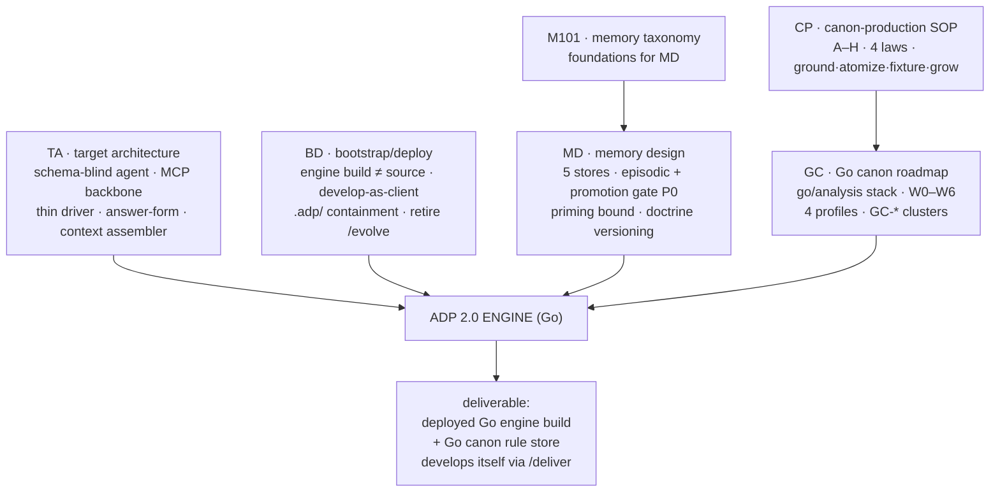
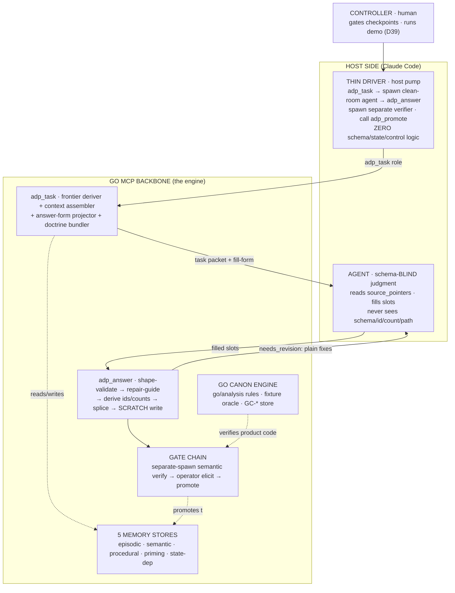
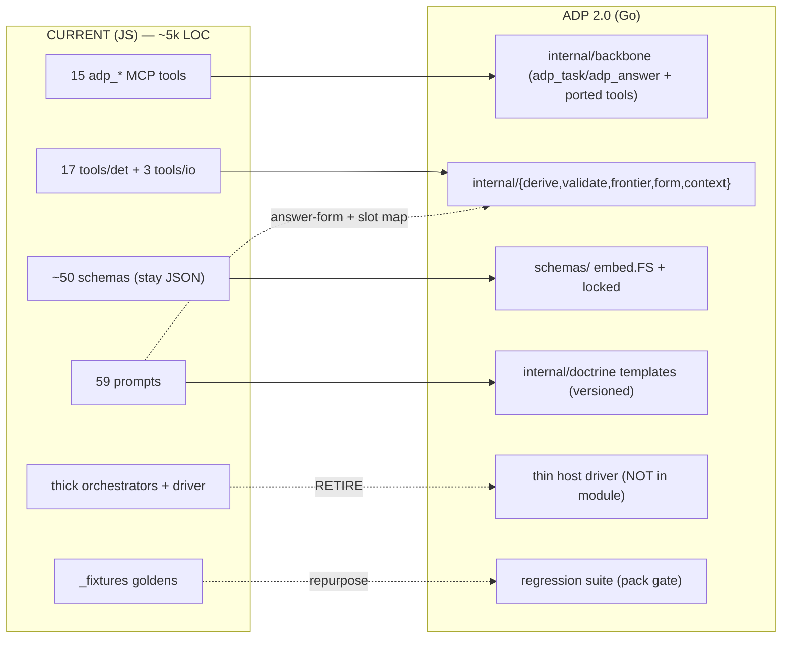
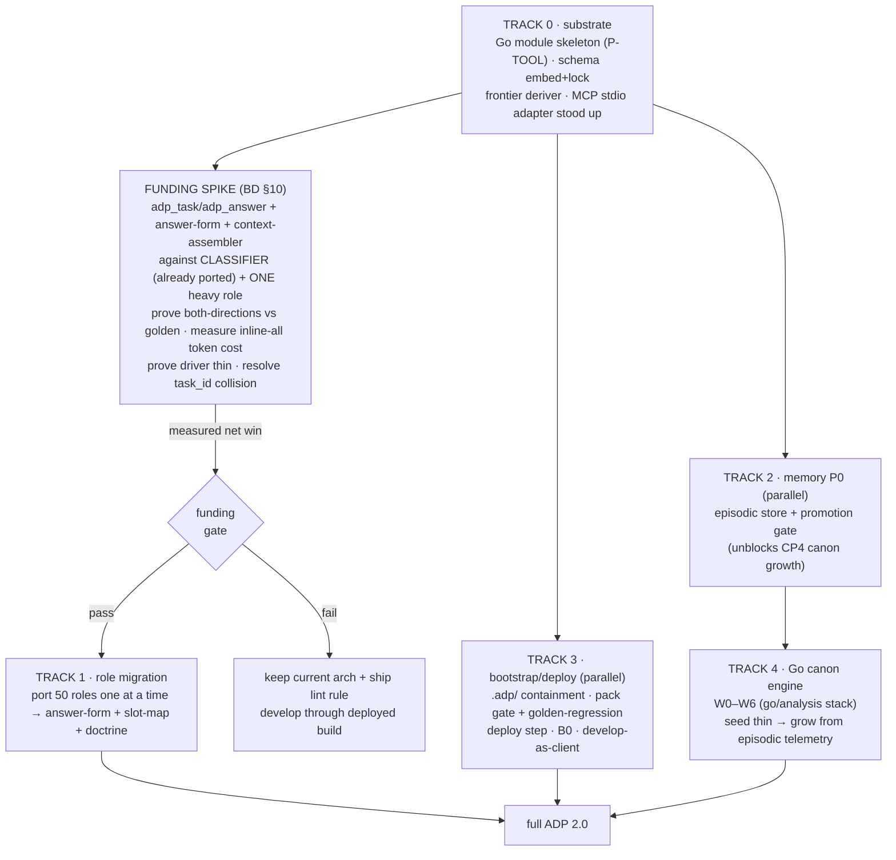
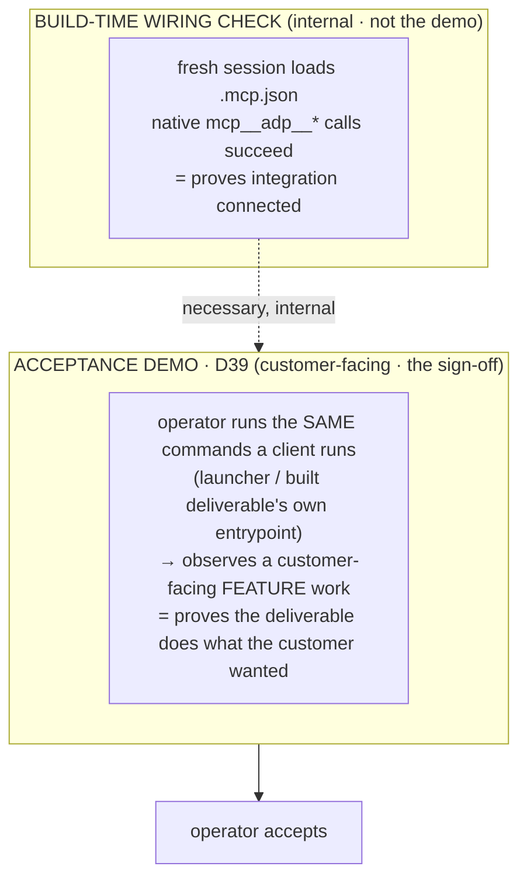
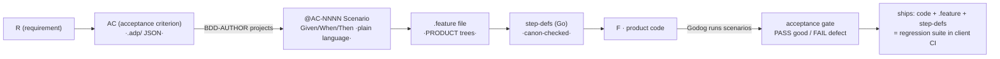
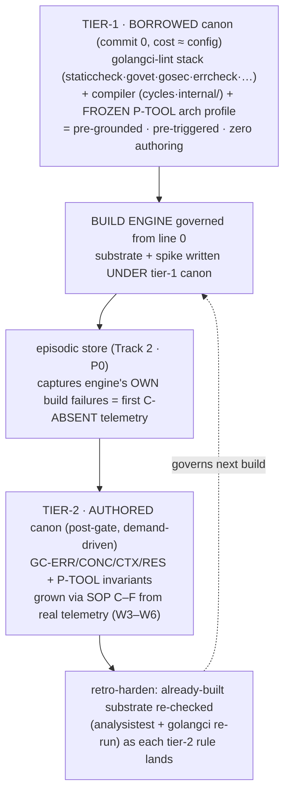

# ADP 2.0 — Build Inventory (Go rewrite)

> CTO build inventory. Full rewrite of ADP → ADP 2.0. New design = schema-blind agent + MCP deterministic backbone + 5-store memory + Go canon engine, developed bootstrap-style through a deployed build. Implementation language = **Go**. This doc = the complete list of what must be built, by subsystem, with port-vs-new status, build sequence, sizing, risks. Register: caveman; structural data (ids, paths, schema keys, tool names) literal.
> Inputs: `_inputs/adp-target-architecture.md` (TA), `adp-bootstrap-deployment-model.md` (BD), `adp-memory-design.md` (MD), `02h-canon-production.md` (CP), `02i-go-canon-roadmap.md` (GC), `00-memory-101.md` (M101). Current system: `docs/adp-system-flow.md` + repo trees.

---

## 0. TL;DR

- ADP 2.0 = **one deterministic engine** (Go MCP backbone) + **one stateless judgment agent** (schema-blind) + **thin host-side driver**. Engine owns ALL structure/state/validation; agent fills prose slots; driver pumps the loop.
- Rewrite from JS → Go. Port surface: **15 `adp_*` MCP tools · ~50 schemas · 17 det tools · 3 io tools · 59 prompts → MCP doctrine templates · 51 roles**. New surface: `adp_task`/`adp_answer` + answer-form projection + context-assembler + repair-guide + 5-store memory (episodic store is load-bearing-new) + Go canon rule engine.
- Go profile = **P-TOOL** (GC App C): pure IO-free deterministic core (`internal/det…`) ⊥ thin protocol adapter (`cmd/adp-server` MCP/stdio). Core fixture-testable in isolation = the canon oracle (CP3).
- **Four build tracks, gated:** (1) Backbone surface — the core rewrite. (2) Memory stores — episodic + promotion gate are P0 (CP4 demand-driven canon dies without them). (3) Go canon engine — `go/analysis` stack, W0–W6. (4) Bootstrap/deploy — pack + `.adp/` containment + deliver-as-client.
- **Funding-gated (BD §10):** 50-role migration NOT committed on principle. Spike CLASSIFIER + one heavy role through new surface, measure token cost, prove driver thin, THEN scope full migration. Build backbone-first against one already-ported role.
- Disk = sole source of truth (D20). Engine stateless. Verify-before-promote. **Operator runs the demo (D39) — CUSTOMER-FACING only** (see §11): operator runs the same commands a client runs, observes a customer-facing feature of the deliverable work. Client never touches MCP/schemas/ids; native `mcp__adp__*` calls = build-time wiring check, NOT the acceptance demo. All carried into Go unchanged.
- **Spec ships as executable BDD (regression mandate, see §4-P + §12):** today spec/design = JSON in `.adp/` — opaque to non-ADP engineers, inert (no spec↔behavior tie), detached (containment keeps it OUT of product trees). Fix: every delivered CODE feature ships Gherkin `.feature` + Godog step-defs in the PRODUCT trees. AC = source → `@AC`-tagged `Scenario`. Makes spec executable (regression-guarded in client CI), readable without ADP, resident IN shipped code — a 3rd-party contractor maintains/extends it without ADP. Acceptance oracle for code slices = Godog both-directions; canon-compliance oracle = `go/analysis`. TWO oracles, both ship in product trees.
- **Canon paradox dissolved (§13 — the build-start blocker):** engine = Go, must obey Go canon; Go canon does NOT exist yet (Track 4 PRODUCES it) and grows from the build's OWN telemetry → circular. Fix = canon in **2 tiers**. Tier-1 **BORROWED** (off-the-shelf golangci-lint stack + the already-FROZEN P-TOOL arch profile) gates EVERY commit from line 0 — pre-grounded, zero authoring. Tier-2 **AUTHORED** (GC-* rules, W3–W6) grown demand-driven from telemetry the engine emits building ITSELF. Foundation never ungoverned; canon never speculative. Corrects §6: borrowed floor → P0-pre (not post-gate); authored rules stay post-gate.

---

## 1. Design synthesis — what the 6 inputs mandate



| Input | Load-bearing mandate for the build |
|---|---|
| **TA** | Stochastic layer = pure judgment, total schema-blindness (P1). Backbone owns all determinism (P3). New surface: `adp_task`/`adp_answer`, answer-form projection (P5), context assembler (§8), bounded shape-repair (P6), external semantic gate (P7). Thin driver irreducible in-harness (§4). Retire thick orchestrator. |
| **BD** | Engine build ≠ source (BP1). ADP develops itself as a client via `/deliver` (BP2). `.adp/` containment iron rule (BP6/§4.3). Pack gate + golden-regression + deploy step. Retire `/evolve` + self-host orchestrator. |
| **MD** | 5 memory stores first-class in backbone. **Episodic store + promotion gate = P0** (without them CP4 canon-growth impossible). Priming = bounded working set + provenance-gate. Procedural = versioned+TTL doctrine. State-dependent = two-pass retrieval. |
| **CP** | Canon = typed atomic trigger-indexed rules, NOT prose (CP2). Ground beats consensus (CP1). Every rule ships a fixture (CP3). Seed thin, grow from failure (CP4). |
| **GC** | Go canon engine stack FROZEN: `go/analysis`+`analysistest` spine · ruleguard · depguard/go-arch-lint · golangci-lint runner. Rule schema (C6). W0–W6 sequence. 4 project profiles (P-SVC/LIB/CLI/TOOL); this engine = P-TOOL. |
| **M101** | Taxonomy substrate for MD; write-path validation > read-path hope; immutable raw log + derived views; provenance everywhere. |

---

## 2. Target architecture (the thing we build)



Hard rule (TA §3): every schema, deterministic computation, file path lives BELOW the Go MCP line. Agent gets prose + named slots, returns prose-in-slots. Nothing crosses up.

---

## 3. Go module layout (P-TOOL profile)

GC App C P-TOOL = **pure deterministic core ⊥ thin protocol adapter**. Core fixture-testable in isolation (= canon oracle CP3). Mirrors current `tools/det/*`.

```
adp/                              ← engine SOURCE repo (BD BP1; ≠ the deployed build)
  cmd/
    adp/             main.go      thin: init · pack · deploy CLI (run(args,io)→exit-code, testable)
    adp-server/      main.go      thin MCP stdio adapter; wires backbone via constructors
  internal/                       ← PURE det core (IO-free where possible; fixture-testable)
    backbone/                     adp_* tool handlers; orchestrate det core; no business prose
    frontier/                     stateless disk frontier deriver (task_id re-derivable)
    context/                      context assembler — read-graph → inline metadata vs source_pointer
    form/                         answer-form projector — schema judgment-leaf → plain slots
    validate/                     shape validator + repair-guide (schema-fail → plain-language fix)
    derive/                       DERIVERS — mint ids/counts, splice envelope, write scratch
    schema/                       schema registry/loader (locked, embed.FS)
    promote/                      scratch→home gate · git · branch · ledger-prune
    memory/
      episodic/                   durable append-only event log (survives workspace teardown)
      semantic/                   facts store access (.adp/{adr,aprd,hld} + schemas)
      promotion/                  episodic→semantic gate (recurrence → canon SOP C–F)
      priming/                    working-set bound + provenance-gate (CR-024 projector)
      statedep/                   two-pass scoped→global retrieval
    elicit/                       operator gate wiring (checkpoint A/B/C · D39)
    canon/                        Go canon engine: go/analysis runner · rule schema · fixture harness
    doctrine/                     task templates (versioned + locked); per-role doctrine + slot map
  schemas/                        ~50 JSON schemas (ported, locked) — embed into binary
  canon-rules/                    GC-* Go canon rule store + analysistest fixtures
  io/io-manifest.json             read-graph (retained; job inverts to inline-recipe)
  tools/pack/                     pack + manifest allowlist + deploy (largely ports from JS)
```

Forbid (P-TOOL): IO tangled into core logic (kills fixture-testing) · protocol details leaking inward · cross-invocation global state (each `adp_*` call context-closed) · non-atomic writes.

Skip `/pkg` (GC App C: cargo-cult unless needed). Driver lives host-side, NOT in this module (see §4-I).

---

## 4. Build inventory by subsystem

Status legend: **PORT** (logic exists in JS, re-implement in Go) · **NEW** (no current analog) · **NEW-from-prose** (doctrine exists as prompt prose, becomes structured engine artifact) · **RETIRE** (delete, do not port).

### A. MCP backbone — the engine surface

| Item | Status | From → To | Notes |
|---|---|---|---|
| `adp_task(role)` | **NEW** | — → `internal/backbone` | core new surface: derive frontier + assemble context + project form + bundle doctrine → self-contained packet |
| `adp_answer(task_id, form)` | **NEW** | — → `internal/backbone` | shape-validate → repair-guide → derive → scratch write; bounded loop |
| `adp_status` | PORT | `adp-server` → `frontier` | disk frontier scan {id,unit,class,schemaId} |
| `adp_next` / `prefill` | PORT→fold | `tools/det/prefill.mjs` → `form` | shell+holes generalizes into answer_form |
| `adp_derive` / DERIVERS | PORT | `tools/det/*-derive.mjs` → `derive` | id/count mint + splice + write; fed slot-mapped primitives |
| `adp_submit` / `adp_verdict` | PORT | `tools/det/verdict.mjs` → `validate` | shape gate plumbing |
| `adp_promote` | PORT | `adp-server` → `promote` | scratch→home; after gate chain |
| `adp_branch` | PORT | `adp-server` → `promote` | branch/stream gate (D28/D29) |
| `adp_coverage` | PORT | `tools/det/coverage.mjs` → `validate` | id-thread / ref-resolve self-consistency |
| `adp_idgen` | PORT | `tools/det/idgen.mjs` → `derive` | id minting |
| `adp_route` / `adp_route_tier` | PORT | `tools/det/route.mjs` → `backbone` | class/tier routing |
| `adp_sequence` | PORT | `tools/det/sequence.mjs` → `derive` | roadmap sequencing |
| `adp_classify_derive` | PORT | `tools/det/classify-derive.mjs` → `derive` | classification deriver |
| `adp_emit` | PORT | `tools/det/emit/*.mjs` → `derive` | emitter-owned (Tier-1 whole-mechanical) roles |
| `adp_guard` | PORT | `adp-server` → `validate` | structural adversarial checks (missing field, weak enum, count mismatch) |

### B. Answer-form projection layer — **NEW** (TA §7)

| Item | Status | Notes |
|---|---|---|
| Projector: schema judgment-leaf → plain slot | NEW | per-schema hand-authored mapping; strips deterministic fields (ids/counts/consts/single-enums) |
| Per-slot plain-language instructions | NEW-from-prose | authored per slot, ALL ~50 schemas; prose lifted from current prompts |
| Slot↔schema-leaf binding | NEW | structural drift caught at `adp_answer` validate; semantic drift = reviewed mapping |
| `repeatable` / `required` slot semantics | NEW | + repeatable-slot bound signaling (TA §13 open item) |

### C. Context assembler — **NEW** (TA §8)

| Item | Status | Notes |
|---|---|---|
| Read-graph → inline-recipe inverter | NEW | metadata (.json/.lock/.md) → inline into context block; raw source → emit source_pointer |
| `when`-predicate evaluator | NEW | class/mode branches resolved server-side → agent gets branch-free packet |
| `io-manifest.json` read-graph | PORT | retained artifact; job inverts (path-list → read+inline vs read+point) |
| source_pointer failure handling | NEW | file missing / glob-zero / unreadable → standard "pointer-failed" return (TA §13) |

### D. Shape-validator + repair-guide — **NEW** (TA §6)

| Item | Status | Notes |
|---|---|---|
| Shape-only validator | PORT | from `tools/det/validate.mjs`; validate vs schema, SHAPE only |
| Schema-fail → plain-language fix mapper | NEW | never emit schema errors to agent; per-slot plain fix |
| Bounded repair loop | NEW | cap 3 attempts (5 for mcp-modernize-class); exhaust → HALT |

### E. Schema owner + DERIVERS — PORT (TA §10)

| Item | Status | Notes |
|---|---|---|
| ~50 JSON schemas | PORT | `schemas/` unchanged home; embed via `embed.FS`; locked (`schemas.lock`) |
| Schema loader/registry | PORT | from JS ad-hoc → typed Go registry |
| DERIVERS (5 registered + 46 to port) | PORT | id/count mint, envelope splice, write; **46 roles still have determinism in prompt prose** (TA §11 migration table) |
| `_meta.json` / lock verify | PORT | generated-frozen discipline (amend generator, not frozen copy) |

### F. Frontier deriver — PORT (TA §12, D20)

| Item | Status | Notes |
|---|---|---|
| Stateless disk scanner | PORT | frontier = first `remaining_sequence` entry whose `done_sentinel` absent/invalid on disk |
| `task_id` = `{role, frontier-key}` re-derivable | NEW | + concurrency/collision resolution across parallel branches (TA §13 open item) |
| Resume re-derives | PORT | no open-task RAM state |

### G. Semantic verify gate — PORT-restructure (TA §9)

| Item | Status | Notes |
|---|---|---|
| Separate-spawn verifier vs GOLDEN | PORT | value-match (known-good) + divergence (planted-defect); BOTH directions; for NON-code artifact slices (aPRD/ADR/HLD) |
| **BDD/Godog acceptance leg (CODE slices)** | NEW | scenarios run vs emitted code; both-directions = PASS on good emit / FAIL on planted defect. Replaces golden-divergence for code; the shipped regression oracle (§4-P, §12) |
| Gate stays OUTSIDE repair loop | NEW-discipline | folding correctness in regresses adversarial verify; binds BOTH legs (golden + Godog) |
| Live-repo path: operator + self-consistency | NEW | no golden on stranger repo (BD §7); det cross-artifact checks + Godog scenarios substitute (BDD ships → works on stranger repo too) |

### H. Operator gates via elicitation — NEW-from-prose (TA §5)

| Item | Status | Notes |
|---|---|---|
| MCP elicitation wiring | NEW | checkpoint A/B/C + D39; gates currently live in orchestrator PROSE |
| Persisted reply / resume-without-re-ask | NEW | elicitation gate UX (TA §13 open item) |
| **Customer-facing demo (DEMO-GEN role)** | NEW-from-prose | demo shows a CUSTOMER-FACING FEATURE of the deliverable, run via the SAME commands a client runs — never MCP tool-calls/schemas/ids. See §11. Build-time native-`mcp__adp__*` wiring check is separate + internal. |

### I. Thin driver — RETIRE-and-replace (TA §4/§5)

| Item | Status | Notes |
|---|---|---|
| Thick orchestrator (`_orchestrator*.md`) | **RETIRE** | logic dissolves into MCP tools + elicitation |
| Thin driver (host-side pump) | NEW | near-logic-free relay: `adp_task`→spawn agent→`adp_answer`→repeat; spawn verifier; call promote |
| Driver location | **DECISION** | in-harness: stays host-side (Claude Code can't MCP-sample/spawn) — minimal JS/skill. Standalone Go engine w/ model creds → driver disappears (TA §4). Primary path = in-harness thin driver. |
| Client control surface (`/adp-*`) | NEW | the launcher layer ON the driver; each command = one driver invocation with params. See §4-O. |

> Driver is NOT in the Go module — it's the host pump. Go engine = passive MCP server. See §10 decision.

### J. Memory stores — NEW (the 5 stores; MD §4)

| Store | Status | Priority | Notes |
|---|---|---|---|
| **Episodic** (`memory/episodic`) | **NEW** | **P0** | durable append-only timestamped run-event log; **survives workspace teardown** — the ONE exception to "workspace disposable"; flush to source-repo ledger on promote. Without it CP4 demand-driven canon = impossible. |
| **Promotion gate** (`memory/promotion`) | **NEW** | **P0** | episodic→semantic hardening; promote only stable+corroborated (never first sighting); runs candidate through canon SOP C–F; operator-gated |
| **Semantic** (`memory/semantic`) | PORT+freshness | P2 | `.adp/{adr,aprd,hld}` + schemas; add TTL/verify-on-use for facts citing mutable code surfaces |
| **Procedural** (`doctrine/`) | NEW-from-prose | P1 | task templates versioned+locked+TTL+scope-guard (anti-ossification); resolves doctrine-versioning open item |
| **Priming** (`memory/priming`) | NEW | P1 | bounded working set; evict-by-relevance; decay/TTL; **provenance-gate untrusted source** (stranger-repo code primes exploration, NEVER authorizes a write); CR-024 projector reframed as bias-control |
| **State-dependent** (`memory/statedep`) | NEW | P2 | scope tags + two-pass scoped→global fallback (anti context-lock-out); folds into multi-phase binding + repeatable-slot open items |

### K. Go canon rule engine — NEW (CP + GC; W0–W6)

| Wave | Item | Status | Notes |
|---|---|---|---|
| W0 | Rule schema (C6) + trigger vocab + source registry | NEW | `{id, body, triggers{imports,symbols,AST,task-class,glob}, severity, provenance{url,go-version}, TTL, fixture-ref}` |
| W0 | Engine stack stood up | NEW | FROZEN: `go/analysis`+`analysistest` spine · ruleguard (gocritic) · depguard+go-arch-lint · golangci-lint runner |
| W1 | Architecture freeze — 4 profiles | NEW | P-SVC/P-LIB/P-CLI/P-TOOL; GC-ARCH routes per profile; depguard/go-arch-lint configs |
| W2 | Linter import (GC-SEC/GC-STD + partials) | NEW | translate staticcheck/govet/gosec/errcheck → schema; pre-grounded, pre-triggered; ~60–90 rules |
| W3 | Correctness core | NEW | GC-ERR/CONC/CTX/RES/SEC; ground vs primary source; ~30–50 rules |
| W4 | Idiom + design | NEW | GC-IFACE/PTR/SLICE/GEN/API + GC-ARCH structural; ~20–35 |
| W5 | Quality | NEW | GC-PERF/TEST/ENC/STD residue; ~15–25 |
| W6 | Validate + cut baseline + wire growth | NEW | prune dead/over-reaching; cut ~80–120 firing rules; wire C-ABSENT telemetry growth (ties to episodic store P0) |

> Canon engine is two oracle layers, kept distinct (GC W0): (1) **canon-compliance** (code obeys rules) = `go/analysis`; (2) **acceptance** (code does what task wanted) = BDD/Gherkin (Godog). **§4-P promotes layer (2) from a side-note to a MANDATORY SHIPPED artifact** — both oracles now live in the product trees and regression-guard the deliverable. Godog runner stands up in this track alongside `go/analysis`; the two never conflate.

### L. Bootstrap / deploy — PORT+complete (BD)

| Item | Status | Notes |
|---|---|---|
| `make pack` / `pack.mjs` → Go | PORT | emit deployable build; npm-installable wrapper OR Go binary release |
| `gen-manifest` + allowlist | PORT | engine payload vs repo-only boundary (§4.1) |
| Pack gate (selftests + roadmap drained + sha) | PORT | HALT on any failure → no tarball |
| **Golden-regression gate in pack** | NEW | `_fixtures/` goldens → regression suite (not dev oracle) |
| **Deploy step** (`adp init` into fresh workspace) | NEW | install build like a client |
| **`.adp/` containment migration** | NEW | nest flat trees (`.aprd/.adr/.hld/.roadmap/.build/.audit/_streams`) under single `.adp/`; re-point read-graph/schemas/sentinels/locks; oracle tests land in repo `tests/`, never `.adp/` |
| Develop-as-client `/deliver` loop | NEW-discipline | inner loop (no redeploy) / outer loop (rebuild when engine shape changes) |
| Stage-0 bootstrap (B0 from current HEAD) | NEW | seed the cycle |

### M. Doctrine templates — NEW-from-prose (TA §10)

| Item | Status | Notes |
|---|---|---|
| 59 prompts → MCP-managed task templates | NEW-from-prose | each carries role doctrine + answer-form + slot→schema projection; doctrine GROWS, doesn't shrink |
| Adversarial role doctrine stays hostile | PORT | GAP-DETECT, CRITIQUE, anti-cheat |
| Template versioning + lock | NEW | frozen+locked like other engine artifacts (MD §4.4) |

### N. Retired surface — delete, do not port

| Item | Status | Reason |
|---|---|---|
| `/evolve` skill + `_orchestrator.md` (self-host) | **RETIRE** | BD BP5; contaminated loop; develop via `/deliver` only |
| `_orchestrator.generic.md` (thick) | **RETIRE** | logic → MCP tools + elicitation + thin driver |
| Self-host docs (`self-host-workflow.md` etc.) | **RETIRE** | superseded by bootstrap model |
| `_fixtures/` as dev oracle | **REPURPOSE** | → regression CI (pack-time), not per-artifact dev correctness |

### O. Client control surface — NEW (replaces god-`/deliver`)

Intent-based `/adp-*` command surface = the client-facing control layer. Verbs over disk state, NOT per-phase (frontier already knows the phase, D20). Each command = customer-facing (§11, no MCP/schema leakage); thin driver translates command+args → `adp_*` MCP calls (reinforces driver thinness — each command = one driver invocation). Surface is a frozen-class, versioned, documented client contract.

| Command | Class | Status | Maps to |
|---|---|---|---|
| `/adp-deliver [req] [--class --until --slice --resume --dry-run]` | DRIVE | NEW (from `/deliver`) | one driving command; continues from disk frontier to completion or `--until` bound |
| `/adp-revise <artifact> <change>` | DRIVE | NEW | change-request vs frozen → new version + downstream re-trigger (immutability law) |
| `/adp-status` | READ | NEW (from `adp_status`) | frontier: phase · role · pending gate · done/remaining (advisory display) |
| `/adp-show [artifact\|demo]` | READ | NEW | render customer-facing view of deliverable / demo (§11) |
| `/adp-init` | LIFECYCLE | NEW (= deploy step §4-L) | scaffold workspace from deployed build (`adp init`) |

Steering = ARGS on `/adp-deliver` (`--class` greenfield/feature-add/bugfix/audit · `--until` checkpoint-a/b/c · `--slice` · `--resume` · `--dry-run`), NOT extra commands.

**Boundary:** entry-point control = `/adp-*`. Mid-run steering = operator gates via elicitation (§4-H), kept distinct. Optional scriptable `/adp-gate accept|reject|answer` deferred (flag, not core — chosen surface is intent-based ~5 commands).

**Not per-phase:** `/adp-aprd`/`/adp-roadmap`/… rejected — fights D20 (frontier re-derives the phase), and client thinks in intent not internal phases. Phase-bounding → `--until` arg.

### P. BDD acceptance specs — NEW (mandatory shipped; the regression solution, §12)

Every delivered CODE feature ships executable BDD in the PRODUCT trees. Attaches at the build/code-emission stage (the `F` in the thread), NOT at spec/ADR/HLD stages. AC (already authored upstream) = the source the scenario projects from. Spec becomes a test that lives with the code → regression-guarded + outsider-maintainable. Reconciles TA golden-divergence oracle with GC Godog acceptance oracle: **code slices verified by Godog; non-code artifact slices stay golden-divergence (§G).**

| Item | Status | From → To | Notes |
|---|---|---|---|
| `bdd-feature` schema | NEW | — → `schema/` | structured Gherkin: `{feature, scenarios[{id, ac_tags[], steps[given/when/then]}], background}`; embed + lock like all schemas |
| **BDD-AUTHOR role** (doctrine + answer-form + slot-map) | NEW | — → `doctrine/` | schema-blind: agent fills Given/When/Then prose slots; engine owns scenario-id mint, `@AC` binding, `.feature` path. One per code-emitting role-class |
| Scenario deriver | NEW | — → `derive` | mint scenario ids · splice `@AC-NNNN` tags · emit step-skeleton stubs · write `.feature` to product tree (not `.adp/`) |
| Step-definition emission | NEW-from-prose | folds into code-emit role | Go glue binding Given/When/Then → product code; canon-checked (`go/analysis`), not BDD-authored prose |
| **Godog acceptance gate** | NEW | — → `validate`/`elicit` | runs scenarios vs emitted code; both-directions = scenario PASS on good emit / FAIL on planted defect. Stays OUTSIDE shape-repair loop (OP6 invariant). The acceptance-oracle leg of §G for code slices |
| AC→scenario coverage gate | PORT-extend | `tools/det/coverage.mjs` → `validate` | every `AC` id maps to ≥1 `@AC`-tagged scenario; uncovered AC ⇒ HALT (extends id-thread self-consistency) |
| Thread extension | NEW | — | `R → AC → @AC-scenario → .feature → step-def → F → commit`; traceable both ways with ZERO ADP knowledge |
| Product-tree placement | NEW-discipline | — | `.feature` + step-defs land in repo's real `features/`/`tests/`, NEVER `.adp/`. Reinforces containment iron rule (spec-as-test = product test) |

> **Where design lives in shipped code (the full answer):** behavioral design constraints → BDD scenarios (Godog); structural design constraints + idioms → canon rules (`go/analysis`); pure non-testable rationale → ADR, referenced by `@ADR-NNNN` tag on feature/step-def. Two executable oracles ship; rationale links back. "Specs + designs live inside the code" = these two oracles resident in product trees.

---

## 5. Port matrix — JS surface → Go target



| Current count | Disposition |
|---|---|
| 15 `adp_*` tools | 13 PORT + 2 NEW (`adp_task`/`adp_answer`) |
| 17 det + 3 io tools | PORT into `internal/*` |
| ~50 schemas | PORT (stay JSON, embed + lock) |
| 59 prompts / 51 roles | doctrine PORT-from-prose; +answer-form +slot-map NEW per role (5/51 determinism relocated → 46 remaining) |
| 2 orchestrators + driver.js | RETIRE thick; NEW thin host driver |
| god-`/deliver` launcher | SPLIT → 5 intent-based `/adp-*` commands (§4-O) |
| 22 selftests | PORT → Go `_test.go` + analysistest fixtures |
| `_fixtures/` | repurpose → regression CI |

---

## 6. Build sequence — backbone-first, funding-gated

TA §11 order: build the surface against ONE already-ported role, prove both-directions vs golden, THEN port roles one at a time. BD §10 funding gate sits before full migration.



Ordering logic:
- **Track 0 first** — substrate (module, schema, frontier, MCP adapter) blocks everything.
- **Track 3 (bootstrap) early + parallel** — `.adp/` containment + deploy must exist to develop-as-client; BD gates the rewrite behind it.
- **Funding spike before Track 1** — do NOT migrate 50 roles on principle; prove the surface + measure token cost first.
- **Track 2 (memory P0) parallel** — episodic + promotion gate unblock Track 4 canon growth; load-bearing.
- **Track 4 (canon) after episodic exists** — seed thin (W0–W6), then growth needs C-ABSENT telemetry from the episodic store.
- **Control surface (`/adp-*`, §4-O) rides with the thin driver** — host-side, built in the funding spike (proving the driver thin = proving command→`adp_*` mapping carries no logic). Full 5-command surface lands with Track 1.

---

## 7. Sizing (rough, sequencing aid — not a commitment)

| Track | Unit | Est. | Confidence |
|---|---|---|---|
| 0 substrate | Go pkgs (backbone/frontier/schema/adapter) | 6–8 pkgs | high |
| funding spike | 2 roles through new surface + measurement | 1 spike | med (gate decides rest) |
| 1 role migration | 50 roles × (answer-form + slot-map + doctrine) | 50 roles | low (gated) |
| 2 memory P0 | episodic store + promotion gate | 2 stores + gate | med |
| 2 memory P1/P2 | priming bound · doctrine version · statedep two-pass | 3 stores | med |
| 3 bootstrap | `.adp/` migration + pack-gate + deploy + B0 | 4 items | med-high (largely ports) |
| 4 canon W0–W6 | Go canon rule store | ~80–120 firing rules baseline | shippable; growth unbounded |
| — schemas | port + embed + lock | ~50 | high |
| — det/io tools | port to internal/* | 20 tools | high |

---

## 8. Risks + open items (carried from inputs)

| # | Risk / open item | Source | Mitigation in build |
|---|---|---|---|
| 1 | **Inline-all token cost** unknown — context assembler inlines all metadata | TA §11 | measure in funding spike BEFORE full migration; CR-024 projector bounds working set |
| 2 | **Projection semantic-drift** — slot instruction mis-describes a leaf; validation can't catch | TA §7 | reviewed mapping; re-review when either side changes |
| 3 | **Episodic store breaks "workspace disposable"** invariant | MD §4.1 | explicit ONE exception; flush to durable source-repo ledger on promote |
| 4 | **Driver thinness** — may conserve real control logic | TA §4 / BD §10 | prove thin in spike, or own the logic + drop "thin" |
| 5 | **task_id collision** under concurrency / parallel branches | TA §13 | resolve in spike; frontier-key carries unit |
| 6 | **Promotion mechanics** — S(n+1) from disposable workspace → source repo | BD §13 | patch/PR vs direct write — decide before outer-loop |
| 7 | **Migration coexistence/rollback** — old + new surface during port | BD §10 | port one role at a time against proven surface |
| 8 | **Provenance-gate** — stranger-repo source priming a write (injection) | MD §4.5 | untrusted source primes exploration, NEVER authorizes write |
| 9 | **Canon trigger-curation** = perpetual FTE labor (CC8) | GC §3 | maximize linter-auto-derivable fraction; grow demand-driven only |
| 10 | **Single-Opus canon** — no cross-model decorrelation | GC standing | linter = the decorrelated second opinion; ground-is-ONLY-truth; GPT5.5 bolts on later |
| 11 | **Step-def maintenance burden** — Go glue per scenario could swamp role authoring | §4-P | scenario deriver emits step skeletons; shared step-libraries per role-class; reuse-over-author |
| 12 | **Gherkin↔AC drift** — scenario prose mis-states the AC it claims to cover | §4-P | `@AC` tag binding + coverage gate (every AC ≥1 scenario); re-review scenario on AC change (mirrors projection-drift risk #2) |
| 13 | **Godog adds build-time + flaky-scenario risk** | §4-P | acceptance gate outside repair loop; deterministic step-defs only; ships as client regression suite, runs at pack gate |
| 14 | **Foundation poured before canon exists** — substrate (§6 P0) + spike (P1) = most load-bearing Go, written FIRST; canon track lands LAST → ungoverned floor | §13 | tier-1 borrowed canon (golangci CI + frozen P-TOOL arch configs) = HARD gate from commit 0; tier-2 authored rules retro-check the substrate (analysistest + golangci re-run) on landing |

---

## 9. Invariants (carried into Go unchanged)

- Disk = sole source of truth (D20); engine stateless; resume re-derives.
- Verify-before-promote; no actor promotes its own authoring output; clean-room separation.
- Adversarial semantic oracle = distinct external gate (divergence-from-golden), never folded into shape repair.
- Operator runs the demo (D39) — **customer-facing** (§11). Operator runs the client's own commands against the DEPLOYED build, observes a customer-facing feature work. NOT an MCP tool-call inspection.
- LLM judges, never authors truth; MCP owns structure + determinism.
- One home per fact (schema home = `schemas/`; doctrine home = template; projection = reviewed mapping).
- Register + Economy bind every artifact (caveman; one home per fact).
- Immutability: frozen artifacts + locks never overwritten; change = new version + downstream re-trigger; generated-frozen → amend the generator.
- `.adp/` containment iron rule: all ADP artifacts under one `.adp/` root; product code/tests in repo's real trees.
- **BDD acceptance mandate (§4-P, §12):** every delivered code feature ships executable BDD (Gherkin + Godog) in product trees; NO code promoted with an AC lacking a passing scenario. Spec-as-test is a product test → repo `tests/`/`features/`, never `.adp/` (reinforces containment). Thread carries `@AC` end-to-end: `R → AC → @AC-scenario → .feature → step-def → F`.
- Acceptance oracle is mode-split: CODE slices = Godog both-directions; NON-code artifact slices = golden-divergence. Both stay OUTSIDE the shape-repair loop.

---

## 10. Key decisions to confirm before scoping

| # | Decision | Options | Recommendation |
|---|---|---|---|
| D1 | **Driver location** | (a) in-harness thin host driver (JS/skill) · (b) standalone Go engine w/ own model creds (no driver) | **(a)** primary per TA/BD; Claude Code can't MCP-sample. (b) is future when engine leaves harness. |
| D2 | **Build artifact form** | (a) npm-installable tgz wrapper (current) · (b) native Go binary release | **(b)** for Go; keep `adp init` UX. Pack gate identical. |
| D3 | **Schema language** | (a) keep JSON Schema + embed · (b) re-model as Go structs | **(a)** — schema home unchanged (TA §10); embed.FS + lock; Go structs as typed view only. |
| D4 | **Migration commitment** | (a) full 50-role on principle · (b) funding-gated spike-first | **(b)** — BD §10 mandate; measure token cost first. |
| D5 | **Episodic store location** | (a) `.adp/episodic/` in-workspace only · (b) durable source-repo ledger | **(b)** — must survive teardown (MD §4.1); workspace `.adp/episodic/` = write buffer, flush on promote. |
| D6 | **Client control surface** | (a) single god-`/deliver` w/ args · (b) intent-based `/adp-*` (~5 cmds) · (c) per-phase commands | **(b)** — DECIDED: `/adp-deliver` (+steering args) · `/adp-revise` · `/adp-status` · `/adp-show` · `/adp-init`. Verbs over disk state, not phases (fights D20). Frozen-class client contract. Needs ADR + aPRD change-request (§4-O). |
| D7 | **BDD framework** | (a) Godog (Cucumber-Go) · (b) plain Go table-tests · (c) hand-rolled Gherkin parser | **(a)** now — Gherkin = the readable-by-outsider carrier; GC W0 already names Godog. GC "own-harness later" = migration path, not v1. (b) loses the plain-language spec; (c) premature. |
| D8 | **Feature-file home** | (a) product trees (`features/`/`tests/`) · (b) `.adp/` | **(a)** — spec MUST ship + survive without ADP; `.adp/` placement would defeat the whole maintainability goal (§12). |
| D9 | **Funding-spike role** | (a) CLASSIFIER (surface-only) · (b) a code-emitting slice | **(b)** — a small code-emitting feature proves the read/write surface AND the BDD acceptance oracle AND the §11 customer demo in ONE slice. CLASSIFIER proves only the surface; can't exercise Godog. |
| D10 | **Canon at build start** (§13) | (a) wait for Track-4 canon before writing engine Go · (b) borrow linter + frozen-arch canon at commit 0, earn ADP-specific rules from the build's own telemetry | **(b)** — (a) IS the paradox: canon comes FROM the build, so waiting deadlocks. (b) dissolves it — tier-1 borrowed governs the foundation, tier-2 authored grows from real C-ABSENT telemetry. Faithful to CP4 (seed thin = the borrowed linters) + W2 (import before generate). |

---

## 11. Demo philosophy — customer-facing acceptance (D39 refined)

**Client never touches the MCP.** Schemas, ids, `adp_*` tool calls, task packets, answer-forms = engine internals. The client runs *commands* to build a deliverable with ADP; the deliverable is product code in the repo's real trees. The operator (the verifying human) cares ONLY about the client-facing side. So the acceptance demo must show a **customer-facing feature of the deliverable working** — never the plumbing that built it.

Two distinct layers — do not conflate:



| | Build-time wiring check | Acceptance demo (D39) |
|---|---|---|
| **Question** | "is the engine integration connected?" | "does the deliverable do what the customer wanted?" |
| **Surface** | native `mcp__adp__*` calls, fresh session | client's own commands / the deliverable's customer-facing feature |
| **Audience** | engine dev (internal) | operator-as-customer |
| **Shows** | tools exposed + callable | a working customer-facing feature |
| **Is the acceptance proof?** | NO (build-time evidence only) | YES (operator signs off here) |

**Rules this sets for the build:**
- **DEMO-GEN doctrine (role, 04-build):** every emitted demo = a customer-facing feature, expressed as the exact commands a client runs + the observable customer-facing result. NO MCP tool-calls, schema ids, or internal artifact paths in a demo. One demo per delivered feature/slice — each shows that slice's customer-facing behavior.
- **Operator gate (elicitation, §4-H):** surfaces the customer-facing demo steps; operator executes them; nothing is "verified" until the operator ran the customer-facing feature.
- **ADP-builds-ADP case:** ADP's own client-facing surface = the launcher commands (e.g. `/deliver`) producing a working deliverable. Even self-development demos show that customer-facing command producing the feature — NOT inspection of ADP's MCP internals.
- **Strengthens, does not weaken D39:** still operator-executed, still against the deployed build, still no agent self-grading. Refinement = the *content* of the demo is a customer feature, and the MCP-native-call check is reclassified as build-time wiring, not acceptance.

---

## 12. Regression-testability — the BDD mandate (the solution)

### Problem

ADP threads `R → AC → S → ADR → C` as JSON under `.adp/`. Three failures kill maintainability + regression-safety:

1. **Opaque** — non-ADP engineer can't read ADP's JSON spec. A 3rd-party contractor onboards to product code, sees no spec they can use.
2. **Inert** — no executable tie between spec and behavior. Code drifts; stale JSON spec never fails a test. No regression guard.
3. **Detached** — `.adp/` containment keeps spec OUT of product trees. Clone the product, get zero spec. Spec dies the moment ADP leaves.

Net: deliverable is not self-describing, not regression-guarded, not extendable without ADP.

### Solution — spec ships as executable BDD, resident in product code

Every delivered CODE feature ships Gherkin `.feature` + Godog step-defs in the PRODUCT trees. The AC ADP already threads becomes the source of an `@AC`-tagged `Scenario`. The spec stops being a detached JSON note and becomes a living, executable test that travels with the code.



Four properties this buys:

| Property | How | Closes |
|---|---|---|
| **Executable** | Godog runs scenarios in client CI on every change | inert (regression guard) |
| **Readable** | Gherkin is plain English; `@AC` tags trace back; no ADP knowledge needed | opaque (outsider-maintainable) |
| **Resident** | `.feature` + step-defs live in product trees, survive `.adp/` teardown | detached (travels with code) |
| **Traceable** | thread `R → AC → @AC-scenario → .feature → step-def → F → commit`, both directions | spec↔code linkage without ADP |

### Two-oracle reconciliation (TA golden-divergence ⊕ GC Godog)

- **Acceptance oracle is mode-split.** CODE slices verified by Godog both-directions (scenario PASS on good emit, FAIL on planted defect). NON-code artifact slices (aPRD/ADR/HLD) stay golden-divergence (TA §9). Both legs of §G; both outside the shape-repair loop (folding correctness in regresses adversarial verify).
- **Design also lives in shipped code, split by testability:** behavioral constraints → BDD scenarios (Godog); structural constraints + idioms → canon rules (`go/analysis`); pure non-testable rationale → ADR, referenced by `@ADR-NNNN` tag. The two executable oracles ship in product trees; rationale links back. That is the literal meaning of "specs + designs live inside the code ADP ships."
- **Promotes GC's side-note (§K W0) to first-class.** Godog was already named as the acceptance layer; the only change is making it MANDATORY and SHIPPED, not a build-time afterthought.

### Build impact (folded into the inventory above)

New surface in §4-P: `bdd-feature` schema · **BDD-AUTHOR** role (AC→scenario projection) · scenario deriver (`@AC` splice + `.feature` write to product tree) · step-def emission (canon-checked Go) · **Godog acceptance gate** (§G code leg) · AC→scenario coverage gate (extends `adp_coverage`). Decisions D7–D9. Risks #11–#13. Funding spike runs a code-emitting slice (D9) so M-Oracle's both-directions proof IS the Godog pass/fail, and that same slice powers the §11 customer demo — one slice proves surface-thinness + BDD acceptance + customer-facing demo together.

---

## 13. Canon bootstrap — dissolving the no-canon paradox (the build-start blocker)

### Problem (the paradox)

Engine = Go code that must obey Go canon. But canon does not exist + cannot exist before the build:

1. **No canon now.** Track 4 (§K, W0–W6) is the thing that PRODUCES Go canon.
2. **Self-reference.** The canon engine is itself ADP 2.0 Go → must obey canon → circular.
3. **Telemetry-fed.** Canon grows demand-driven from C-ABSENT episodic telemetry (CP4 / W6) — telemetry that exists only once the engine RUNS + builds things. Canon cannot be complete before the build; the build FEEDS the canon.
4. **Temporal inversion.** Code that most needs canon — substrate + spike (§6 P0/P1), the most load-bearing Go — gets written FIRST; canon track (§K) lands LAST (post-gate). Naive read ⇒ foundation poured ungoverned (risk #14).

### Solution — "borrow then earn": canon = 2 tiers, only tier-2 is missing

Canon was never one undifferentiated thing. **Tier-1 = externally-grounded, exists TODAY, zero ADP authoring. Tier-2 = ADP-specific, authored, demand-driven.** The paradox only ever touched tier-2. Land tier-1 at commit 0; earn tier-2 from the build itself. Paradox → spiral.



**Move 1 — Borrowed canon floor (commit 0; cost ≈ CI config).** Off-the-shelf linter stack = canon that is pre-grounded + pre-triggered (GC W0 FROZEN engine stack + W2 import-sources). Wire golangci-lint meta-bundle (staticcheck·govet·gosec·errcheck·ineffassign·unused·gocritic·revive) + compiler (import cycles · `internal/` visibility) as a **HARD CI gate BEFORE the first hand-written Go line**. This IS CP4 "seed thin" — consumed as a tool NOW, transcribed into the rule schema LATER (W2). Risk #10's "linter = decorrelated second opinion" doubles here as the day-1 governor.

**Move 2 — Frozen architecture profile (commit 0; cost ≈ 2 configs).** P-TOOL profile (GC App C / W1) is ALREADY frozen in input — the hardest arch decisions are done. Adopt as the binding layout spec for the engine itself: core⊥adapter · package-by-domain · consumer-side interfaces · acyclic deps (compiler) · no global mutable state · atomic writes · context-closed invocation. Stand up depguard + go-arch-lint configs encoding it. Architecture canon governs from line 1 — free, research pre-frozen.

**Move 3 — Engine's own build = first canon-growth episode (earn tier-2).** ADP-specific rules (GC-ERR/CONC/CTX/RES + P-TOOL invariants: no-IO-in-core · atomic-write · no-cross-invocation-state) are NOT pre-authored. Grown demand-driven (CP4 / W6) from C-ABSENT telemetry whose FIRST source = the engine building ITSELF. Episodic store (Track 2 · P0) captures build failures; promotion gate hardens recurring ones through SOP C–F; already-built substrate retro-checked (analysistest + golangci re-run on whole tree) as each rule lands. Generated-frozen + immutability discipline applies to every rule-store write.

### Consequence for the build order (corrects §6)

§6 originally placed ALL canon post-gate (P2). **SPLIT it:**

| Tier | What | Lands | Cost | Gates |
|---|---|---|---|---|
| **1 borrowed** | golangci CI · compiler · FROZEN P-TOOL freeze · depguard/go-arch-lint configs · W0 rule-schema + analysistest harness shell | **P0-pre** (commit 0) | config only | every Go commit incl. substrate + spike |
| **2 authored** | W3–W6 GC-* rules + P-TOOL invariants | **post-gate** (P2), demand-driven | high (gated) | new code + retro-checks built code |

Net: no ungoverned foundation · no speculative mass-authoring · no blocking wait. The build is not blocked-on-canon; the build PRODUCES the canon.

### Faithfulness to the inputs

- **CP4 (seed thin, grow from failure):** borrowed linters = the thin seed — pulled to commit 0, not post-gate; W3–W6 = grow-from-failure off real telemetry.
- **W2 ("import free grounded rules BEFORE generating"):** import = commit-0 CI consumption; generate = post-gate authoring. Same ordering, made temporal.
- **Two-oracle split intact:** this bootstraps the canon-COMPLIANCE oracle (go/analysis + linters); the ACCEPTANCE oracle = Godog (§4-P) stays distinct — never conflated.
- **Single-Opus (GC standing / risk #10):** the borrowed linter IS the decorrelated second opinion for the engine's own code, before any ADP rule is grown.
