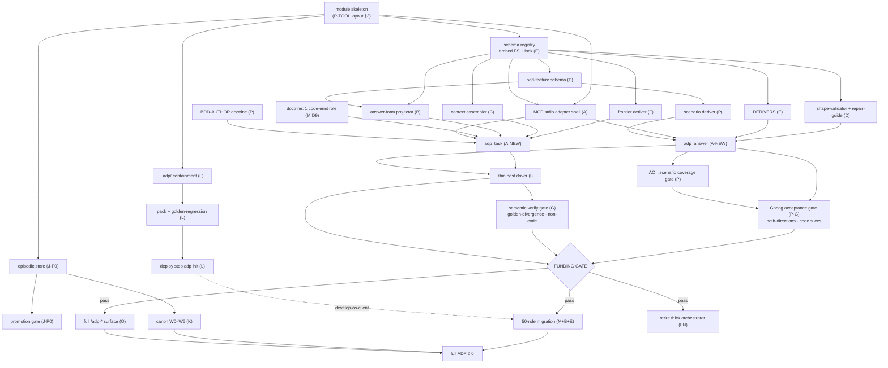
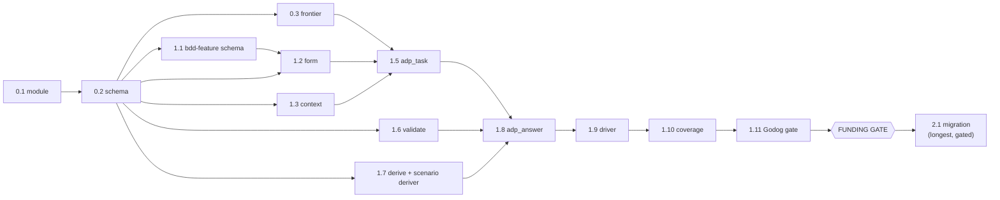

# ADP 2.0 — Build Order (Go rewrite)

> CTO build-order. Derives most-efficient construction sequence from `00-build-inventory.md` (subsystems A–O, module layout §3, track sketch §6, risks §8, decisions §10). Inventory §6 = track-level. This doc = **item-level**: explicit dependency edges, critical path, parallel lanes, gate placement, first-runnable-slice milestones. Register: caveman; structural data (ids, paths, tool names, schema keys) literal.
> Optimize for: shortest path to a **runnable both-directions oracle** (the funding spike), then unblock parallel tracks, defer all funding-gated bulk (50-role migration) behind measured proof.
> **BDD-integrated (inventory §4-P, §12).** Spec ships as executable BDD (Gherkin + Godog) in PRODUCT trees → regression-guarded + outsider-maintainable. For CODE slices the both-directions oracle IS the Godog pass/fail; golden-divergence stays for non-code artifact slices. Consequence for order: the spike role is a code-emitting slice (D9), and BDD build items (schema · BDD-AUTHOR · scenario deriver · Godog gate · AC→scenario coverage) slot onto the spike path + thread through migration.

---

## 0. TL;DR — the order

1. **P0 Substrate** — Go module + schema embed/lock + frontier + MCP adapter shell. Blocks everything.
2. **P1 Spike core** — `adp_task`/`adp_answer` + answer-form + context-assembler + shape-validator/repair + thin driver + **BDD-AUTHOR + scenario deriver + Godog acceptance gate**, against ONE code-emitting role (D9). Ends at **both-directions oracle = Godog PASS-good / FAIL-defect** (golden-divergence for non-code) = the funding gate. Same slice powers the §11 customer demo.
3. **Parallel from P0 (not gated):** Memory P0 (episodic + promotion gate) · Bootstrap (`.adp/` containment + pack + deploy).
4. **FUNDING GATE** (measure inline-all token cost, prove driver thin). PASS →
5. **P2 Bulk + canon** — 50-role migration · canon W0–W6 (needs episodic for growth) · full `/adp-*` surface · retire thick orchestrator.

Critical path = **P0 → P1 spike → gate**. Everything else hangs off P0 in parallel or sits behind the gate. Shorten the path to the gate; do nothing on principle before it.

---

## 1. Dependency graph (item-level)

---

## 2. Ordering principles (the justification basis)

| # | Principle | Consequence for order |
|---|---|---|
| OP1 | **Critical path = path to the funding gate.** Spike is the decision that scopes the whole rest. | Everything on the spike path goes first + sequential; everything else parallelizes around it or waits behind it. |
| OP2 | **Nothing on principle before measurement** (D4 / BD §10). | 50-role migration, full doctrine port, full `/adp-*` surface = AFTER gate. Spike touches exactly 1 role. |
| OP3 | **Substrate blocks all.** Schema + frontier + adapter have no upstream; everything imports them. | P0 first, fully, before any tool surface. |
| OP4 | **Parallelize the independent.** Memory-P0 + bootstrap share only the module; touch no spike code. | Run both from end of P0, concurrent with the spike. |
| OP5 | **Build the consumer last in each chain.** `adp_task`/`adp_answer` consume B/C/D/E/F; driver consumes them. | Leaf deps before composing tools before driver. |
| OP6 | **Adversarial oracle is a separate build, not folded in** (invariant; G outside repair loop). | Semantic gate (G) built as distinct step after `adp_answer`, never inside D's repair loop. |
| OP7 | **Canon growth needs episodic telemetry** (CP4 / W6 C-ABSENT). | Canon W0–W5 seed can precede, but W6 growth-wiring waits on episodic store (J·P0). |
| OP8 | **Develop-as-client needs a deployable build** (BP2). | Bootstrap (deploy step) must land before role-migration runs through `/deliver`. |
| OP9 | **Retire only after replacement exists.** Thick orchestrator logic must already live in tools+elicitation+driver. | RETIRE (N, orchestrator) at cutover, after gate, not before. |
| OP10 | **Acceptance oracle for code = shipped BDD** (inv §4-P/§12). The both-directions proof for code slices IS Godog pass/fail; spec must ship in product trees. | Spike role is code-emitting (D9); BDD items (schema·BDD-AUTHOR·scenario deriver·Godog gate·coverage) ride the spike path, then thread every code-emit role in migration. Godog gate is a §G leg → OP6: distinct, outside the repair loop. |

---

## 3. Phases

### P0 — Substrate (critical path, sequential)

Blocks everything. No tool runs without these.

| Order | Item | Inv ref | Depends on | Why here |
|---|---|---|---|---|
| 0.1 | Go module skeleton (P-TOOL: `internal/det…` ⊥ `cmd/adp-server`) | §3 | — | the floor; defines core⊥adapter boundary that fixture-testing relies on |
| 0.2 | Schema registry + loader + `embed.FS` + `schemas.lock` | E | 0.1 | every tool, form, validator reads schemas; D3 keeps JSON, typed Go view only |
| 0.3 | Frontier deriver (stateless disk scan; `task_id` re-derivable) | F | 0.2 | `adp_task` can't derive work without it; D20 stateless resume |
| 0.4 | MCP stdio adapter shell (server stands up, ports 13 tool stubs) | A | 0.1,0.2 | host wiring + transport; native `mcp__adp__*` reachable (build-time check) |

**Exit P0:** server boots, registers tools, frontier scans disk, schemas embedded+locked. Ported det tools (`status`/`coverage`/`idgen`/`route`/`sequence`/…) can land here opportunistically — they're high-confidence pure ports (§7) and de-risk the adapter.

### P1 — Spike core (critical path, sequential) → **funding gate**

Goal: ONE **code-emitting** role (D9) drives end-to-end through the new surface, verified BOTH directions — Godog for the code, golden-divergence for any artifact it threads. Smallest build that earns the gate decision AND proves the BDD regression mandate (§4-P/§12) + the §11 customer demo in one slice.

| Order | Item | Inv ref | Depends on | Why here |
|---|---|---|---|---|
| 1.1 | `bdd-feature` schema (NEW-design; embed + lock) | E,P | 0.2 | form/deriver/Godog gate all read it; first needed here, not a port |
| 1.2 | Answer-form projector (role schema + `bdd-feature` → plain slots) | B,P | 0.2,1.1 | `adp_task` hands the agent slots; BDD-AUTHOR fills Given/When/Then |
| 1.3 | Context assembler (read-graph → inline vs source_pointer; `when`-eval) | C | 0.2 | `adp_task` must hand a branch-free, self-contained packet |
| 1.4 | Doctrine: 1 code-emit role + **BDD-AUTHOR** doctrine + slot-maps | M,P | 0.2,1.1 | packet needs role doctrine + BDD-AUTHOR projection (AC→scenario) |
| 1.5 | `adp_task` (frontier + context + form + doctrine → packet) | A·NEW | 0.3,1.2,1.3,1.4 | composing tool; the new read surface |
| 1.6 | Shape-validator + repair-guide (shape-only; plain-language fix; cap-3 loop) | D | 0.2 | `adp_answer` gate; never leak schema errors to agent |
| 1.7 | DERIVERS for the role + **scenario deriver** (`@AC` splice; `.feature` → product tree; step-skeletons) | E,P | 0.2,1.1 | `adp_answer` must produce real code + a real `.feature` on disk |
| 1.8 | `adp_answer` (validate → repair → derive → scratch write) | A·NEW | 1.6,1.7 | composing tool; the new write surface |
| 1.9 | Thin host driver + minimal `/adp-deliver` (one role loop) | I,O | 1.5,1.8 | the host pump; proving it carries ZERO logic = part of the gate |
| 1.10 | AC→scenario coverage gate (extends `adp_coverage`) | P | 1.8 | every AC ≥1 `@AC`-scenario or HALT; precedes the Godog run |
| 1.11 | **Godog acceptance gate** (separate-spawn; both-directions) + golden-divergence leg for artifacts | G,P | 1.8,1.10 | OP6/OP10: distinct adversarial oracle, OUTSIDE repair; the shipped acceptance oracle |

**Exit P1 = FUNDING GATE inputs:** (a) both-directions oracle green — **Godog PASS on good emit + FAIL on planted defect** (code), golden-divergence (artifacts); (b) inline-all token cost measured (risk #1); (c) driver proven thin or logic owned + "thin" dropped (risk #4); (d) `task_id` collision resolved (risk #5); (e) shipped `.feature` + step-defs land in product trees, readable without ADP (§12 proof); (f) step-def authoring cost sane (risk #11). Gate decides whether P2 bulk happens.

### Parallel lanes (start at end of P0; NOT gated)

Independent of spike code — only import the module. Run concurrent with P1.

**Lane M (memory P0):**
| Order | Item | Inv ref | Depends on | Why |
|---|---|---|---|---|
| M.1 | Episodic store (durable append-only, survives teardown; D5 source-repo ledger) | J·P0 | 0.1 | the ONE disposable-workspace exception; without it CP4 canon-growth impossible |
| M.2 | Promotion gate (episodic→semantic; recurrence-gated; SOP C–F; operator-gated) | J·P0 | M.1 | hardens telemetry into canon candidates; feeds W6 |

**Lane B (bootstrap):**
| Order | Item | Inv ref | Depends on | Why |
|---|---|---|---|---|
| B.1 | `.adp/` containment migration (nest flat trees; re-point read-graph/schemas/sentinels/locks) | L | 0.1 | iron rule; must precede deploy + develop-as-client; touches paths the spike also reads — land early to avoid rework |
| B.2 | Pack + manifest allowlist + pack gate (selftests + roadmap drained + sha) | L | B.1 | HALT-on-fail packaging |
| B.3 | Golden-regression gate in pack (`_fixtures/` → CI suite, not dev oracle) | L,N | B.2 | repurpose goldens; protects every later port |
| B.4 | Deploy step (`adp init` into fresh workspace) | L | B.2 | OP8: develop-as-client needs an installable build before migration |

> `.adp/` containment (B.1) is the one cross-lane ordering hazard: it re-points paths the frontier/context/schema layers read. Either land B.1 **before** 0.3/1.3 wire paths, or build the spike against post-containment paths from the start. **Recommendation: do B.1 inside P0** (between 0.1 and 0.2) so all path-readers target `.adp/` from day one — cheaper than re-pointing later.

### P2 — Bulk + canon (AFTER funding gate passes)

| Order | Item | Inv ref | Depends on | Why here |
|---|---|---|---|---|
| 2.1 | Role migration — 50 roles × (answer-form + slot-map + doctrine); **code-emit roles also get BDD-AUTHOR + scenarios** | M,B,E,P | gate, B.4 | OP2 bulk behind proof; OP8 runs through deployed build; risk #7 coexistence → one at a time; BDD pattern proven in spike, replicated per code-emit role |
| 2.2 | Full `/adp-*` surface (`-revise`/`-status`/`-show`/`-init` beyond spike's `-deliver`) | O | gate,1.8 | rides the proven thin driver; each cmd = one driver invocation |
| 2.3 | Operator gates via elicitation (checkpoint A/B/C + D39 customer-facing demo) | H | 2.2 | mid-run steering; DEMO-GEN doctrine (§11 customer-facing) |
| 2.4 | Canon W0–W2 (rule schema + engine stack + arch profiles + linter import); **Godog runner stands up alongside `go/analysis`** | K,P | gate | seed; `go/analysis` stack, pre-grounded linter rules; two oracles kept distinct (canon-compliance ⊥ Godog acceptance, inv §K) |
| 2.5 | Canon W3–W5 (correctness core + idiom/design + quality) | K | 2.4 | hand-grounded rules vs primary source |
| 2.6 | Canon W6 (validate, cut baseline, **wire C-ABSENT growth**) | K | 2.5,M.1 | OP7: growth-wiring needs episodic telemetry |
| 2.7 | Memory P1/P2 (priming bound · doctrine versioning · statedep two-pass) | J | 2.1 | refine after core surface proven; resolves open items (TA §13) |
| 2.8 | **RETIRE** thick orchestrator + `/evolve` + self-host docs | I,N | 2.2,2.3 | OP9: only after tools+elicitation+driver fully replace the logic |

---

## 4. Critical path

- **Path to gate:** module → schema → (frontier ∥ bdd-schema ∥ form ∥ context) → adp_task → (validate ∥ derive+scenario) → adp_answer → driver → coverage → Godog gate. ~11 sequential build steps. This is the number to compress.
- **schema (0.2) = the chokepoint** — 7 of the next items depend on it (incl. `bdd-feature`). Build it solid + locked first; it gates the widest fan-out.
- **Longest absolute task = 2.1 role migration** (50 roles, low confidence §7) but it's gated + parallelizable per-role, so it's NOT on the path to the decision — only on the path to "full ADP 2.0."

---

## 5. Parallelization map

| Lane | Items | Starts after | Runs concurrent with |
|---|---|---|---|
| Critical (spike) | 0.1→…→1.11 (Godog gate) | — | both lanes below |
| Memory-P0 | M.1, M.2 | 0.1 | spike |
| Bootstrap | B.1(→P0), B.2–B.4 | 0.1 | spike |
| Det-tool ports | status/coverage/idgen/route/sequence/… | 0.4 | spike (opportunistic, high-confidence) |

Post-gate, P2 fans wide: migration (2.1) ∥ canon (2.4→2.6) ∥ surface (2.2→2.3). Canon W6 (2.6) is the one join — waits on episodic (M.1, already done in parallel lane).

---

## 6. Gates (HALT points)

| Gate | When | Pass criterion | On fail |
|---|---|---|---|
| P0 exit | end P0 | server boots, tools register, frontier scans, schemas locked | fix substrate; nothing downstream starts |
| **FUNDING GATE** | end P1 | both-directions green (**Godog PASS-good/FAIL-defect** for code · golden-divergence for artifacts) · `.feature`+step-defs shipped to product trees + readable without ADP · token cost net-win · driver thin · task_id resolved | keep current arch + ship as lint rule (inventory §6 KEEP); develop through deployed build |
| AC→scenario coverage | every code slice | every AC id maps to ≥1 `@AC`-tagged scenario | HALT; no code promoted with uncovered AC |
| BDD acceptance (Godog) | every code slice | scenarios PASS on emit; planted-defect FAILs (both-directions); gate OUTSIDE repair loop | not accepted; emit repaired/rejected (never fold correctness into shape repair) |
| Pack gate | every pack | selftests + roadmap drained + golden-regression + **shipped Godog suite green** + sha all green | no tarball emitted (HALT) |
| Promotion gate | every canon/fact promote | stable + corroborated (never first sighting) + operator-gated | stays in episodic, not promoted |
| Acceptance demo (D39) | every delivered slice | operator runs client's OWN commands vs deployed build, sees customer-facing feature work (§11) | not accepted; native `mcp__adp__*` is build-time only, not this gate |

---

## 7. First-runnable-slice milestones

Each = a demoable checkpoint, earliest possible.

| Milestone | At | Proves |
|---|---|---|
| **M-Boot** | end P0 | `adp-server` connects in fresh session; `mcp__adp__status` returns disk frontier (build-time wiring check) |
| **M-Read** | 1.5 done | `adp_task(code-emit role)` returns a self-contained, branch-free packet (no schema/id leaked to agent) |
| **M-Write** | 1.8 done | `adp_answer` validates slots → derives ids → writes a real scratch artifact |
| **M-Loop** | 1.9 done | thin driver pumps task→agent→answer for one role, host-side, zero control logic in driver |
| **M-Spec** | 1.7 done | `adp_answer` emits product code + a `@AC`-tagged `.feature` into product trees, readable without ADP → the §12 regression-mandate proof |
| **M-Oracle** | 1.11 done | both-directions: **Godog PASS-good + planted-defect FAIL** (code) / golden-divergence (artifact) → **the funding-gate evidence**; same slice = §11 customer demo |
| **M-Deploy** | B.4 done | `adp init` scaffolds a fresh workspace from the packed build = develop-as-client ready |
| **M-Self** | 2.1 first role | ADP builds an ADP artifact through the deployed build via `/adp-deliver` |

Order optimizes to reach **M-Oracle** in the fewest sequential steps — it's the only milestone that unlocks the scope decision.

---

## 8. Risk-driven ordering notes

| Risk (inv §8) | Where order mitigates it |
|---|---|
| #1 inline-all token cost | measured AT M-Oracle, BEFORE any bulk migration (2.1) — cost surprise can't sink 50 roles |
| #2 projection semantic-drift | 1 reviewed mapping in spike (1.1); mass mapping (2.1) only after pattern proven |
| #3 episodic breaks "disposable workspace" | M.1 builds the durable-ledger exception explicitly + early, flush-on-promote |
| #4 driver thinness | proven at M-Loop/gate; if logic irreducible, own it + drop "thin" before committing surface (2.2) |
| #5 task_id collision | resolved in spike (frontier-key carries unit) before any parallel-branch work |
| #7 migration coexistence/rollback | 2.1 strictly one-role-at-a-time against the frozen proven surface |
| #9 canon curation FTE | W2 (2.4) front-loads linter-auto-derivable rules; hand-ground (2.5) minimized; growth demand-driven only |
| #11 step-def maintenance | measured at M-Spec/gate (criterion f) on ONE role before mass replication (2.1); scenario deriver emits step skeletons; shared step-libs per role-class |
| #12 Gherkin↔AC drift | 1 reviewed AC→scenario mapping + coverage gate (1.10) in spike; mass mapping only after proven (mirrors #2) |
| #13 Godog flaky/build-time | Godog gate built distinct + outside repair (1.11, OP6); deterministic step-defs only; runs at pack gate as shipped regression |

---

## 9. Summary justification

- **Why substrate-first:** schema/frontier/adapter have zero upstream and maximal downstream fan-out (OP3). Building anything else first = building on air.
- **Why spike-before-bulk:** the 50-role migration is the largest, lowest-confidence cost (§7) and is *conditional*. Spending it before the gate violates BD §10 / D4. Reach the both-directions oracle (M-Oracle) in minimum steps, decide, then commit (OP2).
- **Why memory + bootstrap parallel:** they share only the module floor, touch no spike code, and each unblocks a later join (episodic→canon-W6; deploy→develop-as-client). Serializing them would extend wall-clock for no dependency reason (OP4).
- **Why canon late + W6 last:** seed rules (W0–W5) need only the engine stack, but *growth* (W6) is demand-driven off episodic telemetry — build the source (M.1) before the consumer (OP7).
- **Why retire last:** the thick orchestrator's logic must already live in tools + elicitation + driver before deletion, or capability regresses (OP9).
- **Why BDD on the spike path, not deferred:** the regression mandate (§12) IS the code-slice acceptance oracle (OP10). Building it into the spike costs only a `bdd-feature` schema + scenario deriver + Godog gate, and in return the funding-gate's both-directions proof becomes a real Godog pass/fail on shipped product-tree specs — proving surface-thinness, BDD acceptance, AND the §11 customer demo in ONE code-emitting slice (D9). Deferring BDD would leave the spike proving the wrong oracle (golden-divergence on a throwaway artifact) and re-prove the acceptance path later at higher cost.
- **Net shape:** one short critical path to a measured decision; two cheap parallel lanes filling the same wall-clock; all expensive, conditional, or telemetry-dependent work deferred behind the gate it depends on.
