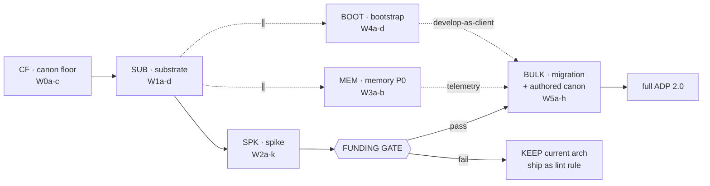
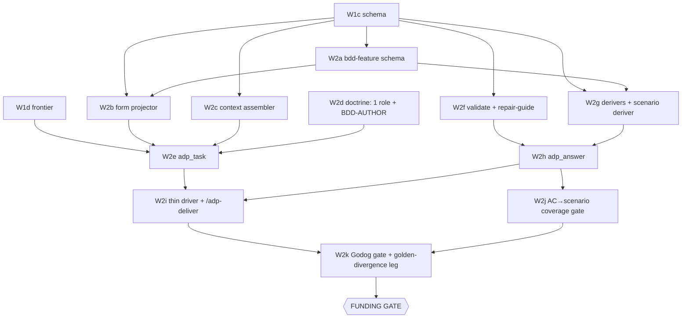

# ADP 2.0 — Build Roadmap (Go rewrite)

> CTO roadmap. Derives executable wave sequence from `01-build-order.md` (item-level deps, critical path §4, lanes §5, gates §6, milestones §7) atop `00-build-inventory.md` (subsystems A–P, layout §3, decisions §10, canon paradox §13). Build order = WHAT depends on what. This doc = **WHEN it ships**: waves with sentinels, exit gates, parallel lanes, milestone checkpoints, frontier discipline.
> Spine = canon paradox fix (inv §13). Tier-1 BORROWED canon (golangci + frozen P-TOOL arch) gates from commit 0; tier-2 AUTHORED canon (GC-* W3–W6) earned post-gate from engine's own telemetry. Order: **borrow → build governed → earn → retro-harden.**
> Frontier = first wave whose `done_sentinel` absent / invalid on disk (D20). Disk = sole source of truth; resume re-derives. Register: caveman; structural data (ids, paths, tool names, schema keys) literal.

---

## 0. TL;DR — the wave plan

| Phase | Waves | Gate at end | Funding |
|---|---|---|---|
| **CF** canon floor | W0a–W0c | M-Floor (CI rejects planted violation) | committed |
| **SUB** substrate | W1a–W1d | M-Boot (server connects, frontier scans) | committed |
| **SPK** spike core | W2a–W2k | **FUNDING GATE** (M-Oracle both-directions) | committed |
| **MEM** memory P0 (∥) | W3a–W3b | episodic captures spike telemetry | committed |
| **BOOT** bootstrap (∥) | W4a–W4d | M-Deploy (`adp init` scaffolds) | committed |
| **BULK** migration + authored canon | W5a–W5h | full ADP 2.0 | **GATED** |

Critical path: **CF → SUB → SPK → FUNDING GATE**. MEM + BOOT run parallel off SUB.1. BULK sits behind the gate. ~12 sequential build steps to the decision; everything else parallel or deferred.

---

## 1. Frontier discipline

- Each wave = one frontier unit: own `done_sentinel` (artifact-on-disk) + `done_discriminator` (canon-clean + test green) + attempt budget + verify.
- Promote independent. Frontier = first wave whose sentinel absent / schema-invalid / discriminator fails on disk.
- **Canon floor (W0a–c) gates EVERY wave after it** — no Go commit lands without golangci + arch-lint green. Sentinel-on-disk does not satisfy the wave; discriminator (canon-clean) must also hold.
- Resume = re-scan disk, re-derive frontier. No RAM state, no tracker.

---

## 2. Phase CF — canon floor (commit 0; tier-1 borrowed; critical path FIRST)

Cheap (config + adopt-frozen, ZERO rule authoring) but FIRST. Dissolves paradox: governs substrate + spike from line 0. Inv §13 / D10 / OP0.

| Wave | Deliverable | Inv ref | Depends | done_sentinel | discriminator |
|---|---|---|---|---|---|
| **W0a** | golangci-lint stack (staticcheck·govet·gosec·errcheck·ineffassign·unused·gocritic·revive) + compiler gate wired HARD CI | §13 m1, K-W0/W2 | — | `.golangci.yml` + CI workflow | planted lint violation → CI red |
| **W0b** | adopt FROZEN P-TOOL arch profile; stand up depguard + go-arch-lint configs | §13 m2, K-W1 | — | `depguard.yml` + `.go-arch-lint.yml` | planted import-direction violation → CI red |
| **W0c** | W0 rule-schema + trigger vocab + source registry + analysistest harness shell (NO rules yet) | §13, K-W0 | — | `canon-rules/schema.json` + harness pkg | analysistest green on throwaway pos/neg fixture |

**Gate — M-Floor:** CI rejects planted lint violation + planted import-direction violation; analysistest harness green. → foundation governed before any engine Go. On fail: fix config; no engine code lands.

---

## 3. Phase SUB — substrate (critical path, sequential; under canon floor)

Blocks everything. Zero upstream, maximal downstream fan-out (OP3). Schema = the chokepoint (7 downstream consumers).

| Wave | Deliverable | Inv ref | Depends | done_sentinel | discriminator |
|---|---|---|---|---|---|
| **W1a** | Go module skeleton (P-TOOL: `internal/det…` ⊥ `cmd/adp-server`) | §3 | W0a–c | `go.mod` + pkg tree | core⊥adapter boundary arch-lint green |
| **W1b** | `.adp/` containment migration (nest trees; re-point read-graph/schemas/sentinels/locks) | L | W1a | `.adp/` root populated | all path-readers target `.adp/` |
| **W1c** | schema registry + loader + `embed.FS` + `schemas.lock` | E | W1b | `internal/schema/` + `schemas.lock` | ~50 schemas embed + lock verify (D3 JSON kept) |
| **W1d** | frontier deriver (stateless disk scan; `task_id` re-derivable) | F | W1c | `internal/frontier/` | scans disk, derives frontier, no RAM state |
| **W1e** | MCP stdio adapter shell (server boots, 13 tool stubs) | A | W1a,W1c | `cmd/adp-server/main.go` | native `mcp__adp__*` reachable |

> **`.adp/` containment pulled into SUB (W1b)** — the one cross-lane hazard (re-points paths frontier/context/schema read). Land before schema so all readers target `.adp/` day-one; cheaper than re-pointing later (build-order §3 recommendation).
> Det-tool ports (`status`/`coverage`/`idgen`/`route`/`sequence`/…) land opportunistically at W1e — high-confidence pure ports (§7), de-risk the adapter.

**Gate — M-Boot:** server boots, registers tools, frontier scans disk, schemas embedded+locked, canon floor green on all of it. On fail: fix substrate; nothing downstream starts.

---

## 4. Phase SPK — spike core (critical path, sequential) → FUNDING GATE

Goal: ONE **code-emitting** role (D9) drives end-to-end through new surface, verified BOTH directions — Godog for code, golden-divergence for any threaded artifact. Smallest build earning the gate + proving BDD mandate (§4-P/§12) + §11 customer demo in one slice. Every line under canon floor; build failures feed episodic store (W3a) = first tier-2 telemetry.

| Wave | Deliverable | Inv ref | Depends | done_sentinel | milestone |
|---|---|---|---|---|---|
| **W2a** | `bdd-feature` schema (embed + lock) | E,P | W1c | `schemas/bdd-feature.json` | — |
| **W2b** | answer-form projector (role schema + bdd-feature → plain slots) | B,P | W1c,W2a | `internal/form/` | — |
| **W2c** | context assembler (read-graph → inline vs source_pointer; `when`-eval) | C | W1c | `internal/context/` | — |
| **W2d** | doctrine: 1 code-emit role + BDD-AUTHOR doctrine + slot-maps | M,P | W1c,W2a | `internal/doctrine/<role>` | — |
| **W2e** | `adp_task` (frontier + context + form + doctrine → packet) | A·NEW | W1d,W2b,W2c,W2d | `adp_task` handler | **M-Read** (branch-free packet, no schema/id leaked) |
| **W2f** | shape-validator + repair-guide (shape-only; plain fix; cap-3 loop) | D | W1c | `internal/validate/` | — |
| **W2g** | DERIVERS for role + scenario deriver (`@AC` splice; `.feature`→product tree; step-skeletons) | E,P | W1c,W2a | `internal/derive/` | **M-Spec** (code + `@AC` `.feature` in product trees, readable w/o ADP) |
| **W2h** | `adp_answer` (validate → repair → derive → scratch write) | A·NEW | W2f,W2g | `adp_answer` handler | **M-Write** (slots→ids→scratch artifact) |
| **W2i** | thin host driver + minimal `/adp-deliver` (one role loop) | I,O | W2e,W2h | driver skill + `/adp-deliver` | **M-Loop** (host pump, zero control logic) |
| **W2j** | AC→scenario coverage gate (extends `adp_coverage`) | P | W2h | coverage check | — |
| **W2k** | Godog acceptance gate (separate-spawn, both-directions) + golden-divergence leg | G,P | W2h,W2j | Godog runner + gate | **M-Oracle** (PASS-good / FAIL-defect = gate evidence) |

**FUNDING GATE — exit criteria (all must hold):**
- (a) both-directions green — Godog PASS on good emit + FAIL on planted defect (code) · golden-divergence (artifacts)
- (b) inline-all token cost measured, net-win (risk #1)
- (c) driver proven thin OR logic owned + "thin" dropped (risk #4)
- (d) `task_id` collision resolved — frontier-key carries unit (risk #5)
- (e) `.feature` + step-defs shipped in product trees, readable without ADP (§12 proof)
- (f) step-def authoring cost sane on ONE role before mass replication (risk #11)
- (g) substrate+spike build failures captured in episodic store = tier-2 canon seed corpus (§13 m3)

**On fail:** keep current arch + ship as lint rule (inv §6 KEEP); develop through deployed build. Gate decides whether BULK happens.

---

## 5. Parallel lanes (start at end of SUB W1a; NOT gated; concurrent with SPK)

Independent of spike code — only import the module floor (OP4).

### Lane MEM — memory P0 (also the tier-2 canon telemetry SOURCE)

| Wave | Deliverable | Inv ref | Depends | done_sentinel |
|---|---|---|---|---|
| **W3a** | episodic store (durable append-only, survives teardown; D5 source-repo ledger) | J·P0 | W1a | `internal/memory/episodic/` + ledger |
| **W3b** | promotion gate (episodic→semantic; recurrence-gated; SOP C–F; operator-gated) | J·P0 | W3a | `internal/memory/promotion/` |

> W3a is the ONE disposable-workspace exception. Starts capturing the engine's OWN build telemetry from SUB onward — by FUNDING GATE the seed corpus for tier-2 canon already exists (no speculation). Without it CP4 canon-growth impossible.

### Lane BOOT — bootstrap / deploy

| Wave | Deliverable | Inv ref | Depends | done_sentinel | milestone |
|---|---|---|---|---|---|
| **W4a** | pack + manifest allowlist + pack gate (selftests + roadmap drained + sha + golangci/analysistest green) | L | W1b | `tools/pack/` + gate | — |
| **W4b** | golden-regression gate in pack (`_fixtures/` → CI suite, not dev oracle) | L,N | W4a | regression suite | — |
| **W4c** | deploy step (`adp init` into fresh workspace) | L | W4a | `adp init` cmd | **M-Deploy** (scaffolds fresh workspace) |
| **W4d** | Stage-0 bootstrap B0 (seed cycle from current HEAD) | L | W4c | B0 seeded | — |

> `.adp/` containment already landed in SUB (W1b), so BOOT starts at pack (no re-point rework). OP8: deploy (W4c) must land before migration runs through `/deliver`.

---

## 6. Phase BULK — migration + authored canon (AFTER funding gate passes; GATED)

Tier-2 canon (W3–W6 of GC) now grows from REAL telemetry substrate+spike emitted (OP7 / §13 m3) — not speculation. Fans wide: migration ∥ authored-canon ∥ surface.

| Wave | Deliverable | Inv ref | Depends | done_sentinel | milestone |
|---|---|---|---|---|---|
| **W5a** | role migration — 50 roles × (answer-form + slot-map + doctrine); code-emit roles also get BDD-AUTHOR + scenarios; one-at-a-time | M,B,E,P | gate, W4c | per-role doctrine + slots | **M-Self** (ADP builds ADP artifact via `/adp-deliver`) |
| **W5b** | full `/adp-*` surface (`-revise`/`-status`/`-show`/`-init` beyond spike's `-deliver`) | O | gate, W2h | 5-command surface | — |
| **W5c** | operator gates via elicitation (checkpoint A/B/C + D39 customer-facing demo; DEMO-GEN doctrine) | H | W5b | elicitation wiring | — |
| **W5d** | AUTHORED canon W3 (correctness GC-ERR/CONC/CTX/RES/SEC); Godog runner alongside `go/analysis` | K | gate, W3a | GC-W3 rules + fixtures | — |
| **W5e** | AUTHORED canon W4–W5 (idiom/design GC-IFACE/PTR/SLICE/GEN/API/ARCH + quality GC-PERF/TEST/ENC/STD) | K | W5d | GC-W4/W5 rules | — |
| **W5f** | AUTHORED canon W6 (validate, cut baseline ~80–120 rules, wire C-ABSENT growth); retro-check whole tree | K | W5e, W3a | baseline cut + growth wired | **M-Earn** (tier-2 rule from real telemetry fires + retro-checks tree) |
| **W5g** | memory P1/P2 (priming bound · doctrine versioning · statedep two-pass) | J | W5a | priming/statedep/doctrine-ver | — |
| **W5h** | RETIRE thick orchestrator + `/evolve` + self-host docs | I,N | W5b,W5c | deleted; no dangling refs | — |

> **W0/W1/W2 of GC are NOT here** — pulled to canon floor (CF) as tier-1 borrowed. BULK holds only AUTHORED tier-2 (W3–W6), telemetry-driven not speculative.
> W5f is the one join — consumes episodic (W3a, already full of the engine's own build telemetry).
> OP9: W5h retire LAST — only after tools+elicitation+driver fully replace the logic.

---

## 7. Gantt — wall-clock shape

```mermaid
gantt
    title ADP 2.0 build — phase wall-clock (relative)
    dateFormat X
    axisFormat %s
    section Critical
    CF canon floor (W0a-c)      :cf, 0, 1
    SUB substrate (W1a-e)       :sub, after cf, 3
    SPK spike (W2a-k)           :spk, after sub, 4
    FUNDING GATE                :milestone, fg, after spk, 0
    BULK migration+canon (W5)   :bulk, after fg, 6
    section Parallel (off SUB)
    MEM memory P0 (W3a-b)       :mem, after sub, 3
    BOOT bootstrap (W4a-d)      :boot, after sub, 3
```

---

## 8. Milestones (demoable checkpoints, earliest possible)

| Milestone | At wave | Proves |
|---|---|---|
| **M-Floor** | W0c | planted lint + import-direction violation both rejected; analysistest green → foundation canon-governed before any engine code (§13 proof) |
| **M-Boot** | W1e | `adp-server` connects fresh session; `mcp__adp__status` returns disk frontier (build-time wiring check) |
| **M-Read** | W2e | `adp_task(code-emit role)` returns self-contained branch-free packet (no schema/id leaked) |
| **M-Write** | W2h | `adp_answer` validates slots → derives ids → writes real scratch artifact |
| **M-Loop** | W2i | thin driver pumps task→agent→answer one role, host-side, zero control logic |
| **M-Spec** | W2g | `adp_answer` emits product code + `@AC`-tagged `.feature` in product trees, readable w/o ADP → §12 regression-mandate proof |
| **M-Oracle** | W2k | both-directions: Godog PASS-good + planted-defect FAIL (code) / golden-divergence (artifact) → **the funding-gate evidence**; same slice = §11 customer demo |
| **M-Deploy** | W4c | `adp init` scaffolds fresh workspace from packed build = develop-as-client ready |
| **M-Self** | W5a (first role) | ADP builds an ADP artifact through deployed build via `/adp-deliver` |
| **M-Earn** | W5f (first rule) | tier-2 GC-* rule authored from REAL episodic telemetry fires + retro-checks tree → paradox spiral closes (§13 m3) |

Order optimizes to reach **M-Oracle** in fewest sequential steps (the only milestone unlocking scope decision), with **M-Floor** the cheap precondition making every prior step governed.

---

## 9. Gates (HALT points)

| Gate | When | Pass criterion | On fail |
|---|---|---|---|
| **Canon floor** | every Go commit (from W0a) | golangci clean · compiler clean (no cycles, `internal/` respected) · depguard/go-arch-lint clean (P-TOOL) | commit rejected; foundation never ungoverned |
| **P0 exit (M-Boot)** | end SUB | server boots, tools register, frontier scans, schemas locked, canon floor green | fix substrate; nothing downstream starts |
| **FUNDING GATE** | end SPK | §4 criteria (a)–(g) all hold | KEEP current arch + ship as lint rule; develop through deployed build |
| **AC→scenario coverage** | every code slice | every AC id → ≥1 `@AC`-tagged scenario | HALT; no code promoted with uncovered AC |
| **BDD acceptance (Godog)** | every code slice | scenarios PASS on emit; planted-defect FAILs (both directions); OUTSIDE repair loop | emit repaired/rejected; never fold correctness into shape repair |
| **Pack gate** | every pack | selftests + roadmap drained + golden-regression + shipped Godog suite + golangci/analysistest + sha all green | no tarball (HALT) |
| **Promotion gate** | every canon/fact promote | stable + corroborated (never first sighting) + operator-gated | stays episodic, not promoted |
| **Acceptance demo (D39)** | every delivered slice | operator runs client's OWN commands vs deployed build, sees customer-facing feature work (§11) | not accepted; native `mcp__adp__*` = build-time only, not this gate |

---

## 10. Risk-driven ordering (carried from inv §8 / order §8)

| Risk | Where roadmap mitigates |
|---|---|
| #1 inline-all token cost | measured AT M-Oracle (W2k), BEFORE bulk migration (W5a) |
| #2 projection semantic-drift | 1 reviewed mapping in spike (W2a–b); mass mapping (W5a) only after pattern proven |
| #3 episodic breaks "disposable workspace" | W3a builds durable-ledger exception explicitly + early, flush-on-promote |
| #4 driver thinness | proven at M-Loop/gate (W2i); irreducible logic → own it + drop "thin" before W5b |
| #5 task_id collision | resolved in spike before any parallel-branch work |
| #7 migration coexistence/rollback | W5a strictly one-role-at-a-time against frozen proven surface |
| #9 canon curation FTE | W2 imported free at W0a (tier-1); tier-2 (W5d–e) hand-ground minimized; growth demand-driven |
| #10 single-Opus canon | tier-1 linter (W0a) = decorrelated second opinion from line 0 |
| #11 step-def maintenance | measured at M-Spec/gate on ONE role before mass replication (W5a); deriver emits skeletons; shared step-libs |
| #12 Gherkin↔AC drift | 1 reviewed mapping + coverage gate (W2j) in spike; mass only after proven |
| #13 Godog flaky/build-time | gate distinct + outside repair (W2k); deterministic step-defs; runs at pack gate as shipped regression |
| #14 foundation poured ungoverned | canon floor (W0a–c) FIRST; tier-2 retro-checks (W5f) on landing |

---

## 11. Summary justification

- **CF first** — paradox fix: canon has 2 tiers, only tier-2 missing. Tier-1 (linters + frozen P-TOOL arch) pre-grounded, zero-authoring, available now. Land commit 0 → foundation governed for ~one CI config. Skipping = the paradox.
- **SUB second** — schema/frontier/adapter zero upstream, max downstream fan-out. Built under floor, never before. `.adp/` containment folded in (W1b) to kill re-point rework.
- **SPK before BULK** — 50-role migration = largest, lowest-confidence, conditional cost. Reach M-Oracle minimum steps, measure, decide, then commit (BD §10 / D4).
- **MEM + BOOT parallel** — share only module floor, touch no spike code, each unblocks a later join (episodic→canon-W6; deploy→develop-as-client). Episodic doubles as tier-2 telemetry source from SUB on.
- **AUTHORED canon late, W6 last** — cheap pre-grounded waves shipped at floor; W3–W6 hand-grounded + demand-driven off episodic telemetry. Build source (W3a) before consumer; retro-harden on each landing.
- **Retire last** — thick orchestrator logic must live in tools+elicitation+driver before deletion or capability regresses.
- **BDD on spike path** — regression mandate IS the code-slice acceptance oracle; costs only bdd-feature schema + scenario deriver + Godog gate; funding-gate both-directions proof = real Godog pass/fail on shipped product-tree specs.
- **Net:** cheap canon floor at commit 0 → every line governed; one short critical path to a measured decision, all canon-clean; two parallel lanes filling the same wall-clock (one seeding canon telemetry); all expensive/conditional/telemetry-dependent work deferred behind its gate. **Borrow → build governed → earn → retro-harden.**
