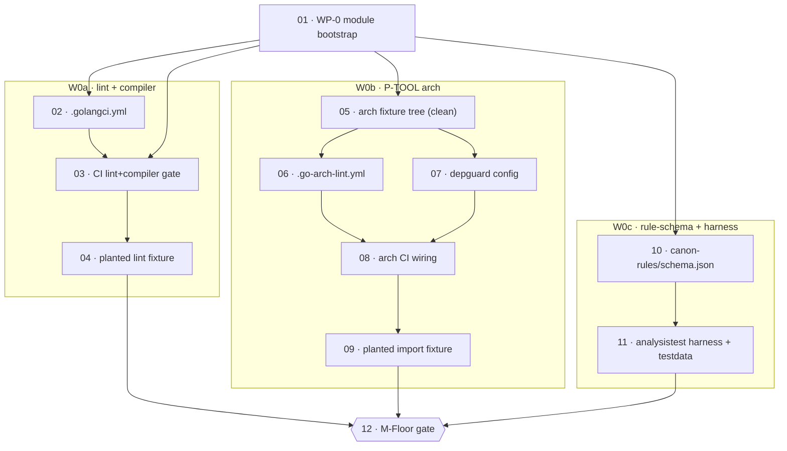

# Phase CF — atomic task index (canon floor)

> Index for the Phase CF atomic-task set. Decomposed from `01-build/01_00-phase-cf-wbs.md` (the WBS). Each task file SELF-CONTAINED — all context inline, no cross-reading needed. Register: caveman; structural data (ids, paths, tool/linter names, schema keys) literal.

## Mission (why CF exists)

Engine = Go, must obey Go canon. Go canon tier-2 (ADP-specific GC-* rules) does NOT exist yet — engine build PRODUCES it from own telemetry → circular paradox. Fix: canon = 2 tiers. Tier-1 = BORROWED (off-the-shelf golangci stack + frozen P-TOOL arch + rule-schema/harness shell), pre-grounded, zero authoring. Land tier-1 at commit 0, BEFORE first hand-written engine Go line. Tier-2 earned later (BULK phase). CF = config + adopt-frozen only.

CF gates EVERY Go commit after it. Exit = **M-Floor** (operator-run): CI rejects planted lint violation + planted import-direction violation; analysistest harness green on throwaway pos/neg fixture.

Delivery root: `_adp-2.0/_deliverables/adp-2.0-code/` (= engine SOURCE repo; ≠ deployed build). ALL sentinel paths relative to this root.

## Task list

| # | File | Covers WBS WP | Deliverable | Lane |
|---|---|---|---|---|
| 01 | `01_00_01-wp0-module-bootstrap.md` | WP-0 | minimal Go module + toolchain/linter pins + CI skeleton | prereq |
| 02 | `01_00_02-w0a-golangci-config.md` | A2 | `.golangci.yml` — 8 linters | W0a |
| 03 | `01_00_03-w0a-ci-lint-compiler-gate.md` | A3, A4 | CI lint+compiler HARD gate job | W0a |
| 04 | `01_00_04-w0a-planted-lint-fixture.md` | A5 | clean/planted lint fixture pair | W0a |
| 05 | `01_00_05-w0b-arch-fixture-tree.md` | (B1/B2/B4 prereq) | clean core⊥adapter stub tree (lint target) | W0b |
| 06 | `01_00_06-w0b-go-arch-lint-config.md` | B1 | `.go-arch-lint.yml` | W0b |
| 07 | `01_00_07-w0b-depguard-config.md` | B2 | depguard config (IO-in-core forbid) | W0b |
| 08 | `01_00_08-w0b-arch-ci-wiring.md` | B3 | CI arch gate job | W0b |
| 09 | `01_00_09-w0b-planted-import-fixture.md` | B4 | planted import-direction defect | W0b |
| 10 | `01_00_10-w0c-rule-schema.md` | C1, C2, C3 | `canon-rules/schema.json` + trigger vocab + source registry | W0c |
| 11 | `01_00_11-w0c-analysistest-harness.md` | C4, C5 | analysistest harness pkg + pos/neg testdata | W0c |
| 12 | `01_00_12-mfloor-gate.md` | M-Floor | aggregate exit gate (operator-run) | gate |

## Dependency graph

Order: **01 first** (shared prereq). Then **W0a ∥ W0b ∥ W0c** concurrent. Single join = **M-Floor (12)**.

## Boundary — what CF is NOT (binds every task)

| OUT | Belongs to | Why not CF |
|---|---|---|
| full P-TOOL pkg tree (`internal/det…` ⊥ `cmd/adp-server`) | SUB W1a | CF = configs only; real tree written UNDER them |
| `embed.FS` + `schemas.lock` plumbing | SUB W1c | CF authors schema; SUB wires embed+lock |
| `.adp/` containment | SUB W1b | unrelated to canon floor |
| MCP adapter / tool stubs | SUB W1e | no engine surface at CF |
| AUTHORED tier-2 rules (GC-ERR/CONC/CTX/RES/SEC/…) | BULK W5d–f | demand-driven from telemetry; CF leaves rule-store EMPTY |
| episodic store / telemetry | MEM W3a | no engine running yet |
| Godog / BDD acceptance | SPK W2a/k | acceptance oracle ≠ compliance oracle; CF = compliance floor only |

CF bootstraps the **canon-COMPLIANCE** oracle (go/analysis + linters + arch). The **ACCEPTANCE** oracle (Godog) = SPK, never conflated here.

## IRON LAW — operator runs every proof (D39)

Agent NEVER runs the demo/acceptance proof it presents. At every gate the agent hands the operator EXPLICIT copy-pasteable steps (exact commands + exact expected output), then STOPS. Operator executes from clean checkout, observes, signs off. Build-time agent self-run during authoring is NOT the demo. Binds tasks 04, 09, 11, 12.
