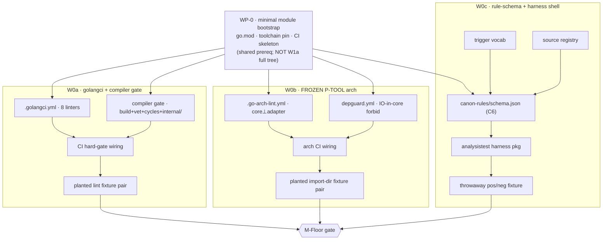
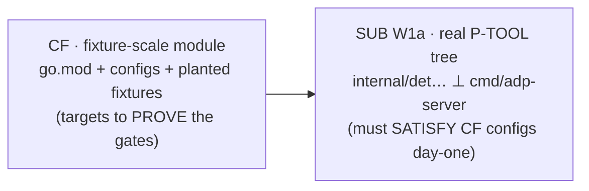

# ADP 2.0 — Phase CF Work Breakdown (canon floor)

> CTO WBS. Decomposes Phase CF (roadmap §2, waves W0a–W0c) into work-packages (WP) + candidate atomic tasks for downstream implementers. Phase CF = **tier-1 BORROWED canon floor**: dissolve no-canon paradox (inventory §13 / D10 / OP0) by landing off-the-shelf governance at commit 0, BEFORE first hand-written engine Go line. Cost ≈ config + adopt-frozen; ZERO rule authoring. Gates every Go commit after.
> Source: `00-design/02-roadmap.md` §2, `00-design/01-build-order.md` §3 (P0-pre) + §4 + §7, `00-design/00-build-inventory.md` §13 + K-W0/W1/W2 + §3 (P-TOOL layout).
> Delivery root: `_adp-2.0/_deliverables/adp-2.0-code/` (engine SOURCE repo, BD BP1; ≠ deployed build). ALL sentinel paths below relative to this root.
> Register: caveman; structural data (ids, paths, tool names, schema keys, linter names) literal.

---

## 0. CF mission + exit

| | |
|---|---|
| **Mission** | governance exists + gates from commit 0. Paradox = engine is Go, must obey Go canon, canon does not exist yet (BULK produces it) → circular. Fix = canon has 2 tiers, only tier-2 missing. CF lands tier-1 (borrowed). |
| **What CF is** | config + adopt-frozen + harness shell. golangci stack · compiler gate · FROZEN P-TOOL arch (depguard + go-arch-lint) · rule-schema + analysistest harness shell. |
| **What CF is NOT** | NO authored rules (tier-2 = BULK W5d–f). NO engine business logic. NO full pkg tree (= SUB W1a). NO embed.FS/schemas.lock plumbing (= SUB W1c). See §7 boundary. |
| **Exit gate** | **M-Floor** — CI rejects planted lint violation + planted import-direction violation; analysistest harness green on throwaway pos/neg fixture. Operator-run (D39). On fail: fix config; NO engine code lands. |
| **Cost / confidence** | ~1 cheap step on critical path (config-only). High confidence — borrowed, pre-grounded, zero authoring. |

CF gates everything after it (roadmap §1): no Go commit lands without floor green. Sentinel-on-disk alone does NOT satisfy a wave — discriminator (canon-clean) must also hold.

---

## 1. Intra-phase dependency graph

Waves W0a/W0b/W0c list deps `—` at wave granularity (roadmap §2): mutually independent, parallelizable. BUT all three share ONE implicit prerequisite — a minimal module to host configs + run linters/tests against. Surfaced as **WP-0 (module-bootstrap micro-step)**, distinct from SUB W1a full skeleton (§6 chicken-egg).



Lanes after WP-0: **W0a ∥ W0b ∥ W0c** run concurrent. Single join = M-Floor.

---

## 2. WP-0 — minimal module bootstrap (shared prereq)

Resolves commit-0 chicken-egg: linters/arch-lint/analysistest need a Go module + lint target to run. CF ships MINIMAL module (host for configs + fixtures), NOT the real P-TOOL tree (SUB W1a).

| WP | Deliverable | Sentinel (path) | Depends | Acceptance |
|---|---|---|---|---|
| **WP-0** | minimal module + toolchain pin + CI skeleton | `go.mod` · `go.sum` · tool-dep manifest (`tools/tools.go` or `go.mod` tool directives) · `.github/workflows/canon-floor.yml` (skeleton) | — | `go build ./...` green on empty/stub module; CI skeleton runs + reports |

**Atomic-task seeds:**
- `go mod init` at delivery root; module path decided (e.g. `github.com/<org>/adp`).
- pin Go version (`go` directive + toolchain) — provenance for canon `go-version` field (W0c).
- pin linter tool versions reproducibly (tool-dep file / vendored bin / CI cache) — drift = false gate.
- CI workflow skeleton: trigger on push/PR; one job; Go setup + cache; placeholder steps W0a/b/c fill.

> **Boundary flag:** WP-0 module is fixture-scale ONLY. Full `internal/det… ⊥ cmd/adp-server` tree = SUB W1a. CF authors the configs that W1a's tree must then satisfy. Do NOT pull W1a forward.

---

## 3. W0a — golangci-lint stack + compiler gate

> Roadmap §2: sentinel `.golangci.yml` + CI workflow; discriminator = planted lint violation → CI red. Inv §13 m1, K-W0/W2. Tier-1 borrowed = the decorrelated second opinion (risk #10) from line 0.

| WP | Deliverable | Sentinel | Depends | Acceptance (both-directions) |
|---|---|---|---|---|
| **A2** | `.golangci.yml` — enable 8 linters: `staticcheck` · `govet` · `gosec` · `errcheck` · `ineffassign` · `unused` · `gocritic` · `revive` | `.golangci.yml` | WP-0 | clean tree → golangci exit 0 |
| **A3** | compiler gate — `go build ./...` + `go vet ./...`; enforce no import cycles + `internal/` visibility (compiler-native, free) | gate step in `canon-floor.yml` | WP-0 | clean tree → build+vet exit 0 |
| **A4** | CI HARD-gate wiring — golangci + compiler as blocking job (fail = red, blocks merge); pinned linter version | `.github/workflows/canon-floor.yml` (lint job) | A2, A3 | gate job present + blocking |
| **A5** | planted-lint fixture pair (clean copy PASS / defect copy FAIL) | `_canon-floor/lint/{clean,planted}/` | A4 | clean → CI green · planted → CI **red** |

**Atomic-task seeds:**
- author `.golangci.yml`: `linters.enable` exact 8; `issues.max-issues-per-linter: 0` + `max-same-issues: 0` (no silent truncation); fail-on-any.
- decide per-linter settings (gosec severity, revive ruleset, gocritic enabled-checks) — keep minimal/default tier-1; document choices.
- compiler gate: cycles + `internal/` are compiler-native — assert `go build ./...` covers them; add `go vet` for shadow/printf/etc.
- CI: cache modules + lint bin; mark job required (branch protection note for operator).
- fixture: ONE planted violation per representative linter class (e.g. unchecked-error for `errcheck`, ineffassign sample) — minimal, deterministic, documents which linter fires.

> **Decision (atomic-task):** `gosec` overlaps SUB security concerns — keep at tier-1 defaults; no custom rules (those = BULK GC-SEC). `revive`/`gocritic` config kept lean to avoid premature tier-2 authoring.

---

## 4. W0b — FROZEN P-TOOL arch profile (depguard + go-arch-lint)

> Roadmap §2: sentinel `depguard.yml` + `.go-arch-lint.yml`; discriminator = planted import-direction violation → CI red. Inv §13 m2, K-W1, layout §3. Architecture pre-frozen in input — hardest decisions done; adopt, don't re-derive.

P-TOOL invariants to encode (inv §3 / §13 m2): core⊥adapter · package-by-domain · consumer-side interfaces · acyclic deps · no global mutable state · atomic writes · context-closed invocation · IO-free core (no IO imports in `internal/det…`/core; protocol details never leak inward).

| WP | Deliverable | Sentinel | Depends | Acceptance (both-directions) |
|---|---|---|---|---|
| **B1** | `.go-arch-lint.yml` — encode P-TOOL layers + allowed dep directions (core ⊥ adapter; adapter→core only; acyclic) | `.go-arch-lint.yml` | WP-0 | clean fixture tree → arch-lint exit 0 |
| **B2** | depguard config — forbid IO/protocol imports inside core; allowlist per layer | `depguard.yml` (or `depguard` block in `.golangci.yml`) | WP-0 | clean → exit 0 |
| **B3** | arch CI wiring — go-arch-lint + depguard blocking in `canon-floor.yml` | `canon-floor.yml` (arch job) | B1, B2 | gate job present + blocking |
| **B4** | planted import-direction fixture pair (core importing adapter/IO = defect) | `_canon-floor/arch/{clean,planted}/` | B3 | clean → green · planted (core→adapter or IO-in-core) → **red** |

**Atomic-task seeds:**
- map P-TOOL layout §3 → go-arch-lint `components` + `deps` rules (name layers: `core` = `internal/...`, `adapter` = `cmd/adp-server`, `cli` = `cmd/adp`).
- depguard rules: deny `net/http`, `os`-IO, MCP/protocol pkgs inside core packages; allow in adapter.
- **placement decision (atomic-task):** depguard runs as a golangci linter → could fold into `.golangci.yml`. Roadmap names `depguard.yml` separate sentinel. CHOOSE: standalone `depguard.yml` referenced from golangci, OR inline block. Honor named sentinel either way; document.
- fixture tree = fixture-scale package pair (tiny `internal/core` + `cmd/adapter` stub) proving direction enforcement — NOT the real W1a tree.
- encode acyclic via compiler (W0a A3) + go-arch-lint structural check — note overlap, both retained (defense-in-depth).

> **Boundary flag:** go-arch-lint needs packages to check directions. CF ships fixture-scale stubs ONLY. The real tree (W1a) must SATISFY this config day-one (roadmap §3: "core⊥adapter boundary arch-lint green").

---

## 5. W0c — rule-schema + trigger vocab + source registry + analysistest harness shell

> Roadmap §2: sentinel `canon-rules/schema.json` + harness pkg; discriminator = analysistest green on throwaway pos/neg fixture. Inv §13, K-W0. **NO rules yet** — this is the HOME tier-2 rules land in later (BULK W5d–f), proven empty.

Rule schema shape (C6, inv K-W0): `{id, body, triggers{imports, symbols, AST, task-class, glob}, severity, provenance{url, go-version}, TTL, fixture-ref}`.

| WP | Deliverable | Sentinel | Depends | Acceptance |
|---|---|---|---|---|
| **C1** | `canon-rules/schema.json` — C6 rule schema (JSON Schema for tier-2 rule entries) | `canon-rules/schema.json` | C2, C3 | schema validates a hand-written sample rule entry; rejects malformed |
| **C2** | trigger vocab — enumerate allowed trigger keys + value shapes (`imports`/`symbols`/`AST`/`task-class`/`glob`) | embedded in `schema.json` (enum/`$defs`) | WP-0 | vocab closed-set; unknown trigger key → schema reject |
| **C3** | source registry — provenance source list shape (`url` + `go-version` grounding) | `canon-rules/sources.json` (or `$defs` in schema) | WP-0 | sample provenance validates |
| **C4** | analysistest harness pkg — `golang.org/x/tools/go/analysis/analysistest` runner; throwaway analyzer; NO real rule | `internal/canon/analysistest/` (pkg) | C1 | `go test ./internal/canon/...` green |
| **C5** | throwaway pos/neg fixture (testdata) proving harness fires + stays silent correctly | `internal/canon/analysistest/testdata/{pos,neg}/` | C4 | analysistest green: pos → diagnostic, neg → silent |

**Atomic-task seeds:**
- author `schema.json`: required `id`, `body`, `triggers`, `severity`, `provenance`; optional `TTL`, `fixture-ref`. `triggers` = object, ≥1 of the 5 keys.
- trigger vocab: closed enum of the 5 trigger types; document each (`imports`=import-path match, `symbols`=ident match, `AST`=node pattern, `task-class`=ADP class, `glob`=path glob).
- source registry: shape carrying primary-source `url` + `go-version` (CP1 ground-beats-consensus provenance).
- harness shell: throwaway analyzer (e.g. flags a marker comment) wired through `analysistest.Run`; proves pos/neg both directions BEFORE any real rule exists.
- **id-scheme decision (atomic-task):** reserve `GC-*` id namespace (GC-ERR/CONC/CTX/RES/SEC/IFACE/…); schema validates pattern; do NOT author rule bodies.

> **Lock/embed discipline (forward-link):** `schema.json` is a frozen-class artifact (generated-frozen rules, CLAUDE.md). At CF it is authored + hash-recorded. embed.FS + `schemas.lock` plumbing = SUB W1c — do NOT build here; note the link so W1c wires it.

---

## 6. Commit-0 chicken-egg — explicit resolution

Tension: roadmap lists CF "commit 0" but full Go module skeleton = SUB W1a (after CF). Linters/arch-lint/analysistest CANNOT run with zero Go.

**Resolution (binds all implementers):**



- CF ships a MINIMAL module + fixture-scale packages — just enough for each gate to have a target + a planted-defect to go red against.
- CF authors the CONFIGS (golangci/arch/depguard/schema). The real tree (W1a) is written UNDER them.
- Do NOT pull W1a's full layout into CF. Do NOT defer CF configs to W1a. The configs precede the code they govern — that IS the paradox fix (OP0).
- Fixtures live under `_canon-floor/` (throwaway, may be pruned once W1a real tree exercises the gates) + analysistest `testdata/`. Flag for SUB: decide whether `_canon-floor/` fixtures retire or fold into regression suite.

---

## 7. Boundary — explicitly OUT of CF

| Item | Belongs to | Why not CF |
|---|---|---|
| Full P-TOOL pkg tree (`internal/det…` ⊥ `cmd/adp-server`) | SUB W1a | CF = configs only; tree written under them |
| `embed.FS` + `schemas.lock` plumbing | SUB W1c | CF authors schema; SUB wires embed+lock |
| `.adp/` containment | SUB W1b | unrelated to canon floor |
| MCP adapter / tool stubs | SUB W1e | no engine surface at CF |
| AUTHORED tier-2 rules (GC-ERR/CONC/CTX/RES/SEC/…) | BULK W5d–f | demand-driven from episodic telemetry; CF leaves rule-store EMPTY |
| episodic store / telemetry capture | MEM W3a | CF emits no telemetry yet (no engine running) |
| Godog / BDD acceptance | SPK W2a/k | acceptance oracle ≠ compliance oracle; CF = compliance floor only |
| golden-regression in pack | BOOT W4b | CF predates pack |

Two-oracle split intact (inv §13): CF bootstraps the **canon-COMPLIANCE** oracle (go/analysis + linters + arch). The **ACCEPTANCE** oracle (Godog, §4-P) is SPK — never conflated here.

---

## 8. M-Floor gate — aggregate exit (operator-run, D39)

CF done ⟺ ALL three discriminators hold simultaneously. **Agent NEVER runs the proof — operator runs it** (CLAUDE.md IRON LAW D39). Agent hands copy-pasteable steps + exact expected output; operator executes from clean checkout, observes, signs off.

| Leg | Discriminator | Expected |
|---|---|---|
| lint (W0a) | run gate on clean fixture, then planted | clean → green · planted → **red** |
| arch (W0b) | run arch+depguard on clean fixture, then planted import-direction defect | clean → green · planted → **red** |
| harness (W0c) | `go test ./internal/canon/...` | analysistest **green** (pos fires, neg silent) |

**Operator repro skeleton (CF supplies exact commands at gate time):**
```
cd _adp-2.0/_deliverables/adp-2.0-code
# leg 1 — lint both-directions
golangci-lint run ./_canon-floor/lint/clean/...     # expect: 0 issues (green)
golangci-lint run ./_canon-floor/lint/planted/...   # expect: ≥1 issue, exit 1 (red)
# leg 2 — arch both-directions
go-arch-lint check                                  # clean tree: pass
#   (then point at planted import-direction fixture) # expect: violation, exit 1
# leg 3 — analysistest harness
go test ./internal/canon/...                        # expect: PASS
```

On any leg fail: HALT. Fix config. No engine code (SUB) starts until M-Floor green. Milestone M-Floor (roadmap §8) = "foundation canon-governed before any engine code."

> Per IRON LAW: build-time agent self-run during authoring is NOT the demo. The demo operator signs off = operator-reproduced from clean checkout. Acceptance demo gold standard (CLAUDE.md): fresh session; but CF is config/gate-level (no MCP surface yet) → operator runs the CI gate + commands above as the floor proof.

---

## 9. CF-specific risks

| # | Risk | Mitigation in CF |
|---|---|---|
| R-CF1 | linter version drift → false gate (passes locally, fails CI or vice-versa) | WP-0 pins tool versions reproducibly; CI uses pinned bin |
| R-CF2 | premature tier-2 authoring (custom revive/gocritic/gosec rules creep in) | tier-1 defaults ONLY; custom rules = BULK; §3 decision note |
| R-CF3 | go-arch-lint/depguard need packages → temptation to pull W1a forward | fixture-scale stubs only; §6 boundary binds it |
| R-CF4 | depguard sentinel ambiguity (standalone file vs golangci block) | §4 atomic-task: choose + document; honor named sentinel |
| R-CF5 | analysistest harness "green with no rules" mistaken for "rules exist" | C5 throwaway pos/neg PROVES harness fires; rule-store explicitly EMPTY (§7) |
| R-CF6 | `_canon-floor/` planted fixtures linted by the real gate later (false red on intentional defects) | exclude `_canon-floor/planted/` from main lint scope; SUB decides retire/fold (§6) |
| R-CF7 | schema.json drifts from future generator (generated-frozen, CLAUDE.md) | record hash at CF; SUB W1c wires generator + deep-equal selftest; forward-link in §5 |

---

## 10. Ordering + parallelization within CF

```mermaid
gantt
    title Phase CF — intra-phase wall-clock (relative)
    dateFormat X
    axisFormat %s
    section Prereq
    WP-0 module bootstrap   :wp0, 0, 1
    section Parallel lanes
    W0a golangci+compiler   :a, after wp0, 2
    W0b P-TOOL arch         :b, after wp0, 2
    W0c rule-schema+harness :c, after wp0, 2
    section Gate
    M-Floor (operator-run)  :milestone, m, after a, 0
```



- **WP-0 first** (shared prereq), then **W0a ∥ W0b ∥ W0c** (independent, roadmap deps `—`).
- Single join = M-Floor. Earliest demoable checkpoint of the whole ADP 2.0 build (roadmap §8 M-Floor).
- Critical-path contribution: ~1 cheap config step (build-order §4) — cheapest + FIRST; converts everything downstream ungoverned→governed.

---

## 11. Downstream — atomic-task production handoff

This WBS feeds the atomic-task author. Per work-package, an atomic task carries: `id` (CF-W0{a,b,c}-{WP}), deliverable, sentinel path (under delivery root), depends-on edges (§1 graph), both-directions acceptance (§3–5 tables), and the atomic-task seeds (bullet lists). M-Floor (§8) = phase-exit gate every task rolls up to. Boundary (§7) + risks (§9) bind scope so no task leaks into SUB/BULK.

Thread: CF emits no `R→AC→…→commit` artifacts (no engine feature) — it lands the GATES those threads later run through. First threaded code = SPK.
