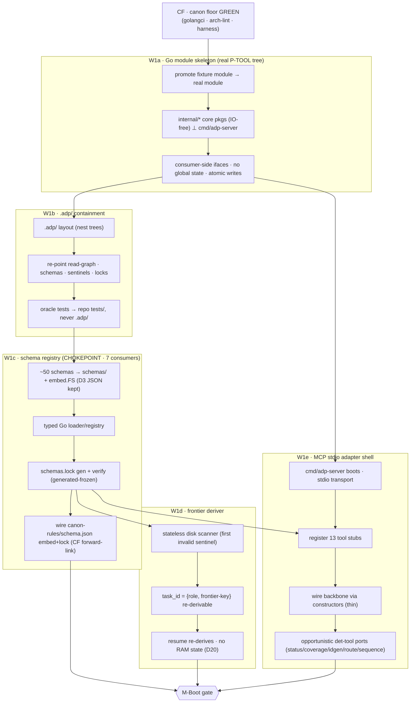

# ADP 2.0 — Phase SUB Work Breakdown (substrate)

> CTO WBS. Decomposes Phase SUB (roadmap §3, waves W1a–W1e) into work-packages (WP) + candidate atomic tasks for downstream implementers. Phase SUB = **critical-path substrate**: Go module + `.adp/` containment + schema registry + frontier deriver + MCP adapter shell. Zero upstream, maximal downstream fan-out (OP3) — blocks everything. Written UNDER the canon floor (CF, every commit gated), never before it.
> Source: `00-design/02-roadmap.md` §3 + §1 + §8 (M-Boot), `00-design/01-build-order.md` §P0 (0.1–0.4) + §B.1 + §9 (chokepoint), `00-design/00-build-inventory.md` §3 (P-TOOL layout) + subsystems A·E·F·L + §13 (canon paradox) + D3/D20.
> Delivery root: `_adp-2.0/_deliverables/adp-2.0-code/` (engine SOURCE repo, BD BP1; ≠ deployed build). ALL sentinel paths below relative to this root.
> Register: caveman; structural data (ids, paths, tool names, schema keys, pkg names) literal.

---

## 0. SUB mission + exit

| | |
|---|---|
| **Mission** | lay the load-bearing floor every later wave imports: real P-TOOL pkg tree · `.adp/` containment · embedded+locked schema registry · stateless frontier deriver · booting MCP adapter. SUB has no upstream; everything (SPK, MEM, BOOT, BULK) imports it. |
| **What SUB is** | the REAL tree CF's configs govern. `internal/*` IO-free core ⊥ `cmd/adp-server` thin adapter (§3 layout). Schema = the chokepoint (7 downstream consumers, build-order §9). Frontier = stateless disk scan, resume re-derives (D20). Adapter shell boots + registers tool stubs; native `mcp__adp__*` reachable. |
| **What SUB is NOT** | NO `adp_task`/`adp_answer` composing logic (= SPK W2e/h). NO form/context/validate/derive business logic (= SPK). NO authored canon rules (= BULK W5d–f). NO episodic store (= MEM W3a). NO Godog/BDD (= SPK W2k). NO pack/deploy (= BOOT). Adapter = SHELL + stubs + opportunistic pure-port det tools only. See §8 boundary. |
| **Exit gate** | **M-Boot** — `adp-server` connects fresh session; `mcp__adp__status` returns disk frontier; schemas embedded+locked; frontier scans disk; canon floor green on ALL of it. Operator-run (D39). On fail: fix substrate; NOTHING downstream starts. |
| **Cost / confidence** | ~3 sequential steps on critical path (roadmap §7). Mixed confidence — det-tool ports high (pure §7); schema/frontier port medium; `.adp/` containment = the one cross-lane hazard (re-points every path-reader). |

SUB gated by CF every commit (roadmap §1): no Go line lands without golangci + arch-lint green. Sentinel-on-disk alone does NOT satisfy a wave — discriminator (canon-clean + the wave's own check) must also hold.

---

## 1. Intra-phase dependency graph

Roadmap §3 deps: W1a←CF; W1b←W1a; W1c←W1b; W1d←W1c; W1e←W1a,W1c. Critical path = **W1a → W1b → W1c → W1d** (sequential). W1e forks off W1a+W1c → runs **parallel to W1d**. End of W1a also unblocks the parallel lanes (MEM W3a, BOOT — OUT of SUB, §8) but those are not SUB work-packages.



Lane shape: W1a→W1b→W1c strictly sequential (each re-points / embeds what the next reads). At W1c done, **W1d ∥ W1e** fork. Single join = M-Boot.

---

## 2. W1a — Go module skeleton (real P-TOOL tree)

> Roadmap §3: sentinel `go.mod` + pkg tree; discriminator = core⊥adapter boundary arch-lint green. Inv §3 layout. This is the REAL tree CF's configs (W0a/b) must pass day-one — CF authored configs against fixture-scale stubs (CF §6); W1a writes the production tree UNDER them.

P-TOOL invariants to realize (inv §3, must satisfy CF go-arch-lint + depguard): **pure deterministic core `internal/*` IO-free ⊥ thin protocol adapter `cmd/adp-server`** · package-by-domain · consumer-side interfaces · acyclic deps · no global mutable state · atomic writes · context-closed invocation (each call self-contained) · protocol details never leak inward.

| WP | Deliverable | Sentinel | Depends | Acceptance |
|---|---|---|---|---|
| **A1** | promote CF fixture-scale module → real module (decided path, e.g. `github.com/<org>/adp`); retire/fold `_canon-floor/` fixtures (CF §6 / R-CF6 decision) | `go.mod` (real path) | CF | `go build ./...` green; CF gates still green |
| **A2** | full `internal/*` core pkg tree (IO-free) ⊥ `cmd/adp-server` + `cmd/adp`, per §3 layout: `backbone·frontier·context·form·validate·derive·schema·promote·memory/{episodic,semantic,promotion,priming,statedep}·elicit·canon·doctrine` + `schemas/·canon-rules/·io/·tools/pack/` | pkg tree on disk | A1 | `go vet ./...` green; pkgs compile empty/stub |
| **A3** | P-TOOL discipline scaffolds — consumer-side interface stubs, atomic-write helper, context-closed call shape, NO global mutable state | `internal/` skeletons | A2 | **core⊥adapter arch-lint green** (CF W0b config); depguard: zero IO/protocol import in `internal/*` core |

**Atomic-task seeds:**
- decide module path; `go mod init`; reconcile with CF WP-0 placeholder path (one path forward, document).
- materialize §3 layout exactly — package-by-domain dirs; `cmd/adp` thin (init·pack·deploy CLI), `cmd/adp-server` thin (MCP adapter); skip `/pkg` (GC App C: cargo-cult).
- **layout-name discrepancy (atomic-task decision):** roadmap §3 W1a writes `internal/det…`; inv §3 layout has NO `internal/det…` — core pkgs are `internal/{backbone,frontier,…}`. RESOLVE: follow inv §3 named pkgs; map CF go-arch-lint `core = internal/...` layer onto them; document the rename so CF config + tree agree.
- atomic-write helper (temp+rename) — P-TOOL "non-atomic writes" forbid; one home, all writers use it.
- consumer-side interfaces — each consumer declares the narrow iface it needs; no upstream "interface package" (Go idiom; satisfies acyclic).
- assert `internal/` visibility + acyclic via compiler (CF A3) AND go-arch-lint structural (CF B1) — defense-in-depth, both retained.

> **Boundary flag:** A2 ships pkg skeletons + signatures ONLY. The handler/business logic inside `backbone·form·context·validate·derive` = SPK W2*. SUB stubs the homes; SPK fills them. Do NOT pull SPK logic forward.

---

## 3. W1b — `.adp/` containment migration

> Roadmap §3: sentinel `.adp/` root populated; discriminator = all path-readers target `.adp/`. Inv L. **The one cross-lane hazard** (roadmap §3 note, build-order §B.1/OP-rec): re-points the paths frontier/context/schema layers read. Pulled INTO SUB (before schema W1c) so every reader targets `.adp/` day-one — cheaper than re-pointing later.

| WP | Deliverable | Sentinel | Depends | Acceptance |
|---|---|---|---|---|
| **B1** | `.adp/` containment layout — nest flat trees (`.aprd·.adr·.hld·.roadmap·.build·.audit·_streams`) under single `.adp/` root | `.adp/` populated | A3 | layout doc + nested tree present |
| **B2** | re-point ALL path-readers — read-graph (`io/io-manifest.json`), schema loader roots, sentinel paths, lock paths — to `.adp/`-relative | path constants in `internal/*` | B1 | grep: zero reader resolves a pre-containment flat root |
| **B3** | test-residence rule — oracle/golden tests land in repo `tests/`, NEVER inside `.adp/` (inv L) | `tests/` convention doc | B1 | no test artifact written under `.adp/` |

**Atomic-task seeds:**
- define canonical `.adp/` subtree map; one home per tree; document as the path contract every later wave honors.
- centralize `.adp/`-relative path constants (one home — single `paths` source) so W1c schema loader + W1d frontier read the SAME roots; no scattered string literals.
- read-graph (`io-manifest.json`) is RETAINED (inv C) but its roots re-point to `.adp/`; the read+inline-vs-pointer job (inverting it) = SPK W2c context assembler, NOT here.
- test-residence: oracle/golden fixtures + selftests under repo `tests/`; `.adp/` holds deliverable trees only — keeps disposable-workspace clean (J·P0 episodic durable-ledger exception is MEM, not this).

> **Boundary flag:** W1b re-points PATHS only. It does NOT build the context-assembler inversion logic (SPK W2c) nor the pack/deploy that consumes `.adp/` (BOOT W4a/c). Land containment early = BOOT starts at pack with no re-point rework (roadmap §5 note).

---

## 4. W1c — schema registry + loader + embed.FS + `schemas.lock` (THE CHOKEPOINT)

> Roadmap §3: sentinel `internal/schema/` + `schemas.lock`; discriminator = ~50 schemas embed + lock verify (D3 JSON kept). Inv E. **Chokepoint: 7 of the next items depend on it** (build-order §9) — incl. `bdd-feature` (SPK W2a), form (W2b), context (W2c), validate (W2f), derivers (W2g). Build solid + locked FIRST; it gates the widest fan-out.

| WP | Deliverable | Sentinel | Depends | Acceptance |
|---|---|---|---|---|
| **C1** | ~50 JSON schemas land in `schemas/`; embed via `embed.FS` into binary (D3: schemas STAY JSON; Go gets typed VIEW only, JSON is source of truth) | `schemas/*.json` + `embed.FS` directive | B3 | `go:embed` resolves all ~50 at build; binary self-contained |
| **C2** | typed Go schema loader/registry — from JS ad-hoc → typed registry (lookup by `schemaId`) | `internal/schema/` | C1 | registry returns each schema by id; unknown id → typed error |
| **C3** | `schemas.lock` generation + verify — generated-frozen discipline (amend GENERATOR, never frozen copy alone; CLAUDE.md); selftest deep-equal generated==frozen | `schemas.lock` | C2 | lock verify green; drift (hand-edit schema, stale lock) → verify RED |
| **C4** | wire `canon-rules/schema.json` embed + lock — CF authored + HASH-RECORDED it (CF §5 / R-CF7 forward-link); SUB wires embed.FS + lock + deep-equal selftest if generator-emitted | lock entry for `canon-rules/schema.json` | C3 | CF-recorded hash matches; selftest green |

**Atomic-task seeds:**
- port ~50 schemas verbatim (D3: no JSON→Go-struct rewrite of source; Go decodes to typed view, JSON remains canonical). Inventory the set; confirm count (~50).
- `embed.FS` at a single owner pkg (`internal/schema`); no scattered embeds.
- `schemas.lock` = manifest of `{schemaId → sha}`; GENERATOR emits it (not hand-maintained); selftest asserts generated==frozen (CLAUDE.md generated-frozen iron rule — canonical drift case CR-008). `_meta.json` / per-schema lock verify (inv E).
- **generated-frozen wiring (atomic-task):** identify the generator (embedded-constants + emit), wire `--write` regen + selftest deep-equal; document so future edits go through generator, never the frozen copy.
- C4 closes CF R-CF7 forward-link: CF left `canon-rules/schema.json` hash-recorded but NOT embedded/locked (embed+lock = SUB scope, CF §5 note). SUB embeds it + adds lock entry. Rule-store STAYS empty (bodies = BULK W5d–f).

> **Boundary flag:** W1c ships the registry + lock MECHANISM + the schema CONTENT. It does NOT build form projection (W2b), validation (W2f), or derivers (W2g) that READ schemas — those are SPK consumers. `bdd-feature` schema is NEW-design (SPK W2a), NOT ported here.

---

## 5. W1d — frontier deriver (stateless disk scan)

> Roadmap §3: sentinel `internal/frontier/`; discriminator = scans disk, derives frontier, no RAM state. Inv F, D20. `adp_task` (SPK W2e) cannot derive work without it. Forks off W1c (∥ W1e).

| WP | Deliverable | Sentinel | Depends | Acceptance |
|---|---|---|---|---|
| **D1** | stateless disk scanner — frontier = first `remaining_sequence` entry whose `done_sentinel` absent / schema-invalid on disk | `internal/frontier/` | C3 | scan returns frontier `{id,unit,class,schemaId}` from disk alone |
| **D2** | `task_id = {role, frontier-key}` re-derivable shape | id-shape in `frontier` | D1 | same disk state → same `task_id` (deterministic, re-derivable) |
| **D3** | resume re-derives — NO open-task RAM state; re-scan disk re-derives frontier (D20) | (covered by D1) | D1 | kill + re-run → identical frontier; no persisted RAM/tracker |

**Atomic-task seeds:**
- scanner walks `remaining_sequence`; per entry test `done_sentinel` present + schema-valid (uses W1c registry); first failing = frontier. No tracker, no DB.
- `task_id` derivation deterministic from `{role, frontier-key}` — pure function of disk state.
- **task_id collision (atomic-task FLAG, not resolved here):** concurrency/collision across parallel branches = risk #5, RESOLVED IN SPK before any parallel-branch work (roadmap §10, build-order §P1). SUB lands the re-derivable KEY SHAPE; SPK proves the frontier-key carries unit to disambiguate. Note the seam; do NOT build branch-concurrency logic in SUB.
- core IO-free tension: frontier MUST read disk → confine IO to a thin injected reader iface (consumer-side, A3), keep derivation logic pure + fixture-testable (CP3). Document the IO seam.

> **Boundary flag:** W1d derives the frontier. It does NOT assemble context (W2c), project forms (W2b), or compose the `adp_task` packet (W2e) — those are SPK. Frontier is an input to `adp_task`, built here standalone.

---

## 6. W1e — MCP stdio adapter shell + opportunistic det-tool ports

> Roadmap §3: sentinel `cmd/adp-server/main.go`; discriminator = native `mcp__adp__*` reachable. Inv A. Forks off W1a+W1c (∥ W1d). Server is a PASSIVE MCP stdio server (inv §4-I: driver lives host-side, NOT in module).

| WP | Deliverable | Sentinel | Depends | Acceptance |
|---|---|---|---|---|
| **E1** | `cmd/adp-server/main.go` — MCP stdio transport; server boots, handshakes | `cmd/adp-server/main.go` | A3 | server starts; MCP initialize handshake completes |
| **E2** | register 13 tool stubs (schema-described, no logic) | tool registry in adapter | C3, E1 | host lists 13 `mcp__adp__*` tools; each stub returns typed "unimplemented"/shell |
| **E3** | thin adapter wiring — backbone constructors injected; protocol stays at edge, core IO-free (A3 boundary) | constructor wiring in `main.go` | E2 | depguard: zero protocol import in `internal/*`; adapter-only |
| **E4** | opportunistic det-tool PORTS — high-confidence pure ports that de-risk adapter: `adp_status`·`adp_coverage`·`adp_idgen`·`adp_route`/`adp_route_tier`·`adp_sequence` (+`adp_classify_derive` if cheap) | ported handlers in `internal/backbone`+`internal/derive` | E3, D3 | `mcp__adp__status` returns REAL disk frontier (W1d); ported tools pass fixture tests |

**Atomic-task seeds:**
- pick MCP Go transport; stdio framing per spec; passive server (no model creds, no sampling — driver is host-side, inv §4-I/§10).
- **tool-count reconcile (atomic-task decision):** roadmap §3 says "13 tool stubs"; inv A registry lists ~15 names (`adp_task·adp_answer·adp_status·adp_next·adp_derive·adp_submit·adp_verdict·adp_promote·adp_branch·adp_coverage·adp_idgen·adp_route·adp_route_tier·adp_sequence·adp_classify_derive·adp_emit·adp_guard`). RESOLVE the canonical stub set + count; document. `adp_task`/`adp_answer` = STUBS only (logic = SPK W2e/h).
- `.mcp.json` registration entry so a fresh Claude Code session exposes `mcp__adp__*` natively (M-Boot demo wiring).
- **det-tool ports = the §7 high-confidence pure set** (build-order §P0, roadmap §3 note): `status/coverage/idgen/route/sequence` are pure deterministic — port to exercise the adapter end-to-end before SPK loads it. Each gets a fixture test (CP3). De-risks: proves transport + registry + core⊥adapter wiring on REAL handlers, not just stubs.
- keep adapter THIN — wires constructors, marshals MCP↔core; ZERO business prose (inv A). Logic lives in `internal/*`.

> **Boundary flag:** W1e = SHELL + stubs + pure-port tools. The composing tools (`adp_task`, `adp_answer`) get STUBS only; their logic + the form/context/validate/derive they call = SPK W2*. Elicitation/operator gates = inv H (BULK W5c). No Godog (SPK W2k).

---

## 7. Boundary — explicitly OUT of SUB

| Item | Belongs to | Why not SUB |
|---|---|---|
| `adp_task`/`adp_answer` composing logic | SPK W2e/W2h | SUB stubs the handlers; SPK fills the new read/write surface |
| form projector · context assembler · shape-validator · derivers logic | SPK W2b/c/f/g | SUB stubs pkg homes; SPK authors the business logic |
| `bdd-feature` schema | SPK W2a | NEW-design, not a ~50-schema port; lands in spike |
| doctrine / role templates | SPK W2d (+ BULK W5a) | no role doctrine in substrate |
| episodic store + telemetry capture | MEM W3a | durable-ledger exception; SUB emits no run telemetry |
| Godog / BDD acceptance | SPK W2k | acceptance oracle ≠ M-Boot wiring check |
| pack · manifest · deploy (`adp init`) | BOOT W4a/c | SUB lands `.adp/` containment; pack consumes it later |
| AUTHORED canon rules (GC-*) | BULK W5d–f | demand-driven from episodic telemetry; rule-store stays empty |
| thin host driver · `/adp-*` surface | SPK W2i / BULK W5b | driver host-side (inv §4-I), not in Go module |
| task_id branch-concurrency / collision resolution | SPK (risk #5) | SUB lands re-derivable key shape; SPK proves disambiguation |

Two-oracle split intact (inv §13): SUB is pure substrate — touches NEITHER oracle's logic. CF holds the canon-COMPLIANCE floor (gates SUB); the ACCEPTANCE oracle (Godog) is SPK. M-Boot = a build-time WIRING check, not an acceptance demo.

---

## 8. M-Boot gate — aggregate exit (operator-run, D39)

SUB done ⟺ ALL legs hold simultaneously, canon floor green throughout. **Agent NEVER runs the proof — operator runs it** (CLAUDE.md IRON LAW D39). Agent hands copy-pasteable steps + exact expected output; operator executes, observes, signs off. **Gold standard: a FRESH Claude Code session loading registered `.mcp.json`, calling `mcp__adp__*` natively** (CLAUDE.md acceptance-demo rule) — the only thing proving the full host wiring.

| Leg | Discriminator | Expected |
|---|---|---|
| boot (W1e) | fresh session connects `adp-server` via `.mcp.json` | server handshakes; `mcp__adp__*` tools listed |
| frontier (W1d→W1e) | call `mcp__adp__status` natively | returns REAL disk frontier `{id,unit,class,schemaId}` |
| schema (W1c) | run lock verify | `schemas.lock` + `canon-rules/schema.json` lock verify GREEN; drift → RED |
| containment (W1b) | grep path-readers | every reader resolves `.adp/`-relative; zero flat-root |
| canon floor (CF, all) | golangci + arch-lint + depguard on whole real tree | GREEN (core⊥adapter; IO-free core) |

**Operator repro skeleton (SUB supplies exact commands + `.mcp.json` snippet at gate time):**
```
cd _adp-2.0/_deliverables/adp-2.0-code
# leg: canon floor on the REAL tree
golangci-lint run ./...            # expect: 0 issues
go-arch-lint check                 # expect: core⊥adapter pass
go build ./... && go vet ./...     # expect: clean (no cycles, internal/ respected)
# leg: schema lock
go test ./internal/schema/...      # expect: lock verify PASS; deep-equal generated==frozen
# leg: boot + frontier — NATIVE, fresh Claude Code session (gold standard)
#   register .mcp.json → adp-server, open fresh session, then:
#   call mcp__adp__status  → expect: real disk frontier object, NOT empty/error
```

On any leg fail: HALT. Fix substrate. NOTHING downstream (SPK / MEM / BOOT joins on substrate) starts until M-Boot green. Milestone M-Boot (roadmap §8) = "`adp-server` connects fresh session; `mcp__adp__status` returns disk frontier."

> Per IRON LAW: agent build-time self-run during authoring is NOT the demo. Raw-protocol piping (`printf … | node`/direct spawn) = build-time check only — bypasses host wiring, NOT acceptance. The demo operator signs off = fresh-session native `mcp__adp__*` call.

---

## 9. SUB-specific risks

| # | Risk | Mitigation in SUB |
|---|---|---|
| R-SUB1 | `.adp/` containment re-point misses a reader → split-brain paths (some flat, some nested) | W1b centralizes path constants (one `paths` home); B2 grep-asserts zero flat-root; land BEFORE schema so all readers nest day-one |
| R-SUB2 | schema chokepoint under-built → 7 SPK consumers blocked / churned | W1c FIRST + locked; verify ~50 embed + lock before W1d/W1e fork; D3 keeps JSON canonical (no lossy struct rewrite) |
| R-SUB3 | generated-frozen drift — hand-edit `schemas.lock`/`schema.json`, stale generator (CR-008 class) | C3/C4 wire generator + deep-equal selftest; edits go through generator, never frozen copy (CLAUDE.md iron rule) |
| R-SUB4 | IO leaks into core → kills fixture-testability + trips depguard | A3 consumer-side iface + injected reader; frontier/schema confine IO to thin seam; CF depguard catches leaks |
| R-SUB5 | `task_id` collision pulled forward / branch-concurrency speculation in SUB | D2 lands re-derivable KEY SHAPE only; collision resolution = SPK risk #5; §7 boundary binds it |
| R-SUB6 | layout-name mismatch (roadmap `internal/det…` vs inv `internal/{backbone,…}`) → CF arch-lint config disagrees with tree | A2 atomic-task resolves to inv §3 names; remap CF `core` layer; document so config + tree agree |
| R-SUB7 | tool-count ambiguity (13 stubs vs ~15 registry names) → registry drift | E2 atomic-task reconciles canonical stub set + count; document |
| R-SUB8 | adapter shipped as pure stubs → wiring unproven at M-Boot | W1e ports the §7 pure det tools (`status` etc.) so `mcp__adp__status` returns REAL frontier — exercises full transport+core path, not just empty stubs |
| R-SUB9 | CF `_canon-floor/` fixtures linted by real gate → false red on intentional defects | A1 closes CF R-CF6: decide retire-or-fold; exclude `_canon-floor/planted/` from main lint scope |

---

## 10. Ordering + parallelization within SUB

```mermaid
gantt
    title Phase SUB — intra-phase wall-clock (relative)
    dateFormat X
    axisFormat %s
    section Critical (sequential)
    W1a module skeleton      :a, 0, 2
    W1b .adp/ containment    :b, after a, 1
    W1c schema registry      :c, after b, 2
    W1d frontier deriver     :d, after c, 1
    section Parallel (off W1c)
    W1e MCP adapter shell    :e, after c, 2
    section Gate
    M-Boot (operator-run)    :milestone, m, after d, 0
```



- **W1a → W1b → W1c strictly sequential** — each re-points / embeds what the next reads (`.adp/` paths before schema roots before frontier sentinel scan).
- At **W1c done, W1d ∥ W1e fork** — frontier deriver + adapter shell independent; W1e also needs W1a (already done). Join = M-Boot.
- **End of W1a unblocks the parallel LANES** (MEM W3a, BOOT W4a) — roadmap §5; OUT of SUB scope (§8), noted as the fan-out point.
- Critical-path contribution: ~3 sequential steps (roadmap §7) — the substrate every later wave imports. Schema (W1c) = the chokepoint to build solid (build-order §9).

---

## 11. Downstream — atomic-task production handoff

This WBS feeds the atomic-task author. Per work-package, an atomic task carries: `id` (SUB-W1{a–e}-{WP}), deliverable, sentinel path (under delivery root), depends-on edges (§1 graph), acceptance (§2–6 tables), and the atomic-task seeds (bullet lists). M-Boot (§8) = phase-exit gate every task rolls up to. Boundary (§7) + risks (§9) bind scope so no task leaks into SPK/MEM/BOOT/BULK.

Seams forwarded OUT of SUB (carry as flags, do NOT build here): `adp_task`/`adp_answer` logic + form/context/validate/derive (SPK) · `bdd-feature` schema (SPK W2a) · task_id collision resolution (SPK risk #5) · episodic capture (MEM W3a) · pack/deploy over `.adp/` (BOOT) · authored canon (BULK). Seams CLOSED here from CF: real tree satisfies CF configs (CF §6); `canon-rules/schema.json` embed+lock wired (CF R-CF7); `_canon-floor/` fixture retire/fold decided (CF R-CF6).

Thread: SUB still emits no `R→AC→…→commit` artifacts (no engine feature) — it lands the surface those threads later run through. First threaded code = SPK.
