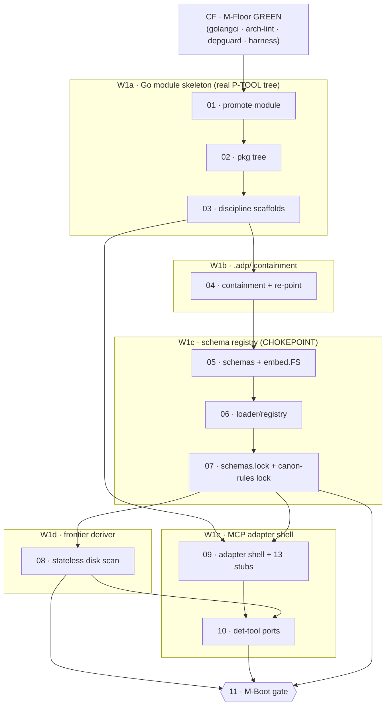

# Phase SUB — atomic task index (substrate)

> Index for Phase SUB atomic-task set. Decomposed from `01-build/01_01-phase-sub-wbs.md` (the WBS). Each task file SELF-CONTAINED — all context inline, no cross-reading needed. Register: caveman; structural data (ids, paths, tool/pkg names, schema keys) literal.

## Mission (why SUB exists)

SUB = critical-path substrate every later wave imports. Lays load-bearing floor: real P-TOOL Go pkg tree · `.adp/` containment · embedded+locked schema registry (~50 schemas, the chokepoint, 7 downstream consumers) · stateless frontier deriver · booting MCP stdio adapter shell. Zero upstream; maximal downstream fan-out (SPK·MEM·BOOT·BULK all import it). Written UNDER the canon floor (CF) — every Go commit gated by golangci + arch-lint + depguard.

SUB is NOT engine business logic. Stubs the pkg homes; SPK fills them. NO `adp_task`/`adp_answer` composing logic, NO form/context/validate/derive business logic, NO authored canon rules, NO episodic store, NO Godog, NO pack/deploy. See per-task Boundary sections.

Exit = **M-Boot** (operator-run, D39): fresh Claude Code session connects `adp-server` via `.mcp.json`; `mcp__adp__status` returns REAL disk frontier; schemas embedded+locked; frontier scans disk; canon floor green on ALL of it.

Delivery root: `_adp-2.0/_deliverables/adp-2.0-code/` (engine SOURCE repo; ≠ deployed build). Module path = `github.com/iiezhachenko/adp-2.0`. ALL sentinel paths relative to this root.

## Task list

| # | File | Covers WBS WP | Deliverable | Lane |
|---|---|---|---|---|
| 01 | `01_01_01-w1a-promote-module.md` | A1 | promote fixture module → real module; retire/fold `_canon-floor/` fixtures (R-CF6) | W1a |
| 02 | `01_01_02-w1a-pkg-tree.md` | A2 | full `internal/*` core ⊥ `cmd/*` pkg tree per §3 layout; resolve `det…` naming (R-SUB6) | W1a |
| 03 | `01_01_03-w1a-discipline-scaffolds.md` | A3 | P-TOOL discipline scaffolds — consumer-side ifaces · atomic-write helper · no global state | W1a |
| 04 | `01_01_04-w1b-adp-containment.md` | B1,B2,B3 | `.adp/` containment layout + centralize path constants + re-point readers + test-residence | W1b |
| 05 | `01_01_05-w1c-schemas-embed.md` | C1 | ~50 JSON schemas land in `schemas/` + `embed.FS` (D3: JSON stays canonical) | W1c |
| 06 | `01_01_06-w1c-loader-registry.md` | C2 | typed Go schema loader/registry (lookup by `schemaId`) | W1c |
| 07 | `01_01_07-w1c-schemas-lock.md` | C3,C4 | `schemas.lock` generated-frozen + wire `canon-rules/schema.json` embed+lock (R-CF7) | W1c |
| 08 | `01_01_08-w1d-frontier-deriver.md` | D1,D2,D3 | stateless disk-scan frontier deriver; re-derivable `task_id`; resume re-derives | W1d |
| 09 | `01_01_09-w1e-adapter-shell.md` | E1,E2,E3 | `cmd/adp-server` MCP stdio shell + 13 tool stubs + thin wiring + `.mcp.json` (R-SUB7) | W1e |
| 10 | `01_01_10-w1e-dettool-ports.md` | E4 | opportunistic pure det-tool ports (`status·coverage·idgen·route·sequence`) | W1e |
| 11 | `01_01_11-mboot-gate.md` | M-Boot | aggregate exit gate (operator-run, fresh-session native MCP) | gate |

## Dependency graph

Order: **W1a (01→02→03) → W1b (04) → W1c (05→06→07) strictly sequential** (each re-points / embeds what the next reads). At **07 done, W1d (08) ∥ W1e (09→10) fork**. Single join = **M-Boot (11)**.

## Boundary — what SUB is NOT (binds every task)

| OUT | Belongs to | Why not SUB |
|---|---|---|
| `adp_task`/`adp_answer` composing logic | SPK W2e/h | SUB stubs handlers; SPK fills new read/write surface |
| form projector · context assembler · shape-validator · derivers LOGIC | SPK W2b/c/f/g | SUB stubs pkg homes; SPK authors business logic |
| `bdd-feature` schema | SPK W2a | NEW-design, not a ~50-schema port |
| doctrine / role templates | SPK W2d (+BULK W5a) | no role doctrine in substrate |
| episodic store + telemetry capture | MEM W3a | SUB emits no run telemetry |
| Godog / BDD acceptance | SPK W2k | acceptance oracle ≠ M-Boot wiring check |
| pack · manifest · deploy (`adp init`) | BOOT W4a/c | SUB lands `.adp/` containment; pack consumes it later |
| AUTHORED canon rules (GC-*) | BULK W5d–f | demand-driven from telemetry; rule-store stays EMPTY |
| thin host driver · `/adp-*` surface | SPK W2i / BULK W5b | driver host-side (inv §4-I), NOT in Go module |
| `task_id` branch-concurrency / collision resolution | SPK (risk #5) | SUB lands re-derivable KEY SHAPE; SPK proves disambiguation |

Two-oracle split intact: SUB = pure substrate, touches NEITHER oracle's logic. CF holds the canon-COMPLIANCE floor (gates SUB); the ACCEPTANCE oracle (Godog) = SPK. **M-Boot = build-time WIRING check, NOT an acceptance demo.**

## IRON LAW — operator runs every proof (D39)

Agent NEVER runs the demo/acceptance proof it presents. At every gate the agent hands the operator EXPLICIT copy-pasteable steps (exact commands + exact expected output), then STOPS. Operator executes, observes, signs off. Build-time agent self-run during authoring is NOT the demo. **Gold standard at M-Boot: a FRESH Claude Code session loading registered `.mcp.json`, calling `mcp__adp__*` natively** — the only thing proving full host wiring. Raw-protocol piping (`printf … | node`/direct spawn) = build-time check ONLY. Binds task 11.

## Downstream handoff

SUB emits no `R→AC→…→commit` thread artifacts (no engine feature) — it lands the surface those threads later run through. First threaded code = SPK. Seams forwarded OUT as flags (do NOT build here): `adp_task`/`adp_answer` logic + form/context/validate/derive (SPK) · `bdd-feature` schema (SPK W2a) · task_id collision (SPK risk #5) · episodic capture (MEM) · pack/deploy (BOOT) · authored canon (BULK). Seams CLOSED here from CF: real tree satisfies CF configs · `canon-rules/schema.json` embed+lock wired (R-CF7) · `_canon-floor/` fixture retire/fold decided (R-CF6).
