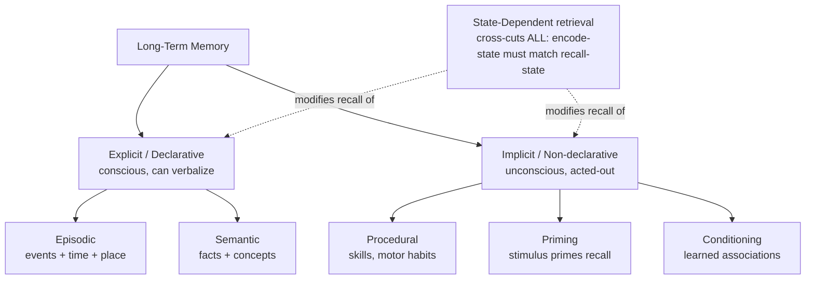
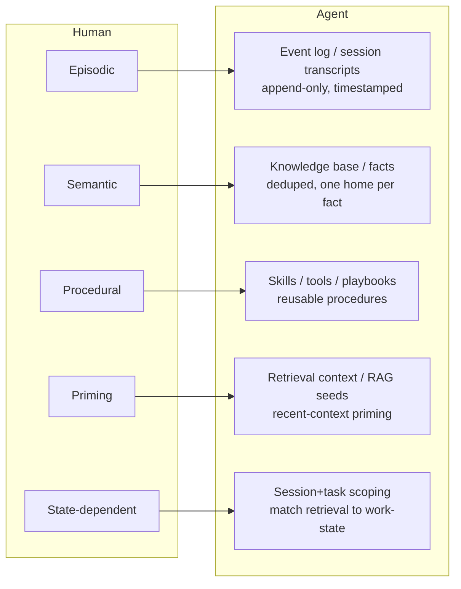
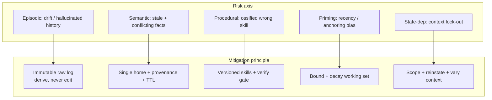

# Memory 101 — Types + Purpose

> Distilled from Magnetic Memory Method (Anthony Metivier). Source pages 403-blocked to bots (Cloudflare); substance is standard cognitive-psych taxonomy MMM teaches, cross-checked via search (SimplyPsychology, Wikipedia, Decision Lab). Lens: map human memory → agentic-system memory design.

## TL;DR

Human memory = many systems, not one store. Split first by **consciousness** (explicit vs implicit), then by **content** (episodic vs semantic), plus a **retrieval modifier** (state-dependent). Each system = different purpose, different failure mode. Agent memory should copy the split, not flatten to one vector blob.

## Taxonomy

## 1. Explicit (Declarative) memory

**What:** conscious, intentional recall. Can state it in words. "I know THAT."
**Purpose:** store retrievable facts + experiences for deliberate use.
**Split into episodic + semantic** (below).
**Encoding:** attention-heavy, effortful. **Brain:** hippocampus + neocortex.
**Failure:** forgetting, distortion, false memory.

### 1a. Episodic — events

- **What:** personal events tagged with time + place + emotion. "Mental time travel."
- **Example:** your first day at job; what you ate this morning.
- **Purpose:** reconstruct past, project future, build identity/continuity.
- **Fragile:** detail decays, gets rewritten on each recall (reconsolidation).

### 1b. Semantic — facts

- **What:** context-free knowledge. Facts, concepts, meanings, vocab.
- **Example:** "Paris = capital of France." Don't recall WHERE you learned it.
- **Purpose:** general world-model, language, reasoning substrate.
- **Stable:** distributed across neocortex; survives even when episodic damaged.
- **Link:** episodic often hardens INTO semantic over time (you forget the event, keep the fact).

## 2. Implicit (Non-declarative) memory

**What:** unconscious. Shows up in behavior, not in words. "I know HOW."
**Purpose:** automate action, perception, response — free up conscious bandwidth.
**Brain:** cerebellum, basal ganglia (not hippocampus-dependent).
**Robust:** survives amnesia that wipes explicit memory.

### 2a. Procedural — skills

- **What:** motor + cognitive skills run without thought. Bike, typing, walking.
- **Purpose:** offload practiced action to autopilot.
- **Built by:** repetition. Slow to form, very durable.

### 2b. Priming

- **What:** prior stimulus speeds/biases later recognition. See "yellow" → faster recall of "banana."
- **Purpose:** fast perceptual identification; cheap pattern shortcut.

### 2c. Conditioning (associative)

- **What:** stimulus→response learned by pairing (Pavlov). Emotional/reflex associations.
- **Purpose:** rapid threat/reward learning without reasoning.

## 3. State-Dependent (+ context-dependent) memory

- **What:** NOT a storage type — a **retrieval rule**. Recall improves when recall-state matches encode-state.
- **State** = internal (mood, caffeine, arousal). **Context** = external (place, smell, sound).
- **Example:** learn drunk → recall better drunk; study in room A → test better in room A.
- **Purpose (mechanism):** encoding binds the surrounding state as retrieval cues.
- **Use:** reinstate context to unlock stuck recall; vary study contexts to make memory robust.

## Quick compare

| System | Conscious? | Content | Durability | Brain | Failure mode |
|---|---|---|---|---|---|
| Episodic | yes | events+when+where | low (rewrites) | hippocampus | distortion, decay |
| Semantic | yes | facts/concepts | high | neocortex (distributed) | tip-of-tongue |
| Procedural | no | skills/motor | very high | cerebellum, basal ganglia | skill rust (slow) |
| Priming | no | perceptual bias | short | neocortex | mis-prime |
| Conditioning | no | associations | high | amygdala etc | maladaptive assoc |
| State-dependent | — (modifier) | cue-match | — | — | context mismatch → blank |

---

# Analysis + suggestions — map to agentic memory

Human split = blueprint for agent memory store. Flat "one big vector DB" loses the distinctions that make recall correct. Recommend mirroring:

**Mapping + design moves:**

1. **Episodic → event log.** Append-only, timestamped session/run records. Cheap to write, never authoritative for facts. Decays/compacts (summarize old runs). This repo: `.roadmap/` frontier records, run transcripts.

2. **Semantic → fact store.** Deduped, canonical, "one home per fact" (matches repo CLAUDE.md economy rule). Promote stable facts OUT of episodic logs into semantic store — same as human episodic→semantic hardening. This repo: `.adr/`, `.aprd/`, `.hld/`, `_playbooks/`.

3. **Procedural → tools/skills/playbooks.** Don't re-derive "how" each run; store executable procedure. Durable, repetition-built. This repo: `prompts/` library, skills.

4. **Priming → retrieval seeding.** Recent context biases next retrieval (RAG, working set). Useful but error source: stale prime → wrong recall. Bound it.

5. **State-dependent → scope retrieval to work-state.** Tag memories with task/context; recall by matching current task-state. Cross-context variety = robustness; over-fit to one context = blanks when context shifts. Practical: namespace memory by project/task, reinstate context to unblock recall.

**Failure-mode lessons for agents:**

- Episodic-style stores **distort on rewrite** → keep raw log immutable, derive summaries separately (don't overwrite source — matches repo immutability rule).
- Semantic store **must dedupe** → conflicting facts = retrieval ambiguity. One home per fact.
- Procedural memory **survives when declarative fails** → encode critical workflows as executable procedures, not prose an agent must re-reason each time.
- **State mismatch = recall failure** → if retrieval ignores task context, agent surfaces irrelevant memories. Always scope.

**One-line thesis:** separate stores by consciousness (log vs knowledge) and content (events vs facts vs skills), add context-scoped retrieval — copy biology, don't flatten.

---

# Biases, risks, tradeoffs per type — agent lens

Each memory system buys a capability AND imports its biology's failure mode. Below: what breaks, why, and design principle that mitigates.

## 1. Episodic (event log)

- **Bias:** reconstructive. Each recall rewrites — agent summaries-of-summaries drift from raw events.
- **Risks:** hallucinated history (agent "remembers" a decision never made); recency over-weighting; PII/secret accretion in logs; unbounded growth.
- **Tradeoffs:** rich raw detail ↔ cost/noise. Aggressive compaction = cheap but loses the evidence you later need to audit.
- **Mitigations:**
  - **Immutability** — raw log append-only; summaries are SEPARATE derived artifacts, never overwrite source (repo rule).
  - **Provenance + timestamps** — every claim traces to a run/source; "remembered" ≠ "happened" unless logged.
  - **Tiered compaction** — keep raw N recent, summarize old, but retain pointers to raw for audit.
  - **Redaction at write** — strip secrets/PII before persist.

## 2. Semantic (fact / knowledge store)

- **Bias:** confidence without source. Facts feel context-free, so agent trusts them past expiry.
- **Risks:** **stale facts** (API changed, file moved); **conflicting duplicates** → retrieval picks one at random; over-generalization (one case promoted to universal rule); poisoning (bad fact ingested, then cited as ground truth).
- **Tradeoffs:** dedup/canonicalize (clean recall) ↔ ingest cost + write contention. Strong promotion rules ↔ slower learning.
- **Mitigations:**
  - **One home per fact** (DRY) — no duplicate = no ambiguity (repo economy rule).
  - **Provenance + freshness/TTL** — fact carries source + as-of date; **verify before reuse** if cited fact names a file/flag/API (repo recall rule).
  - **Promotion gate** — episodic→semantic only when stable + corroborated, not on first sighting.
  - **Contradiction check on write** — new fact conflicts with stored → flag, don't silently dual-store.

## 3. Procedural (tools / skills / playbooks)

- **Bias:** automaticity = runs without re-checking. Wrong-but-practiced procedure executes confidently.
- **Risks:** **ossification** (skill encodes assumption that changed); silent skill rust (env drifts under it); negative transfer (procedure from domain A misfires in B); hard to introspect/debug (it just "does").
- **Tradeoffs:** automation speed ↔ adaptability. Durable skill = fast + repeatable, but the more baked-in, the costlier to correct.
- **Mitigations:**
  - **Versioned skills** — change = new version, not in-place mutate; rollback path.
  - **Verify gate** — skill validated clean-room against fixtures/oracle before promote (repo verify rule); known-good passes, planted-defect fails.
  - **Idempotent + observable** — procedures log what they did; no silent autopilot.
  - **Scope guard** — skill declares preconditions; refuse outside domain rather than misfire.

## 4. Priming (retrieval seeding / working set)

- **Bias:** recency + anchoring. Whatever's in context biases next retrieval, true or not.
- **Risks:** stale prime → wrong recall; prompt-injection priming (planted context steers behavior); availability bias (frequent ≠ correct); confirmation loop (agent retrieves what its current frame expects).
- **Tradeoffs:** seeding gives relevance + speed ↔ tunnel vision. Bigger working set = more context ↔ more noise + drift.
- **Mitigations:**
  - **Bound the working set** — fixed budget; evict by relevance, not just recency.
  - **Decay / TTL on primes** — old context loses weight automatically.
  - **Provenance gating** — untrusted/injected context can prime exploration, never authorize action.
  - **Diverse retrieval** — multi-angle fetch (not single query) to break confirmation loop.

## 5. State / context-dependent (scoped retrieval)

- **Bias:** cue-match. Recall only fires when retrieval-context resembles encode-context.
- **Risks:** **context lock-out** (memory written under task A invisible under task B → agent "forgets"); over-scoping (siloed, no cross-task transfer); under-scoping (wrong-context memory leaks in, irrelevant recall).
- **Tradeoffs:** tight scope = precise, low-noise recall ↔ poor generalization. Loose scope = transferable ↔ noisy, off-topic hits.
- **Mitigations:**
  - **Explicit scope tags** — namespace memory by project/task/session; retrieve by match.
  - **Context reinstatement** — to unblock recall, reconstruct encode-context as query cue.
  - **Encode across varied contexts** — store durable facts context-free (semantic) so they survive state shift; keep only the genuinely situational in scoped store.
  - **Two-pass retrieval** — scoped first (precision), then global fallback (recall) when scoped returns empty.

## Cross-cutting principles (apply to ALL)

1. **Separation of stores** — distinct failure modes need distinct stores + policies; one blob inherits every bias at once.
2. **LLM reconciles, never authors truth** — cheapest source first; model specializes canon, doesn't invent it (repo D-canon). Kills hallucinated-fact class.
3. **Write-path validation > read-path hope** — dedup, redact, contradiction-check, freshness-stamp AT WRITE. Cheaper than catching garbage on every read.
4. **Immutable source + derived views** — never edit history; derive summaries/indexes. Audit always possible.
5. **Verify before done** — any promoted memory (fact/skill) passes oracle both directions before trusted.
6. **Provenance everywhere** — every memory carries source + timestamp + trust level; ungrounded recall is a hypothesis, not a fact.

| Type | Headline bias | Worst risk | Key mitigation |
|---|---|---|---|
| Episodic | reconstructive drift | hallucinated history | immutable log + provenance |
| Semantic | stale confidence | conflicting/poisoned facts | one home + TTL + verify-on-use |
| Procedural | blind automaticity | ossified wrong skill | versioned + verify gate |
| Priming | recency/anchoring | injection / tunnel vision | bounded + decayed + gated |
| State-dependent | cue-match | context lock-out | scope tags + reinstate + fallback |

## Sources

- [Implicit Memory — MMM](https://www.magneticmemorymethod.com/implicit-memory/)
- [Explicit Memory — MMM](https://www.magneticmemorymethod.com/explicit-memory/)
- [State-Dependent Memory — MMM](https://www.magneticmemorymethod.com/state-dependent-memory/)
- [Episodic vs Semantic Memory — MMM](https://www.magneticmemorymethod.com/episodic-vs-semantic-memory/)
- Cross-check: [SimplyPsychology — Implicit vs Explicit](https://www.simplypsychology.org/implicit-versus-explicit-memory.html), [Wikipedia — Implicit memory](https://en.wikipedia.org/wiki/Implicit_memory), [Decision Lab — Implicit Memory](https://thedecisionlab.com/reference-guide/psychology/implicit-memory)
