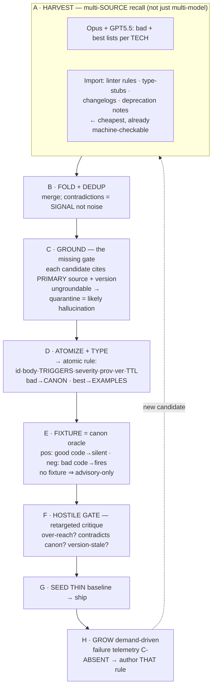

# 02h — Canon-Production SOP (bootstrap + grow)

> Procedural canon (playbook) for producing the canon rule store. Disarms CC8 cold-start from [[02f-problem-solution-critiques-concensus]]; output conforms to C6 typed-rule store ([[02-problem-solution-proposal]] §5.1) and P6 verify-both-directions. Referenced by [[02g-critique-disarm]] §6a/W4. Phases `A–H`. ID rules `CP*`.

## TL;DR

Canon = **trigger-indexed store of atomic, grounded, fixture-verified rules** — NOT a prose spec. Multi-model generation is a *recall* engine, never a *truth* signal (correlated errors, CC4). Three laws make output canon not docs: **ground beats consensus · every rule ships a fixture · seed thin, grow from failure**. Offline-strong plane (FIX1) authors it; the deterministic compiler activates it.

## 0. Why the naive flow fails

Naive flow (generate bad/best lists ×2 models → fold → spec → critique → recurse) is good *recall* but produces **documentation, not canon**. Five gaps:

| Gap | Why fatal | Phase that fixes |
|---|---|---|
| Output = prose spec, not typed triggered rules | compiler can't activate prose; can't fire on "imports pandas" (C6) | D Atomize+Type |
| Multi-model consensus treated as truth | Opus+GPT share priors → correlated, confidently-wrong-in-unison (CC4) | C Ground |
| Canon authored from weights = the distrusted parametric knowledge | poisons fleet at source (R8) | C Ground + E Fixture |
| No canon oracle — prose-on-prose critique only | rule plausible ≠ rule correct; can't gate (P6) | E Fixture |
| Speculative pre-generation | cold-start canon storm + dead rules (CC8); skips free machine-checkable sources | A (linter import) + G/H (demand-driven) |

Plus: **bad > best for this system.** Anti-pattern → concrete AST trigger → firing rule. "Best practice" → aspirational/contextual → poor trigger → noise. Route **bad → CANON rule**, **best → EXAMPLES slot** (golden in/out priming).

## 1. Pipeline A–H

### A — Harvest (recall, multi-source)
- Keep multi-model bad+best generation per TECHNOLOGY (Opus + GPT5.5). Diversity = better candidate recall.
- **Add non-model sources — the cheapest + already machine-checkable:** existing linters (ruff/eslint/golangci-lint/error-prone), type-stubs, library changelogs, deprecation notes. Many ARE rules already (carry their own AST matcher) → import, don't regenerate.
- Weight harvest toward **anti-patterns** (concrete, detectable) over aspirational best-practice prose.

### B — Fold + dedup
- Merge multi-source → combined candidate set. Dedup.
- **Cross-model/source disagreement = SIGNAL** (flag to ground), not a tie to average away.

### C — Ground (THE missing gate; CP1)
- Each candidate must cite a **primary source + version** (doc URL, changelog entry, linter rule id, type stub). 
- **Ungroundable claim → quarantine** — likely model hallucination. Cross-model agreement does NOT promote; primary-source citation promotes.
- This converts "what the models recalled" → "what is verifiably true for version X."

### D — Atomize + type (prose → rule store; CP2)
- Decompose into **atomic rules** (one rule = one home per fact, AB-style). 
- Each: `{id, terse body, triggers{libs, APIs/symbols, AST constructs, task-class, file-glob}, severity (MUST/SHOULD), provenance=source, version-bound, TTL}`.
- **Route by kind:** bad-practice → CANON firing rule; best-practice → EXAMPLES (golden in/out).
- Author triggers; auto-derive where source already encodes a matcher (linter-imported rules carry theirs — measure this auto-derivable fraction, CC8).

### E — Fixture = canon oracle (CP3)
- Every rule ships **executable pos + neg**: good code → rule silent; bad code → rule fires.
- **No fixture ⇒ advisory-only** (can't carry accept/reject authority). Mirrors P6 both-directions at canon level. This is what separates verified canon from a confident guess.

### F — Hostile gate (your critique step, retargeted)
- Adversarial pass × models, but aimed: **over-reach** (fires on valid code?), **contradiction** (conflicts existing canon → flag, don't dual-store), **staleness** (version moved?).
- Keeps steps 5–6 of the naive flow; gives them a falsification target instead of vibes.

### G — Seed thin → ship
- Baseline = linter-import + top grounded anti-patterns + always-on repo invariants. Ship that. Resist the urge to pre-author everything.

### H — Grow demand-driven (NOT speculative; CP4)
- New rules authored when **real telemetry hits C-ABSENT** (a task failed for lack of a rule) — not "as demand arises" in the abstract. Failure cites the gap → author THAT rule → back through C–F.
- Avoids dead-rule storm; keeps strong-model spend on rules that actually fire.

## 2. The four laws (CP*)

- **CP1 — Ground beats consensus.** Promote on primary-source citation + version, never on model agreement (correlated, CC4). Disagreement = investigate, not average.
- **CP2 — Canon is typed atomic rules, not prose.** A spec doc is an input; the deliverable is the trigger-indexed store (C6). Atomize always.
- **CP3 — Every rule ships a fixture.** Pos+neg executable, else advisory-only. P6 at canon level — the falsifiability bar.
- **CP4 — Seed thin, grow from failure.** Bootstrap = linter-import + top anti-patterns; everything else demand-driven from C-ABSENT telemetry (P8). No speculative mass-generation.

## 3. Governance (frozen-artifact class)

Canon = highest-stakes write (one bad rule contaminates every triggering task, R8). Already repo discipline:
- Versioned; provenance = source URL / failure-id; TTL forces re-validation (kills CC9 ossification + CC8 trigger-rot).
- Contradiction-check on merge; rollback path; change = new version via change-request, never in-place.
- Trigger curation is itself perpetual labor (CC8) — budget it as FTE at corpus × churn; maximize linter-auto-derivable fraction to shrink hand-tag.

## 4a. Worked application

Go canon, Opus-only → [[02i-go-canon-roadmap]] (clusters `GC-*`, step sequence `W0–W6`). Shows the single-model adaptation: no cross-model consensus → grounding + linters become the only truth checks; the **linter stands in as the decorrelated second opinion** the missing model would have provided.

## Bottom line

Naive multi-model loop = a recall engine. Bolt on **Ground (C)**, **Atomize+Type (D)**, **Fixture (E)** and it becomes a canon factory whose output the deterministic compiler can actually fire — verified, version-bound, falsifiable. Seed thin from linters; grow from real failures, not speculation.
