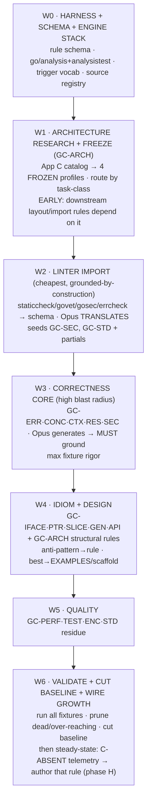

# 02i — Go Canon-Authoring Roadmap (Opus-only)

> Step sequence producing the Go canon rule store. Applies [[02h-canon-production]] phases A–H to Go; single generative model = Opus (GPT5.5 deferred, App E). Output conforms to C6 typed-rule store ([[02-problem-solution-proposal]] §5.1). Step IDs = waves `W0–W6` (cross-ref'd by 02g/02h); cluster IDs `GC-*` (App B); profile IDs `P-*` (App C). NOTE: content-authoring roadmap — distinct from `.roadmap/` (ADP product build frontier).

## TL;DR

Seed thin from Go's **machine-checkable linters** (staticcheck/govet/gosec = pre-grounded, pre-triggered), let Opus **translate not invent** there, then author the **semantic/idiom clusters** Opus must **ground against official docs** with executable fixtures. Single-model = no cross-model consensus → **grounding + linters are the only truth checks** (CP1 hardens). Ship a correctness-first baseline (~95–145 rules), grow the rest demand-driven from C-ABSENT telemetry (CP4). **Architecture researched + FROZEN early (W1, App C)** as **4 project-type profiles** (P-SVC service · P-LIB library · P-CLI tool · P-TOOL agentic/MCP — this project) — Go's package-by-domain / consumer-side-interface / acyclic-deps consensus, NOT a Python/Java layered-hexagonal port (Go anti-pattern). GC-ARCH rules route per profile.

---

## Standing constraints (apply to EVERY step)

### Single-Opus adaptation (vs 02h multi-model)

| 02h assumption | Single-Opus reality | Compensation |
|---|---|---|
| Multi-model recall (Opus+GPT) | Opus alone → fewer candidates surfaced | lean HARD on non-model sources (linters/docs) — out-recall a second LLM for Go, and grounded |
| Cross-model disagreement = signal | unavailable | drop consensus crutch; **CP1 ground-beats-consensus becomes ground-is-ONLY-truth** |
| Hostile gate = Opus vs GPT | Opus-vs-Opus = correlated blind spots (CC4) | **linter = the decorrelated second opinion** (non-LLM, grounded). "Does staticcheck/govet already flag this?" replaces the second model. Executable fixtures carry real weight. |

**Consequence:** no rule promotes ungrounded, EVER. Plausibility has zero standing — only primary-source citation + passing fixture + (ideally) a linter that already detects it.

### Per-rule definition-of-done (the bar — gates every authored rule)

A rule ships only if ALL hold:
1. **Atomic** — one fact, terse body (caveman).
2. **Triggers authored** — machine-evaluable against Go trigger vocabulary (W0).
3. **Severity** — MUST / SHOULD.
4. **Provenance** — primary-source URL + Go version (CP1).
5. **Fixture** — executable pos (silent) + neg (fires). Missing → **advisory-only**, cannot gate (CP3).
6. **F-gate passed** — not over-reaching, no canon contradiction, not version-stale.

---

## THE SEQUENCE

Sequencing logic: **blast-radius × groundability.** Settle architecture before layout rules (W1); import free grounded linters before generating (W2); ground correctness before idiom (W3→W4); validate+prune before shipping (W6).

### W0 — Harness + schema + engine stack
**Goal:** lock the substrate. Pin first or rework everything.
**Do:**
- **Rule schema** (= C6): `{id, terse body, triggers{imports, symbols/APIs, AST-construct, task-class, file-glob}, severity MUST/SHOULD, provenance{source-url, go-version}, TTL, fixture-ref}`.
- **Trigger vocabulary:** enumerate detectable signals — import paths, called symbols, `go/ast` node kinds (`GoStmt`, `DeferStmt`, channel ops, `RangeStmt`, …). Triggers MUST map to these.
- **Source registry** (App A) with version pins.
- **Adopt the FROZEN engine stack** (below).

#### FROZEN — rule-engine / fixture-runner stack

| Layer | Tool | Role | Why |
|---|---|---|---|
| **Spine** | **go/analysis + analysistest** | Go-canon rules + CP3 fixtures | type-aware (go/types); `analysistest` `// want "regexp"` = built-in pos/neg golden harness; **W2 linter import is native** (staticcheck/govet/gosec/errcheck all conform → zero execution-model translation) |
| **Authoring** | **ruleguard** (in gocritic) | pattern-DSL rules | cuts per-rule boilerplate for rules not needing a full analyzer |
| **GC-ARCH** | **depguard + go-arch-lint + compiler** | structural/import-graph rules | go/analysis is single-package-weak → import-direction/layer rules need graph tools; compiler covers cycles + `internal/` free |
| **Orchestration** | **golangci-lint** | run + distribute all above | most-adopted runner; CI free |
| **Polyglot (LATER)** | **Semgrep** | Python/TS targets + fast-authoring security | cross-language (02g §6a); cheapest YAML authoring; reserved until system slices non-Go |
| **Deep security (RESERVED)** | **CodeQL** | taint/dataflow GC-SEC only | strongest dataflow, heavy DB build — use only where taint pays |

Rejected as primary: raw `go/ast`+`go/types` (boilerplate, reimplements analysistest); ast-grep (syntax-only, no go/types → misses type-dependent rules). Layered (not one tool) because precision vs authoring-cost trade: typed spine + cheap-authoring helpers + graph tools for structure.

**Output:** schema file · trigger-vocab list · pinned source registry · engine stack stood up + golangci-lint config.
**Gate:** `analysistest` runs a throwaway pos/neg fixture green before any real rule authored.

> Scope: this stack verifies **canon-rule compliance** (code obeys rules). The separate **acceptance oracle** (code does what the task wanted) = BDD/Gherkin (Godog now → parser+own-harness later), see [[02g-critique-disarm]] FIX2-impl. Two distinct oracle layers — don't conflate.

### W1 — Architecture research + freeze (GC-ARCH)
**Goal:** settle architecture BEFORE any layout/import/interface-placement rule. Author against a moving target = rework.
**Input:** App C Tier-1/2/3 catalog + community sources (App A prose).
**Do:**
- Research/ground vs App C sources — Opus researches, does NOT invent architecture.
- Freeze the **4 project-type profiles** (App C §profiles): P-SVC · P-LIB · P-CLI · P-TOOL. Each = a task-class.
- Stand up enforcement plumbing: depguard config + go-arch-lint layer spec (compiler already covers cycles + `internal/`).
**Output:** frozen profile spec (App C) · depguard/go-arch-lint configs · per-profile scaffold EXAMPLES.
**Gate:** freeze = locked default (change = new version); enforcement configs fail a planted import-direction violation.

### W2 — Linter import (cheapest, highest-confidence, seeds baseline)
**Goal:** harvest the free grounded rules before generating anything.
**Input:** App A machine-checkable sources.
**Do:**
- Opus role = **TRANSLATE** staticcheck/govet/gosec/errcheck catalogs → canon schema. Each arrives pre-grounded (documented rationale+version) + pre-triggered (has analyzer). Low hallucination risk.
- Author terse body + pos/neg fixtures (reuse linters' own test data).
**Output:** seeds GC-SEC + GC-STD wholesale; partials across GC-ERR/CONC/PTR. **= the thin baseline core** (CP4).
**Gate:** each imported rule passes per-rule DoD; fixture reproduces the linter's own diagnostic.

### W3 — Correctness core (highest blast radius)
**Goal:** the rules whose absence corrupts silently (concurrency, security).
**Input:** App A prose (Effective Go, Code Review Comments, memory model, gosec).
**Do:**
- Opus **generates** candidates → **every candidate grounds** vs primary source; ungroundable → quarantine.
- Max fixture rigor; concurrency needs `-race`-style or pattern fixtures.
- Linter cross-check = second opinion (staticcheck already catches it? → corroborated; novel → fixture carries full weight).
**Output:** GC-ERR · GC-CONC · GC-CTX · GC-RES · GC-SEC firing rules.
**Gate:** per-rule DoD; no ungrounded rule survives.

### W4 — Idiom + design
**Goal:** idiom rules + the GC-ARCH structural rules (now that W1 froze the target).
**Do:**
- GC-IFACE · GC-PTR · GC-SLICE · GC-GEN · GC-API.
- GC-ARCH structural rules authored against the W1 freeze; route per profile.
- Aggressively route best-practice → EXAMPLES; keep only anti-patterns with concrete triggers as firing rules. Resist style-rule noise (over-tag = budget waste, CC6 trigger precision).
**Output:** idiom firing rules + GC-ARCH rules + EXAMPLES/scaffolds.
**Gate:** per-rule DoD; over-tagging pruned.

### W5 — Quality
**Goal:** lower-blast-radius / contextual rules.
**Do:** GC-PERF (needs benchmark-backed fixtures or it's opinion) · GC-TEST (mostly EXAMPLES) · GC-ENC · GC-STD residue.
**Output:** quality rules + EXAMPLES.
**Gate:** per-rule DoD; opinion-without-fixture → advisory-only.

### W6 — Validate + cut baseline + wire growth
**Goal:** ship a tight baseline, then go steady-state.
**Do:**
- Run **all** fixtures both directions.
- **Prune** dead rules (no realistic trigger) + over-reaching rules (fire on valid code).
- **Cut shippable baseline** = grounded + fixtured + non-over-reaching subset (~80–120 firing rules, App F).
- **Wire phase H (steady-state):** telemetry C-ABSENT → author THAT rule through W0 schema + ground + fixture. No further speculative generation; growth is demand-driven + unbounded.
**Output:** shipped baseline + growth loop live.
**Gate:** full fixture suite green both directions; every shipped rule passes DoD.

---

## Appendix A — Harvest sources (phase A registry)

Machine-checkable (pre-grounded, pre-triggered — IMPORT, don't generate):
- **golangci-lint** meta-bundle → **staticcheck** (gold standard; SA/ST/S/QF, each documented w/ rationale+version), **govet** (toolchain), **errcheck**, **gosec** (security), **ineffassign**, **unused**, **gocritic**, **revive**.
- `golang.org/x/tools/go/analysis` analyzers = already the rule format (matcher + diagnostic).

Authoritative prose (ground semantic rules against these):
- **Effective Go**, **Go Code Review Comments** (official idiom/anti-pattern canon), **Go spec**, **Go memory model** (concurrency).
- **Google Go Style Guide**, **Uber Go Style Guide** (well-reasoned, groundable).
- stdlib godoc + **release/deprecation notes** (io/ioutil deprecation, loopvar 1.22, rand changes…).

## Appendix B — Rule clusters (`GC-*` = canon task-classes)

| ID | Cluster | Blast radius | Linter-backed? | Opus mode | Step |
|---|---|---|---|---|---|
| GC-ERR | error handling (wrap %w, errors.Is/As, no-discard, panic-in-lib) | high | partial (errcheck) | ground vs Code-Review-Comments | W3 |
| GC-CONC | concurrency (goroutine leak, channel close, mutex copy, WaitGroup, races) | **critical** | partial (govet copylocks, -race) | ground vs memory model | W3 |
| GC-CTX | context (first-param, no-store-in-struct, cancellation, no-nil) | high | partial | ground vs ctx docs | W3 |
| GC-RES | resource mgmt (defer Close, defer-in-loop, double-close, leaks) | high | partial | ground + fixture | W3 |
| GC-SEC | security (injection, weak crypto, hardcoded creds, path traversal, TLS) | **critical** | **yes (gosec)** | translate gosec | W2/W3 |
| GC-IFACE | interfaces (accept-iface/return-struct, nil-iface trap, pollution) | med | partial | ground vs idioms | W4 |
| GC-PTR | pointers/values (receiver consistency, big-struct copy, loopvar pre-1.22) | med | partial (govet) | ground | W4 |
| GC-SLICE | slices/maps (append aliasing, nil-map write, capacity sharing, prealloc) | med | partial | fixture-heavy | W4 |
| GC-GEN | generics 1.18+ (over-genericization, constraints) | low | no | ground vs proposal/docs | W4 |
| GC-API | package/API design (naming, exported surface, internal/, semver) | med | partial (revive) | best→EXAMPLES | W4 |
| GC-PERF | performance (allocs, str/byte conv, sync.Pool, defer cost) | low-med | partial | fixture + benchmark | W5 |
| GC-TEST | testing (table-driven, t.Parallel, t.Helper, golden, -race) | low | no | best→EXAMPLES | W5 |
| GC-ENC | encoding (json tags, omitempty traps, time fmt, number precision) | med | partial | fixture-heavy | W5 |
| GC-STD | stdlib idioms + deprecations (ioutil→io/os, rand seeding) | med | yes (staticcheck SA1019) | translate | W2/W5 |
| GC-ARCH | architecture (package layout, import direction, interface placement, DI) | **high** | partial (depguard/go-arch-lint/compiler) | research+FREEZE (App C) then ground | W1/W4 |

Routing (02h): anti-pattern → **CANON firing rule**; best-practice → **EXAMPLES** slot (GC-API/GC-TEST skew EXAMPLES). GC-ARCH special — mostly **structural** (fires on import-graph/package-layout/task-class, not single AST node) + **scaffold templates** in EXAMPLES.

## Appendix C — Go architecture: catalog + FROZEN profiles (GC-ARCH input)

Go's architecture consensus **diverges from Python/Java layered-hexagonal**. Porting 1:1 is itself a recognized Go anti-pattern (over-abstraction, framework-thinking).

### Tier 1 — foundational principles (near-universal)

| Principle | Go specifics | vs Python/Java |
|---|---|---|
| **Organize by domain, NOT layer-type** | package = capability it *provides* (`user`, `billing`), never `controllers/`/`models/`/`services/` top-level | kills Rails/Django/MVC layer-dir habit — #1 Python-import mistake |
| **Accept interfaces, return structs** | take interface params, return concrete | opposite of Java "return the interface" |
| **Consumer-defined interfaces** | *caller* declares the small interface it needs, at use; provider exports concrete | Java/hexagonal define big port beside impl — Go does NOT |
| **Acyclic deps, compiler-enforced** | import cycle = compile error → dependency rule free | manual discipline in Python |
| **`internal/` boundary** | compiler-enforced encapsulation | no Python equivalent |
| **Thin `main`, DI via constructors** | wire deps in `main`/`cmd`; no DI framework (google/wire only on real pain) | no Spring/dependency-injector container |
| **Start flat, extract on pain** | single package until it hurts | community resists upfront layer scaffolding |
| **Composition via embedding** | no inheritance; embed | — |

### Tier 2 — named approaches (pick per project)

| Approach | Source | When | Caveat |
|---|---|---|---|
| **Standard Package Layout** | Ben Johnson (WTF Dial) | domain types at module root, deps in subpkgs named by dependency, no cycles | most-cited; great default |
| **Package-Oriented Design** | Bill Kennedy / Ardan Labs | packages *provide* not *contain*; kit vs app | strong for libraries |
| **Hexagonal / Ports & Adapters (Go-flavored)** | community | domain core, ports = consumer-side small interfaces, adapters in outer pkgs; inner never imports outer | your background — realize Go way, not Java |
| **"How I write HTTP services"** | Mat Ryer | `NewServer`→`http.Handler`, deps as struct fields, handlers as methods/closures | best pragmatic HTTP adapter |
| **Clean Architecture (Go port)** | Uncle Bob, ported | entities/usecases/adapters/frameworks | **WARNING: most Go "clean arch" repos over-engineered** — community criticizes ceremony |
| **Standard Go Project Layout** | golang-standards repo | `/cmd /internal /pkg /api` | **contested, NOT official**; use `/cmd`+`/internal`, skip `/pkg` unless needed |
| **Three-layer (handler→service→repo)** | pragmatic mainstream | simple CRUD | fine IF packaged by domain, not layer-dir |

### Tier 3 — concern-specific
- **Functional options** (`WithX(...)`) for constructor config (Pike / Cheney).
- **Repository pattern** — used but debated; storage interface **consumer-side**, beware over-abstraction.
- **Context propagation** — `context.Context` threaded = cross-cutting arch (links GC-CTX).
- **Worker pool / pipeline / fan-in-fan-out** — concurrency architecture (links GC-CONC).

### Enforcement tooling
- **compiler** — import cycles, `internal/` visibility (free, hard gate).
- **depguard** (golangci-lint) — forbid import direction (domain importing infra).
- **go-arch-lint** — declare layers + allowed deps, fail on violation.
- Structural rules → deterministic gates; aspirational (naming, "start flat") → EXAMPLES + review-priority.

### FROZEN profiles (by project-type)

> FROZEN — graduate to `.adr/` when pipeline formalizes; locked defaults, change = new version. One-size was wrong: CLI ≠ library ≠ service in idiomatic Go. Each profile = a **task-class** so GC-ARCH rules route per project-type.

**Common baseline — ALL profiles inherit (Tier 1):** package-by-domain (never layer-type) · accept-interfaces/return-structs · consumer-side small interfaces · acyclic deps (compiler) · composition via embedding · no global mutable state · start-flat/extract-on-pain · gofmt + golangci-lint clean.

| ID | Project-type | Detection trigger | Hexagonal depth | Layout spine |
|---|---|---|---|---|
| **P-SVC** | long-running service (HTTP/gRPC/MCP-server/daemon/worker) | `main` + listens/loops; net/http·grpc·server | **full** | `cmd/<app>` + `internal/` (domain + adapters) |
| **P-LIB** | importable library / SDK | no `main`; imported; no `cmd/` | **none imposed** | flat / few domain pkgs; public API = product |
| **P-CLI** | command-line tool | `main` + `cmd/` + flag/cobra; short-lived terminal IO | **light** (IO ports only) | `cmd/<tool>` + `internal/` |
| **P-TOOL** | agentic tool / MCP server / pipeline stage (THIS project) | protocol adapter (MCP/stdio) OR pure transform; deterministic core | **core⊥adapter split** | thin adapter + pure `det/` core |

**P-SVC — service.** Hexagonal Go-way on Ben Johnson layout + Mat Ryer HTTP:
1. Domain types + consumer-side ports at `internal/` root (or `internal/<domain>`); domain imports nothing outward.
2. Adapters in dependency-named subpkgs (`postgres/`, `http/`, `mcp/`) implement ports; outer→inner only (depguard + compiler-acyclic).
3. `cmd/<app>/main.go` wires concrete adapters via constructors; thin; graceful shutdown via context+signal.
4. `internal/` wraps non-public. Config = explicit struct, parsed in main.
- **Forbid:** logic in handlers · fat main · global DB handle · layer-type dirs.

**P-LIB — library / SDK.** Public API IS the product:
1. No `cmd/`. Module root = packages consumers import. Package-oriented; packages *provide*; minimize count; no `util`/`common` dumps.
2. Minimal deps (don't drag onto consumers); don't impose a logging framework — return errors, accept interfaces, let caller wire.
3. Stable API + semver; godoc every exported symbol; `internal/` hides non-API impl.
4. No global state, no `init()` side-effects, context-aware signatures.
- **Forbid:** imposing hexagonal/app-layer ceremony (a lib owns no adapters) · exposing internal types · panic across API boundary · framework lock-in · package-per-layer.

**P-CLI — command-line tool.**
1. `cmd/<tool>/main.go` thin → command tree (cobra/urfave/stdlib flag) → delegates to `internal/`. Logic testable WITHOUT invoking the CLI.
2. `func main(){ os.Exit(run(args, io)) }` — `run` returns exit code, takes injected args/IO → testable.
3. Abstract only IO boundaries (fs/net/clock) behind small interfaces; skip deep hexagonal.
4. Config precedence flags > env > file > default.
- **Forbid:** business logic in command callbacks · scattered `os.Exit` · global flag vars · logic welded to cobra (untestable).

**P-TOOL — agentic tool / MCP server / pipeline stage ⟵ this repo.** Hybrid SVC+LIB; key = **deterministic core ⊥ protocol adapter**:
1. **Pure, IO-free deterministic core** (tool logic) — fixture-testable in isolation. *Maps to canon oracle (CP3): pure core = trivially pos/neg fixturable.* Mirrors repo `tools/det/*`.
2. **Thin protocol adapter** (MCP/stdio/HTTP/CLI-invoke) wraps core; protocol never leaks inward.
3. **Explicit input→output contract** (schema); idempotent; **atomic writes, disk = source of truth** (repo convention).
4. No cross-invocation global state (each invocation context-closed — echoes the packet model).
- **Forbid:** IO tangled into logic (kills fixture-testing) · protocol details in core · cross-invocation global state · non-atomic writes.

**Routing.** GC-ARCH triggers carry a `profile` task-class. Compiler detects profile from repo signals (detection col) → activates only that profile's rules + common baseline. "Must have ports/adapters" fires for P-SVC, NOT P-LIB. Scaffold EXAMPLES per-profile.

**Rationale.** Bridges hexagonal background to Go idiom (consumer-side interfaces · package-by-domain · compiler-enforced dep direction) **only where it fits** (P-SVC/P-TOOL); explicitly forbids importing that ceremony into P-LIB/P-CLI. P-TOOL is this project's profile; its core⊥adapter split is what makes tools fixture-testable for the canon oracle.

**Universal anti-patterns (all profiles → GC-ARCH rules):** layer-type top-level dirs · big provider-side port interfaces · domain/core importing infra · global mutable state · `/pkg` cargo-cult.

## Appendix D — GPT5.5 integration (deferred)

When a second model is available, retro-upgrade — do NOT block baseline:
- Re-run F-gate as **true cross-model adversarial** → promotes advisory-only rules that survive; decorrelates the gate (restores CC4 mitigation).
- Re-run harvest with GPT5.5 → catch recall gaps Opus missed (new candidates → ground+fixture+gate).
- Until then: **linter = the decorrelated checker** standing in for the second model.

## Appendix E — Rough sizing (sequencing aid, not a commitment)

| Step | Est. rules | Confidence |
|---|---|---|
| W1 architecture (GC-ARCH) | 18–30 across 4 profiles (+ per-profile scaffold EXAMPLES) | high (frozen + tool-enforced) |
| W2 linter import | 60–90 | high (grounded by construction) |
| W3 correctness core | 30–50 | high (heavily grounded) |
| W4 idiom+design | 20–35 (+ EXAMPLES) | med (prune aggressively) |
| W5 quality | 15–25 (+ EXAMPLES) | med-low |
| **Baseline cut (W6)** | **~80–120 firing rules** | shippable |
| Growth (phase H) | unbounded, demand-driven | per-failure |

## Bottom line

Single-Opus doesn't weaken the plan — it **removes the consensus crutch** and forces the discipline that was right anyway: ground everything, fixture everything, **linter = the second opinion**. Sequence: **W0** lock substrate+engine → **W1** freeze architecture (4 profiles) so layout rules have a fixed target → **W2** import free grounded linters → **W3** ground the correctness core → **W4–W5** idiom+quality → **W6** prune to a tight baseline + wire demand-driven growth. Architecture freeze = Go-idiomatic hexagonal (consumer-side interfaces, package-by-domain, compiler-enforced dep direction), NOT a Python/Java layered port. GPT5.5 bolts on later to decorrelate the gate.
