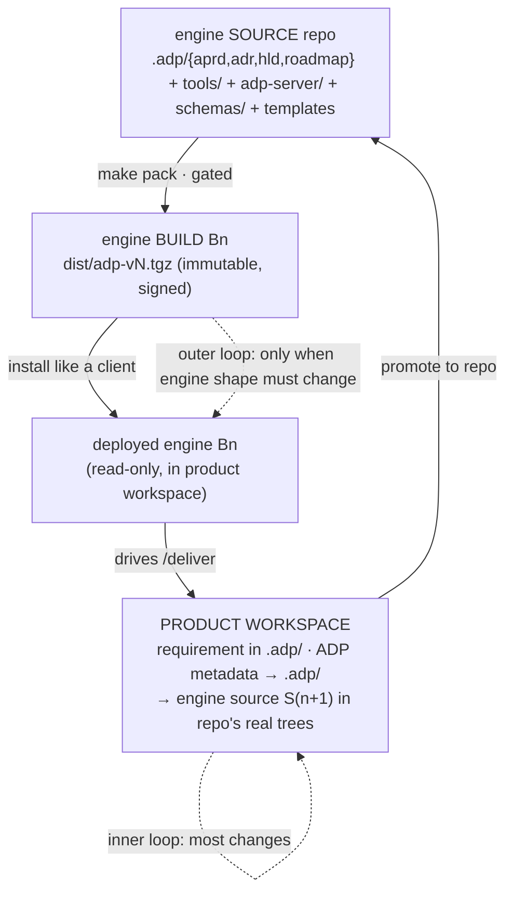

# ADP Bootstrap & Deployment Model — develop ADP through a deployed build

> How ADP develops itself without contaminating the product. The engine that drives development is a built, deployed artifact — separate from the engine source under development. ADP develops itself as a client project through `/deliver`, the same path a paying customer uses. Register: caveman; structural data literal.

---

## 1. Problem

The self-host (`/evolve`) loop runs against live files in the repo. There is no separation between the product under development and the system developing it:

- Phases 0–3 are frozen, only Build runs live, and it verifies against `_fixtures/` goldens.
- `/evolve` exercises the self-host path, NOT `/deliver` — the customer path. They are different loops (`adp-system-flow.md`).
- The customer path runs all 5 phases live against a stranger's repo with **no golden**.

Consequence: "works in `/evolve`" carries no guarantee for "works in `/deliver`." ADP shipped to a customer can behave differently from anything observed while building ADP. The correctness oracle that the self-host loop leans on (divergence-from-golden) does not exist on the product path — so verification silently degrades to shape-only for paying users. The methodology is untested on the path that matters.

---

## 2. Principle

**ADP must develop itself through a deployed build, via `/deliver`.** This is compiler bootstrapping with a deployment boundary: improve the engine *source* using the current engine *build*; rebuild the build only when development needs the new engine shape.

| # | Principle |
|---|---|
| BP1 | **Engine build ≠ engine source.** The engine driving development is a packaged, deployed artifact, immutable for the duration of a dev cycle. The source under development is a separate tree. |
| BP2 | **Develop as a client.** ADP's own design (`.aprd`/`.adr`/`.hld`/`.roadmap`) is the client requirement, processed by the deployed build through `/deliver` — the customer path, end to end. |
| BP3 | **Two cadences.** Inner loop: develop engine source via the current deployed build (no redeploy). Outer loop: rebuild + redeploy only when the engine's own shape must change for development to proceed. |
| BP4 | **Battle-test by construction.** Because development uses `/deliver`, every customer-path behavior is exercised continuously. No behavior ships unobserved. |
| BP5 | **Retire `/evolve`.** The contaminated self-host loop is removed; its fixtures become a regression suite, not the dev oracle (§7). |
| BP6 | **`.adp/` containment.** Every ADP artifact lives under a single `.adp/` root — the only ADP footprint in a workspace. Product code/tests live in the repo's real trees. Authoring product files inside `.adp/` is forbidden (§4). |

---

## 3. The bootstrap cycle



- **Inner loop** (common): the deployed build `Bn` develops engine source through `/deliver`. Output promoted back to the source repo. No redeploy — `Bn` keeps driving.
- **Outer loop** (rare): when development needs a changed engine shape (new role behavior in the loop itself, new MCP surface), build `B(n+1)` from the new source, deploy it, and the dev loop now runs on the new shape.

This mirrors bootstrapping: you edit compiler source with the current binary; you only rebuild the binary when the next stage needs its new features.

---

## 4. Engine / product boundary

Two boundaries, both enforced.

### 4.1 What ships in the build (source repo → payload)

`tools/pack/gen-manifest.mjs` + `manifest.json` allowlist define what ships (engine) vs what's repo-only:

| Class | Contents | Ships? |
|---|---|---|
| **Engine** | `tools/` · `adp-server/` · `schemas/` · `io/` · role templates · launchers · `code-canon/` | yes (payload) |
| **ADP metadata** (`.adp/`) | `aprd`/`adr`/`hld`/`roadmap`/`build`/`audit`/`streams` | no — run-produced / the requirement; never payload |
| **Dev scaffolding** | `docs/` · `_fixtures/` (now regression) · `.claude/` dev config | no — repo-only |

The product workspace receives ONLY the engine payload, via install. It never sees the source repo.

### 4.2 What ADP writes into a workspace — the `.adp/` containment

Every artifact ADP produces during a run lives under a single top-level `.adp/` directory. Nothing else in the workspace is ADP's. A client repo (or ADP's own self-dev workspace) stays clean — `.adp/` is the entire ADP footprint.

```
<workspace root>/
  .adp/                  ← EVERYTHING ADP. the only ADP footprint.
    aprd/                requirements (the WHAT)
    adr/                 decisions
    hld/                 design skeleton
    roadmap/             build frontier
    build/               build BOOKKEEPING ONLY (records · plans · verification · integration JSON)
    audit/               audit-class outputs
    streams/             workstream registry
  src/                   ← PRODUCT. code under development.
  tests/                 ← PRODUCT. tests, incl. materialized oracle tests.
  <client's own files>   ← PRODUCT. ADP's only relationship to these is as the deliverable.
```

This replaces the old flat layout (`.aprd`, `.adr`, `.hld`, `.roadmap`, `.build`, `.audit`, `_streams` scattered at repo root). The deployed engine itself installs separately (npm/global, read-only); `.adp/` is run-produced state only.

### 4.3 IRON RULE — `.adp/` holds ONLY ADP's own files

**Only ADP-specific metadata lives under `.adp/`. Authoring anything that belongs to the product under development inside `.adp/` is strictly forbidden.**

- Product **code** → the repo's real source tree (`src/…`), never `.adp/`.
- Product **tests**, including materialized oracle tests → the repo's real test tree (`tests/…`), where the client's own runner finds and runs them — never a slice dir under `.adp/`.
- `.adp/build/` carries build **bookkeeping** (build-record · build-plan · verification · integration-record — JSON *about* the build), NOT the built code or its tests.

Failure mode this closes: ADP materializing code/tests into `.build/slices/<id>/…` instead of the repo. That buries the deliverable in ADP's scratch space — it doesn't ship, doesn't run where the client expects, and makes the demo unfaithful. The product lands in the product tree; `.adp/` never holds a line of the deliverable.

---

## 5. Build & deploy (largely exists)

`make pack` → `tools/pack/pack.mjs` already produces a deployable build:

- `dist/adp-v<version>.tgz` — npm-installable (installer wrapper + `manifest.json` + gated `payload/`), offline (`npx --package=./adp-v<version>.tgz adp init`).
- `.sha256` digest + optional `cosign` signature.
- **Pack gate runs the system's own bar before emitting:** roadmap drained, manifest matches source sha, ALL `*.selftest.mjs` green. HALT on any failure → no tarball.

Missing pieces to complete the model:
- **Golden-regression gate** in pack (§7): the `_fixtures/` goldens become a regression suite the pack gate runs, so a build can't ship if it regressed a known behavior.
- **Deploy step**: install the tgz into a fresh product workspace (`adp init`) — the same command a client runs.

---

## 6. The product workspace (ADP as a client)

A clean workspace, created by installing build `Bn` exactly as a customer would:

1. `make pack` → `Bn`.
2. `npx --package=dist/adp-vN.tgz adp init` into a fresh workspace.
3. Seed the workspace's client requirement = ADP's own design for the next change (the `.aprd`/`.adr`/`.hld` describing what the engine should become).
4. Run `/deliver` — the deployed `Bn` drives all 5 phases live. ADP metadata lands under `.adp/`; the engine source `S(n+1)` (the product) lands in the repo's real trees (§4).
5. Verify on the deliver oracle (§7), operator-accepts at the demo (D39, now run against the deployed build — maximally faithful).
6. Promote `S(n+1)` back to the source repo. Rebuild to `B(n+1)` only if the new shape is needed to continue (outer loop).

The workspace is disposable; the source repo + the build artifacts are the durable state.

---

## 7. The `/deliver` oracle (post-evolve)

Retiring `/evolve` removes the fixture-golden net for ADP's own development — which forces defining the customer-path oracle (the gap the old model hid):

- **Per-artifact dev oracle = operator + self-consistency.** The operator runs the demo and accepts (D39, already mandated). Deterministic cross-artifact self-consistency checks (ids thread, refs resolve, schema-valid, acceptance satisfied) run in the backbone. There is no golden to diverge against on a live client repo — correctness rests on the operator + machine-checkable consistency.
- **Goldens → regression CI.** `_fixtures/` goldens are repurposed as a **regression suite the pack gate runs**. They no longer gate per-artifact dev correctness; they guard against *known-behavior breakage* across rebuilds. Separates two questions: "did we regress?" (golden regression, automated, pack-time) vs "is this new artifact correct?" (operator + self-consistency, dev-time).

---

## 8. Stage-0 bootstrap

The current repo is the hand-built **stage-0**: assembled by `/evolve` and direct authoring. The first action seeds the cycle:

1. `make pack` on current HEAD → `B0` (the stage-0 build).
2. Deploy `B0` into a product workspace.
3. From `B0` onward, develop ADP through `/deliver`; never edit the live engine in place again.

The stage-0 artifacts (the existing `prompts/`, `tools/`, etc.) are the corpus `B0` carries. No further hand-authoring of the engine in the source repo outside the deliver loop, except break-glass.

---

## 9. What gets retired

- **`/evolve` skill** and `prompts/_orchestrator.md` (the self-host loop) — removed.
- **`_fixtures/` as the dev oracle** — repurposed as regression CI (§7).
- **Self-host docs** (`self-host-workflow.md`, `self-host-usage-guide.md`) — superseded by this model.
- **D39 unchanged and strengthened** — the operator demo now runs against the *deployed* build from a fresh session, the most faithful possible acceptance.

---

## 10. Relationship to the schema-blind rewrite

The schema-blind / MCP-backbone rewrite (`adp-target-architecture.md`) is **decoupled** from this fix and **gated behind it**. Once the bootstrap model is in place, the rewrite is just another change developed through the deployed engine via `/deliver` — and battle-tested on the product path as a side effect.

It must clear a **funding gate** before full migration (50 roles is not committed on principle):

1. **Ship the schema-drift lint rule** — closes the only nameable problem cheaply; if drift stops hurting, the rewrite's premise weakens.
2. **Deliver oracle defined** (§7) — done here.
3. **Spike CLASSIFIER + one heavy late-phase role** (HLD/build class), through the new `adp_task`/`adp_answer` surface; measure inline-all token cost vs the current path.
4. **Write the driver** — prove it's thin, or own the conserved control logic and drop the word.
5. **Resolve** concurrency/`task_id` collision, projection semantic-drift, and migration coexistence/rollback.

Only on a measured net win does full migration get scoped. Until then: keep the current architecture + the lint rule, developed through the deployed build.

---

## 11. Migration steps

1. Add the golden-regression gate to the pack pipeline (§5).
2. Nest the flat ADP trees under `.adp/` (§4.2): move `.aprd`/`.adr`/`.hld`/`.roadmap`/`.build`/`.audit`/`_streams` → `.adp/{aprd,adr,hld,roadmap,build,audit,streams}`; update the `io/io-manifest.json` read-graph, schema paths, sentinels, and locks to the nested paths. Re-point oracle materialization so tests land in the repo's `tests/` tree, not `.adp/build/` (§4.3). Confirm `.adp/` is excluded from the build payload.
3. Build `B0`; stand up the install-into-fresh-workspace deploy step (`adp init`).
4. Author ADP's own client requirement for the next change in a product workspace; run `/deliver` on `B0`; promote; confirm parity with prior behavior via regression.
5. Retire `/evolve` + self-host orchestrator + self-host docs once the deliver-driven loop is proven on one change end to end.
6. Thereafter, all engine development flows through the deployed build.

---

## 12. Invariants

- **Engine build is immutable during a dev cycle.** Changing the driving engine requires a new build + deploy (outer loop), never an in-place edit.
- **Develop through the customer path.** No self-host shortcut; `/deliver` is the only development loop.
- **Verify-before-ship.** The pack gate (selftests + golden regression) is the build's own bar; a build that fails it emits no artifact.
- **Operator runs the demo (D39).** Now against the deployed build from a fresh session.
- **Disk is the sole source of truth.** Durable state = source repo + signed build artifacts; product workspaces are disposable.
- **`.adp/` containment (iron rule).** All ADP artifacts under one `.adp/` root; product code/tests in the repo's real trees. No deliverable file is ever authored inside `.adp/` (§4.3).

---

## 13. Open items

- **Promotion mechanics** — how `S(n+1)` produced in a disposable workspace flows back to the source repo (patch/PR vs direct write), and how the workspace's `/deliver` output maps onto the repo's engine layout.
- **Regression-suite curation** — which `_fixtures/` goldens become regression tests, and how they're versioned as the engine shape changes (a golden for a retired behavior must retire too).
- **Build cadence policy** — what concretely counts as "the engine shape must change" (outer loop trigger) vs an inner-loop source change the current build can already produce.
- **Workspace requirement authoring** — whether ADP's "client requirement" for a change is authored by hand or itself produced by an upstream ADP run.
