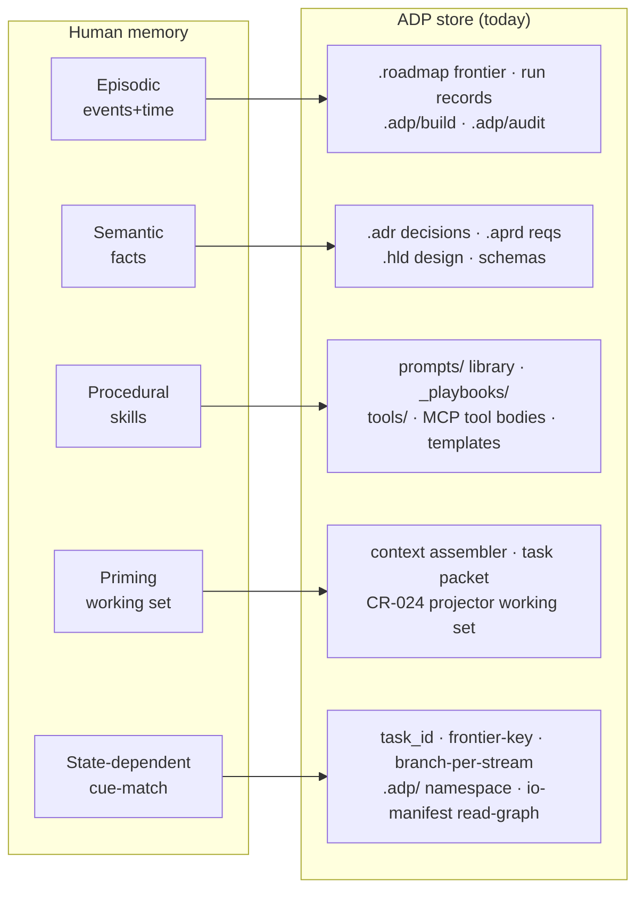
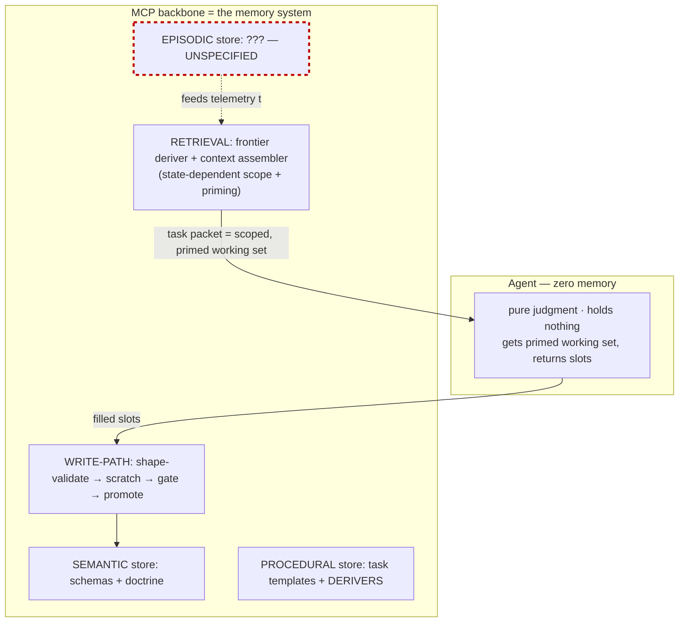
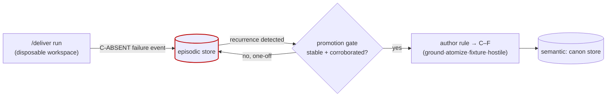

# ADP Memory Design — multi-store memory for the schema-blind backbone

> CTO analysis. Maps human-memory taxonomy ([[00-memory-101]]) onto ADP. Finding: ADP already IS a multi-store memory — by principle, not accident. ADP 2.0 (schema-blind agent + MCP backbone + disposable workspaces) makes the **MCP the sole memory manager** while **discarding episodic memory**. That gap blocks demand-driven canon growth ([[02h-canon-production]] CP4). This doc names the stores, the gaps, the fixes. Register: caveman; ids/paths/schema-keys literal. Inputs: `adp-target-architecture.md`, `adp-bootstrap-deployment-model.md`, `00-memory-101.md`, `02h-canon-production.md`, current repo trees.

---

## 0. TL;DR

- ADP not missing memory — ADP **is** memory. On-disk trees map 1:1 onto the human taxonomy. `.adr`/`.aprd`/`.hld` = semantic. `prompts/`+`_playbooks/`+`tools/` = procedural. `.roadmap`+run records = episodic. Context assembler = priming. `task_id`/branch/`.adp/` = state-dependent.
- ADP 2.0 strengthens 4 of 5 stores: agent goes stateless, MCP owns all retrieval → textbook "separate stores, scope retrieval, write-path validation." Good.
- **One store ADP 2.0 actively destroys: episodic.** "Product workspaces disposable" (`bootstrap` §6, §12) = raw run history thrown away each cycle. Human analog: anterograde amnesia. System cannot learn across runs.
- That breaks the one growth mechanism the canon SOP depends on: **grow demand-driven from C-ABSENT failure telemetry** (CP4). No durable episodic store → no telemetry → canon can only be seeded, never grown from real failure. Speculative pre-authoring (the thing CP4 forbids) becomes the only option left.
- Fix = add a durable, append-only **episodic store** outside the disposable workspace + a **promotion gate** (episodic→semantic) mirroring biological hardening. Three other moves: bound the priming working set (reframe the CR-024 projector as bias-control, not just token-cut), TTL+version the growing doctrine (procedural anti-ossification), add two-pass scoped→global retrieval (state-dependent anti-lockout).
- Cost-gated like the rest of 2.0: episodic store + promotion gate is load-bearing (do it); the rest is incremental hardening of stores that already work.

---

## 1. ADP is already a multi-store memory

Memory-101 thesis: don't flatten to one vector blob; split by consciousness (log vs knowledge) + content (events vs facts vs skills); scope retrieval. ADP did this already — disk trees ARE the split, the CLAUDE.md rules ARE the write-path discipline.

| Memory type | ADP store | Maturity | Memory-101 discipline already met |
|---|---|---|---|
| **Semantic** (facts) | `.adr` · `.aprd` · `.hld` · `schemas/` | strong | one home per fact (DRY/economy) · provenance (ADR source field) · immutable+versioned (frozen+lock) · contradiction-check (supersedes chain) |
| **Procedural** (skills) | `prompts/` · `_playbooks/` · `tools/*.mjs` · MCP tool bodies | strong | versioned (CR/ADR) · verify gate (clean-room vs `_fixtures/` both directions) · scope guard (role preconditions) · observable (writes to disk) |
| **Episodic** (events) | `.roadmap` frontier · ADR drafts · `.adp/build` records | **partial** | append-mostly, but no immutable raw run-log; frontier re-derived not retained; **discarded on workspace teardown** |
| **Priming** (working set) | context assembler → task packet; CR-024 projector | **new in 2.0** | not yet bounded/decayed as a bias-control; framed only as token-cut |
| **State-dependent** (scope) | `task_id` · frontier-key · branch-per-stream · `.adp/` | partial | scope tags exist (role+frontier); no two-pass scoped→global fallback |

Read this as: ADP got semantic + procedural right years ago because the same discipline (immutability, one-home, verify-both-directions, provenance) that CLAUDE.md enforces for engineering reasons IS the memory-101 mitigation set. Convergent design. The lens just gives names + exposes the two soft stores.

---

## 2. ADP 2.0 makes the MCP the sole memory manager

Two 2.0 moves change the memory picture structurally.

**Move 1 — agent goes stateless + schema-blind** (`target-arch` P1/P2/P9). Agent = "pure judgment engine, stateless beyond current task." It holds NO memory. Every memory operation — what to recall, how to scope, what to write — moves below the MCP line. The backbone becomes the *only* memory system; the agent is a stateless function the memory system calls.

This is exactly memory-101's prescription, arrived at independently:

The architecture spec is meticulous about retrieval (context assembler §8), semantic (schema home §10), procedural (doctrine in templates §10), and write-path (scratch→promote §9 — this IS memory-101 cross-cutting principle #3, "write-path validation > read-path hope"). **It is silent on the episodic store.** §13 open items list multi-phase binding, repeatable-slot bounds, pointer-failure, doctrine versioning, elicitation UX — no episodic memory.

**Move 2 — workspaces are disposable** (`bootstrap` §6: "workspace is disposable; source repo + build artifacts are the durable state"; §12 invariant). Durable = semantic (promoted to source repo) + procedural (the build). Episodic = whatever happened during the run = **deleted with the workspace.**

Combined effect: the agent remembers nothing within a run (Move 1), and the system remembers nothing across runs (Move 2). All retained state is semantic/procedural. **ADP 2.0 has anterograde amnesia by design** — it hardens facts and skills but keeps zero event history.

---

## 3. The load-bearing gap — no episodic store breaks canon growth

Amnesia would be fine IF nothing downstream needed event history. One thing does, and it is central to the system's quality story.

[[02h-canon-production]] CP4 — the fourth law of canon production:

> **Seed thin, grow from failure.** New rules authored when **real telemetry hits C-ABSENT** (a task failed for lack of a rule) — not speculatively. Failure cites the gap → author THAT rule.

CP4 is the explicit rejection of speculative mass-generation (the CC8 cold-start storm, dead-rule rot). The whole SOP rests on it: seed from linters, then **let real failures drive what gets authored next.**

"Real telemetry of failures" = **episodic memory.** A failure is an event: run R, role X, task T, missing-rule-class C, timestamp. To grow canon from failure you must (a) record failures durably and (b) survive them across runs to spot recurrence ("C-ABSENT fired 5× across 3 cycles → author the rule").

If the episodic store doesn't exist / dies with the workspace:
- No recurrence detection → every failure looks like a first sighting → can't distinguish stable gap from one-off noise.
- CP4's demand-driven growth is **impossible**. Only seeding works.
- The system falls back to speculative pre-authoring — **exactly the CC8 anti-pattern the SOP was written to kill.**

This is the episodic→semantic *hardening* memory-101 calls out (line 47: "episodic often hardens INTO semantic over time"). ADP 2.0 specified the semantic store and the write-path but deleted the episodic substrate that feeds promotion. **Highest-priority fix.**

Same gap hits other demand-driven loops: roadmap re-rank from observed build cost, retry-budget tuning, projector hint quality — all want "what actually happened across runs," all currently homeless.

---

## 4. Design — five stores, explicit, in `.adp/` + a durable spine

Make every store first-class in the backbone. Bind to memory-101 mitigations. Respect `.adp/` containment (`bootstrap` §4.3) — except the one store that must outlive the disposable workspace.

### 4.1 Episodic — the missing store (BUILD THIS)

- **What:** append-only, timestamped, immutable run-event log. Every task dispatch, repair attempt, HALT, gate verdict, C-ABSENT miss, operator decision — one event, with provenance (run-id, role, task_id, source).
- **Where:** **must survive workspace teardown.** Workspace `.adp/episodic/` is the write buffer; on promote, events flush to a **durable episodic store in the source repo** (`.adp/episodic/` at source, or a dedicated ledger). This is the ONE exception to "workspace disposable" — events are durable state alongside semantic+procedural.
- **Discipline (memory-101 §1):** immutable raw log; summaries are SEPARATE derived artifacts (never overwrite source — already the repo immutability rule); redact secrets at write; tiered compaction (raw N recent, summarize old, keep pointers for audit).
- **Reuse:** `.roadmap` fix-records + ADR drafts are proto-episodic already; formalize, don't reinvent.

### 4.2 Promotion gate — episodic → semantic (BUILD THIS)

- **What:** the hardening mechanism. Recurring/corroborated episodic patterns promote to semantic (canon rule, ADR, playbook entry); one-offs stay in the log.
- **Discipline (memory-101 §2):** promote only when **stable + corroborated**, never on first sighting (kills over-generalization from a single case). Contradiction-check on write — new fact conflicts with stored → flag, don't dual-store. Runs through canon SOP C–F (ground·atomize·fixture·hostile) so promoted rules ship a fixture.
- **Owner:** MCP backbone (LLM reconciles candidate, never authors truth — D-canon). Operator-gated for canon-class writes (highest-stakes write, R8).

### 4.3 Semantic — keep, add freshness

- Already strong. One add from memory-101 §2: **freshness/TTL + verify-on-use.** A fact naming a file/flag/API must be re-verified before reuse (already a recall rule in this repo's own memory policy). The canon SOP already mandates TTL (CP1/§3) — extend it to ADRs/HLD facts that reference mutable code surfaces.

### 4.4 Procedural — keep, add anti-ossification

- Architecture §10 says doctrine "moves into the backbone and grows; it does not shrink." Memory-101 §3 names the risk precisely: **ossification** — a baked-in, practiced procedure that encodes an assumption that changed, runs confidently wrong, hard to introspect.
- Fixes (memory-101 §3): **versioned doctrine** (the §13 open item "doctrine versioning" — resolve it: templates frozen+locked like other engine artifacts, change = new version + downstream re-trigger); **verify gate** (clean-room both-directions already mandated — extend to task templates per §10 verify-target shift); **TTL** so growing doctrine gets periodic re-validation, not unbounded accretion; **scope guard** (template declares preconditions; refuse outside domain — maps to §13 `source_pointer` failure + multi-phase binding).

### 4.5 Priming — reframe the projector as bias-control

- The context assembler (§8) inlines "the actual content of every ADP artifact this role reads." Unbounded inline = memory-101 §4 risk: **recency/anchoring, tunnel vision, injection priming, confirmation loop.**
- CR-024 projector (hint→field-selector, server-side projection) is currently sold as a **token-cut**. Reframe: it is the **working-set bound** memory-101 §4 demands. Same mechanism, second justification — and the second one is load-bearing for correctness, not just cost.
- Adds (memory-101 §4): fixed budget, **evict by relevance not just recency**; **decay/TTL on inlined context**; **provenance gating** — untrusted/fetched source (brownfield code, fetched manifest via `source_pointer`) may prime exploration, **never authorize a write** (critical for the schema-blind agent reading stranger repos); **diverse retrieval** for adversarial roles (multi-angle, break the confirmation loop).

### 4.6 State-dependent — add two-pass retrieval

- Scope tags exist (`task_id` = `{role, frontier-key}`, branch-per-stream, `.adp/` namespace). Risk (memory-101 §5): **context lock-out** — a fact written under task A invisible under task B → agent "forgets" something it knows.
- Add: **two-pass retrieval** — scoped first (precision), global fallback when scoped returns empty (recall). Keep durable facts context-free in semantic (survive state shift); keep only genuinely situational state in scoped store. Directly informs the §13 open items (multi-phase role binding, repeatable-slot bounds) — both are scope-disambiguation problems.

---

## 5. Write-path discipline = ADP's existing law, restated

Memory-101's strongest cross-cutting principle (§225 #3): **validate at WRITE, not hope at READ** — dedup, redact, contradiction-check, freshness-stamp on the way in. Cheaper than catching garbage on every read.

ADP 2.0 already does this and should be recognized as the template for ALL stores:

`adp_answer` → scratch → separate-spawn verify → operator gate → `adp_promote` is **write-path validation for the semantic store.** Generalize the same shape to episodic (redact+dedup at write), priming (relevance-bound at assembly), procedural (verify-gate at template promote). No actor promotes its own output (clean-room separation) — this is memory-101 "LLM reconciles, never authors truth" enforced structurally.

---

## 6. Risk register — biases per store, mapped to ADP mitigation

| Store | Headline bias (memory-101) | Worst risk in ADP 2.0 | ADP mitigation | Status |
|---|---|---|---|---|
| Episodic | reconstructive drift | hallucinated history; **lost telemetry → CP4 dead** | immutable durable log + provenance + tiered compaction | **MISSING — build §4.1/4.2** |
| Semantic | stale confidence | stale fact cites moved file/API; poisoned canon (R8) | one-home + TTL + verify-on-use + promotion gate | strong; add freshness §4.3 |
| Procedural | blind automaticity | ossified doctrine runs confidently wrong | versioned + verify-gate + TTL + scope guard | strong; resolve doctrine-versioning §4.4 |
| Priming | recency/anchoring | injection from stranger-repo source; tunnel vision | bound + decay working set + provenance-gate untrusted | **reframe CR-024 §4.5** |
| State-dependent | cue-match lock-out | fact written under task A invisible under task B | scope tags + two-pass scoped→global fallback | partial; add two-pass §4.6 |

---

## 7. Recommendations — prioritized, cost-gated

Match the 2.0 funding-gate discipline (`bootstrap` §10 — 50 roles not committed on principle). Memory work earns its cost the same way.

**P0 — load-bearing, do before canon-growth ships:**
1. **Episodic store** (§4.1) — durable, append-only, survives workspace teardown. Without it CP4 is impossible and the canon SOP degrades to speculative seeding. ADR-worthy.
2. **Promotion gate** (§4.2) — episodic→semantic hardening through canon SOP C–F. The mechanism that turns recorded failures into rules.

**P1 — hardening of stores that already work:**
3. **Reframe CR-024 projector** as priming working-set bound + add provenance-gating for untrusted source (§4.5). Cheap — mostly a doctrine/spec reframe + an injection guard. High value when agent reads stranger repos.
4. **Resolve doctrine-versioning open item** (§4.4) as procedural anti-ossification: version+TTL+verify-gate task templates.

**P2 — incremental:**
5. Semantic freshness/TTL on facts referencing mutable code surfaces (§4.3).
6. Two-pass scoped→global retrieval (§4.6); folds into multi-phase binding + repeatable-slot open items.

**Process:** record P0 as an ADR + aPRD change-request (same path `target-arch` §14 prescribes), sequence behind the bootstrap/deploy fix, develop through the deployed build via `/deliver`. The memory stores are themselves ADP engine source — dogfooded through the customer path like everything else.

---

## 8. One-line thesis

ADP already split memory by consciousness + content the way biology does — semantic and procedural are textbook-correct because CLAUDE.md's immutability/one-home/verify discipline IS the memory-101 mitigation set. ADP 2.0 perfects retrieval and write-path by making the stateless agent's MCP the sole memory manager — then deletes the episodic store with the disposable workspace, severing the failure-telemetry that demand-driven canon growth (CP4) runs on. **Add a durable episodic store + an episodic→semantic promotion gate; bound the priming working set; version the growing doctrine. Copy biology's split — don't amputate the event log.**
