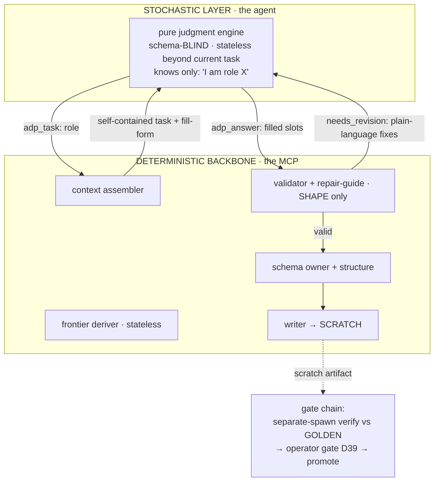
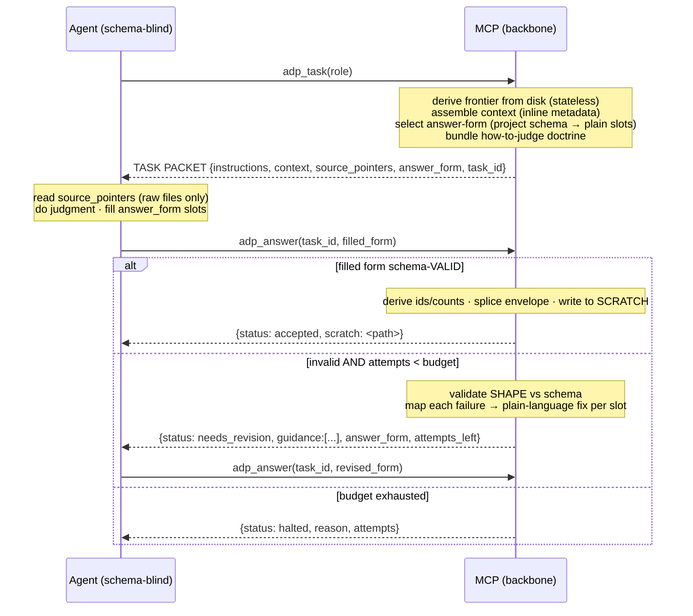
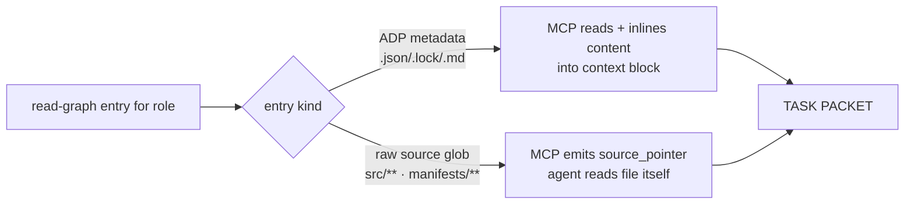
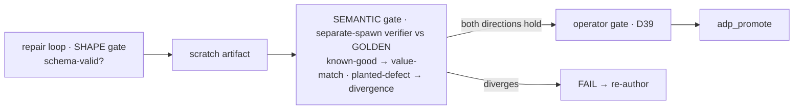

# ADP Target Architecture — schema-blind agent, MCP as deterministic backbone

> Target design for ADP. The stochastic layer is a pure judgment engine, completely schema-unaware. The deterministic backbone (an MCP server) owns all structure, context, validation, and state; it calls the agent only to fill judgment gaps. Current state of the system: see `adp-system-flow.md`. Register: caveman; structural data (ids, paths, schema keys) stays literal.
>
> **Status: candidate, gated.** Sequenced behind the bootstrap/deployment fix (`adp-bootstrap-deployment-model.md`). Not committed on principle — must earn funding by proving out through `/deliver` against the funding gate in that doc §10 (ship the drift lint rule · spike CLASSIFIER + one heavy role with token metrics · write the driver and prove it thin · resolve concurrency/`task_id`, projection semantic-drift, migration coexistence). Until then: keep the current architecture + lint rule, developed through the deployed build.

---

## 1. Thesis

The deterministic system is the whole. The agent is an **external integration** it invokes where determinism can't reach — judgment. The agent never sees a schema, an id, a count, or a file path; it receives a self-contained task, returns prose-in-slots, and that is its entire surface.

This is a design principle, not a cleanup. Schema already has a single validated home (`schemas/`, locked); prose drift between that home and prompts is closable by a lint rule alone. The rewrite earns its cost only against the principle — **total schema-blindness of the stochastic layer** — and is justified there.

---

## 2. Design principles

| # | Principle |
|---|---|
| P1 | **Total schema-blindness.** No agent — including adversarial roles — ever sees schema, structure, ids, counts, or paths. |
| P2 | **Agent = external integration.** A model-as-a-service call to fill a judgment gap. Not a driver, not stateful. |
| P3 | **Backbone owns all determinism.** Frontier, sequencing, context, structure, ids/counts, validation, structural checks, scratch-write, promotion, operator gates. |
| P4 | **Self-contained tasks.** MCP inlines all ADP metadata; the agent opens zero `.json`/`.lock`. Raw source (code, fetched manifests) the task points to; MCP never hauls whole trees. |
| P5 | **Runtime fill-form.** Each task carries an answer-template of named slots with plain instructions. Agent fills slots; MCP maps slots → schema internally. |
| P6 | **Single-shot + bounded repair.** MCP validates SHAPE only; on failure it returns plain-language fixes (never schema errors); the loop is capped. |
| P7 | **Correctness gate is external.** Semantic divergence-from-golden is judged outside the repair loop, by a separate spawn. |
| P8 | **Scratch-write, verify-before-promote.** The authoring call writes to scratch; the gate chain promotes. No actor promotes its own output. |
| P9 | **Stateless backbone.** `task_id` re-derivable from disk; no open-task RAM state. Disk is the sole source of truth. |

---

## 3. The two-layer split



Hard rule: every schema, every deterministic computation, every file path lives below the MCP line. Nothing crosses up. The agent receives prose + named slots and returns prose-in-slots; it cannot name a schema because it never sees one.

---

## 4. Capability constraints (why a thin driver exists)

The purest realization of P2 = the backbone runs, hits a gap, calls the model, validates, continues — i.e. MCP **sampling**. Claude Code does not allow this:

| MCP capability | Claude Code | Consequence |
|---|---|---|
| **sampling** (server delegates an LLM call to the host) | not supported | backbone cannot call the model itself in-harness |
| **subagent spawn from a server** | not supported (host-only) | backbone cannot spawn clean-room agents |
| **elicitation** (server requests structured input from the human) | supported | backbone owns operator gates directly |

An MCP server is passive — it answers tool calls, never initiates. So something host-side must pump the loop. That is the **thin driver**: a near-logic-free relay that delegates every decision to the MCP and exists only to (a) call the MCP and (b) spawn clean-room agents (which the server can't).

If ADP later leaves the harness (standalone engine with its own model credentials), the engine samples directly and even the thin driver disappears. In-harness, the thin driver is structurally irreducible.

---

## 5. Actors

| Actor | Role |
|---|---|
| **Controller** | the human. Gates checkpoints (surfaced via MCP elicitation), runs the acceptance demo. Writes nothing. |
| **Thin driver** | host-side pump. Loop: `adp_task` → spawn clean-room agent → `adp_answer` → repeat; spawn the separate verifier; call `adp_promote` after the gate chain. Zero schema, state, or control logic. |
| **Agent** | external integration · pure judgment. Receives a self-contained packet, reads only source pointers, fills slots, never sees schema. |
| **MCP backbone** | frontier deriver, context assembler, doctrine server, schema owner, shape-validator + repair-guide, structural-check owner, deriver (ids/counts), scratch writer, operator-gate owner (elicitation). |

**Duty ownership:**

| Duty | Owner |
|---|---|
| frontier scan · sequence · promote · git · branch · ledger | MCP backbone |
| structural adversarial checks (missing field, weak enum, count mismatch) | MCP backbone |
| operator gates (checkpoint A/B/C · D39) | MCP elicitation |
| judgment dispatch + clean-room verify (spawning) | thin driver |
| semantic judgment | agent |

The thin driver's entire loop:
```
loop:
  packet = adp_task(role)              # MCP decides frontier, context, form, doctrine
  if packet.done: break
  answer = spawn_clean_room_agent(packet)
  result = adp_answer(packet.task_id, answer)   # MCP validates(shape) + writes scratch
  while result.needs_revision and attempts < budget:
    answer = re_spawn_with(result.guidance)
    result = adp_answer(packet.task_id, answer)
  # MCP raises operator gates via elicitation
  # separate-spawn semantic verify (§9) → adp_promote
```

---

## 6. The agent contract

Two calls, one bounded repair loop. This is the agent's entire world — no other tools, no file resolution, no schema id, no path knowledge.



Repair is shape-only. Correctness is judged downstream against the golden (§9).

---

## 7. The task packet

`adp_task(role)` returns a self-contained packet. The agent performs the task without opening any metadata file.

| Field | Holds | Source |
|---|---|---|
| `instructions` | how-to-judge doctrine for this role (the discriminator, the rules, the lane boundaries) | MCP task template |
| `context` | inlined upstream metadata — the actual content of every ADP artifact this role reads, with per-block hints | MCP reads disk per the read-graph |
| `source_pointers` | raw non-metadata files to read (brownfield code, fetched manifests): `{path, why}` | MCP read-graph (source globs) |
| `answer_form` | named slots: `{slot, instruction, required, repeatable}`. No schema, ids, or counts | MCP projects schema judgment-leaves → plain slots |
| `task_id` | stateless handle encoding `{role, frontier-key}`, re-derivable from disk | MCP |

**answer_form is a projection, not a schema.** MCP strips every deterministic field (ids, counts, consts, single-enums) — those it fills itself on accept. Only judgment-bearing leaves become slots, each with a plain instruction.

Example (EXTRACT-RULES):
```
answer_form:
  rules (repeatable):
    - source:  "which source did this come from? (pick from context block labels)"
    - rule:    "state the prescription in one caveman line"
    - setting: "verbatim config key+value, or leave blank if prose"
    - evidence:"paste the exact text from the file that proves this rule exists"
    - topic:   "short subject slug, e.g. semicolons"
  unfetched: "list any source named in context but with no file present, + why"
```
No `source_ref`/`tier`/`tool`/`id`/`kind` — MCP derives those from context and mints ids. Agent sees plain questions only.

**Projection coupling.** The slot↔schema-leaf mapping is hand-authored in the template. Structural drift (a slot dropping or renaming a required field) is caught at `adp_answer` validate-time. The residual risk is semantic — a slot instruction mis-describing a leaf — which validation can't catch; the mapping is reviewed when either side changes.

---

## 8. Context assembly

The `io/io-manifest.json` read-graph (role → input paths) is retained, but its job inverts: instead of handing the agent paths, the MCP uses it to decide what to read and inline.



- Metadata → inlined. The agent never chases an artifact; its content arrives in `context`.
- Raw source → pointer. MCP names the files and why; the agent reads them (that reading is part of its judgment).
- `when` predicates (class/mode branches) are evaluated by the MCP before assembly — the agent gets a branch-free packet.

This forces all metadata through MCP-curated `context` blocks, betting the read-graph is complete for every role. The trade is flexibility for purity: a role needing an unanticipated cross-reference has no ad-hoc escape — the read-graph is amended instead. The read-graph is therefore a first-class, change-requestable artifact.

---

## 9. Verify and promote

The repair loop enforces shape; correctness is a separate gate. Schema-validity ≠ correctness: a defect that is schema-valid but semantically wrong (fabricated evidence, plausible-false rule, mis-attributed source) passes validation untouched.



The semantic oracle is value-divergence-from-golden, judged by a separate spawn after scratch-write. It must stay outside the repair loop: the better the plain-language repair, the more easily it could walk a *defective* fill to validity, eroding a shape-only fail signal. Folding correctness into the loop would regress the adversarial verify.

**Bounded repair.** The loop is capped at the standard budget (3 attempts; 5 for `mcp-modernize`-class). Exhaustion → HALT, report, no scratch.

**Scratch-write.** `adp_answer` accept writes to a scratch path only. The gate chain (separate-spawn verify → operator gate → `adp_promote`) runs after. The authoring call never produces a promoted artifact.

---

## 10. What changes from the current system

- **`prompts/<ROLE>.md` library → MCP-managed task templates.** Each template carries the role's doctrine plus its answer-form plus the slot→schema projection. Doctrine moves into the backbone and grows; it does not shrink.
- **Schema home unchanged** (`schemas/`, locked) — but no agent-facing artifact references it; the agent is blind to it.
- **`io-manifest` becomes an inline recipe** (read+inline vs read+point) rather than a path list handed to the agent.
- **Verify target shifts** from a prompt `.md` to a task template + its answer-form + its projection. Both-directions clean-room still holds; the semantic gate stays external.
- **`adp_next`/`prefill` shell+holes** generalizes into the answer-form; `adp_derive`/`DERIVERS` is retained (now fed slot-mapped primitives); `adp_submit`/`adp_promote` remain as gate/promote plumbing.
- **Thick orchestrator retired.** Its logic dissolves into MCP tools + elicitation; the thin driver replaces it.

---

## 11. Migration

A backbone build, not a finish.

| Work item | State | Remaining |
|---|---|---|
| Determinism relocated (`DERIVERS`) | 5 of ~51 roles | 46 roles |
| `adp_task` / `adp_answer` MCP surface | none | the core surface |
| `answer_form` projection layer | none | per-schema judgment-leaf → slot mapping, all schemas |
| Per-slot plain-language instructions | none | authored per slot, all schemas |
| Doctrine migration | 0 of 59 prompts | 59 templates → MCP-managed |
| Context-assembler (inline recipe) | read-graph exists; inline logic does not | new MCP module |
| Bounded repair-guide (shape → plain-language) | none | new MCP module |
| Thin driver | thick orchestrator exists | retire it; author the relay |
| Operator gates → MCP elicitation | gates in orchestrator prose | new elicitation wiring (checkpoint A/B/C, D39) |
| Structural adversarial checks → MCP | partly in det modules | consolidate; agent does semantic only |

The in-flight `mcp-modernize` class ports determinism but leaves the agent schema-coupled — necessary but insufficient; the answer-form layer sits on top of it.

**Order: backbone-first.** Build `adp_task`/`adp_answer` + answer-form + context-assembler against one already-ported role (CLASSIFIER), prove both directions vs golden through the new surface, then port roles one at a time. This avoids partial migrations against a surface that does not yet exist.

---

## 12. Invariants

- **Disk is the sole source of truth (D20).** The frontier deriver is stateless; `task_id` is re-derivable; no open-task RAM. Resume re-derives.
- **Verify-before-promote.** MCP writes scratch only; the gate chain promotes; no actor promotes its own authoring output.
- **Clean-room separation.** The thin driver spawns the judgment agent and a separate verifier agent; the runner never grades its own output.
- **Adversarial oracle is a distinct external gate** — semantic divergence-from-golden, never folded into the shape repair loop.
- **Operator runs the demo (D39).** Work is driven entirely through native `adp_*` calls; operator gates surface via elicitation.
- **LLM judges, never authors truth.** MCP owns structure and determinism; the agent judges; correctness is checked externally.
- **Bounded work.** Repair loop capped (3; 5 for `mcp-modernize`).
- **One home per fact.** Schema home = `schemas/`; doctrine home = template; the projection is a reviewed mapping, not a duplicate.
- **Register and economy.** Templates and instructions stay caveman.
- **Immutability.** Frozen artifacts and locks are never overwritten; a change is a new version plus downstream re-trigger; a generated-frozen artifact is changed via its generator.

---

## 13. Open items (not load-bearing for the thesis)

- **Multi-phase role binding.** A role appearing in several phases (e.g. CRITIQUE) needs explicit unit binding under concurrency; `task_id`/frontier-key carries the unit, but the disambiguation rule across parallel branches must be specified.
- **Repeatable-slot bounds.** How the MCP signals a missing expected item (e.g. an unfetched source) when the count is itself derived from context.
- **`source_pointer` failure modes.** File missing mid-judgment, glob matches zero, agent can't read a pointed file → define a standard "pointer-failed" return on `adp_answer`.
- **Doctrine versioning.** Whether task templates are frozen + locked like other engine artifacts, and the change-request flow when doctrine evolves.
- **Elicitation gate UX.** How the MCP frames checkpoints A/B/C and D39 acceptance (form fields, persisted reply, resume-without-re-ask).

---

## 14. Next step

These decisions re-point the build frontier and retire `_orchestrator.md`. Record them as an ADR plus an aPRD change-request before scoping the migration work.
