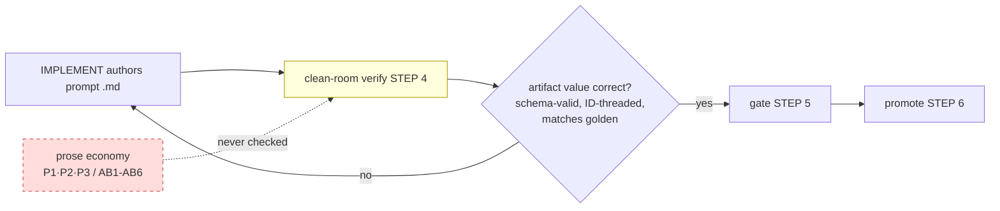

# Authoring-improvements — executive summary

> Review of prompt-authoring discipline across whole tree. Problem: agents patch behavior by ADDING text → prompts bloat. Three practices demanded; assess adherence + enforce globally. Caveman register throughout. Do-not-commit (analysis only).

## The three practices (the bar)

| # | Practice | Plain statement |
|---|---|---|
| **P1** | Delete/rewrite, never patch-by-adding | Wrong behavior → cut or rewrite the offending text. Never bolt on another instruction. |
| **P2** | Every statement has an objective | Each line earns its place by a clear purpose. No decorative narration, no mandate-restated-for-emphasis. |
| **P3** | One interpretation only | Most precise wording. Statement readable two ways = bad statement. |

## Headline finding

Project ALREADY has the right canon — **AB1–AB6** (`.hld/skeleton/coding-canon.md`) + the DRY prompt skeleton. ADR-0010 root-caused bloat correctly (old skeleton mandated 3–5 homes per fact) and retrofitted all 26 prompts once (−29%, 4433→3135 lines).

**But the rules are ADVISORY, not GATED. Bloat came back.** The only gate the pipeline runs (clean-room verify, `_orchestrator.md` STEP 4 + `code-canon` field 6) judges the **artifact's value/behavior** — right downstream JSON, ID-threaded, schema-valid, matches golden. It NEVER reads the prompt prose for economy. A 331-line prompt that restates one fact 12× passes verify exactly like a tight 120-line one would. **No check fails a bloated prompt → drift is free.**

Two more gaps:
- **AB1–AB6 cover P1 + parts of P2, but NOT P2-general or P3.** No rule says "every statement needs an objective" beyond the specific AB cases; NO rule at all bans multi-interpretation wording (P3).
- **Nothing routes a bloat defect back to re-authoring.** Even if a human spots bloat, the loop has no "re-author, don't patch" path for prose — only for wrong behavior.

## The enforcement gap, visually

Dashed box = the missing dimension. Verify sees behavior, is blind to prose. Bloat enters through that blind spot.

## Adherence verdict (detail in `02-adherence-assessment.md`)

Corpus = 39 prompts + orchestrator + step-runner + specs + ADRs + docs. Audited all.

- **Violations pervasive.** Every schema-bearing prompt restates its lane in ≥3 homes (role identity + "Stay in lane" Rule + Stop). Every large 03-hld prompt states its "one load-bearing thing" 3–4×, its "never invent" 4–6×.
- **Worst:** DERIVE-TESTS (331 ln) — "design-layer oracle NOT aPRD oracle" ×12. MODEL-DATA — "never mints E*" ×6. MAP-NFR — anti-gold-plating ×5. INTEGRATE — "carry the framework, don't re-pick" ×4 (product+Rule4+Rule5+schema).
- **Dominant root pattern:** the **two-pass skeleton/increment split** (Part A / Part B) copies every shared rule into both halves. Single biggest structural driver of duplication.
- **Cleanest:** `_step-runner.md` (24 ln), DECISION-EXTRACT, CLAUDE.md, ADR-0001.

## Recommendation (detail in `01-enforcement-mechanism.md`)

Three layers, cheapest-source-first (project's own P5 discipline):

1. **Codify the missing rules** — add **AB7** (objective-per-statement / P2), **AB8** (single-interpretation / P3), **AB9** (fix-by-deletion / P1) to coding canon. Proposed text in `03-new-canon-rules.md`. (Canon is frozen → needs change-request, see that file.)
2. **Mechanical linter** (deterministic, no LLM) — line budgets, role-identity line count, `format:` clause length, banned-hedge wordlist, duplicate-phrase detector, Field-rules-section detector, escapes-restated-in-Stop detector, **register/caveman compliance** (PR4 made gated, not advisory — caveman absolute on every artifact). Catches the cheap 70%. Spec in `04-linter-spec.md`.
3. **Adversarial PROMPT-AUDIT role** (one role = one prompt) — hostile reviewer for the judgment calls linter can't see (P2 no-objective, P3 ambiguity, semantic duplication). Blocking-grade only, **routes always to re-author, never patch** — this IS P1 enforced structurally. Slots into verify beside CRITIQUE. Design in `01`.

Routing rule binds all three: **a bloat finding routes back to IMPLEMENT to re-author against the DRY skeleton — never a patch.** That route is P1 made mechanical: you cannot fix bloat by adding; the only available action is rewrite.

## Scope: ALL artifacts, ALL projects (not just prompts)

The deliverable of self-host is prompts, but the discipline is NOT prompt-specific. **Every prose artifact the pipeline emits (aPRD, ADR, HLD, roadmap) is produced by one agent and loaded into the next agent's context — it IS a prompt fragment.** Bloat there = context bloat, same disease, read by more agents more times. And the ADS builds OTHER systems (P3 — one spine, swappable playbooks), so the rule must travel with the engine, generic, not a self-host config. My audit (file 02) confirms the disease in non-prompt artifacts already (spec H14 ×6, ADR Decision blocks narrate sessions, docs triplicated). **Economy is a universal, stack-independent, project-independent invariant.** Generalization in `06`.

Two absolute invariants it pins, both consumer-independent: **caveman register** AND **economy**. Caveman (terse style — drop articles/filler) governs ALL prose in ALL artifacts, no exception, **incl human-facing ones** — condensed reads faster, and every "human" artifact is still ingested by agents downstream. Need a different prose style for a human consumer → a SEPARATE agent OUTSIDE the pipeline rewrites that one artifact; never relax caveman inside the system. Economy (P1/P2/P3 = AB1/AB7/AB8/AB9 — one home, objective-per-statement, single-interpretation) is a distinct invariant, also universal. The old loophole — every prompt's "artifact stays clean and complete" Register **exception** — is killed: it contradicted the absolute mandate (CLAUDE.md already says caveman governs all artifact bodies) and got misread as excusing economy too. DELETE the exception; both invariants bind every artifact.

## File map

| File | Holds |
|---|---|
| `00-summary.md` | this — problem, gap, verdict, recommendation, scope |
| `01-enforcement-mechanism.md` | the 3-layer gate design + pipeline wiring + justification (prompt-stack view) |
| `02-adherence-assessment.md` | corpus-wide adherence audit, per-phase, cited, scored (prompts AND artifacts) |
| `03-new-canon-rules.md` | proposed AB7–AB9 + caveman additions (paste-ready, not applied) |
| `04-linter-spec.md` | mechanical check spec (regex/heuristic, threshold, practice) |
| `05-remediation-backlog.md` | prioritized per-file fix list, deletable-in-N-1, line savings |
| `06-artifact-economy-generalization.md` | **generalizes to ALL artifacts + ALL projects**; economy-as-invariant; one shared auditor at every phase gate; substance floor (economy ≠ truncation) |
