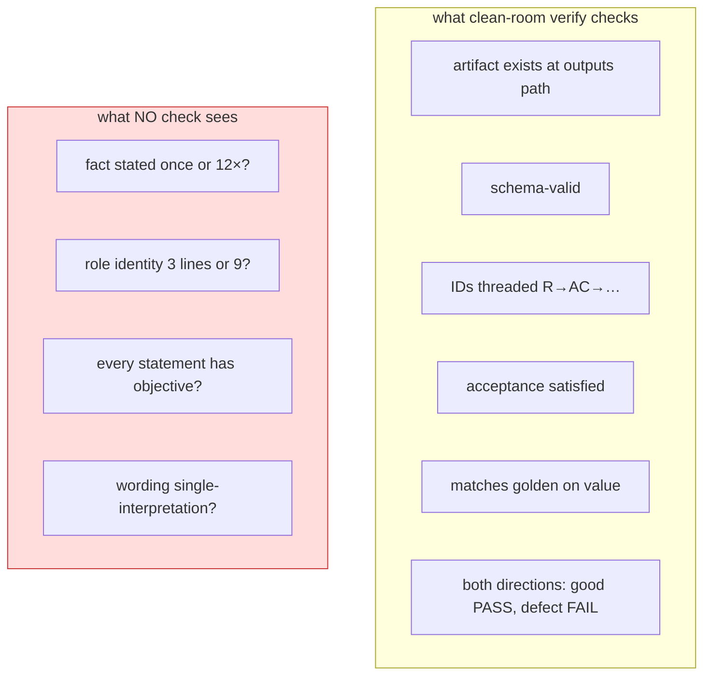
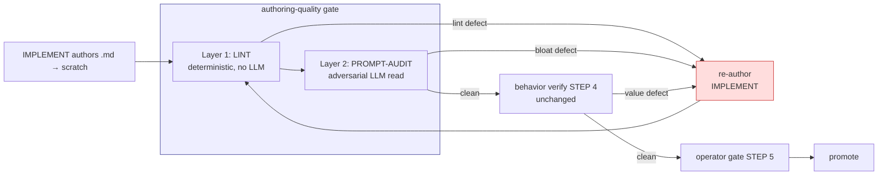
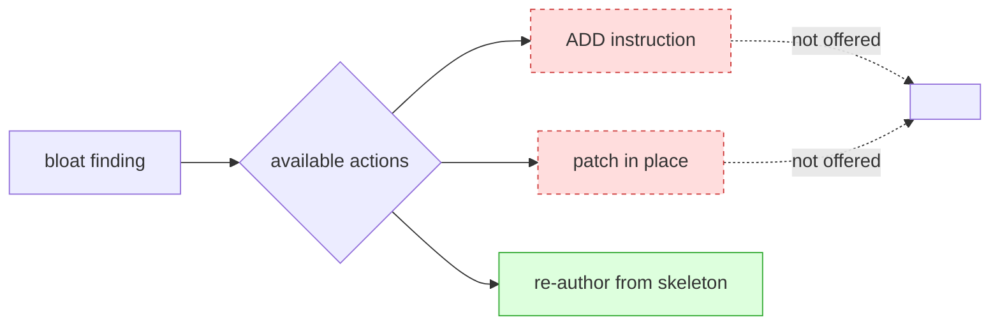

# Enforcement mechanism — make AB rules a GATE, not advice

> How to enforce P1/P2/P3 globally. Root problem first, then 3-layer design, then wiring + justification. Grounded in project canon (AB1–AB6, P5 cheapest-source, P11 LLM-verifies-not-authors, D3 disk-truth, one-role-one-prompt, D20 idempotency).

## Why bloat recurs — the root cause

ADR-0010 already nailed the FIRST root cause: old skeleton mandated 3–5 homes per fact. Fix = DRY skeleton + AB1–AB6. That fix WORKED once (−29%).

But bloat returned. SECOND root cause, not addressed by ADR-0010:

**AB1–AB6 are unenforced advice. The pipeline's only gate is value-blind to prose.**



A bloated prompt and a tight prompt produce the SAME artifact → SAME verify verdict. The agent authoring a fix has no signal that adding text is wrong; behaviorally it's free. So it adds. Every session. That is the mechanism.

**Corollary:** you cannot fix this with more canon prose alone (that's itself patch-by-adding — P1 violation in the meta). You fix it by making a check FAIL on bloat, and routing the failure to deletion.

## The 3-layer gate (cheapest source first — P5)



Order matters: lint is free (runs in ms, no tokens), runs FIRST and short-circuits the obvious. PROMPT-AUDIT spends tokens only on what survives lint. Behavior verify (the expensive clean-room sim) runs only on prose-clean prompts. Cheapest-source-first, exactly P5.

---

### Layer 1 — LINT (deterministic, mechanical)

No LLM. Pure text checks. Catches the cheap ~70% of violations the audit found (line budgets, role-identity length, `format:` essays, hedge words, Field-rules sections, escapes-in-Stop). Full spec + thresholds in `04-linter-spec.md`.

- **Why mechanical first:** these violations are STRUCTURAL — countable, regex-detectable. Spending LLM tokens on "is role identity >3 lines" wastes the model + is non-deterministic. P5: cheapest source owns the fact.
- **Output:** `lint.json` — `{violations:[{rule:AB*, file, line, evidence}], verdict:clean|blocked}`. Same shape as every other gate artifact (D3 disk-truth, schema-valid).
- **Where it runs:** orchestrator STEP 4, before spawning the clean-room runner. A lint-blocked scratch never reaches the expensive sim.

### Layer 2 — PROMPT-AUDIT (adversarial LLM, one role = one prompt)

Lint can't judge MEANING. "Every statement has an objective" (P2) and "single interpretation" (P3) and **semantic** duplication (same fact, different words — the DERIVE-TESTS ×12) need a reader. That reader is a new hostile role, modeled on the existing CRITIQUE roles.

**Why a new role, not extend CRITIQUE:** one-role-one-prompt is load-bearing canon (D1, failure isolation). Build-CRITIQUE hunts CODE cheats (hardcode/swallow/stub/under-complexity/gold-plating) — wrong category set for prose. RECONCILE-CRITIQUE gates DESIGN coherence. Neither owns prose economy. A merged role would blur two failure lanes. New role, same adversarial idiom.

**Role sketch** (full draft would be authored by the pipeline itself via self-host):

```
role: PROMPT-AUDIT
phase: 04-build            # verify stage, beside CRITIQUE
interactive: false
inputs:
  - scratch .md (the authored prompt — the DIFF under review)
  - .hld/skeleton/coding-canon.md (AB1–AB9 = the oracle)
  - .hld/skeleton/prompt-skeleton.md (the DRY scaffold = home-map)
  - lint.json (Layer-1 verdict — pre-cleared structural; AUDIT does meaning only)
outputs:
  - prompt-audit.json {verdict:clean|blocked, issues[]{category, target file:line, finding, routes_to:IMPLEMENT, fix:DELETE|REWRITE}}
```

Blocking categories (the discriminator, hostile):

| Category | Practice | Fires when |
|---|---|---|
| `duplicate-fact` | P1/AB1 | Same fact in ≥2 sections; semantic not just literal. Names the home it belongs in + the N-1 to delete. |
| `no-objective` | P2/AB7 | Statement serves no purpose — decorative narration, motivational prose, mandate restated for emphasis. |
| `mandate-narration` | P2/AB6 | Role identity narrates the mandate Rules already own; >3 lines. |
| `ambiguous` | P3/AB8 | Wording readable two ways; hedge with no crisp test ("usually", "loosely", "too big", "genuinely unsure"). |
| `re-spec` | P2/AB3 | `format:` clause re-documents upstream schema. (Lint flags length; AUDIT confirms it's a re-spec vs a legit consume-clause.) |

**Discipline (inherited from CRITIQUE roles):**
- Blocking-grade ONLY. A clean prompt is the EXPECTED outcome; don't manufacture issues.
- **FLAG + route, never edit.** AUDIT writes issues; it does NOT rewrite the prompt.
- **Every issue routes to IMPLEMENT with `fix: DELETE | REWRITE` — NEVER `ADD`.** This is the keystone (below).
- Cite concrete `file:line` + which AB rule + the home the fact belongs in.
- Anti-false-positive: a fact that legitimately appears in two PARTS of a two-pass prompt with a real per-pass delta is NOT duplicate — but the SHARED part must be factored (see "two-pass" below).

### Layer 0 — codify P2/P3 as AB7–AB9

Lint + AUDIT need an ORACLE to gate against. AB1–AB6 don't cover P2-general or P3. Add AB7 (objective-per-statement), AB8 (single-interpretation), AB9 (fix-by-deletion). Paste-ready text in `03-new-canon-rules.md`. This is Layer 0 because both gates reference it.

---

## The keystone: route = re-author, never patch (P1 made mechanical)

Every bloat finding — lint or AUDIT — carries `routes_to: IMPLEMENT, fix: DELETE|REWRITE`. The orchestrator's existing rule (STEP 4.5) already says for behavior defects: *"the defect is in the PROMPT — re-author (STEP 3), never hand-patch."* Extend that verbatim to prose defects.

**Why this enforces P1 structurally, not by exhortation:** the only action the loop offers on a bloat finding is "re-author from the DRY skeleton." There is NO patch path. An agent physically cannot fix bloat by adding a line, because the route discards the scratch and re-runs IMPLEMENT against the scaffold. P1 stops being advice ("please delete instead of add") and becomes the only available move.



## Wiring into the existing pipeline

Minimal spine touch (respects invariant #1 — configure, don't special-case):

- **`code-canon/agentic-delivery-pipeline.md` field 6 (verify mechanism):** today = "clean-room runner, both directions." Add: "AND authoring-quality gate (lint + PROMPT-AUDIT) on the prompt prose before the clean-room sim." One field edit; the profile is the designed extension point.
- **`_orchestrator.md` STEP 4:** insert Layer-1 lint + Layer-2 AUDIT before the runner spawn. Both write disk artifacts (`lint.json`, `prompt-audit.json`) → D20 idempotent, resume-safe, re-derive from disk.
- **No new state file, no bookkeeping.** Both verdicts are disk artifacts the next STEP-0 scan reads — same pattern as every other gate. Honors the orchestrator's "no bookkeeping" mandate (these are gate outputs, not trackers/changelogs).

## Addressing the obvious objection

> Orchestrator says repeatedly "no anti-bloat ceremony." Doesn't this re-introduce the retired ceremony?

No. The RETIRED thing (ADR-0010, orchestrator) was a **post-promotion manual compression hand-loop + status-file bookkeeping**. This is a **pre-promotion automated GATE** — a verify dimension, not a ceremony, not a tracker. ADR-0010's own remedy was "author DRY from the start"; that remedy currently has zero teeth because nothing fails a non-DRY prompt. This gate gives the existing remedy teeth. It is the missing half of ADR-0010, not a reversal of it.

Distinction, sharp:

| Retired (ceremony) | Proposed (gate) |
|---|---|
| Runs AFTER promote | Runs BEFORE promote |
| Manual hand-loop | Automated, disk-in/disk-out |
| Writes status/changelog bookkeeping | Writes a gate verdict artifact (like every gate) |
| Compresses shipped prose | FAILS bloated scratch, routes to re-author |
| Optional, skippable | Blocks the gate (both-directions, like verify) |

## Both-directions discrimination (mirror the verify mandate)

Project requires every verifier prove it discriminates: known-good PASSes, planted-defect FAILs (`code-canon` note). Apply to the new gate too:
- A tight reference prompt → PROMPT-AUDIT `clean`.
- A planted-bloat copy (one fact duplicated into a 4th home) → PROMPT-AUDIT `blocked`, names the duplicate.
- If AUDIT can't tell them apart, AUDIT is broken — fix it before trusting it. Same bar as the behavior verifier.

## Justification recap (each layer → a project principle)

| Layer | Project principle it honors |
|---|---|
| Lint first | P5 cheapest-source-first |
| AUDIT = LLM flags, IMPLEMENT fixes | P11 LLM verifies, never authors truth |
| New role, not merged | D1 one-role-one-prompt, failure isolation |
| Route = re-author only | P1 + orchestrator STEP 4.5 (defect in prompt, never patch) |
| Disk artifacts, no tracker | D3 disk-truth, D20 idempotent resume, no-bookkeeping |
| Profile field 6 edit | invariant #1 configure-don't-special-case |
| Both-directions | code-canon verify mandate |
