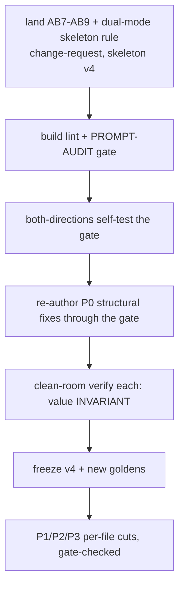

# Remediation backlog — prioritized fixes, deletable-in-N-1

> Concrete per-file cuts the audit found. All DELETE/REWRITE (never ADD — AB9). Each keeps the canonical home, deletes the copies. Est. savings rough. **Apply only after AB7–AB9 land + gate exists** (else drift returns). Do-not-commit.

## Priority 0 — structural (fixes many files at once)

| # | Fix | Affects | Why first |
|---|---|---|---|
| S1 | **Dual-mode skeleton: shared Rules ONCE + per-pass delta.** Add the prompt-skeleton rule (`03-new-canon-rules.md`), re-author 03-hld so Part A/B share one Rules block. | all 8 03-hld | biggest line driver; ~30-40% of each two-pass prompt is A↔B copy |
| S2 | **Role identity → ≤3 lines, delete the load-bearing paragraph (it = Rule 1).** | all 8 04-build + RESOLVE-LOCAL, RECONCILE-CRITIQUE | mechanical (lint C2); paragraph is verbatim Rule 1 |
| S3 | **Delete schema-footer prose ("On a clean run X==Y...").** Comments are the doc (AB5). | most 04-build + 03-hld | mechanical (lint C5); pure duplication |
| S4 | **Delete lane from role identity + Stop; keep only in "Stay in lane" Rule.** | every schema-bearing prompt | the universal triple |
| S5 | **Stop condition: "guard tripped → HALT (escapes)", delete guard re-enumeration.** | RE-RANK, DERIVE-TESTS, several 03-hld | AB2; mechanical (lint C6) |

## Priority 1 — worst single-fact offenders (per-file)

### DERIVE-TESTS.md (331 → ~210 est)
- "design-layer oracle NOT aPRD oracle" ×12 → keep A-Rule2 + schema `layer` field; DELETE role-L54 prose, B-Rule5 (link to A), scattered.
- 8-item lane list verbatim A-Rule9 L82 + B-Rule10 L240 → factor to shared (S1).
- `format:` L14/L19 brace-lists → trim to one consume-clause (AB3).
- Stop L205-207 guard re-list → S5.

### RESOLVE-LOCAL.md (327 → ~215)
- escalation rule ×4 (role L56, disc L81, A-Rule4 L89, B-Rule8 L244) → keep Rule4; delete 3.
- drafts-then-freeze mechanism ×3 (§L65-71, Rule9 L94, Stop L215) → keep the section; delete Rule/Stop copies.
- role L55-56 Phase-2 recap → DELETE (decorative, AB6/AB7).
- "never import recalled market claim" ×3 → one grounding bullet (AB4).

### MODEL-DATA.md (270 → ~175)
- "never mints E*" ×6 → keep Rule5 + schema comment; delete input/escape/B-test/Rule9 copies.
- `WRONG: "fields":[{name,type}]` verbatim twice (L71, L182) → keep once (lint C7).
- field-deferral ×5 → keep Rule5 + schema; delete rest.

### MODEL-FLOWS.md (287 → ~190)
- "flow can't be drawn = DEFECT" ×4 (role L51, step L67, A-Rule1 L74, B-Rule1 L191) → keep Rule1.
- exclusion section L187-188 + Rule7 L197 (membership gate twice) → keep one.
- failure-variant-MANDATORY ×4 → S1 shared.

### MAP-NFR.md (265 → ~175)
- anti-gold-plating ×5 → keep disc + Rule6 + schema; delete role/B-test/Rule5.
- `WRONG: Redis LRU cache` verbatim twice (Rule3 L70, Rule6 L176) → once.

### RECONCILE-CRITIQUE.md (264 → ~180)
- "RE-DERIVE from PRIMARY, ignore self-report" — full section in BOTH passes (L83-86, L177-180) → one shared (S1).
- 7 blocking categories re-specified A (L74-81) + B (L166-174) → A owns; B = delta (category 8 + slice-scope) only.
- role L60-61 adversary narration → trim (AB6/AB7).

### INTEGRATE.md (166 → ~120)
- "carry framework, don't re-pick" ×4 (product4 L49, Rule4 L57, Rule5 L58, schema L103) → keep Rule4 + schema; delete product + Rule5.
- role L43 embeds escape policy (= escapes frontmatter + Rule4) → trim (AB2/AB6).

### aprd VERIFY.md (138 → ~100)
- "never re-reconcile / carry verbatim" ×5 → keep Rule1.
- `not-version-bound iff setting null` ×3 → keep schema comment.
- "(= 14 for standard input)" L52 → mark illustrative or cut (AB8).

## Priority 2 — recurring across 00-aprd / 01-roadmap / 02-adr

- **00-aprd:** `format:` re-specs (EXTRACT-RULES L7, RECONCILE L7, EXTRACT L8, CLASSIFIER L11) → trim. Edge-cases re-prosing schema (aprd CRITIQUE L95-99, QUESTION-GEN L79-82) → DELETE. CLASSIFIER "never guess silently" role+Rule4 → keep Rule4.
- **01-roadmap:** ordering tuple ×4 (SEQUENCE disc L30/Rule3 L36/step L47/schema L86) → keep disc + schema. value-carried-verbatim ×4-5 → keep one Rule. FOUNDATION-CUT "name category never decide" ×6 → keep Rule2. SEQUENCE-REVIEW slack formula ×3 → keep the section.
- **02-adr:** lane triple (every file). caveman footer per-schema (SYNTHESIZE-ADR L107+L142, others) → S3/C8. SYNTHESIZE-ADR Rule6 ≈ Rule1 → merge. DIAGNOSE disc≈Rules → keep one.

## Priority 3 — non-prompt artifacts

- **specs:** each rule in principle-table + stage-prose + §8 prompt-block + §12 failure-table = ~4 homes. Keep principle-table + glossary; prompt-blocks should LINK to stage §, not re-document. spec-03 H14 ×6, spec-00 slicing ×5.
- **docs:** idempotency/oracle facts triplicated (generic-guide + self-host-guide + workflow). State once (generic), reference. Delete rhetorical narration (workflow L19/L49).
- **ADRs:** Decision blocks should RECORD a decision, not narrate the session. ADR-0019 L13 → cut TODO + status-narration. ADR-0010 → cite "AB1-AB6 (coding-canon)" not re-derive. Increment ADRs (0015-0019) → state H14 carry-by-reference pattern ONCE (0014/0015), later cite.

## Sequencing (do not just start cutting)

**Hard rule:** every cut goes THROUGH the new gate + clean-room verify — proving behavior invariant (only duplication dies, ADR-0010's bar). Never cut-and-promote blind; that's how the retrofit's behavior-preservation went unverified ("re-test SKIPPED", ADR-0010 L16). The gate makes "compression must not change behavior" checkable, not assumed.

## Est. aggregate

| Tree | Now (ln) | Est. after | Cut |
|---|---|---|---|
| 03-hld (8) | ~2219 | ~1450 | ~35% |
| 04-build (8) | ~1304 | ~950 | ~27% |
| 00-aprd (9) | ~954 | ~820 | ~14% |
| 01-roadmap (7) | ~831 | ~700 | ~16% |
| 02-adr (7) | ~892 | ~760 | ~15% |

Bulk of the win is 03-hld two-pass de-duplication (S1). Matches ADR-0010's earlier −29%; the difference is THIS time a gate keeps it from creeping back.
