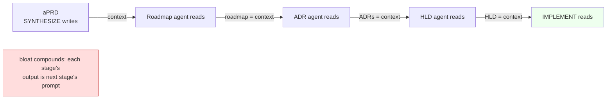
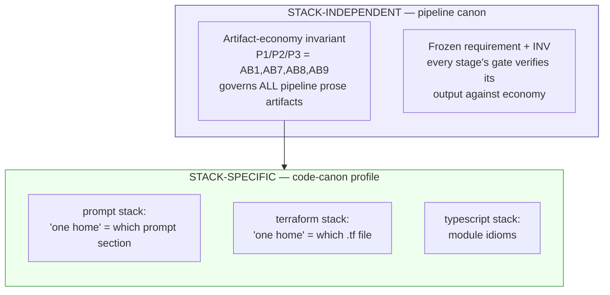
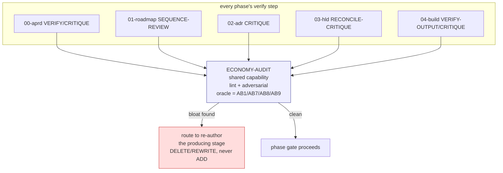

# Artifact economy — generalize the discipline to ALL produced artifacts, ALL projects

> Scope correction. Files 00–05 scoped the discipline to PROMPT prose (the self-host deliverable). Too narrow. The pipeline's intermediate artifacts (aPRD, ADR, HLD, roadmap) are produced by one agent and **loaded into the next agent's context** — they ARE prompt fragments. Bloat there = context bloat, same disease. And the ADS builds OTHER systems, so the rule must be generic, not a self-host special case. This file generalizes.

## The unifying principle

**Every artifact the pipeline emits is downstream prompt context. Author it to the same economy bar as a prompt.**

A pipeline artifact is not documentation-for-humans first. Its primary consumer is the NEXT agent: SYNTHESIZE's aPRD → SLICE-EXTRACT reads it; EVALUATE-DECIDE's ADR → DERIVE-COMPONENTS reads it; the HLD → IMPLEMENT reads it. Each artifact lands in a context window and competes for the model's attention with the actual task. So bloat in an ADR is bloat in IMPLEMENT's prompt — one step removed, same cost:

Bloat compounds along the chain. A verbose ADR doesn't just cost its own tokens — it dilutes every downstream agent that loads it. The disease is worse for artifacts than for prompts, because artifacts are read MORE times by MORE agents.

**My own audit (file 02) already confirms the disease is present in non-prompt artifacts:** spec-03 states H14 six times; ADR Decision blocks (0019, 0010) narrate whole working sessions + embed TODOs; docs triplicate idempotency facts across three files. The user's concern is empirically verified, not hypothetical.

## Two consequences

1. **Economy applies to every artifact every stage produces** — not just the prompt deliverable. aPRD, ADR bodies, HLD specs, roadmap, data-model, contracts prose, test-spec prose, build records' prose fields — all of it.
2. **Economy applies to every PROJECT the ADS builds** — not just self-host. The ADS is a generic engine (P3 — one spine, swappable playbooks). When it builds a terraform system or a typescript app, it still emits a PRD, ADRs, an HLD — same prose artifacts, same downstream-context role, same disease. The bar must travel with the engine, not live in the self-host config.

## Caveman + Economy — both ABSOLUTE, no exception — kill the loophole first

Canon contradicts itself on artifacts. Resolve in favor of the absolute mandate:

- **CLAUDE.md** (correct): caveman register governs "all artifact prose (spec/ADR/prompt/doc bodies)".
- **Every prompt's Register block** (wrong, DELETE): *"Exception: artifact content (specs, JSON/YAML, ADR bodies) stays clean and complete. Caveman governs narration, not the deliverable."*

The exception is killed. **Caveman is an absolute mandate on EVERY artifact, incl human-facing.** Rationale:
- condensed text reads faster (human + agent);
- a "human-facing" artifact is still ingested by agents downstream — it IS prompt context (P13);
- need a different prose style for a human consumer → a SEPARATE agent OUTSIDE the pipeline rewrites that one artifact. Restyling is an external post-process, NEVER a reason to relax caveman inside the system.

Register + economy are TWO separate properties — but BOTH are absolute + consumer-independent:

| Property | What it controls | Consumer-dependent? |
|---|---|---|
| **Register** (caveman) | terse style — drop articles/filler | **No** — all prose, all artifacts, incl human-facing. External restyle only. |
| **Economy** (P1/P2/P3 = AB1/AB7/AB8/AB9) | one home per fact · every statement has objective · single interpretation | **No** — all prose regardless of register or consumer |

Both bind every artifact, independently: a text can be caveman-terse yet still bloated (repeats a fact) — economy fails it; or economical yet full-sentence — register fails it. Both must hold. The old loophole ("artifact stays complete" → agents read it as "say everything, repeat freely, full prose") vanishes because there is no exception left to misread.

**Rule:** caveman (register) AND economy (AB1, AB7, AB8, AB9) are both universal, consumer-independent, absolute. No artifact is exempt from either. Different human prose = external rewrite, outside the system.

## Where the discipline must LIVE (architectural relocation)

Today AB1–AB6 live in `.hld/skeleton/coding-canon.md` framed as **"prompt-domain idioms (D21 field 2)"** and surface in `code-canon/agentic-delivery-pipeline.md` under the PROMPT stack's "coding canon" field. That binds economy to ONE stack. Wrong home for a universal rule.

Split by what's universal vs stack-specific:

- **Universal layer (new):** economy is a first-class pipeline property. Two homes:
  1. A **core principle** in the spec (`P13 — every artifact is downstream context; author to context-economy`), table in `00-…-spec.md §2`. Stack-independent, applies to every project.
  2. A **cross-slice invariant** (INV) the foundation-cut carries, so VERIFY-OUTPUT's NFR-wiring check (which already exists) measures every stage's output against it. Economy becomes an NFR (`A*`) that threads `R → AC → … → gate` like everything else — not a soft guideline.
- **Stack-specific layer (keep):** the code-canon profile keeps only what "one home" MEANS for that stack's CODE unit (a prompt section vs a `.tf` resource vs a TS module). The ECONOMY rule itself moves up; only its stack-local realization stays in the profile.

This makes economy survive a stack swap. A terraform project the ADS builds inherits P13 + the INV automatically; its profile only fills in terraform-local specifics.

## Generalize the gate — ONE auditor, invoked everywhere (don't copy it 5×)

File 01 proposed PROMPT-AUDIT in 04-build. That's now seen as **one instantiation** of a general capability for the prompt stack. The general form:

**A single reusable artifact-economy auditor (lint + adversarial pass), parameterized by {artifact, economy-canon}, invoked by EVERY phase's existing verify gate.**

Copying an economy check into all five phase gates would itself violate AB1 (one home per fact — the meta-irony). Instead, one auditor, five callers:

- **Lint layer** (file 04) generalizes: line/section budgets, hedge wordlist, duplicate-phrase, "every statement maps to a downstream use" heuristics — applied to ANY artifact, not just `.md` prompts. Per-artifact-type thresholds live in the stack profile.
- **Adversarial layer** = the general ECONOMY-AUDIT role (PROMPT-AUDIT was its prompt-stack name). Hostile, blocking-grade, FLAG-not-fix, **routes to re-author the producing stage** (AB9 keystone — no patch path).
- Each phase's gate already exists and is adversarial (CRITIQUE/VERIFY family). Economy is a DIMENSION they all delegate to the shared auditor — one home for the check, five invocation points. DRY by construction.

## Economy ≠ truncation — the substance floor (both directions)

Critical guard. The goal is RIGHT-SIZED-for-the-consumer, not shortest. Over-compression that drops a load-bearing fact is ALSO a defect — and a worse one (a missing requirement ships silently; a duplicated one only wastes tokens). The auditor's both-directions discrimination (mirror the verify mandate) must catch BOTH:

| Direction | Defect | Auditor must FAIL |
|---|---|---|
| over | bloat — fact stated N×, no-objective prose, ambiguity | planted-duplicate copy |
| under | starvation — load-bearing fact deleted, ambiguity from terseness | planted-omission copy (a dropped R*/constraint/edge) |

The bar is **"every fact present exactly once, stated precisely, nothing decorative"** — substance invariant (ADR-0010's own rule: "only duplication dies"). An auditor that just rewards shortness would amputate substance. It must prove it discriminates over-AND-under before trusted, exactly as the behavior verifier does.

## Per-project inheritance (how a client project gets this for free)

When the ADS builds a non-self-host project:

1. P13 (economy principle) is in the spec → every project's aPRD synthesis inherits it as a standing NFR.
2. The economy INV is cut into that project's foundation-cut by default (it's cross-cutting, like security/auth).
3. The project's stack profile (terraform/typescript/…) fills in stack-local "one home" specifics.
4. The shared ECONOMY-AUDIT runs at every phase gate of that project, same as self-host.

Result: every artifact the ADS ever emits — for itself or any client — is economy-gated. The discipline ships with the engine.

## Corrections to files 00–05

- **File 01:** PROMPT-AUDIT is reframed — it's the prompt-stack instantiation of the general ECONOMY-AUDIT, invoked by 04-build's gate. The general capability (this file) is the parent; PROMPT-AUDIT is one caller's view.
- **File 03:** AB7–AB9 must be authored as **stack-independent pipeline canon** (spec P13 + INV), not as additions to the prompt-only `coding-canon.md`. The prompt `coding-canon.md` then REFERENCES them (cheapest-source: one home, profile cites it).
- **File 04:** lint generalizes from "`.md` prompt checks" to "per-artifact-type economy checks"; thresholds parameterized by artifact type in the stack profile.
- **File 02:** the non-prompt-artifact findings (specs H14 ×6, ADR session-narration, doc triplication) are NOT a side note — they are the core evidence that artifact economy needs the same gate as prompt economy.

## One-line statement of the generalized rule

> Treat every produced artifact as the next agent's prompt. Economy (one home, every statement earns its place, single interpretation) is a universal, stack-independent, project-independent invariant — gated at every phase by one shared auditor, both-directions, routing always to re-author.
