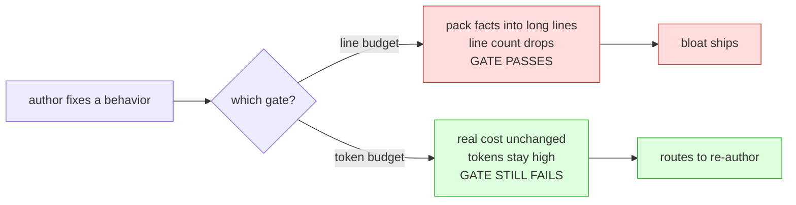

# 07 — Bloat metric: tokens, not lines (C1 fix)

> Do-not-commit. Caveman register. Closes a gaming hole in the Layer-1 lint (T04 / `04-linter-spec.md` check **C1**).

## PROBLEM

Line count was introduced as bloat tripwire (C1: WARN >150, BLOCK >220 lines). System games it: **fewer lines, each line longer.** Cut a prompt under the line cap by packing facts into mega-lines — same context cost, passes the gate.

Root: **line ≠ unit of cost.** Context window pays per TOKEN, not per newline. A newline is free to add and free to omit. Counting lines counts the one thing that doesn't matter.

## EVIDENCE (corpus, `prompts/*.md`, 42 files)

```
char/line spread:   min 78   median 134   max 190   (spread = 83% of median)
token-proxy (÷4):   p50 4122   p75 5453   p90 7895   max 10810
```

- **83% spread** = same line budget buys 2.4× the real cost depending on packing. The metric has no fixed meaning.
- **Rank inversion** — line-rank disagrees with cost-rank:

| Prompt | lines | chars | ~tokens | line-gate verdict | cost-rank |
|---|---|---|---|---|---|
| RECONCILE-CRITIQUE | 238 | 43241 | ~10810 | **passes block** (238<… warns) | **#1 heaviest** |
| DERIVE-TESTS (named worst) | 262 | 29436 | ~7359 | blocks (262>220) | #7 |

Line gate flags the lighter file, clears the heaviest. Backwards.



## DECISION

**C1 budgets TOKENS, not lines.** Tokens = the actual context-window cost; un-gameable by line packing (a long line costs proportionally more tokens). Line count stays REPORTED in `counts` (informational), but the GATE moves to tokens.

Token estimate stays **deterministic + zero-dep** (lint mandate: no LLM, byte-identical runs — D22 helper-tool contract). Proxy: `est_tokens = ceil(content_chars / 4)` (content = non-frontmatter, non-blank lines, mirroring old C1 scope). `÷4` = standard English BPE rule-of-thumb; caveman is denser so this slightly UNDER-counts → conservative, never false-blocks. Upgrade path (optional): vendor a real BPE tokenizer — still deterministic, still D22-compliant — if proxy drift ever matters. Not needed for a budget tripwire.

### Threshold mapping (preserve calibration, kill the gaming)

Convert existing line thresholds at corpus **median density (134 char/line)** so the effective ceiling is unchanged — only the gameable axis flips:

| | line (old) | × median 134 char | ÷4 | token (new) |
|---|---|---|---|---|
| WARN | >150 | 20100 | 5025 | **>5000** |
| BLOCK | >220 | 29480 | 7370 | **>7500** |

Tunable per phase w/ justification (unchanged policy). C1 stays **signal-grade** (WARN→BLOCK, override-on-justification) — a long prompt CAN be legit; the budget is a tripwire, not a verdict. Real economy enforcement is still C2–C9 (duplication, hedge, re-spec) + AUDIT (semantic dup). Token budget only fixes the COARSE tripwire.

### Why this is the right metric, not just a bigger one

- **Lines** — gameable (newline free), 83% cost-variance, ranks backwards. ✗
- **Chars/words** — un-gameable by packing, but off from true cost by markup/code density. OK proxy.
- **Tokens** — IS the cost the context window pays. The invariant we actually care about. ✓ Measure the thing, not a proxy of a proxy.

Per-line-length cap was considered + rejected: tokens SUBSUME it. Once the budget counts tokens, packing a line no longer dodges anything → no separate per-line rule needed (AB1: one home for the check).

## SCOPE OF CHANGE

- `tools/economy-lint/lint.mjs` — C1 gates `est_tokens`; profiles gain `tokenBudget`; `counts` reports `est_tokens` + keeps `lines_total`.
- `tools/economy-lint/selftest.mjs` — C1 defect inflates tokens past block; ADD a **gaming defect** (few mega-lines, low line count, high tokens) → must still block. Proves the fix.
- `tools/economy-lint/README.md`, `tasks/T04-build-layer1-lint.md`, `04-linter-spec.md` — C1 text: lines→tokens.
- Non-prompt `artifact` profile: same flip (line→token budget).

DO NOT COMMIT.
