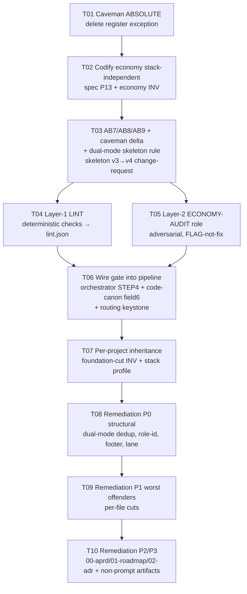

# Tasks index — make artifact economy a GATE, not advice

> Do-not-commit. Analysis + planning only. Caveman register throughout.
> Each `T*.md` is SELF-CONTAINED: full context inside, no need to read sibling files or `00-summary.md`..`06-*.md`.

## Problem (one paragraph)

Agents fix prompt/artifact behavior by ADDING text → prose bloats. Project ALREADY has right canon (AB1–AB6 anti-bloat rules + DRY prompt skeleton). But rules are ADVISORY, not GATED. Only gate the pipeline runs (clean-room verify) judges artifact VALUE/behavior — never reads prose for economy. Bloated prompt + tight prompt produce same artifact → same verdict → adding text is behaviorally free → bloat returns every session. Fix: make a check FAIL on bloat, route the failure to deletion/rewrite (never patch-by-add).

## The bar — three practices, generalized to ALL prose

| # | Practice | Statement | Canon rule |
|---|---|---|---|
| **P1** | Delete/rewrite, never patch-by-add | Wrong behavior → cut/rewrite offending text. Never bolt on another instruction. | AB1 (placement) + **AB9** (action) |
| **P2** | Every statement has an objective | Each line earns place by clear purpose. No decorative narration, no mandate-restated-for-emphasis. | AB3/5/6 (cases) + **AB7** (general) |
| **P3** | One interpretation only | Most precise wording. Readable two ways = defect. | **AB8** (wholly new) |

Economy = universal, stack-independent, project-independent invariant. Caveman register = ALSO absolute: governs every artifact incl human-facing (condensed reads faster; every artifact is also agent-ingested context). No register exception. Different human prose = a separate agent OUTSIDE the system rewrites that one artifact. Register + economy are two separate properties, both consumer-independent, both bind every artifact.

## Task DAG (sequence — file 05 hard rule: canon → gate → self-test → re-author → verify)

## Task list

| Task | Deliverable | Touches |
|---|---|---|
| `T01` | Caveman made absolute; register exception DELETED everywhere | CLAUDE.md, every prompt Register block, coding-canon |
| `T02` | Economy = first-class pipeline canon: P13 principle + cross-slice economy INV (A*) | `.aprd/specs/*` §2, aPRD change-request |
| `T03` | AB7/AB8/AB9 + caveman delta + dual-mode skeleton rule, frozen as skeleton v4 | `.hld/skeleton/*`, skeleton change-request |
| `T04` | Deterministic economy linter (Layer 1), `lint.json` contract, both-directions self-test | new linter unit + spec |
| `T05` | Adversarial ECONOMY-AUDIT role (Layer 2) + PROMPT-AUDIT instantiation, both-directions + substance-floor self-test | new prompt role |
| `T06` | Gate wired pre-promote; routing keystone (fix=DELETE/REWRITE, never ADD) | `_orchestrator.md`, `code-canon/agentic-delivery-pipeline.md` |
| `T07` | Economy inherited by every project the ADS builds | foundation-cut default INV + stack profiles |
| `T08` | Re-author P0 structural fixes through the gate (biggest line driver) | all 8 03-hld, all 8 04-build + 2 |
| `T09` | Re-author P1 worst single-fact offenders | DERIVE-TESTS, RESOLVE-LOCAL, MODEL-DATA, MODEL-FLOWS, MAP-NFR, RECONCILE-CRITIQUE, INTEGRATE, aprd VERIFY |
| `T10` | Re-author P2/P3 recurring + non-prompt artifacts | 00-aprd, 01-roadmap, 02-adr, specs, docs, ADRs |

## Hard rules binding all tasks

- **Routing keystone (the keystone of the whole improvement):** every bloat finding carries `fix: DELETE | REWRITE` — NEVER `ADD`. Loop offers no patch path. Re-author from DRY skeleton is the only move. This IS P1/AB9 made mechanical.
- **Both-directions discrimination** (mirror verify mandate): each gate proves it discriminates — tight prose PASSes, planted-bloat FAILs, AND planted-omission FAILs (substance floor: economy ≠ truncation).
- **Immutability:** frozen artifacts (`aprd.frozen.md`, `skeleton.frozen.md`, `.adr/log/*`, `*.lock`) never overwritten in place. A change = new signed version + change-request re-triggering downstream. T02/T03 carry this.
- **Every cut goes THROUGH the gate + clean-room verify** — behavior invariant (only duplication dies). Never cut-and-promote blind.
- **Do-not-commit.** All tasks analysis/planning artifacts; no git commit unless operator says so.
