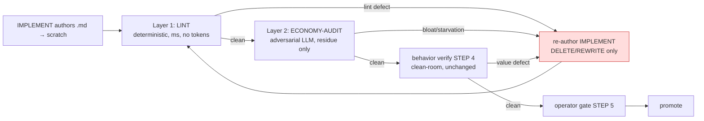

# T06 — Wire the economy gate into the pipeline + the routing keystone

> Do-not-commit. Caveman register. SELF-CONTAINED.

## WHY (problem)

Lint (T04) + ECONOMY-AUDIT (T05) exist but enforce nothing until wired BEFORE promote. And the keystone of the whole improvement: a bloat finding must route to RE-AUTHOR (delete/rewrite), with NO patch path — that is P1/AB9 made mechanical. An agent physically cannot fix bloat by adding a line because the only available action discards the scratch and re-runs IMPLEMENT against the DRY skeleton.


Order = cheapest-source-first (P5): lint (free) short-circuits the obvious; AUDIT spends tokens only on lint-clean; behavior verify (expensive sim) runs only on prose-clean.

## SCOPE

Minimal spine touch (respect invariant #1 — configure, don't special-case). Wire lint + AUDIT into the existing verify stage; extend the existing re-author route to cover prose defects. Generalize so EVERY phase gate delegates to the ONE shared auditor (don't copy the check 5×).

Does NOT build lint/audit (T04/T05). Does NOT re-author prompts (T08–T10).

## GIVEN (current state, exact wiring points)

- `code-canon/agentic-delivery-pipeline.md` — "six fields" table. **Field 6 (verify mechanism)** currently = "Clean-room runner simulation … both directions." This profile is the designed extension point; spine reads it, never special-cases (invariant #1).
- `prompts/_orchestrator.md`:
  - **STEP 4** (L66–72) — "Verify clean-room against the fixtures." L72: *"Flaw ⇒ the defect is in the PROMPT, not the artifact. Re-author (STEP 3). Never hand-patch."* ← the existing re-author route (STEP 4.5 behavior).
  - **STEP 3** (L62–65) — IMPLEMENT authors to SCRATCH, never over shipped file.
  - **STEP 5** (L74–80) — operator gate.
  - L102: "No bookkeeping file, ever … no anti-bloat ceremony." ← must NOT be violated (see objection below).
- Every phase has an adversarial verify gate already: 00-aprd VERIFY/CRITIQUE, 01-roadmap SEQUENCE-REVIEW, 02-adr CRITIQUE, 03-hld RECONCILE-CRITIQUE, 04-build VERIFY-OUTPUT/CRITIQUE.

## DO

1. **code-canon field 6 edit** (one field, the designed extension point). Append to verify mechanism: *"AND authoring-quality gate (Layer-1 lint + Layer-2 ECONOMY-AUDIT) on the artifact prose BEFORE the clean-room sim. Both write disk verdicts (`lint.json`, `economy-audit.json`); both run both-directions."*

2. **Orchestrator STEP 4 insert** — before spawning the clean-room runner:
   - **STEP 4.0a** run Layer-1 lint on scratch → `lint.json`. `blocked` → route to STEP 3 re-author, SKIP the expensive sim.
   - **STEP 4.0b** if lint `clean`, spawn ECONOMY-AUDIT on scratch → `economy-audit.json`. `blocked` → route to STEP 3 re-author.
   - **STEP 4.1+** only prose-clean scratch reaches the existing clean-room value-verify (unchanged).
   - Both verdicts are DISK ARTIFACTS the next STEP-0 scan reads — no new state file, idempotent, resume-safe (D20). NOT a tracker/changelog.

3. **Extend the routing keystone (STEP 4.5 / STEP 3)** verbatim to prose defects:
   - Existing rule: behavior defect → defect is in the PROMPT, re-author, never hand-patch.
   - Extend: a prose/bloat/starvation finding ALSO routes to STEP 3 re-author against the DRY skeleton. `fix` is always `DELETE | REWRITE`. There is NO patch path; the scratch is discarded + IMPLEMENT re-runs. Retry budget shared with behavior (3 → HALT, report, do not promote).

   ```mermaid
   flowchart LR
       F[bloat / starvation finding] --> R{available actions}
       R --> X1[ADD instruction]:::no
       R --> X2[patch in place]:::no
       R --> Y[re-author from DRY skeleton]:::yes
       classDef no fill:#fdd,stroke:#c33,stroke-dasharray:4 4
       classDef yes fill:#dfd,stroke:#3a3
   ```

4. **Generalize — ONE auditor, five callers (don't copy the check).** Copying an economy check into all 5 phase gates would itself violate AB1. Instead: each phase's existing verify gate DELEGATES the economy dimension to the shared ECONOMY-AUDIT (T05), parameterized `{artifact, economy-canon}`. One home for the check, five invocation points. Lint thresholds per artifact-type come from the stack profile.

   ```mermaid
   flowchart TD
       G0[00-aprd VERIFY/CRITIQUE] --> EA
       G1[01-roadmap SEQUENCE-REVIEW] --> EA
       G2[02-adr CRITIQUE] --> EA
       G3[03-hld RECONCILE-CRITIQUE] --> EA
       G4[04-build VERIFY-OUTPUT/CRITIQUE] --> EA
       EA[ECONOMY-AUDIT<br/>shared, oracle = AB1–AB9 + P13] -- bloat --> RE[re-author producing stage<br/>DELETE/REWRITE, never ADD]
       EA -- clean --> PASS[phase gate proceeds]
   ```

## ADDRESS the obvious objection (so the wiring isn't rejected)

Orchestrator repeatedly bans "anti-bloat ceremony / bookkeeping". This gate is NOT that. The RETIRED thing = a post-promotion MANUAL compression hand-loop + status-file bookkeeping. This = a PRE-promotion AUTOMATED gate, disk-in/disk-out, writing a gate VERDICT (like every gate), blocking both-directions. ADR-0010's own remedy was "author DRY from the start" — this gives that remedy teeth. It is the missing half of ADR-0010, not a reversal.

| Retired (ceremony) | This (gate) |
|---|---|
| Runs AFTER promote | Runs BEFORE promote |
| Manual hand-loop | Automated, disk-in/disk-out |
| Writes status/changelog | Writes a gate verdict artifact |
| Compresses shipped prose | FAILs bloated scratch, routes to re-author |
| Optional/skippable | Blocks the gate (both-directions) |

## ACCEPTANCE

- code-canon field 6 names the authoring-quality gate; no other field special-cased.
- Orchestrator STEP 4 runs lint → AUDIT → clean-room, in that order; blocked at any layer routes to STEP 3.
- Routing keystone extended: prose defect → re-author, `fix` never `ADD`, no patch path.
- `lint.json` + `economy-audit.json` are disk verdicts, NOT trackers; STEP-0 re-derives from disk; no status pointer / changelog added.
- Shared auditor invoked by all 5 phase gates; the check has ONE home (no copy-5×).
- Both-directions still mandatory at this gate (verdict trusted only if it discriminates).

## DEPENDS ON / BLOCKS

- Depends on: T04 (lint), T05 (auditor).
- Blocks: T07 (per-project inheritance reuses this wiring), T08–T10 (every cut goes THROUGH this gate).

## OUT OF SCOPE

Building lint/auditor (T04/T05). Per-project foundation-cut INV (T07). Re-authoring (T08–T10).

---

## STATUS: DONE (not committed)

Wiring-only. No tool/prompt re-authored (T04/T05/T08–T10 out of scope). 5 phase-gate prompt bodies untouched (re-author = T08–T10) — generalization declared as delegation CONTRACT in the shared home, not copied into gates.

### Changes (4 edits, 2 files)

**`code-canon/agentic-delivery-pipeline.md` (the designed extension point):**
1. **Field 6 (verify mechanism) cell** — appended authoring-quality gate: Layer-1 lint + Layer-2 ECONOMY-AUDIT BEFORE clean-room sim (P5); both write disk verdicts (`lint.json`, `economy-audit.json`), both both-directions, `blocked` short-circuits the sim. Source col gains `tools/economy-lint/` + `prompts/_economy-audit.md`. No other field touched.
2. **Verbatim-shape block** — mirrored: sim PRECEDED by the gate (same field, one home).
3. **Notes** — two notes: (a) verdicts are gate artifacts NOT trackers (STEP-0 re-derives); (b) **ONE shared auditor, five callers** — every phase gate (00→04) DELEGATES economy to shared `ECONOMY-AUDIT` `{artifact, economy-canon}`; copying 5× would break AB1; lint thresholds per artifact-type from THIS profile; finding → producing-stage re-author, `fix DELETE|REWRITE` never `ADD`.

**`prompts/_orchestrator.md`:**
4. **STEP 4** — reframed as THREE layers cheapest-first: 4.0a lint→`lint.json` (`blocked`→STEP 3, skip rest); 4.0b ECONOMY-AUDIT→`economy-audit.json` only if lint clean (`blocked`→STEP 3); 4.1+ clean-room sim (existing 1–5, unchanged) on prose-clean scratch only. Intro addresses the ceremony objection inline (pre-promote/automated/verdict vs retired post-promote/manual/status).
5. **STEP 4 item 5 — routing keystone** — extended verbatim to bind ALL layers: behavior OR prose/bloat/starvation flaw → defect in PROMPT → re-author against DRY skeleton, scratch DISCARDED + IMPLEMENT re-runs, `fix DELETE|REWRITE` never `ADD`, no patch path, ONE shared retry budget (3 → HALT).
6. **RULES "no anti-bloat ceremony" line** — clarified gate ≠ banned ceremony (avoids self-contradiction).

### Acceptance check

- [x] field 6 names the gate; no other field special-cased.
- [x] STEP 4 runs lint → AUDIT → clean-room in order; `blocked` at any layer → STEP 3.
- [x] keystone extended: prose defect → re-author, `fix` never `ADD`, no patch path.
- [x] `lint.json`+`economy-audit.json` = disk verdicts, STEP-0 re-derives, no status pointer/changelog added.
- [x] shared auditor invoked by all 5 phase gates; ONE home (delegation contract, no copy-5×).
- [x] both-directions still mandatory (Layer-3 item 4 unchanged; field 6 binds both layers both-directions).

### Invariants respected

- #1 (configure, don't special-case): change lands in the profile (spine's extension point) + the one orchestrator verify step that reads it; no per-gate special-casing.
- #2 (frozen immutable): only `code-canon/` + `_orchestrator.md` (live spine) edited; no frozen lock / shipped phase-gate prompt mutated.
- AB1 (one home): the economy check has ONE home (ECONOMY-AUDIT) referenced by 5 callers; not copied.
