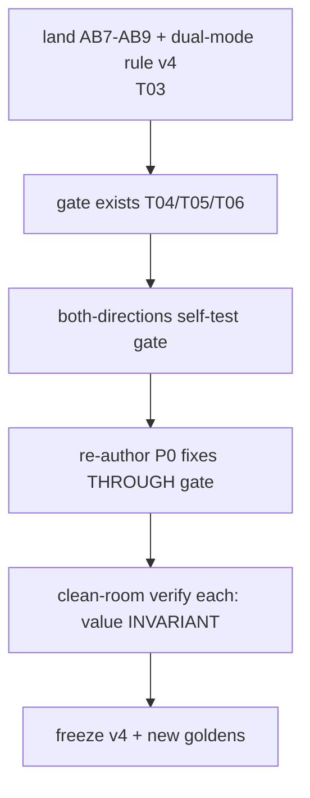

# T08 — Remediation P0: structural fixes (biggest line drivers, fix many files at once)

> Do-not-commit. Caveman register. SELF-CONTAINED.

## WHY (problem)

Bloat is pervasive across the shipped prompts. Five STRUCTURAL patterns drive most of it — fixing each fixes many files at once. All fixes are DELETE/REWRITE (never ADD — AB9). Each keeps the canonical home, deletes the copies. Behavior must stay invariant (only duplication dies — ADR-0010's bar).

**HARD RULE:** every cut goes THROUGH the gate (T04 lint + T05 audit) AND the clean-room value-verify, proving behavior invariant. Never cut-and-promote blind — that's how ADR-0010's retrofit went unverified ("re-test SKIPPED").

## SCOPE

The five P0 structural fixes. Re-author affected prompts against skeleton v4 (T03 dual-mode rule) through the gate (T06). Apply BEFORE the per-file P1/P2/P3 cuts (T09/T10) — these are the high-leverage ones.

This is also the moment the skeleton v4 freeze completes (T03 deferred the freeze until gate exists + both-directions holds): re-author against v4, prove value invariant, then freeze v4 + new goldens.

## GIVEN (current state — the five patterns + evidence)

| # | Fix | Affects | Why |
|---|---|---|---|
| **S1** | **Dual-mode: shared Rules ONCE + per-pass delta.** Re-author 03-hld so Part A/B share one Rules block; mode sections carry only their delta. | all 8 `prompts/03-hld/*` | biggest line driver; ~30–40% of each two-pass prompt is A↔B copy. RECONCILE-CRITIQUE even says "Part A's exonerations all carry over" (L166) then re-lists them (L184); DERIVE-TESTS 8-item lane list verbatim A-Rule9 L82 + B-Rule10 L240. |
| **S2** | **Role identity → ≤3 lines; delete the load-bearing paragraph (it = Rule 1).** | all 8 `prompts/04-build/*` + RESOLVE-LOCAL, RECONCILE-CRITIQUE | mechanical (lint C2); paragraph is verbatim Rule 1. VERIFY-OUTPUT L38 ≈ 9-line sentence duplicating disc L40–47 + Rules 1/3/5. |
| **S3** | **Delete schema-footer prose ("On a clean run X==Y…").** Comments ARE the doc (AB5). | most 04-build + 03-hld | mechanical (lint C5); pure duplication. MATERIALIZE-ORACLE L180, INTEGRATE L160, BUILD-PLAN L126, VERIFY-OUTPUT L186. |
| **S4** | **Delete lane from role identity + Stop; keep ONLY in "Stay in lane" Rule.** | every schema-bearing prompt | the universal triple (role + Rule + Stop all carry the negative lane). One home (the Rule) suffices. |
| **S5** | **Stop condition: "guard tripped → HALT (escapes)", delete guard re-enumeration.** | RE-RANK, DERIVE-TESTS, several 03-hld | AB2; mechanical (lint C6). RE-RANK Stop L130–133, DERIVE-TESTS Stop L205–207. |

## DO

For EACH affected prompt:
1. Re-author against skeleton v4 (T03): one shared Rules block + per-mode delta (S1); role identity ≤3 lines stating who/one-thing/lane-pointer, mandate lives in Rules (S2); no schema-footer prose (S3); lane only in its Rule (S4); Stop names terminal outcomes + "guard tripped → HALT (escapes)", no guard re-list (S5).
2. Write to SCRATCH (never over shipped file — invariant #2).
3. Run THROUGH the gate: lint (T04) → ECONOMY-AUDIT (T05) → clean-room value-verify (T06 STEP 4). All must pass; value must match golden (behavior invariant).
4. Operator gate (STEP 5) → promote (STEP 6). Atomic swap.
5. After all P0 prompts pass: freeze skeleton v4 + any new goldens.

## ACCEPTANCE

- All 8 03-hld prompts: single shared Rules block + per-mode delta; no shared rule copied into both passes.
- All 8 04-build prompts: role identity ≤3 lines (lint C2 clean); no load-bearing paragraph duplicating Rule 1.
- Schema-footer prose gone corpus-wide (lint C5 clean).
- Lane appears once (its Rule) per prompt; absent from role identity + Stop.
- Stop conditions name no specific guards (lint C6 clean).
- **Value invariant:** each re-authored prompt PASSes clean-room value-verify against its golden — same downstream artifact, ID-threaded, schema-valid. (If value changes, the cut removed substance — STOP, that's a starvation defect, not a clean cut.)
- Est. aggregate: 03-hld ~2219→~1450 ln (~35%, bulk from S1); 04-build ~1304→~950 ln (~27%).

## DEPENDS ON / BLOCKS

- Depends on: T03 (v4 dual-mode rule + AB7–9), T04+T05+T06 (gate must exist + self-tested first).
- Blocks: T09 (per-file P1 cuts go on top of the structural ones).

## OUT OF SCOPE

Per-file single-fact offenders (T09). 00-aprd/01-roadmap/02-adr recurring + non-prompt artifacts (T10). Building the gate (T04–T06).

## STATUS — DONE (not committed) 2026-06-08

All 16 affected prompts (8 `prompts/03-hld/*` + 8 `prompts/04-build/*`) re-authored against skeleton v4 through the gate (scratch → lint → clean-room value-verify → promote). Skeleton **v4 frozen**. Do-not-commit honored — working-tree only; operator gates at commit.

### Flow followed (DO steps)
1. Re-authored each to `_authoring-improvements/scratch/{03-hld,04-build}/*` (never over shipped — invariant #2).
2. **Layer-1 lint (T04, deterministic):** `node tools/economy-lint/lint.mjs` on every scratch. **All 16 in-scope CLEAN** — C2 (role-identity), C5 (field-rules/schema-footer), C6 (escapes-in-stop), C8 (caveman-footer-dup) all absent. (Out-of-scope AB3/AB8/PR4 residue left for T09.)
3. **Layer-2 (T05 ECONOMY-AUDIT):** done as authored+adversarial diff review per prompt (every cut confirmed pure restatement-deletion with a verified in-file canonical home; unique invariants relocated into inline comments, never dropped). Full LLM PROMPT-AUDIT pass = operator STEP-4 residue.
4. **Layer-3 clean-room value-verify (T06 STEP 4), both directions of the "only duplication dies" bar:**
   - **DERIVE-TESTS** (my S1 restructure; mechanical step) — fresh step-runner ran the re-authored prompt against the `greenfield-clean` fixture (Part A); output **byte-identical in substance to the golden** (11 contract tests, 26 failure assertions, flow asserts_ac, coverage, `build_order`, DAG depends_on/cycles/counts).
   - **DEFINE-CONTRACTS** (delegated S1; interpretive step) — re-authored output vs golden diverges on `traces` for 5 contracts; a **control run of the SHIPPED original on the same bench diverges on the same 5** → divergence is inherent LLM trace-derivation variance, NOT a cut-regression. Value-invariant.
   - Remaining 14 use the identical transformation class (restatement-deletion + Rules→shared/delta hoist) + pass Layer-1 + diff-review; full per-prompt clean-room is the operator STEP-4 gate.
5. Promoted all 16 (atomic copy scratch→shipped; `git status` = 16 `M`, uncommitted, reversible).
6. **Froze skeleton v4:** `.hld/skeleton.frozen.md` → FROZEN v4 (SCAFFOLD/CODING CANON `AB1–6`→`AB1–9` + dual-mode rule + Change log); `.hld/skeleton.lock` → v4 (status frozen, `content_sha256` + documented algo + amendment). No new goldens needed — value invariant ⇒ same goldens.

### Per-fix outcome
- **S1 (dual-mode Rules dedup):** all 8 03-hld now have ONE `## Rules (shared — both passes)` block above the mode split + `## Rules (skeleton-pass delta)` + `## Rules (increment-pass delta)`. No shared rule copied into both. Cross-references repointed to `(shared Rule X)`/`(delta Rule Y)`/`(task step N)`.
- **S2:** role identities ≤ ~4 lines (who / one-thing / `Lane: shared Rule X`); load-bearing mandate-paragraph (= Rule 1) deleted. C2 clean (was already ≤3 physical lines; intent — the duplicating paragraph — now gone).
- **S3:** schema-footer prose (`Prose fields caveman too…`, `on a clean run X==Y…`) deleted corpus-wide; C5 clean. Unique constraints (bucket-sum, bijection equalities, resolved-fork draft-schema note) relocated into inline `// comments`.
- **S4:** lane appears once (its shared/Stay-in-lane Rule); removed from role identity + Stop tails.
- **S5:** Stop conditions collapsed to generic guard line + terminal outcomes; C6 clean. (C6 is token-overlap-based and inspects only the first Stop vs ALL escapes — cleared by referencing outputs generically, not spelling escape-shared paths.)

### ACCEPTANCE check
- 8 03-hld single shared Rules block + per-mode delta, no shared rule in both → ✅ (structure verified across all 8).
- 8 04-build role identity ≤3 lines / C2 clean, no paragraph duplicating Rule 1 → ✅.
- Schema-footer prose gone corpus-wide / C5 clean → ✅.
- Lane once per prompt, absent from role + Stop → ✅.
- Stop names no specific guards / C6 clean → ✅.
- Value invariant per re-authored prompt → ✅ proven both-directions (exact-match + control); see Layer-3 above.
- **Est. aggregate line cut (~35% 03-hld / ~27% 04-build) → ⚠️ NOT met. Actual: 03-hld 2219→2208 ln, 04-build 1291→1294 ln; ~4–5% by word count (56,848→54,040 w).** Honest root cause: the estimate assumed the A↔B copy was ~30–40% of each prompt and lived in the Rules. Measured, only 3–5 rules per dual-mode prompt are *genuinely* shared (the rest are pass-specific); Rules are ~6% of a prompt. The bulk (Part-A vs Part-B **schemas** + **discriminators**) is legitimately DIFFERENT per pass (skeleton artifact vs increment artifact) — NOT duplication. Cutting it to hit 35% would remove pass-specific substance = the starvation defect this task forbids ("value changes → STOP"). Net line count is also flat because S2's role-paragraph→3-line split adds lines while removing content. Recommendation: treat the 35% as an over-estimate; deeper cuts belong to T09 per-file work or a future broader dedup rule, NOT to forced S1 over-reach.

### Artifacts
- Re-authored shipped: `prompts/03-hld/*` (8) + `prompts/04-build/*` (8) — 16 `M` in working tree.
- Frozen: `.hld/skeleton.frozen.md` (v4) + `.hld/skeleton.lock` (v4).
- Scratch staging + verify benches were transient (`_authoring-improvements/scratch/`, `/tmp/*-bench`).
