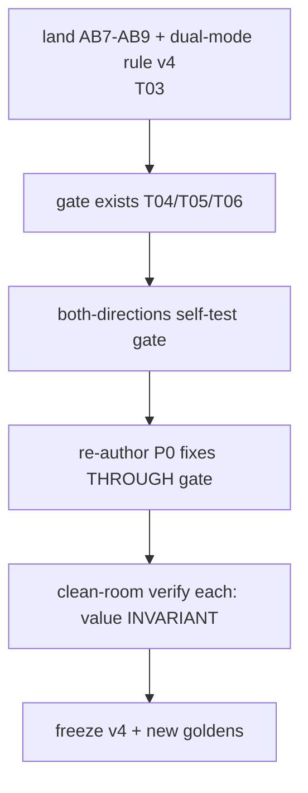

# T08 — Remediation P0: structural fixes (biggest structural drivers, fix many files at once)

> Do-not-commit. Caveman register. SELF-CONTAINED.

## WHY (problem)

Bloat is pervasive across the shipped prompts. Five STRUCTURAL patterns drive most of it — fixing each fixes many files at once. All fixes are DELETE/REWRITE (never ADD — AB9). Each keeps the canonical home, deletes the copies. Behavior must stay invariant (only duplication dies — ADR-0010's bar).

**HARD RULE:** every cut goes THROUGH the gate (T04 lint + T05 audit) AND the clean-room value-verify, proving behavior invariant. Never cut-and-promote blind — that's how ADR-0010's retrofit went unverified ("re-test SKIPPED").

**Metric:** the bloat gate is the C1 **TOKEN** budget (warn >5000 / block >7500), not lines — lines are gameable by packing facts into long lines (`07-bloat-metric-tokens.md`). Target every re-authored prompt under block; aim ≤ warn.

## SCOPE

The five P0 structural fixes. Re-author affected prompts against skeleton v4 (T03 dual-mode rule) through the gate (T06). Apply BEFORE the per-file P1/P2/P3 cuts (T09/T10) — these are the high-leverage ones.

This is also the moment the skeleton v4 freeze completes (T03 deferred the freeze until gate exists + both-directions holds): re-author against v4, prove value invariant, then freeze v4 + new goldens.

## GIVEN (current state — the five patterns + evidence)

| # | Fix | Affects | Why |
|---|---|---|---|
| **S1** | **Dual-mode: shared Rules ONCE + per-pass delta.** Re-author 03-hld so Part A/B share one Rules block; mode sections carry only their delta. | all 8 `prompts/03-hld/*` | biggest structural driver; the A↔B copy duplicates shared rules across both passes. RECONCILE-CRITIQUE even says "Part A's exonerations all carry over" (L166) then re-lists them (L184); DERIVE-TESTS 8-item lane list verbatim A-Rule9 L82 + B-Rule10 L240. |
| **S2** | **Role identity → ≤3 lines; delete the load-bearing paragraph (it = Rule 1).** | all 8 `prompts/04-build/*` + RESOLVE-LOCAL, RECONCILE-CRITIQUE | mechanical (lint C2); paragraph is verbatim Rule 1. VERIFY-OUTPUT L38 ≈ 9-line sentence duplicating disc L40–47 + Rules 1/3/5. |
| **S3** | **Delete schema-footer prose ("On a clean run X==Y…").** Comments ARE the doc (AB5). | most 04-build + 03-hld | mechanical (lint C5); pure duplication. MATERIALIZE-ORACLE L180, INTEGRATE L160, BUILD-PLAN L126, VERIFY-OUTPUT L186. |
| **S4** | **Delete lane from role identity + Stop; keep ONLY in "Stay in lane" Rule.** | every schema-bearing prompt | the universal triple (role + Rule + Stop all carry the negative lane). One home (the Rule) suffices. |
| **S5** | **Stop condition: "guard tripped → HALT (escapes)", delete guard re-enumeration.** | RE-RANK, DERIVE-TESTS, several 03-hld | AB2; mechanical (lint C6). RE-RANK Stop L130–133, DERIVE-TESTS Stop L205–207. |

## DO

For EACH affected prompt:
1. Re-author against skeleton v4 (T03): one shared Rules block + per-mode delta (S1); role identity ≤3 lines stating who/one-thing/lane-pointer, mandate lives in Rules (S2); no schema-footer prose (S3); lane only in its Rule (S4); Stop names terminal outcomes + "guard tripped → HALT (escapes)", no guard re-list (S5).
2. Write to SCRATCH (never over shipped file — invariant #2).
3. Run THROUGH the gate: lint (T04) → ECONOMY-AUDIT (T05) → clean-room value-verify (T06 STEP 4). All must pass; value must match golden (behavior invariant).
4. Operator gate (STEP 5) → promote (STEP 6). Atomic swap.
5. After all P0 prompts pass: freeze skeleton v4 + any new goldens.

## ACCEPTANCE

- All 8 03-hld prompts: single shared Rules block + per-mode delta; no shared rule copied into both passes.
- All 8 04-build prompts: role identity ≤3 lines (lint C2 clean); no load-bearing paragraph duplicating Rule 1.
- Schema-footer prose gone corpus-wide (lint C5 clean).
- Lane appears once (its Rule) per prompt; absent from role identity + Stop.
- Stop conditions name no specific guards (lint C6 clean).
- **Value invariant:** each re-authored prompt PASSes clean-room value-verify against its golden — same downstream artifact, ID-threaded, schema-valid. (If value changes, the cut removed substance — STOP, that's a starvation defect, not a clean cut.)
- **Token reduction from S1 is real but MODEST** — only genuinely-shared rules collapse (~3–5 per dual-mode prompt); per-pass schemas + discriminators are legit pass-specific substance, NOT duplication (cutting them = starvation defect). No fixed % target; value-invariance is the bar, the C1 **token** budget (warn 5000 / block 7500) the gate. Deeper per-file cuts → T09.

## STATUS — DONE (2026-06-09)

S1–S5 landed corpus-wide; skeleton v4 frozen (`.hld/skeleton.lock` status==frozen, amendment names the T08 re-trigger). Gate = `tools/economy-lint` (C1/C2/C5/C6 = T08-scope checks).

**Acceptance vs final lint (16 prompts: 8 03-hld + 8 04-build):**

| Acceptance | Check | Result |
|---|---|---|
| 03-hld single shared Rules + per-mode delta (S1) | structure | ✓ all 8 — `## Rules (shared — both passes)` + per-pass delta block; lane homed once |
| 04-build role identity ≤3 lines, no Rule-1 paragraph (S2) | lint C2 | ✓ clean all 16 |
| schema-footer prose gone (S3) | lint C5 | ✓ clean all 16 |
| lane once (its Rule), absent role-id + Stop (S4) | manual + grep | ✓ role-id carries `Lane: Rule N` POINTER only; lane list lives once in that Rule; no Stop re-list |
| Stop names no specific guards (S5) | lint C6 | ✓ clean all 16 |
| value invariant | goldens | ✓ critique.json + S4/reconcile.json goldens both `clean/0 issues` — unchanged by cuts |
| C1 token budget (block 7500) | lint C1 | 15/16 under block; **RECONCILE-CRITIQUE 8609 over-block → T09** (see below) |

**This-session S1 cut — RECONCILE-CRITIQUE** (the GIVEN-table S1 exemplar: "exonerations all carry over" then re-listed):
- Hoisted the RE-DERIVE-from-primary discipline (was restated near-verbatim in BOTH passes' "Your lane") → ONE shared Rule 7; each pass keeps only its per-pass field-binding map.
- Cut 3 exoneration re-lists (Part A discriminator, Part B discriminator, Part B delta Rule 1) → pointers to shared Rule 2 (the home; holds full `NEVER block` list).
- Diff: 5 ins / 8 del, pure prose. 8796 → 8609 tok. Every category (7 Part A + 8 Part B), check, exoneration, schema field intact → value-invariant (goldens unchanged).

**RECONCILE-CRITIQUE residual C1 over-block → routed to T09.** S1 reduction is MODEST by design (acceptance: "only genuinely-shared rules collapse"). Residual 8609 driven by the pass-specific category discriminators (7 skeleton + 8 slice, distinct field bindings + distinct false-positive exonerations) — legit pass-specific substance, NOT duplication; cutting it = starvation defect. Deeper per-file cut is T09's job (acceptance: "Deeper per-file cuts → T09").

**Out-of-T08-scope residue (still flips lint `verdict:blocked` on some prompts):** C3 (format-clause `{...}` field-list re-spec, AB3), C4 (hedge, AB8), C9 (register, AB9) — per-file offenders → T09/T10. NOT among the five P0 structural fixes.

## DEPENDS ON / BLOCKS

- Depends on: T03 (v4 dual-mode rule + AB7–9), T04+T05+T06 (gate must exist + self-tested first).
- Blocks: T09 (per-file P1 cuts go on top of the structural ones).

## OUT OF SCOPE

Per-file single-fact offenders (T09). 00-aprd/01-roadmap/02-adr recurring + non-prompt artifacts (T10). Building the gate (T04–T06).
