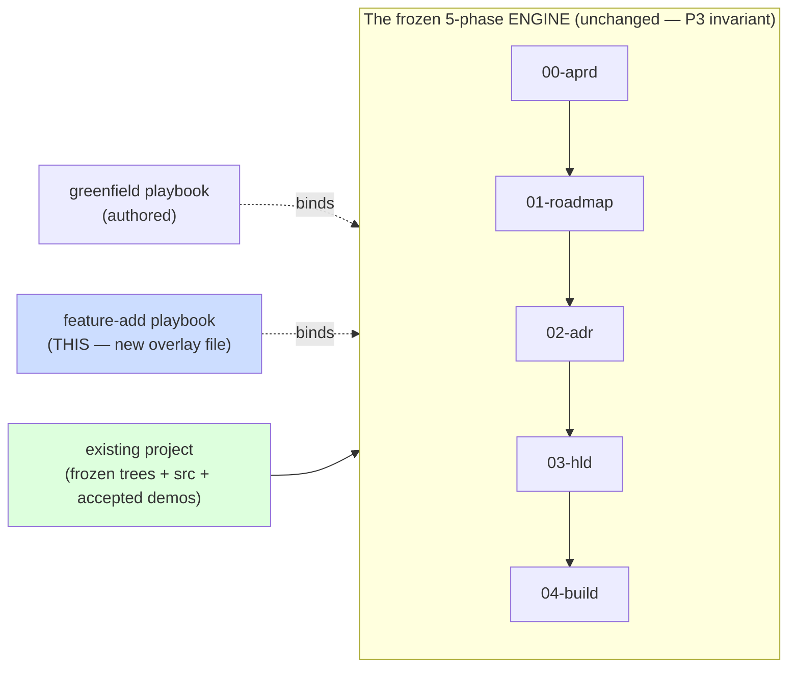
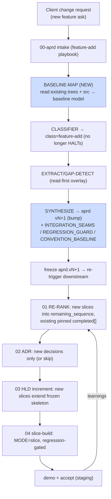
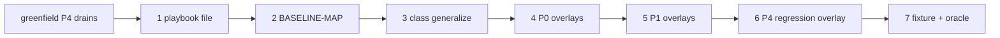

# Brownfield:feature — Solution Architecture

> WHAT this is: solution architecture for **brownfield feature-add** capability — add new feature to a project the greenfield spine already built + delivered to staging. Caveman register (CLAUDE.md). Fits canonical structure: one spine, per-class playbook overlay (P3), engine unchanged. Status: design proposal, pre-build.

---

## 0. Thesis (read this first)

**Brownfield:feature is NOT a new engine. It = the change-request mechanism the frozen artifacts already promised, fired for `class=feature-add`.**

Greenfield spine already built every hook brownfield needs:
- Every prompt frontmatter: `class-agnostic by design, only greenfield authored yet`.
- Every escape: `non-greenfield → playbook (not authored yet) — HALT`. Slot reserved, empty.
- Every frozen artifact: `change = new version + change request re-triggering affected downstream stages` (P8). Promise made, never fired.
- ADR-0004: `author greenfield Phase 0→4 first, THEN generalize to other classes via playbook overlays`. Brownfield = the planned "then."
- Phase 3 **increment mode** (D9/D14) + Phase 1 **RE-RANK** + Phase 4 **slice-build mode**: machinery for "extend a frozen baseline with one more slice." Already built (3) / being built (4).

Greenfield after slice 1 ALREADY is "additive build into existing accepted code." Brownfield:feature differs in ONE thing: the baseline was accepted in a **prior engagement** (frozen trees + accepted demos the current run did not author), and re-entry is a **client change request** that bumps the aPRD version.

So the work = **fill reserved slots + fire reserved hooks**, not build a parallel pipeline.



---

## 1. Given / scope

**In scope:** `class=feature-add` against a project **the greenfield spine built** → existing `.aprd/ .adr/ .hld/ .roadmap/ .build/ src/` all present, locked, demo-accepted. Add one new feature (atomic, single system) end-to-end to staging.

**Out of scope (later brownfield classes, own architectures):** bugfix, refactor, migration, perf, integration. Foreign brownfield (project NOT built by this system, no frozen trees) = harder ingest variant, deferred (see §12).

**Deliverable shape (unchanged):** library of executable AI prompts in `prompts/`. Brownfield:feature ships = new playbook file + a few overlay blocks + one new role prompt, verified clean-room against fixtures.

---

## 2. Reuse ledger — what each phase does for feature-add

Three postures: **REUSE** (run verbatim, disk-state dispatches it) · **OVERLAY** (playbook-injected delta block) · **NEW** (net-new role).

| Phase | Roles | Posture | Why |
|---|---|---|---|
| **0 aPRD** | CLASSIFIER | REUSE | already emits `feature-add`; today HALTs (no playbook). Registering playbook = un-HALT. |
| | EXTRACT, GAP-DETECT | OVERLAY | grounding-order flip (§5.1 read-code-first): read existing aPRD+code+conventions BEFORE asking. Gaps measured vs baseline, not blank. |
| | SYNTHESIZE | OVERLAY | emit feature-add aPRD **version bump** + class-extension block (INTEGRATION_SEAMS, REGRESSION_GUARD, CONVENTION_BASELINE). New `R*/AC*` continue numbering. |
| | QUESTION-GEN, CRITIQUE, EXTRACT-RULES, RECONCILE, VERIFY | REUSE | research fires only for NEW tech feature needs; mostly cache-hit (canon). |
| | **BASELINE-MAP** | **NEW** | ingest existing project → baseline model: ID high-water-marks, conventions, integration-seam catalog, existing-oracle inventory. Brownfield analog of arch-review's lone net-new role (DIAGNOSE). |
| **1 roadmap** | SLICE-EXTRACT, SEQUENCE | OVERLAY | slice ONLY new feature's `R*/AC*`; existing slices = pinned `completed[]` baseline. |
| | RE-RANK | REUSE | **already** the next-picker that merges new slices into `remaining_sequence` with `completed[]` pinned + ingests learnings. Zero change. |
| | VERTICALITY-CHECK, SEQUENCE-REVIEW | REUSE | |
| | SKELETON-IDENTIFY, FOUNDATION-CUT | SKIP | foundation already built. Feature needing NEW foundation → widen-cut escape (already a Phase-4→Phase-1 target). |
| **2 adr** | all 7 | REUSE | scoped to NEW decisions feature forces. Existing ADRs = frozen constraints (like canon). TRIAGE may find "no new decision" → skip Phase 2 for small features. New ADRs continue numbering; existing changed only by superseding ADR (immutability). |
| **3 hld** | all 8 | REUSE | **increment mode = exactly this.** `skeleton.lock` present → INCREMENT PASS extends frozen skeleton for new slices. New components/contracts as slice increments. Collision w/ frozen box → change request (already wired). |
| **4 build** | BUILD-PLAN…DEMO-GEN | REUSE | **slice-build mode**, `MODE=slice` (no scaffold — harness exists, B9/§11 "large feature-add: no scaffold"). |
| | MATERIALIZE-ORACLE, IMPLEMENT, INTEGRATE, VERIFY-OUTPUT | OVERLAY | regression-guard layer mandatory (§4.2 ladder row already defined); IMPLEMENT grounds from existing code (cheapest-first §7); INTEGRATE wires to existing seams. |

**Tally: ~31 of 39 roles REUSE near-verbatim. ~7 carry an OVERLAY delta. 1 NEW role.** Phases 2 + 3 entirely free. Engine untouched → P3 invariant holds. If wiring forces an engine edit, abstraction leaked — fix spine once, not the playbook (§11 test, same as every class).

---

## 3. The brownfield delta — invariants the playbook enforces

Greenfield invariants all carry. Feature-add ADDS:

| # | Invariant | Mechanism |
|---|---|---|
| **BF1** | **Baseline immutable + additive** — never rewrite existing frozen artifact; only extend. | version-bump aPRD; new `R*/AC*/S*/ADR*/C*` continue numbering; HLD increment never redraws frozen box (D14). |
| **BF2** | **Grounding read-first** — existing code/aPRD/conventions read BEFORE client asked. Client answers residue only. | Phase-0 overlay flips stage order (spec00 §5.1); BASELINE-MAP front-loads the read. |
| **BF3** | **ID continuation, no collision** — new IDs start above baseline high-water-mark. | BASELINE-MAP emits high-water-marks; all minting reads them. |
| **BF4** | **Regression-gated** — nothing previously green goes red. | regression layer in oracle (§4.2); existing test suite inherited + must stay green; mandatory AC. |
| **BF5** | **Convention-conformant** — new code matches existing conventions, not canon defaults. | CONVENTION_BASELINE (aPRD ext) → IMPLEMENT grounds from existing code first (§7 brownfield=delta). |
| **BF6** | **Seam-bounded** — feature plugs into existing components at declared seams; existing internals untouched. | INTEGRATION_SEAMS (aPRD ext) → HLD increment + INTEGRATE honor them. |
| **BF7** | **Re-entry = change request** — feature enters via client CR that bumps a frozen version + re-triggers affected downstream. | the front door (§4). Fires P8's standing promise. |

---

## 4. Entry — change-request re-entry (the front door)

Frozen artifacts are immutable; change = **new version + change request** (P8). Brownfield:feature is the first real exerciser. Re-entry is NOT a fresh greenfield run — it resumes the SAME project at Phase 0 with a CR.



Affected-downstream re-trigger is the existing idempotency story (D20): disk = source of truth, frontier re-derived from sentinels. New aPRD version invalidates downstream sentinels for the touched slices only → pipeline re-derives + extends. Untouched slices stay `completed[]`, never rebuilt.

---

## 5. Net-new components (what brownfield:feature actually adds to `prompts/`)

### 5.1 Feature-add playbook file — `prompts/_playbooks/feature-add.md`
The pluggable config (spec00 §11 / spec04 §11). Sibling to `_orchestrator.md`, `_step-runner.md`, `_economy-audit.md`. Holds, per canonical playbook schema:
```yaml
class: feature-add
classifier_hints:    "new behavior into existing codebase"
grounding_order:     read-existing-first   # flips spec00 §5.1
grounding_corpus:    [existing .aprd/.adr/.hld/.build, src/, conventions, canon-for-NEW-tech-only]
active_stages:       { skeleton_identify: off, foundation_cut: off, scaffold: off }   # foundation+harness exist
aprd_extension:      [INTEGRATION_SEAMS, REGRESSION_GUARD, CONVENTION_BASELINE]
oracle_layers:       [contract, flow, acceptance, regression]   # regression mandatory (BF4)
prompt_overlays:     { EXTRACT, GAP-DETECT, SYNTHESIZE, SLICE-EXTRACT, SEQUENCE,
                       MATERIALIZE-ORACLE, IMPLEMENT, INTEGRATE, VERIFY-OUTPUT }
build_depth:         per-slice-no-scaffold   # spec04 §11
verify_method:       inherited ladder + regression-must-stay-green
```
One file = the whole class binding. Adding the class touched no engine — proves abstraction.

### 5.2 BASELINE-MAP — `prompts/00-aprd/BASELINE-MAP.md` (the one NEW role)
Front of feature-add intake. Reads existing project, emits baseline model the rest of the run grounds against. Why a role not inline: cheapest-source-first (P5) — ingest existing truth ONCE, cache it, every downstream role reads the map instead of re-scanning `src/`.

Output `.aprd/baseline-map.json` (sketch):
```json
{
  "built_by": "greenfield-spine",
  "id_high_water": { "R": 42, "AC": 88, "S": 7, "ADR": 23, "C": 19 },
  "conventions": { "lang": "...", "layout": "...", "lint": "...", "naming": "..." },
  "integration_seams": [ {"at": "C12", "kind": "...", "contract_ref": "CT9"} ],
  "existing_oracle": { "suites": [...], "must_stay_green": true },
  "frozen_locks": { "aprd.lock": "...", "adr.lock": "...", "hld.lock": "...", "build.lock": "..." }
}
```
Escapes: missing/corrupt frozen locks → HALT (baseline untrustworthy); project NOT greenfield-built (no trees) → out of scope, route to foreign-brownfield variant (§12).

### 5.3 Class generalization of frontmatter (mechanical)
Today `class: greenfield  # only greenfield authored`. Generalize to **playbook-injected** so a role no longer HALTs on `feature-add`. Mechanical edit across roles; substance invariant; AB-clean. Per anti-bloat (P1/AB9) this is DELETE/REWRITE of the hardcoded line, never ADD.

### 5.4 OVERLAY delta blocks (per §2 table)
Small per-mode DELTA blocks on the ~7 overlay roles, following the dual-mode pattern already proven (skeleton|increment): ONE shared `## Rules`, a `feature-add` delta carrying ONLY what differs. Never copy a shared rule (AB1).

---

## 6. On-disk layout — where a feature version lands

Sibling-additive to the existing trees. Existing files immutable; feature adds versions + slices.

```
project/
  .aprd/
    aprd.frozen.md            # v1 baseline — IMMUTABLE
    aprd.v2.frozen.md         # feature-add version (new R*/AC* continue numbering)  ← BF1
    aprd.lock                 # re-signed at v2 freeze
    baseline-map.json         # NEW (BASELINE-MAP) ← BF2/BF3
    change-requests/
      CR-001-<feature>.md     # raw client ask + classification
  .roadmap/
    roadmap.md                # new slices appended; existing pinned
    08-rerank.json            # remaining_sequence += new slices; completed[] pinned ← RE-RANK reuse
  .adr/
    log/00NN-*.md             # new ADRs continue numbering (or none)
    adr.lock                  # re-signed if new ADR
  .hld/
    skeleton.frozen.md        # IMMUTABLE (skeleton frozen)
    slices/S<new>/...         # HLD increments (existing machinery) ← BF6
  .build/
    slices/S<new>/
      oracle/                 # + regression layer ← BF4
      build-record.json
      build.lock
  src/                        # extended, conventions conformed ← BF5; commits cite new R/AC
```

ID thread unbroken: `R → AC → S → ADR → C → CT → F → commit`, new IDs above high-water-mark. Provenance pins which baseline version the feature built against (audit + resume).

---

## 7. Verification — fixture + both-directions oracle

Same bar as every self-host build: clean-room runner vs golden, PASS known-good + FAIL planted-defect.

**New fixture: `_fixtures/brownfield-feature/`** = a `greenfield-clean`-style accepted project + a feature CR. Seeds the existing frozen trees as baseline. Oracle golden = correctly-extended trees (new aPRD version, new slice, regression-green).

Both-directions for the brownfield-specific risks:
- planted **regression** (feature breaks an existing AC) → MUST FAIL.
- planted **ID collision** (new R reuses baseline R id) → MUST FAIL.
- planted **frozen-overwrite** (mutates baseline aPRD instead of versioning) → MUST FAIL (BF1).
- planted **convention drift** → CRITIQUE flags → FAIL.

If verifier can't tell golden from defect, it's broken — fix before trusting any brownfield build.

---

## 8. Build plan — order to author (self-host loop)

**Blocked-on:** greenfield Phase-4 slice-build modes (current roadmap frontier) must drain first — feature-add Phase 4 = those modes + regression overlay. Build order: **greenfield → (Spine D / Spine A) → brownfield:feature**. Brownfield is its own spine, own tracker, authored after greenfield buildout (mirrors aPRD scope note).

Then, in dependency order:

1. **`feature-add` playbook file** (`prompts/_playbooks/feature-add.md`) — the binding; everything else references it. Sentinel: file present + schema-valid.
2. **BASELINE-MAP** role — net-new, head of intake. Sentinel: `_fixtures/brownfield-feature/.aprd/baseline-map.json`.
3. **Class generalization** — un-HALT `feature-add` in CLASSIFIER + frontmatter sweep. Sentinel: CLASSIFIER routes feature-add to playbook (no HALT).
4. **Phase-0 overlays** — EXTRACT/GAP-DETECT (read-first), SYNTHESIZE (version-bump + class-ext block). Sentinel: `aprd.v2.frozen.md` golden.
5. **Phase-1 overlays** — SLICE-EXTRACT/SEQUENCE feature-add delta (RE-RANK reused as-is). Sentinel: new slice in `08-rerank.json` golden.
6. **Phase-4 regression overlay** — MATERIALIZE-ORACLE (regression layer) + IMPLEMENT (convention) + INTEGRATE (seams) + VERIFY-OUTPUT (regression run). Sentinel: regression-green `build-record.json` golden.
7. **Brownfield fixture + both-directions oracle** (§7).

Phases 2 + 3: nothing to author (REUSE). Verify they run clean on a feature CR fixture — no new prompt.



---

## 9. Risks / open questions

- **Affected-downstream blast radius.** aPRD version bump re-triggers which slices? Need precise rule: touch-set = slices whose `R*/AC*` the feature alters. Over-broad → needless rebuild; too-narrow → stale slice ships. (ties spec04 §14 skeleton-stability.)
- **Foreign brownfield (no frozen trees).** Out of scope here, but BASELINE-MAP's hardest mode = reconstruct baseline model from raw `src/` w/o frozen artifacts. Separate architecture; this design assumes greenfield-built baseline.
- **Skeleton too thin for feature.** Feature needs a frozen box redrawn → HLD increment escapes to Phase 2/3 (already wired). Frequency unknown until exercised; if common, signals greenfield skeletons under-built.
- **Regression suite cost.** Whole inherited suite per slice = slow on large baselines. Scope regression guard to touched surface + seams (spec00 §4 "regression tests for touched surface"), not full re-run.
- **CONVENTION_BASELINE fidelity.** How precisely conventions captured from existing code so IMPLEMENT conforms vs canon defaults. Cheapest-first read of `src/` may miss tacit conventions.
- **Where playbooks live.** Proposed `prompts/_playbooks/`; confirm vs putting overlay blocks inline in each role. Tradeoff: one-home-per-fact (AB1) favors a single playbook file over scattered blocks.
