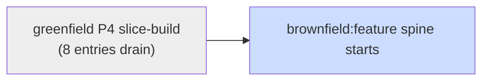
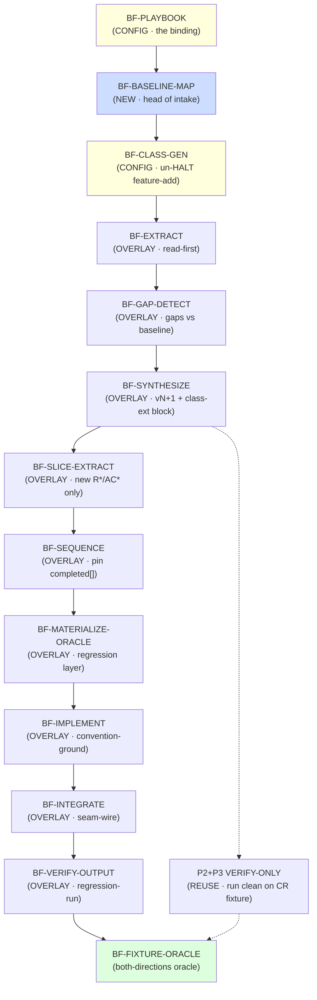

# Brownfield:feature — Build Roadmap

> Unshipped frontier of **brownfield:feature** capability (add new feature to greenfield-built project). Derived from `00_solution-architecture.md` §8. Same loop as greenfield self-host: each entry = one prompt-build the loop authors, verifies clean-room vs `_fixtures/brownfield-feature/`, promotes to `prompts/`. Order = dependency DAG below; position derived from disk (`done_sentinel` scan), never read from tracker. Own spine, own tracker — sibling to greenfield roadmap, not merged.

## Posture key

- **NEW** — net-new role file. Full prompt-build + both-directions oracle.
- **OVERLAY** — feature-add DELTA block on existing role (dual-mode pattern, shared `## Rules` + delta carrying ONLY what differs, AB1). Lighter than NEW.
- **CONFIG** — playbook binding / mechanical frontmatter sweep. No new substance.
- **VERIFY-ONLY** — REUSE role, nothing authored; prove it runs clean on feature CR fixture.

Each non-verify entry threads brownfield invariants it satisfies (BF1–BF7, arch §3).

## Blocked-on (hard gate)

**Greenfield Phase-4 slice-build modes must drain first.** Feature-add Phase 4 = those modes + regression overlay; can't overlay mode not yet built. Greenfield frontier today = `P-BUILD-PLAN-SLICE` → 8 entries to `P-DEMO-GEN-SLICE`. Brownfield starts only when greenfield `08-rerank.json remaining_sequence` empty.

## Dependency DAG (build order)

## Build order (author in sequence)

1. **BF-PLAYBOOK** — CONFIG. Unit: `prompts/_playbooks/feature-add.md` (NEW file + NEW `_playbooks/` dir, arch §5.1). Class binding; everything downstream references it. Holds class schema: `class/classifier_hints/grounding_order/grounding_corpus/active_stages/aprd_extension/oracle_layers/prompt_overlays/build_depth/verify_method`. One file = whole class binding; touches no engine (proves abstraction, P3). Sentinel: file present + schema-valid vs canonical playbook schema. Deps: none (head).

2. **BF-BASELINE-MAP** — NEW. Unit: `prompts/00-aprd/BASELINE-MAP.md`. Head of feature-add intake. Reads existing project ONCE → `baseline-map.json` (ID high-water-marks, conventions, integration-seam catalog, existing-oracle inventory, frozen-lock digests). Cheapest-source-first (P5): cache baseline truth, downstream reads map not `src/`. Escapes: missing/corrupt frozen locks → HALT (baseline untrustworthy); no frozen trees (not greenfield-built) → out of scope, route foreign-brownfield variant. Satisfies BF2/BF3. Sentinel: `_fixtures/brownfield-feature/.aprd/baseline-map.json` golden. Deps: BF-PLAYBOOK.

3. **BF-CLASS-GEN** — CONFIG. Unit: CLASSIFIER un-HALT + frontmatter `class:` sweep across all 39 roles. Today every role hardcodes `class: greenfield  # only greenfield authored`; CLASSIFIER escapes `feature-add → playbook not authored yet, HALT`. Generalize to playbook-injected dispatch. Per AB9: DELETE/REWRITE hardcoded line, never ADD. Mechanical; substance invariant. Satisfies BF7 (re-entry routes, no HALT). Sentinel: CLASSIFIER routes `feature-add` to playbook (golden `01-classification.json`, `class=feature-add`, escape absent). Deps: BF-PLAYBOOK.

4. **BF-EXTRACT** — OVERLAY. Unit: `prompts/00-aprd/EXTRACT.md` feature-add delta. Grounding-order flip (arch §5.1): read existing aPRD + code + conventions BEFORE client asked; client answers residue only. Satisfies BF2. Sentinel: extract output grounds from `baseline-map.json` (golden cites baseline IDs/conventions). Deps: BF-BASELINE-MAP, BF-CLASS-GEN.

5. **BF-GAP-DETECT** — OVERLAY. Unit: `prompts/00-aprd/GAP-DETECT.md` feature-add delta. Gaps measured vs baseline (not blank-slate). Adversarial posture stays hostile. Satisfies BF2. Sentinel: gaps golden references baseline coverage. Deps: BF-EXTRACT.

6. **BF-SYNTHESIZE** — OVERLAY. Unit: `prompts/00-aprd/SYNTHESIZE.md` feature-add delta. Emit aPRD **version bump** (`aprd.v2.frozen.md`, new `R*/AC*` continue above high-water-mark) + class-extension block: `INTEGRATION_SEAMS`, `REGRESSION_GUARD`, `CONVENTION_BASELINE`. Never rewrite baseline (BF1). Freeze re-signs `aprd.lock`, re-triggers affected downstream (touch-set = slices whose `R*/AC*` feature alters — see Risk R1). Satisfies BF1/BF6. Sentinel: `_fixtures/brownfield-feature/.aprd/aprd.v2.frozen.md` golden + baseline `aprd.frozen.md` byte-unchanged. Deps: BF-GAP-DETECT.

7. **P2+P3 VERIFY-ONLY** — REUSE checkpoint, nothing authored. Phase-2 (7 roles) + Phase-3 (8 roles) carry verbatim: Phase-2 scoped to NEW decisions (TRIAGE may find none → skip); Phase-3 = increment mode (`skeleton.lock` present → extends frozen skeleton, D9/D14). New ADRs/components continue numbering; frozen boxes never redrawn. Satisfies BF1/BF6. Sentinel: feature CR fixture runs P2+P3 clean — golden `slices/S<new>/` HLD increment, frozen `skeleton.frozen.md` unchanged. Deps: BF-SYNTHESIZE. (Parallel to Phase-1 overlays — no ordering dep between them.)

8. **BF-SLICE-EXTRACT** — OVERLAY. Unit: `prompts/01-roadmap/SLICE-EXTRACT.md` feature-add delta. Slice ONLY new feature's `R*/AC*`; existing slices = pinned baseline. SKELETON-IDENTIFY + FOUNDATION-CUT stay OFF (foundation exists, playbook `active_stages`). Sentinel: golden slice covers only new IDs. Deps: BF-SYNTHESIZE.

9. **BF-SEQUENCE** — OVERLAY. Unit: `prompts/01-roadmap/SEQUENCE.md` feature-add delta. Merge new slices into `remaining_sequence`; existing pinned `completed[]`. RE-RANK + VERTICALITY-CHECK + SEQUENCE-REVIEW REUSE verbatim (already next-picker w/ completed[] pin + learnings ingest). Sentinel: `_fixtures/brownfield-feature/.roadmap/08-rerank.json` golden — new slice in `remaining_sequence`, baseline slices in `completed[]`. Deps: BF-SLICE-EXTRACT.

10. **BF-MATERIALIZE-ORACLE** — OVERLAY. Unit: `prompts/04-build/MATERIALIZE-ORACLE.md` feature-add delta. Mandatory **regression layer** (oracle_layers += regression, BF4). Scope regression to touched surface + seams, NOT full inherited suite (Risk R4). MODE=slice (no scaffold — harness exists). Sentinel: golden `oracle.json` carries `regression` layer. Deps: BF-SEQUENCE, greenfield `P-MATERIALIZE-ORACLE-SLICE` shipped.

11. **BF-IMPLEMENT** — OVERLAY. Unit: `prompts/04-build/IMPLEMENT.md` feature-add delta. Ground from existing code FIRST (cheapest-first §7); new code matches `CONVENTION_BASELINE`, not canon defaults (BF5). MODE=slice. Sentinel: golden `build-record.json`, new code convention-conformant. Deps: BF-MATERIALIZE-ORACLE, greenfield `P-IMPLEMENT-SLICE` shipped.

12. **BF-INTEGRATE** — OVERLAY. Unit: `prompts/04-build/INTEGRATE.md` feature-add delta. Wire feature into existing components at declared `INTEGRATION_SEAMS`; existing internals untouched (BF6). Sentinel: golden `integration-record.json` cites baseline seams. Deps: BF-IMPLEMENT, greenfield `P-INTEGRATE-SLICE` shipped.

13. **BF-VERIFY-OUTPUT** — OVERLAY. Unit: `prompts/04-build/VERIFY-OUTPUT.md` feature-add delta. Run regression layer; nothing previously green goes red (BF4). Inherited ladder + regression-must-stay-green. Sentinel: regression-green `build-record.json` / `verify-output.json` golden. Deps: BF-INTEGRATE, greenfield `P-VERIFY-OUTPUT-SLICE` shipped.

14. **BF-FIXTURE-ORACLE** — both-directions verification. Unit: `_fixtures/brownfield-feature/` = greenfield-clean-style accepted project (seeded frozen baseline trees) + feature CR. Golden = correctly-extended trees (new aPRD version, new slice, regression-green). Plant defects, all MUST FAIL:
    - **regression** — feature breaks existing AC → FAIL (BF4).
    - **ID collision** — new `R*` reuses baseline id → FAIL (BF3).
    - **frozen-overwrite** — mutates baseline aPRD vs versioning → FAIL (BF1).
    - **convention drift** — CRITIQUE flags → FAIL (BF5).
    Known-good golden PASSes. Verifier can't separate golden from defect → broken, fix before trusting any brownfield build. Deps: BF-VERIFY-OUTPUT + P2+P3 VERIFY-ONLY.

## Frontier rule

Frontier = first entry whose `done_sentinel` absent or schema-invalid. Brownfield spine inert until greenfield `remaining_sequence` empty → today frontier = greenfield `P-BUILD-PLAN-SLICE`, brownfield not yet startable. First brownfield frontier on unblock = **BF-PLAYBOOK** (`prompts/_playbooks/feature-add.md` absent).

## Effort shape

| Posture | Count | Units |
|---|---|---|
| NEW | 1 | BASELINE-MAP |
| OVERLAY | 9 | EXTRACT, GAP-DETECT, SYNTHESIZE, SLICE-EXTRACT, SEQUENCE, MATERIALIZE-ORACLE, IMPLEMENT, INTEGRATE, VERIFY-OUTPUT |
| CONFIG | 2 | PLAYBOOK, CLASS-GEN |
| VERIFY-ONLY | 1 | P2+P3 checkpoint (15 roles, 0 authored) |
| oracle | 1 | brownfield fixture + both-directions |

~31 of 39 roles REUSE near-verbatim (arch §2 tally). Engine untouched → P3 invariant holds. Any unit forcing engine edit = leaked abstraction → fix spine once, not playbook.

## Open risks (carried from arch §9)

- **R1 — blast radius.** aPRD version bump re-triggers which slices? Need precise touch-set rule (= slices whose `R*/AC*` feature alters). Over-broad → needless rebuild; too-narrow → stale slice ships. Resolve before BF-SYNTHESIZE freeze logic finalizes.
- **R4 — regression cost.** Whole inherited suite per slice = slow on large baselines. Scope to touched surface + seams (drives BF-MATERIALIZE-ORACLE delta).
- **R5 — convention fidelity.** Tacit conventions may escape cheapest-first `src/` read → BASELINE-MAP `CONVENTION_BASELINE` capture must be explicit enough for BF-IMPLEMENT.
- **Foreign brownfield** (no frozen trees) = separate architecture, deferred. This spine assumes greenfield-built baseline; BASELINE-MAP escapes on missing trees.
