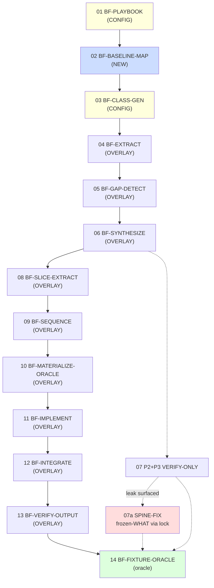

# Brownfield:feature — Task Index

> Build frontier of **brownfield:feature** (add new feature to greenfield-built project), broken into self-contained implementer tasks. Each task file = full scope + context, no need to read other files. Order = dependency DAG (`01_roadmap.md`). Caveman register throughout (see any task's EMBEDDED CANON).

## What we build

Add `class=feature-add` capability to the pipeline: re-enter a project the greenfield spine already shipped, add ONE new feature end-to-end to staging. NOT a new engine — fire the change-request mechanism frozen artifacts already promised. ~31 of 39 roles REUSE verbatim; ~9 carry a feature-add OVERLAY delta; 2 CONFIG; 1 NEW role.

## Posture key

- **NEW** — net-new role file. Full prompt-build + both-directions oracle.
- **OVERLAY** — feature-add DELTA block on existing role (shared `## Rules` + delta carrying ONLY what differs, AB1).
- **CONFIG** — playbook binding / mechanical frontmatter sweep. No new substance.
- **VERIFY-ONLY** — REUSE role, nothing authored; prove it runs clean on a feature-CR fixture.
- **SPINE-FIX** — class-agnostic spine defect surfaced by a checkpoint; REWRITE once (P3), not a per-class overlay.

## Tasks (build in order)

| # | Task | Posture | Unit | Deps |
|---|---|---|---|---|
| 01 | BF-PLAYBOOK | CONFIG | `prompts/_playbooks/feature-add.md` (+ new dir) | none (head) |
| 02 | BF-BASELINE-MAP | NEW | `prompts/00-aprd/BASELINE-MAP.md` | 01 |
| 03 | BF-CLASS-GEN | CONFIG | CLASSIFIER un-HALT + `class:` sweep | 01 |
| 04 | BF-EXTRACT | OVERLAY | `prompts/00-aprd/EXTRACT.md` | 02, 03 |
| 05 | BF-GAP-DETECT | OVERLAY | `prompts/00-aprd/GAP-DETECT.md` | 04 |
| 06 | BF-SYNTHESIZE | OVERLAY | `prompts/00-aprd/SYNTHESIZE.md` | 05 |
| 07 | P2+P3 VERIFY-ONLY | VERIFY-ONLY | Phase-2 (7 roles) + Phase-3 (8 roles) checkpoint | 06 |
| 07a | FIX-FROZEN-WHAT-VERSION-RESOLVE | SPINE-FIX | 13 P2/P3 roles resolve frozen-WHAT via `aprd.lock.artifact` | 07 |
| 08 | BF-SLICE-EXTRACT | OVERLAY | `prompts/01-roadmap/SLICE-EXTRACT.md` | 06 |
| 09 | BF-SEQUENCE | OVERLAY | `prompts/01-roadmap/SEQUENCE.md` | 08 |
| 10 | BF-MATERIALIZE-ORACLE | OVERLAY | `prompts/04-build/MATERIALIZE-ORACLE.md` | 09 |
| 11 | BF-IMPLEMENT | OVERLAY | `prompts/04-build/IMPLEMENT.md` | 10 |
| 12 | BF-INTEGRATE | OVERLAY | `prompts/04-build/INTEGRATE.md` | 11 |
| 13 | BF-VERIFY-OUTPUT | OVERLAY | `prompts/04-build/VERIFY-OUTPUT.md` | 12 |
| 14 | BF-FIXTURE-ORACLE | oracle | `_fixtures/brownfield-feature/` + both-directions | 13, 07 |

## Dependency DAG

## Hard gate (carried from arch §8)

Greenfield Phase-4 slice-build modes must drain first — feature-add Phase 4 overlays sit ON those modes. Tasks 10–13 reference shipped greenfield `MODE=slice-build` parts. If a greenfield slice-build part is absent, that overlay task is blocked until it ships.

## Frontier rule

Done = sentinel present + schema-valid. Frontier = first task whose sentinel absent. Each task names its sentinel under "DONE WHEN".
