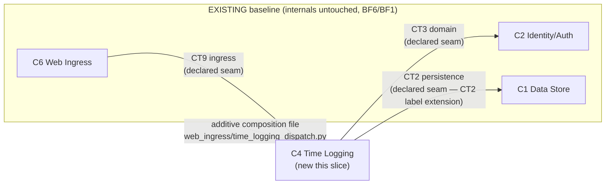

# Task 12 — BF-INTEGRATE (OVERLAY)

> Self-contained. Everything needed embedded below — do NOT hunt other files.

## TL;DR

Add a `feature-add` DELTA to the SLICE-BUILD mode of `prompts/04-build/INTEGRATE.md`. Greenfield INTEGRATE composes built components into the end-to-end flow (greens the FLOW layer; swaps mocks for real deps). Feature-add wires the new feature into EXISTING components at the declared `INTEGRATION_SEAMS`; existing internals stay untouched (BF6). MODE=slice. Dual-mode overlay on the existing slice-build part: ONE shared Rules + a feature-add delta carrying ONLY what differs (AB1). Satisfies **BF6**.

## Why this exists

The new feature plugs into the existing system at specific seams (declared in the aPRD `INTEGRATION_SEAMS`, catalogued in `baseline-map.json`). INTEGRATE must compose the new component with prior-built components ALONG those seams without rewriting any existing component's internals (BF6) — the contract is the wall; mock-and-real are interchangeable by construction.

### Invariants served
- **BF6 — seam-bounded.** Feature wired into existing components at declared seams; existing internals untouched.
- **BF7 / P8 — lock = single source of current frozen WHAT.** The aPRD carrying `INTEGRATION_SEAMS` is RESOLVED via `aprd.lock.artifact` (read lock → open named file), NOT a hardcoded `aprd.v<N>.frozen.md`. Same canon as Task 07a; `v2` below is the bench EXAMPLE, never the binding.

## DAG position

- **Deps:** Task 11 (BF-IMPLEMENT — slice contract layer green). **Hard gate:** greenfield `INTEGRATE` SLICE-BUILD part shipped.
- **Downstream:** BF-VERIFY-OUTPUT (13).
- **Sentinel:** golden slice `integration-record.json` cites the baseline seams it wired into; no existing component internals modified.

## EMBEDDED CANON

**Caveman block — already present in INTEGRATE; leave verbatim.**

**Anti-bloat:** AB1 (delta = only differences), AB2, AB7–AB9. **Dual-mode overlay pattern:** role runs `mode: skeleton-build|slice-build` off ONE shared `## Rules` + per-mode deltas. Add the feature-add seam delta to the slice-build part; class dispatched by playbook (`aprd_extension` includes `INTEGRATION_SEAMS`).

## Current state — `prompts/04-build/INTEGRATE.md` (greenfield, slice-build mode)

**Role:** Phase 4 role 4/8. Compose built components end-to-end: green the FLOW layer (the contract layer is IMPLEMENT's, already green; acceptance/held-out is VERIFY-OUTPUT's). Swap contract-level mocks for real wired components along the flow path. Internal — team owns HOW + wiring; the frozen oracle is immutable (you green the flow layer, NEVER edit it, B4/B5). Ground wiring in the frozen frame (ADR stack, MPA/SSR routing, OAuth, INV6 synchronous); never re-decide. Wire real components — never rewrite their internals.

**SLICE-BUILD mode:** auto-select the target slice from `08-rerank.json`; wire the slice's flow F* composing the new component + prior-built components (real on disk along the path); inherit the frozen skeleton wiring; output `.build/slices/<id>/integration-record.json`. Contract layer already green (IMPLEMENT).

## THE WORK — add the feature-add delta to the slice-build part of `INTEGRATE.md`

1. **Frontmatter:** add feature-add inputs — `.aprd/baseline-map.json` (`integration_seams` catalog: `{at: C*, kind, contract_ref: CT*}`), the lock-resolved CURRENT frozen version `.aprd/<aprd.lock.artifact>` (read `.aprd/aprd.lock`, open `.aprd/` + its `artifact` value; feature-add → `aprd.v<N>.frozen.md`, here `aprd.v2.frozen.md` — example, NOT hardcoded path; BF7/P8 + 07a canon) for its `INTEGRATION_SEAMS` block (which seams the feature plugs into), the existing prior-built `src/**` components (read-only, real callables to compose). Guard (rewrite freeze-gate, don't add — AB9): lock missing / `status != frozen`, OR named artifact missing/unparseable → HALT. Class dispatched by playbook.
2. **Shared `## Rules`:** keep verbatim. The "wire real components, never rewrite internals" rule already exists — generalize its source set so for feature-add the wiring targets are the declared `INTEGRATION_SEAMS` (state in delta, AB1).
3. **Add a `### feature-add delta (slice-build)` block:**
   - **Wire at declared seams only (BF6).** Compose the new component into the existing system ONLY at the seams declared in `INTEGRATION_SEAMS` (`at: C*`, `contract_ref: CT*`). The seam contract is the wall — wire against it, never reach inside an existing component.
   - **Existing internals untouched (BF6/BF1).** Wiring may add a NEW composition file / additive seam adapter (mirrors the greenfield slice pattern of adding a new dispatcher file in a prior-built namespace), but NEVER edits an existing component's internal logic. Needing to edit existing internals to wire = the seam is wrong → escape (Phase 2/3 change request), never patch.
   - **Honor the frozen frame.** Wiring conforms to the existing ADR stack + conventions (BF5 carries here) — same routing/session/error patterns the baseline uses.
4. **Output schema:** slice `integration-record.json` adds `class:"feature-add"`, `wired_seams: [{at, contract_ref}]` (the baseline seams composed), `existing_internals_modified: false` (MUST be false), `new_composition_files[]` (any additive adapter files). Keep the rest of the slice integration-record shape.
5. **Task steps:** add a feature-add branch: read `INTEGRATION_SEAMS` + seam catalog → compose the new component with prior-built components at those seams (additive wiring only) → green the slice flow layer → record `wired_seams` + assert `existing_internals_modified: false`. Keep slice-build steps intact.

## Lane / what NOT to do

- Don't edit any existing component's internals (BF6 — additive wiring only at seams).
- Don't wire at a seam not declared in `INTEGRATION_SEAMS` (reach-around = breach).
- Don't edit the frozen oracle (green the flow layer, never edit, B4).
- Don't re-decide the frame (ground in frozen ADRs).

## Verify (both-directions)

- **Known-good:** feature-add slice → flow wired at declared seams via additive files; `existing_internals_modified: false`; flow layer green. PASS.
- **Planted defect — internals edit:** wiring edits an existing component's internal logic → MUST FAIL (BF6).
- **Planted defect — undeclared seam:** wiring reaches into a component at a seam not in `INTEGRATION_SEAMS` → MUST FAIL (BF6).
- **Planted defect — stale-version walk:** a copy that ignores `aprd.lock.artifact` and hardcodes a fixed `aprd.v<N>.frozen.md` → reads the wrong version's `INTEGRATION_SEAMS` → MUST FAIL (BF7/P8; the 07a defect).

## DONE WHEN

- `INTEGRATE.md` slice-build part carries a feature-add seam delta (shared/slice-build Rules substance untouched).
- Frozen-WHAT RESOLVED via `aprd.lock.artifact` (no hardcoded version path); freeze-gate guard verifies the named artifact exists (BF7/P8 + 07a canon).
- Golden feature-add slice `integration-record.json` cites `wired_seams`, asserts `existing_internals_modified: false`, flow layer green.
- Both-directions check holds (incl. stale-version-walk FAIL).

---

## STATUS — DONE (2026-06-10)

Feature-add seam delta added to SLICE-BUILD part of `prompts/04-build/INTEGRATE.md`. Greenfield substance untouched (AB1 — delta carries ONLY differences).

### What changed in `INTEGRATE.md`

| Edit | Where | Substance |
|---|---|---|
| Frontmatter inputs | feature-add slice-build block | `.aprd/<aprd.lock.artifact>` (lock-resolved `INTEGRATION_SEAMS`, NEVER hardcoded `v<N>`) + `.aprd/baseline-map.json` `integration_seams` catalog = the declared seam wall |
| Freeze-gate guard | shared escape (rewrite, not add — AB9) | extended with `(feature-add) the artifact aprd.lock names missing/unparseable → HALT` |
| feature-add escapes | slice-build feature-add block | (a) no baseline-map catalog / no `INTEGRATION_SEAMS` → HALT; (b) internals-edit-need OR off-catalog reach-around → ESCAPE (Phase 2/3) |
| `### feature-add delta (slice-build)` | PART B, after slice-build Rules | 4 delta rules: lock-resolve WHAT · wire at declared catalog seams ONLY (BF6) · existing internals untouched, additive only (BF6/BF1) · honor frozen frame (BF5) |
| Task-steps feature-add branch | slice-build steps | 0a resolve frozen-WHAT · 4 classify hops vs catalog · 5 additive composition file only · 7 emit `wired_seams` + `existing_internals_modified:false` + `new_composition_files[]` |
| Schema delta | after slice-build schema | `class:"feature-add"` + `aprd_ref`/`aprd_version` + `baseline_map_ref`/`integration_seams_ref` + `wired_seams[]` (⊆ catalog) + `existing_internals_modified:false` + `new_composition_files[]` + per-swap `seam_basis` |
| Stop condition | slice-build stop | feature-add blocked (internals/off-catalog) + feature-add clean lines |

Shared Rule 4 ("compose real callables, never rewrite internals") kept VERBATIM — feature-add only NARROWS its target set to the declared `INTEGRATION_SEAMS` (stated in delta, AB1).

### Golden fixture

`_fixtures/brownfield-feature/.build/slices/S5/integration-record.json` — feature-add slice (Tag a time entry with a label). New C4 wired into existing C6/C2/C1 at declared seams via ONE additive file. Validated: JSON well-formed; `wired_seams ⊆ baseline-map integration_seams` catalog (C6/CT9, C2/CT3, C1/CT2 — C2/CT8 external correctly excluded, off F5 path); `existing_internals_modified:false`; flow F5 green (5 assertions incl. CT2:store-unavailable failure variant).

### Seam-bounded wiring (BF6)

Wiring lands ONLY at declared `INTEGRATION_SEAMS`; new component plugs in via an additive composition file; zero existing-internal edits.

### Both-directions verify

- **Known-good** (golden S5): additive wiring at declared seams, `existing_internals_modified:false`, flow green → **PASS**.
- **Internals-edit defect**: caught by delta Rule 3 + escape (EDITING internals → ESCAPE) + schema `existing_internals_modified` MUST be false → **FAIL**.
- **Undeclared-seam defect**: caught by delta Rule 2 + escape (off-catalog reach-around → ESCAPE) + `wired_seams ⊆ catalog` → **FAIL**.
- **Stale-version-walk defect** (07a): hardcoded `aprd.v<N>.frozen.md` ignoring `aprd.lock.artifact` reads wrong version's `INTEGRATION_SEAMS`; caught by delta Rule 1 + input binding + freeze-gate guard → **FAIL**.

Downstream: BF-VERIFY-OUTPUT (13) runs the full ladder + scoped regression.
