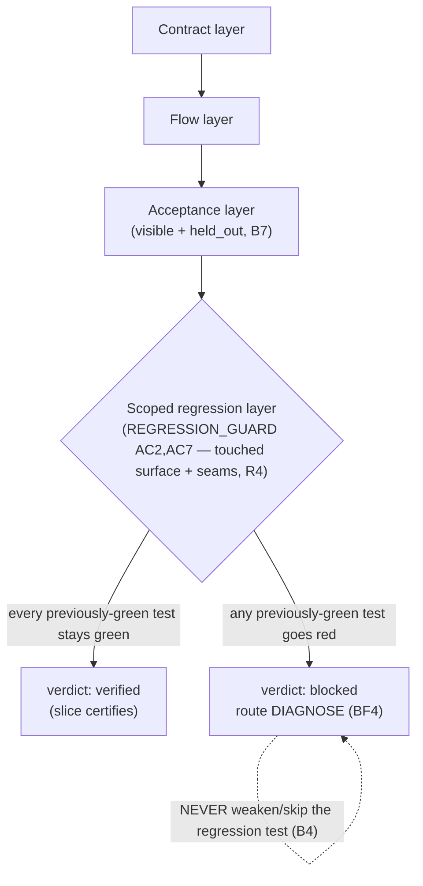

# Task 13 — BF-VERIFY-OUTPUT (OVERLAY)

> Self-contained. Everything needed embedded below — do NOT hunt other files.

## TL;DR

Add a `feature-add` DELTA to the SLICE-BUILD mode of `prompts/04-build/VERIFY-OUTPUT.md`. Greenfield VERIFY-OUTPUT runs the full verification ladder (contract + flow + acceptance, incl. held-out) and certifies the slice. Feature-add ADDS the **regression layer run** — nothing previously green goes red (BF4). Inherited ladder + regression-must-stay-green is the bar. MODE=slice. Dual-mode overlay on the existing slice-build part: ONE shared Rules + a feature-add delta carrying ONLY what differs (AB1). Satisfies **BF4**.

## Why this exists

Feature-add's defining guarantee is that the existing accepted behavior keeps working (BF4). VERIFY-OUTPUT is the gate that runs the oracle — so it must also run the regression layer MATERIALIZE-ORACLE added (Task 10), assert it green, and fail the slice if any previously-green existing AC/suite goes red.

### Invariants served
- **BF4 — regression-gated.** Regression layer run; nothing previously green goes red, or the slice fails.
- **BF7 / P8 — lock = single source of current frozen WHAT.** The aPRD carrying `REGRESSION_GUARD` is RESOLVED via `aprd.lock.artifact` (read lock → open named file), NOT a hardcoded `aprd.v<N>.frozen.md`. Same canon as Task 07a; `v2` below is the bench EXAMPLE, never the binding.

## DAG position

- **Deps:** Task 12 (BF-INTEGRATE — flow layer green), Task 10 (regression layer materialized in the slice oracle). **Hard gate:** greenfield `VERIFY-OUTPUT` SLICE-BUILD part shipped.
- **Downstream:** Task 14 (BF-FIXTURE-ORACLE).
- **Sentinel:** regression-green `verify-output.json` / `build-record.json` golden — the regression layer ran and passed alongside the full ladder.

## EMBEDDED CANON

**Caveman block — already present in VERIFY-OUTPUT; leave verbatim.**

**Anti-bloat:** AB1 (delta = only differences), AB2, AB7–AB9. **Dual-mode overlay pattern:** role runs `mode: skeleton-build|slice-build` off ONE shared `## Rules` + per-mode deltas. Add the feature-add regression delta to the slice-build part; class dispatched by playbook (`oracle_layers` includes `regression`; `verify_method: inherited ladder + regression-must-stay-green`).

## Current state — `prompts/04-build/VERIFY-OUTPUT.md` (greenfield, slice-build mode)

**Role:** Phase 4 role 6/8. Run the full verification ladder against the frozen oracle and certify the slice: contract layer (IMPLEMENT greened it) + flow layer (INTEGRATE greened it) + acceptance layer including the GATE-ONLY held-out tests (the structural anti-cheat — builder never saw them, B7). The authoritative execution: where IMPLEMENT recorded `static-trace`, VERIFY-OUTPUT owes the real run. A red here routes to DIAGNOSE (self-heal vs escape adjudication). The oracle is frozen — run it, never edit it (B4).

**SLICE-BUILD mode:** auto-select the target slice from `08-rerank.json`; run the slice oracle's full ladder (inheriting the frozen skeleton oracle greens by reference, not re-run); output `.build/slices/<id>/verify-output.json`.

## THE WORK — add the feature-add delta to the slice-build part of `VERIFY-OUTPUT.md`

1. **Frontmatter:** add feature-add inputs — the slice `oracle.json` `class_ext` regression layer (from Task 10), `.aprd/baseline-map.json` `existing_oracle` (the suites that must stay green), the lock-resolved CURRENT frozen version `.aprd/<aprd.lock.artifact>` (read `.aprd/aprd.lock`, open `.aprd/` + its `artifact` value; feature-add → `aprd.v<N>.frozen.md`, here `aprd.v2.frozen.md` — example, NOT hardcoded path; BF7/P8 + 07a canon) for its `REGRESSION_GUARD` (the scoped guard). Guard (rewrite freeze-gate, don't add — AB9): lock missing / `status != frozen`, OR named artifact missing/unparseable → HALT. Class dispatched by playbook.
2. **Shared `## Rules`:** keep verbatim. The "run the full ladder, oracle is frozen" rule stays; the delta adds the regression layer to the ladder for feature-add (one home, AB1).
3. **Add a `### feature-add delta (slice-build)` block:**
   - **Run the regression layer; must stay green (BF4).** After the contract/flow/acceptance ladder passes, run the regression layer (the scoped existing suites named in `REGRESSION_GUARD` / `class_ext`). EVERY previously-green test in scope must still pass. Any regression red = the slice FAILS — route to DIAGNOSE (the feature broke existing behavior).
   - **Regression red is a hard fail, not a flake.** A previously-green test going red after the feature lands is a real regression (BF4) unless DIAGNOSE proves it flaky. Never weaken/skip a regression test to pass — that's a frozen-test edit (B4), escape instead.
   - **Scope = touched surface + seams (Risk R4).** Run the SCOPED regression layer Task 10 materialized, not the whole inherited suite — same scope basis, kept fast.
   - **Held-out + regression together = the bar.** The acceptance held-out (anti-cheat) AND the regression layer must both be green for the slice to certify.
4. **Output schema:** slice `verify-output.json` adds `class:"feature-add"`, `regression: { ran: true, scope, suites_run[], verdict: "green|red", reds[] }`, and the slice certifies only when `regression.verdict == "green"` AND the full ladder passes. `regression_guard_ref`.
5. **Task steps:** add a feature-add branch: after the standard ladder, run the scoped regression layer → if any red, set slice not-certified + route to DIAGNOSE → else certify. Keep slice-build steps intact.

## Lane / what NOT to do

- Don't weaken/skip/edit any regression or frozen test to pass (B4 — escape instead).
- Don't run the whole inherited suite unscoped (Risk R4).
- Don't certify a slice with a regression red (BF4).
- Don't edit the oracle.

## Verify (both-directions)

- **Known-good:** feature-add slice, no regression → full ladder + scoped regression both green → slice certifies. PASS.
- **Planted defect — regression (the headline BF4 test):** the feature breaks an existing AC → a previously-green regression test goes red → slice MUST FAIL (not certify).
- **Planted defect — regression skipped:** feature-add slice certified without running the regression layer → MUST FAIL.
- **Planted defect — weakened regression test:** a regression test edited to pass → MUST FAIL (B4 breach).
- **Planted defect — stale-version walk:** a copy that ignores `aprd.lock.artifact` and hardcodes a fixed `aprd.v<N>.frozen.md` → reads the wrong version's `REGRESSION_GUARD` → MUST FAIL (BF7/P8; the 07a defect).

## DONE WHEN

- `VERIFY-OUTPUT.md` slice-build part carries a feature-add regression delta (shared/slice-build Rules substance untouched).
- Frozen-WHAT RESOLVED via `aprd.lock.artifact` (no hardcoded version path); freeze-gate guard verifies the named artifact exists (BF7/P8 + 07a canon).
- Golden feature-add slice `verify-output.json` runs the scoped regression layer green alongside the full ladder.
- Both-directions check holds (incl. stale-version-walk FAIL + the headline planted-regression FAIL).

---

## STATUS — DONE (2026-06-10)

Feature-add regression delta added to SLICE-BUILD part of `prompts/04-build/VERIFY-OUTPUT.md`. Greenfield + shared substance untouched (AB1 — delta carries ONLY differences).

### What changed in `VERIFY-OUTPUT.md`

| Edit | Where | Substance |
|---|---|---|
| Frontmatter inputs | feature-add slice-build block | `.aprd/<aprd.lock.artifact>` (lock-resolved `REGRESSION_GUARD`, NEVER hardcoded `v<N>`) + `.aprd/baseline-map.json` `existing_oracle.suites` = the prior-green suites the scoped regression runs against by reference |
| Freeze-gate guard | shared escape (rewrite, not add — AB9) | extended with `(feature-add) the artifact aprd.lock names missing/unparseable → HALT` (BF7/P8) |
| feature-add escapes | slice-build feature-add block | (a) no baseline-map `existing_oracle` / no `REGRESSION_GUARD` / no regression layer in oracle.json → HALT (a regression-skip is a BF4 breach); (b) edit/weaken/skip a regression-or-frozen test to pass → blocked + DIAGNOSE, never patch (B4) |
| `### feature-add delta (slice-build)` | PART B, after slice-build Rules | 5 delta rules: lock-resolve WHAT (BF7) · run regression, nothing previously green goes red (BF4) · regression red = hard fail, never weaken (B4) · scope = touched surface + seams (R4) · held_out + regression together = the bar (B7) |
| Task-steps feature-add branch | slice-build steps | 0a resolve frozen-WHAT + read `REGRESSION_GUARD`/`existing_oracle`/regression layer · 4 run full ladder THEN scoped regression · 6 certify iff ladder green AND `regression.verdict==green` · 7 emit `regression{}` block |
| Schema delta + blocked example | after slice-build schema | `class:"feature-add"` + `aprd_ref`/`aprd_version` + `baseline_map_ref` + `regression_guard_ref` + `ladder.class_ext` fires (regression) + top-level `regression{ran,scope,suites_run,asserts,results,verdict,reds,baseline_tests_edited}` + counts; headline REGRESSION-red blocked example (slice MUST FAIL) |
| Stop condition | slice-build stop | feature-add regression-red blocked (route DIAGNOSE) + feature-add clean lines |

Shared `## Rules` + the 5-rung verification ladder kept VERBATIM — discriminator-4 (class-ext) already runs "only what the oracle materialized"; feature-add NARROWS it so the materialized layer IS the MANDATORY scoped regression (stated in delta, AB1).

### Golden fixture (sentinel)

`_fixtures/brownfield-feature/.build/slices/S5/verify-output.json` — feature-add slice (Tag a time entry with a label). Full ladder (contract CT2-LABEL + flow F5 + acceptance AC11/AC13 visible+held_out) green; scoped regression layer (AC2/AC7 from `REGRESSION_GUARD`, suites `.build/skeleton/oracle/` + `.build/slices/S4/oracle/` by reference) green → `verdict:"verified"`. Validated: JSON well-formed; `regression.ran:true` + `verdict:"green"` + `baseline_tests_edited:false`; `class_ext_layers:1`; skeleton-fidelity untouched (H14/BF1).

### Regression-gated certification (BF4)

Held-out anti-cheat AND scoped regression BOTH green = the bar; regression red fails the slice, never patched.

### Both-directions verify

- **Known-good** (golden S5): full ladder + scoped regression both green, held_out green → `verdict:"verified"` → **PASS**.
- **Planted regression-red** (headline BF4): feature breaks an existing AC → previously-green regression test goes red → `regression.verdict:"red"` + `verdict:"blocked"` → caught by delta Rule 2 + schema `regression.verdict` gate → **FAIL** (slice MUST NOT certify).
- **Regression-skipped defect**: feature-add slice certified without running regression → caught by feature-add guard (no regression layer → HALT) + schema `regression.ran` MUST be true → **FAIL**.
- **Weakened-regression-test defect**: a regression test edited to pass → caught by delta Rule 3 + escape (edit/weaken → blocked, never patch) + `baseline_tests_edited` MUST be false (B4) → **FAIL**.
- **Stale-version-walk defect** (07a): hardcoded `aprd.v<N>.frozen.md` ignoring `aprd.lock.artifact` reads wrong version's `REGRESSION_GUARD`; caught by delta Rule 1 + input binding + freeze-gate guard → **FAIL**.

Downstream: BF-FIXTURE-ORACLE (14) freezes the regression-green sentinel.
