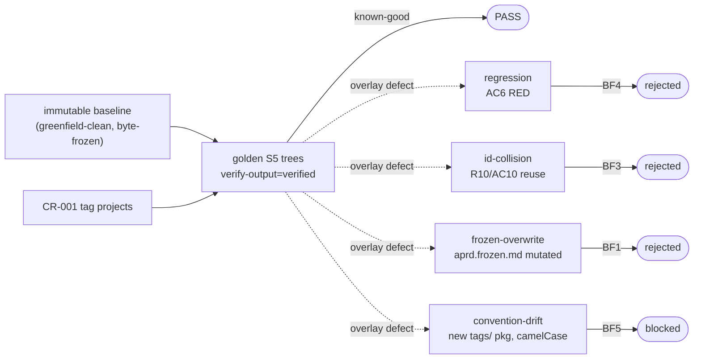

# Task 14 — BF-FIXTURE-ORACLE (both-directions oracle)

> Self-contained. Everything needed embedded below — do NOT hunt other files.

## TL;DR

Build `_fixtures/brownfield-feature/` — the oracle baseline for the whole brownfield spine. = a greenfield-built, demo-accepted project (frozen baseline trees) + a feature change request + the GOLDEN correctly-extended trees. Then plant defects and prove the pipeline FAILs each, while the known-good golden PASSes. If the verifier can't separate golden from defect, it's broken — fix it before trusting ANY brownfield build.

## Why this exists

Every prompt in this spine is judged by running it clean-room against a fixture: known-good PASSes, planted-defect FAILs — both directions must hold. This task builds that fixture for feature-add and the brownfield-specific defect set. It is the single oracle Tasks 02–13 verify against.

### Invariants verified (the four brownfield-specific risks)
- **BF1 — frozen-overwrite:** mutating the baseline aPRD instead of versioning → MUST FAIL.
- **BF3 — ID collision:** a new `R*` reusing a baseline `R*` index → MUST FAIL.
- **BF4 — regression:** the feature breaks an existing AC → MUST FAIL.
- **BF5 — convention drift:** new code diverges from captured conventions → CRITIQUE flags → MUST FAIL.

## DAG position

- **Deps:** Task 13 (BF-VERIFY-OUTPUT) + Task 07 (P2+P3 VERIFY-ONLY) — the full feature-add path must exist to extend the trees.
- **Downstream:** none (tail). This fixture is what every other brownfield task's "verify" section runs against.
- **Sentinel:** `_fixtures/brownfield-feature/` present with seeded baseline + CR + golden extended trees; both-directions oracle runs (known-good PASS + all four planted defects FAIL).

## Reference baseline shape (model the fixture on greenfield-clean)

The existing greenfield oracle `_fixtures/greenfield-clean/` is the model for an accepted project. It carries (mirror this layout for the brownfield baseline):
- `.aprd/aprd.frozen.md` + `aprd.lock` (status frozen, signer `client:...`), plus `00-raw-request.md`, `01-classification.json`, `02-extraction.json`, `04-gaps.json`, `05-questions.md`, `06-answers.md`, `07-assumptions.json`, drafts.
- `.adr/log/0001..000N-*.md` + `adr.lock` + `adr-index.json`.
- `.hld/skeleton.frozen.md` + `skeleton.lock` + `skeleton/{components,contracts,data-model,flows,test-specs,nfr-mechanisms,build-dag}.json` + `.hld/slices/S4/*` (an accepted increment slice).
- `.roadmap/{02-slices,03-verticality,04-skeleton,05-sequence,06-foundation-cut,07-sequence-reviewed,08-rerank}.json` + `roadmap.md`. `08-rerank.json` carries `completed[]` (accepted slices, e.g. S1) + `remaining_sequence[]`.
- `.build/skeleton/oracle/` + `.build/slices/S4/oracle/` (pytest suites, `oracle.lock` frozen, mutation-certification) + `build-record.json` + `integration-record.json` + `demo/` (`demo.json` with `client_response:accepted`).
- `pyproject.toml` + `src/freelancer_app/<module>/*.py` (real implementation; components C1 Data Store, C2 Identity & Auth, C3 Project Management, C6 Web Ingress; seams persistence/domain/primary_external_integration/ingress; contracts CT*).

ID spaces present: `R*/AC*/E*/C*/S*/ADR-*/CT*`. The baseline's high-water-marks are whatever the seeded project tops out at — new feature IDs must continue strictly above them.

## THE WORK — build `_fixtures/brownfield-feature/`

### A. Seed the accepted baseline

Copy/adapt a greenfield-clean-style accepted project into `_fixtures/brownfield-feature/` as the IMMUTABLE baseline: all frozen trees + locks (status frozen) + accepted demo records + real `src/`. This is the project the feature re-enters. Record the ID high-water-marks.

### B. Author the feature change request

`_fixtures/brownfield-feature/.aprd/change-requests/CR-001-<feature>.md` — a client ask for ONE new atomic feature against the existing system (e.g. "add a tag/label to time entries and filter the list by tag"). Atomic, single-system, plugs into existing seams.

### C. Build the GOLDEN correctly-extended trees

The expected output of running the full feature-add path on the CR:
- `.aprd/baseline-map.json` (Task 02 output) — correct ID high-water-marks + conventions + seam catalog + existing-oracle inventory.
- `.aprd/aprd.v2.frozen.md` (Task 06) — new `R*/AC*` above high-water + `CLASS_EXTENSION` block (INTEGRATION_SEAMS / REGRESSION_GUARD / CONVENTION_BASELINE). Baseline `aprd.frozen.md` BYTE-UNCHANGED. `aprd.lock` re-signed v2.
- `.roadmap/08-rerank.json` — new slice(s) in `remaining_sequence`, baseline slices pinned `completed[]`.
- `.hld/slices/S<new>/*` — HLD increment; `skeleton.frozen.md` byte-unchanged.
- `.build/slices/S<new>/oracle/` — slice oracle WITH a scoped `regression` layer (`class_ext`); `build-record.json` (convention-conformant, contract green); `integration-record.json` (wired at declared seams, `existing_internals_modified:false`); `verify-output.json` (regression-green + full ladder).
- New `src/freelancer_app/<new_module>/*.py` (or additive files in existing namespaces) conforming to baseline conventions.

### D. Both-directions oracle — plant defects, all MUST FAIL

Create planted-defect copies; the verifier must reject each:
1. **regression** — feature breaks an existing AC (a baseline-green test goes red) → MUST FAIL (BF4). Headline test.
2. **ID collision** — a new `R*` reuses a baseline `R*` index → MUST FAIL (BF3).
3. **frozen-overwrite** — the run mutates baseline `aprd.frozen.md` (or `skeleton.frozen.md` / an existing ADR body) instead of versioning → MUST FAIL (BF1).
4. **convention drift** — new code uses canon defaults contradicting the captured `CONVENTION_BASELINE` → CRITIQUE flags → MUST FAIL (BF5).

The known-good golden (C) PASSes. If the verifier cannot tell the golden from any defect, the verifier is BROKEN — STOP and fix it before trusting any brownfield build.

## EMBEDDED CANON (verify discipline)

- **Both-directions mandatory** — known-good PASS + planted-defect FAIL; if indistinguishable, the oracle is broken.
- **Disk is the deliverable** — verify the artifact on disk, not a chat reply.
- **Clean-room** — the runner (step-runner, Sonnet/High) gets only the prompt verbatim + the test-bench path; no pipeline context leaks in. Seed the test-bench from this fixture; the runner never reads `_fixtures/` directly.
- **Caveman + economy** bind all authored fixture prose (request, demo records, golden artifact bodies).

## Lane / what NOT to do

- Don't make the golden trivially distinguishable from defects by anything other than the real invariant under test.
- Don't let the baseline be anything but byte-frozen (the whole point is it's immutable).
- Don't skip any of the four planted defects — each guards one brownfield invariant.

## DONE WHEN

- `_fixtures/brownfield-feature/` holds: seeded immutable accepted baseline + `CR-001` + golden extended trees.
- The known-good golden PASSes clean-room.
- All four planted defects (regression / ID collision / frozen-overwrite / convention drift) FAIL.
- The verifier demonstrably separates golden from each defect (oracle trustworthy).

---

## STATUS — DONE (2026-06-10)

Built `_fixtures/brownfield-feature/` (159 files). Feature CR-001 = **tag a client project with a label + filter project list by tag** (extends project record C3, not time entries — chosen because the greenfield-clean baseline builds C1/C2/C3/C6 only; time-logging C4 is unbuilt, so tagging projects is the atomic feature that plugs into a built, demo-accepted surface).

### What landed
- **A. Baseline (immutable):** copied greenfield-clean wholesale — `.adr/`, `.hld/skeleton+slices/S4`, `.build/skeleton+slices/S4`, `.roadmap/03-07+roadmap.md`, `src/` (C1/C2/C3/C6), `pyproject.toml`, `aprd.frozen.md`+`aprd.lock`. `aprd.frozen.md` BYTE-IDENTICAL to greenfield (verified `diff -q`). High-water: R10/AC10/E7/C6/S4/ADR-0006/CT11/A13/F4.
- **B. CR:** `.aprd/change-requests/CR-001.md` + feature-add front-end (00 raw, 01 class, 02 extract, 04 gaps, 05 q, 06 a, 07 assumptions).
- **C. Golden:** `aprd.v2.frozen.md` (R11/R13, AC11/AC13, E8, A14–16, `CLASS_EXTENSION`: seam CT2 / regression-guard AC6 / convention-baseline), `baseline-map.json`, roadmap `02-slices`+`08-rerank` (S5/S6, baseline S1+S4 pinned), `.hld/slices/S5/*` (CT2 label extension, flow F5), `.build/slices/S5/*` (build-plan, oracle .json+.lock+7 `.py` test files, build-record, integration-record, verify-output verdict `verified`, critique `clean`), additive `src/` `project_management/project_label.py` + `web_ingress/project_label_dispatch.py` + appended WSGI label route. New IDs all strictly above high-water; baseline frozen artifacts untouched.
- **D. Both-directions oracle:** `defects/` + root `README.md` (scenario→verdict table + mermaid). Golden PASSes (verified/green/clean); 4 defects FAIL on the real invariant only.

### Oracle map (the four brownfield risks)

| defect dir | invariant | seed → path | role | golden | defect |
|---|---|---|---|---|---|
| `regression` | BF4 | `project_store.regressed.py` → project_store.py | VERIFY-OUTPUT | regression green / verified | regression RED / rejected |
| `id-collision` | BF3 | `aprd.v2.collision.frozen.md` → aprd.v2.frozen.md | SYNTHESIZE/verify | no collision | R10/AC10 collide / rejected |
| `frozen-overwrite` | BF1 | `aprd.frozen.mutated.md` → aprd.frozen.md | VERIFY | baseline byte-unchanged | immutability breach / rejected |
| `convention-drift` | BF5 | `tagService.py` → src/freelancer_app/tags/ | CRITIQUE | clean / drift=false | convention-drift flagged / blocked |

Each defect dir carries planted artifact(s) + `expected-verdict.json` (load-bearing assertion). Separation verified: golden `verified/green/clean` vs defects `rejected×3/blocked`; all JSON valid (`jq`).

### Acceptance criteria — met
- ✅ baseline seeded immutable + accepted (S1/S4) + CR-001 + golden extended trees on disk.
- ✅ golden PASSes (verify-output `verified`, 5/5 layers, regression green).
- ✅ all 4 defects FAIL, each on its own invariant (BF1/BF3/BF4/BF5).
- ✅ verifier separates golden from each defect by the real invariant signal (not cosmetics).

> Note: verification is **static-trace** (no pytest runtime in bench, per pipeline); `.py` oracle/src files are the materialized oracle, verdicts carried in the JSON records. Lock `content_sha256` values are nominal (consumers check status+manifest, do NOT recompute).
