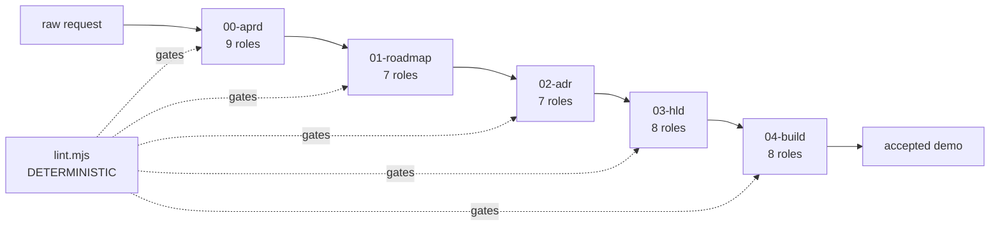
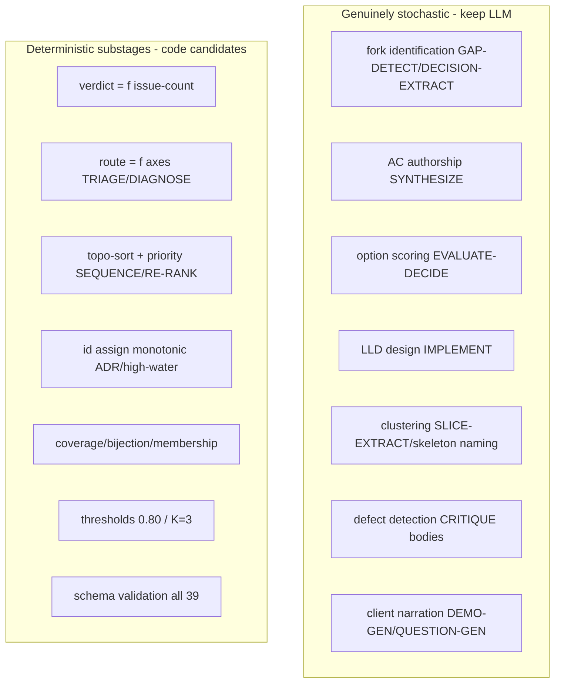

# 00 — Current-State Analysis: Stochastic Steps, Fixed Data Models, Deterministic Decisions

> Map of the prompt-driven delivery pipeline. Goal: find where stochastic (LLM) steps lean on **fixed data models** + make **deterministic decisions** — the seams where code can replace the model. Source of truth: `prompts/`, `.hld/skeleton/`, `tools/`, `_fixtures/`.

## System shape

Pipeline = library of **39 executable prompts** (one role = one prompt) across 5 phases. Each prompt = one stochastic step: clean-room LLM session reads disk → does work → writes disk → stops. State derived from disk (no tracker). Phases chain producer/consumer (PR2): output schema of step N == input schema of step N+1. IDs thread `R→AC→S→ADR→C→CT→F→commit`.

Every step today = LLM. Two deterministic tools already exist beside the prompts (proof determinism fits this engine):
- `tools/economy-lint/lint.mjs` — Layer-1 structural lint, zero LLM, 11 checks (AB1–AB9), `verdict: clean|blocked`, byte-identical out. Catches ~70% bloat pre-token.
- `tools/pack/{gen-manifest,pack}.mjs` — allowlist manifest gen + selftest gate, deterministic, byte-identical on clean tree.

## Two findings axes (per task)

- **A = fixed data model.** Step emits/consumes a closed-schema JSON/YAML artifact: typed arrays, enum fields, bijections, id-threading. Schema is invariant; LLM only fills values.
- **B = deterministic decision.** Step makes a choice driven by fixed rule / threshold / lookup / set-membership / topo-sort / count — computable by code, no judgment.

Nearly **every** step is A (all 39 write closed-schema artifacts). Many embed B substages buried inside an LLM call. Below: per-phase, the fixed model + the deterministic decision logic, quoted.

---

## A — Stochastic steps using FIXED DATA MODELS (all 39)

All prompts declare `## Output schema — <path>` with closed shape. Representative models:

| Phase | Step | Fixed model (key shape) | Enum / closed fields |
|---|---|---|---|
| 00 | CLASSIFIER | `01-classification.json` `{is_compound, overall_confidence, needs_confirmation, subrequests[]{id,text,class,confidence,reason}}` | `class` enum (7), `confidence∈[0,1]` |
| 00 | EXTRACT | `02-extraction.json` typed arrays `entities[] explicit_requirements[] implied_requirements[] stated_constraints[] unknowns[]` | `inferred:bool`, id-spaces E*/R*/C*/U* |
| 00 | EXTRACT-RULES | `rules-extracted.json` `RULE*[]{source_ref,tier,tool,kind,setting,evidence}` | `kind:config\|opinion`, `tier` |
| 00 | GAP-DETECT | `04-gaps.json` `G*[]{interpretations[],recommended_default,blast_radius,disposition}` | `blast_radius:architecture\|scope\|cosmetic`, `disposition:ask\|assume` |
| 00 | QUESTION-GEN | `05-questions.md` ≤6 Q-blocks, lettered options + gap_ref comments | recommended marker, escape option |
| 00 | RECONCILE | `rules-reconciled.json` `AGR*[] CONF*[]{positions[],recommended_position}` | tier-precedence |
| 00 | SYNTHESIZE | `aprd draft` + `07-assumptions.json` `A*[]{gap_ref,source,chosen_interpretation,rejected[]}` | `source` enum (4), `touch_set[]` |
| 00 | VERIFY | `rules-verified.json` `+verification{status,...}` | `status` enum (7) |
| 00 | CRITIQUE | `08-critique.json` `{verdict, issues[]{category,target_ref}}` | 5 categories, `verdict:clean\|blocked` |
| 01 | SLICE-EXTRACT | `02-slices.json` `slices[]{id,requirements,acceptance,value,depends_on}` + `coverage{}` | `value:high\|med\|low` |
| 01 | VERTICALITY-CHECK | `03-verticality.json` `{valid[],rejected[]{category,remedy},verdict}` | `verdict:all_vertical\|horizontal_found` |
| 01 | SKELETON-IDENTIFY | `04-skeleton.json` `{skeleton{seam_coverage[]},foundational_seams[],uncovered_seams[]}` | seam enum (4) |
| 01 | SEQUENCE | `05-sequence.json` `sequence[]{position,id,cost_proxy,depends_on}` + `dependency_check` | `acyclic`, `skeleton_is_root` |
| 01 | SEQUENCE-REVIEW | `roadmap.md` MCQ + `07-sequence-reviewed.json` `review{verdict,overrides[]}` | `verdict:confirmed\|reordered\|deferred\|blocked` |
| 01 | FOUNDATION-CUT | `06-foundation-cut.json` `foundational_decisions[] skeleton_seams[] cross_slice_invariants[] deferred[]` | category-named, INV* |
| 01 | RE-RANK | `08-rerank.json` `{completed[],remaining_sequence[]{done_sentinel},dependency_check,verdict}` | `verdict:re_ranked\|unchanged\|dependency_defect` |
| 02 | DECISION-EXTRACT | `01-decision-points.json` `DP*[]{category,forced_by[],candidate_blast_radius}` + `checklist_coverage[]` | 10-category §-taxonomy |
| 02 | TRIAGE | `02-triage.json` `triage[]{blast_radius,cut_status,route}` + 4 queues | `route` (4), `blast_radius` (3) |
| 02 | OPTION-GEN | `03-options/<DP>.json` `options[]{source,tradeoffs{strengths[],costs[]}}` `degenerate:bool` | `source` enum |
| 02 | EVALUATE-DECIDE | `<DP>.decision.json` `{evaluation[],decision_made,rejected[],consequences{},traces[]}` | `degenerate_forced` |
| 02 | RECONCILE | `04-conflicts.json` `{conflicts[],constraint_violations[],coverage{},verdict,blocking_count}` | `verdict:coherent\|blocked` |
| 02 | SYNTHESIZE-ADR | `<NNNN>.draft.md` Nygard frontmatter + `adr-index.json` | `status:Proposed`, ADR-NNNN monotonic |
| 02 | CRITIQUE | `05-critique.json` `{issues[]{category,target_adr},verdict}` | 7 categories |
| 03 | DERIVE-COMPONENTS | `components.json` `components[]{traces,owns_entities,realizes_seam} edges[]{from,to}` | acyclic, topo-order |
| 03 | DEFINE-CONTRACTS | `contracts.json` `CT*[]{between,kind,shape,failure_modes[]}` bijection edge↔CT* | `kind:sync_api\|shared_data\|async_event` |
| 03 | MODEL-DATA | `data-model.json` `entities[]{owner,persisted}` `ownership{E*:C*}` | single-owner bijection |
| 03 | MAP-NFR | `nfr-mechanisms.json` `nfr_inventory[]{disposition,mechanism_ref}` | `disposition` enum (5) |
| 03 | MODEL-FLOWS | `flows.json` `F*[]{path[C*],steps[]{via:CT*},seam_coverage}` | `composes_against_contracts:bool` |
| 03 | DERIVE-TESTS | `test-specs.json` `contract_tests[]`(1/CT*) `flow_tests[]`(1/F*) + `build-dag.json` | bijection, topo waves |
| 03 | RECONCILE-CRITIQUE | `critique.json`/`reconcile.json` `{issues[]{category},verdict}` | 7+1 categories |
| 03 | RESOLVE-LOCAL | `deferred-decisions.json` `resolutions[]{disposition,adr_id}` + local ADR drafts | `disposition:resolved\|re-deferred\|escalated` |
| 04 | BUILD-PLAN | `build-plan.json` `build_units[]{wave,consumes_seams[]{status}} mock_map{}` | `status:real\|mocked` |
| 04 | MATERIALIZE-ORACLE | `oracle.json` `{contract_tests[],flow_tests[],acceptance_tests[]{visible,held_out}}` + `oracle.lock` | `starts_red:true`, held-out split |
| 04 | IMPLEMENT | `build-record.json` `build_units[]{contract_tests_greened[],status,escape}` | `status:green\|blocked` |
| 04 | INTEGRATE | `integration-record.json` `{mock_swaps[]{status},mocks_retained[],flow_test}` | `status:swapped-real` |
| 04 | VERIFY-OUTPUT | `verification.json` `ladder{} per_ac_summary[]{visible,held_out,verdict}` | `verdict:verified\|blocked` |
| 04 | CRITIQUE | `critique.json` `issues[]{category:hardcoded-fixture\|...}` | 5 cheat categories |
| 04 | DIAGNOSE | `diagnosis.json` `{verdict,classification,routable_diagnosis}` | `verdict` (3), `classification` (5) |
| 04 | DEMO-GEN | `demo.md` + `demo.json` `{demonstrated_acs[],client_response,learnings[],status}` | `status:accepted\|rejected\|changes_requested` |

**Finding A:** 39/39 steps bound to closed schema. Schema authoring + validation are NOT stochastic — only value-fill is. Today an LLM both fills AND (implicitly) validates. **Validation half is pure code.**

---

## B — Stochastic steps making DETERMINISTIC DECISIONS

Decisions below run inside an LLM call today but follow fixed rule/threshold/lookup/topo/count → code-replaceable. Quoted logic:

### Gates: verdict = function(issue count)
Every gate sets `verdict` by a pure rule, NOT judgment:
- 00 CRITIQUE, 02 RECONCILE, 02 CRITIQUE, 03 RECONCILE-CRITIQUE, 04 VERIFY-OUTPUT, 04 CRITIQUE: **`verdict = blocked iff issues non-empty / blocking_count>0 / any-red, else clean`**. Counting is mechanical. (Defect *detection* may need LLM; verdict-from-count does not.)

### Routing: route = function(axes)
- 02 TRIAGE: **`route` is pure function of (blast_radius, cut_status)** — foundational+in-cut→resolution_queue; foundational+not-yet→slice_deferred; local→convention; etc. 4 queues partition. Axis-2 (`cut_status`) = lookup: *FD.needed_by includes skeleton? → in-cut*.
- 04 DIAGNOSE: 4-gate discriminator in order (flaky? → quarantine; signature-changed OR pass-count-rose? → self-heal; misread? → self-heal; else classify by frozen artifact → route). `classification→target_phase` = pure function. Stall = **`K=3 same-signature + 0 net-new passes`** (threshold).

### Ordering: topological sort + fixed priority
- 01 SEQUENCE: **skeleton pinned position 1; greedy frontier fill; depends-on = hard topo constraint; tie-break priority (a) value high>med>low verbatim (b) retires_risk≠null (c) lower cost_proxy (d) lowest S* index**. Fully algorithmic.
- 01 RE-RANK: same topo+priority; reorder only on **material change** (added/removed real dep, or learning-driven value/risk change) else `verdict:unchanged` (anti-thrash gate).
- 01 SEQUENCE-REVIEW slack: **`slack(X) iff position(X)−1 > max(position(d) for d in X.depends_on)`; earliest legal = max(position(d))+1`**. Pure algebra.
- 03 DERIVE-COMPONENTS / DERIVE-TESTS: topo build-order, cycle-detect→escalate.

### ID assignment: monotonic
- 02 SYNTHESIZE-ADR: **ADR-NNNN assigned in manifest array order, monotonic 0001..n, zero-padded**. `len(adrs)==len(decisions)` accounting.
- 00 BASELINE-MAP: **id high-water = max() index per namespace** by scanning artifacts. Feature-add mints above high-water.
- 02 RESOLVE-LOCAL: ADR ids `baseline_max+1` in queue order.

### Set membership / bijection / coverage
- 02 RECONCILE coverage: **bucket each in-scope C* — covered iff id literally in some decision's `traces[]`; deferred iff in cut deferral; gap iff none**. Set membership.
- 03 DEFINE-CONTRACTS: **one CT* per edge** (bijection); every edge contracted, no orphan.
- 03 MODEL-DATA: **every E* appears exactly once across `owns_entities[]`**; 2-owner/orphan → defect. Walk + count.
- 03 DERIVE-TESTS: **one shape-test per CT* + N failure-tests (N=len(failure_modes))**; coverage by walking.
- 04 BUILD-PLAN: **`status=real iff dep∈build_set, else mocked`**. Pure membership.
- 04 INTEGRATE: **swap-real iff both endpoints built AND in build_set**, else retain mock.
- 04 VERIFY-OUTPUT per-AC: **verdict=pass iff visible AND held_out both pass**.
- 04 DEMO-GEN: **demonstrable set = flow.traces ∩ verified per_ac(verdict==pass)**. Intersection.
- Universal: **coverage counts walked, not estimated** — orphan/count checks across all phases.

### Threshold gates
- 00 CLASSIFIER: confidence threshold **0.80**; spans >1 class OR >1 system → compound → needs confirmation.
- 04 IMPLEMENT self-heal budget **K=3**.

### Discriminator (≥N-of-M clauses)
- 02 DECISION-EXTRACT: emit fork iff **all 3 hold (forced ∧ live-≥2-ways ∧ structural)**.
- 02 OPTION-GEN compliance gate: **exclude option iff breaches hard C*/INV***. Real-option = 3 clauses.
- 03 DERIVE-COMPONENTS: component valid iff **3 clauses (traces≥1 R* ∧ honors frame ∧ unit-of-responsibility)**.

---

## Stochastic vs deterministic split (per step)

| Step | Stochastic core (keep LLM) | Deterministic substage (→ code) |
|---|---|---|
| BASELINE-MAP | — (transcription) | **whole step**: scan ids, max() high-water, lock-status gate |
| CLASSIFIER | class judgment, reason | 0.80 threshold, compound rule, schema |
| EXTRACT | fact-vs-gap judgment | atomic-split check, baseline-ref thread, schema |
| EXTRACT-RULES | kind discriminator | **mostly**: parse manifest, extract setting+evidence (transcription) |
| GAP-DETECT | fork identification | disposition=f(blast_radius), schema |
| QUESTION-GEN | plain-language rephrase | **mostly**: select min(6,ask), letter options in order, marker placement |
| RECONCILE (00) | semantic-equivalence | tier-precedence pick, merge/split bookkeeping |
| SYNTHESIZE | AC authorship | answer-letter→interpretation map, OUT_OF_SCOPE derivation, version-bump, flag rule |
| VERIFY | currency judgment | status enum assignment |
| CRITIQUE (00) | defect detection | verdict=f(count), 5-category schema |
| SLICE-EXTRACT | capability clustering | coverage/orphan check, emit-order, acyclic |
| VERTICALITY-CHECK | "user-observable?" judgment | **mostly**: existential ≥1-qualifying-AC test, verdict |
| SKELETON-IDENTIFY | seam grounding | 4-test ranking, uncovered-seam check |
| SEQUENCE | — | **whole step**: topo-sort + priority comparator |
| SEQUENCE-REVIEW | client reply (human) | slack algebra, reorder legality, verdict |
| FOUNDATION-CUT | category naming | skeleton-seam carry, deferred logic |
| RE-RANK | learning interpretation | **mostly**: DAG projection, topo, material-change gate |
| DECISION-EXTRACT | live-fork judgment | checklist walk, 3-clause discriminator |
| TRIAGE | blast-radius judgment | **route=f(axes)**, cut-status lookup, 4-queue partition |
| OPTION-GEN | "real option?" judgment | compliance gate (C*/INV* breach), degenerate flag |
| EVALUATE-DECIDE | option scoring, pick | INV*-floor gate, trace=forced_by∪cited check |
| RECONCILE (02) | "contradict?" judgment | coverage bucketing (membership), violation check, verdict |
| SYNTHESIZE-ADR | title authoring | **mostly**: ADR-NNNN monotonic, verbatim transcription, gate |
| CRITIQUE (02) | defect detection | verdict, 7-category schema |
| DERIVE-COMPONENTS | boundary clustering | 3-clause component test, single-owner, topo-order |
| DEFINE-CONTRACTS | — | **mostly**: kind discriminator (3 rules), edge↔CT* bijection |
| MODEL-DATA | — | **mostly**: single-owner verify, reciprocal-cardinality |
| MAP-NFR | — | **mostly**: disposition=f(stmt,frame,INV6), anti-gold-plate gate |
| MODEL-FLOWS | — | **mostly**: seam-cross, hop→CT* map, AC-arrival, compose verdict |
| DERIVE-TESTS | — | **whole step**: CT*/F* bijection, AC trace, build-DAG topo |
| RECONCILE-CRITIQUE | defect detection | 8-category rules, verdict |
| RESOLVE-LOCAL | local option reasoning | escalation criterion, disposition, ADR-id |
| BUILD-PLAN | — | **whole step**: real\|mocked=f(build_set), filter+order verbatim |
| MATERIALIZE-ORACLE | test-body authoring | bijection, held-out split, mutation-cert list, red-first gate |
| IMPLEMENT | **LLD design (true generative)** | namespace=snake_case, obligation-test set, mock reuse |
| INTEGRATE | composition-root LLD | swap=f(build_set), retained-mock rule, entry-point fixed |
| VERIFY-OUTPUT | — | **whole step**: re-run, per-AC=visible∧held_out, NFR-wiring, verdict |
| CRITIQUE (04) | cheat detection | verdict, 5-category schema |
| DIAGNOSE | misread-vs-wrong judgment | 4-gate discriminator, K=3 stall, classification→route |
| DEMO-GEN | client narration | demonstrable=traces∩verified, learnings-from-artifacts |

---

## Replacement candidates (ranked by determinism share)

```mermaid
flowchart LR
  subgraph T1[Tier 1 — pure code, retire LLM]
    a[BASELINE-MAP]
    b[SEQUENCE]
    c[DERIVE-TESTS]
    d[BUILD-PLAN]
    e[VERIFY-OUTPUT]
    f[all gate verdicts]
  end
  subgraph T2[Tier 2 — extract substage to code, thin LLM]
    g[TRIAGE route]
    h[DIAGNOSE discriminator]
    i[RE-RANK topo]
    j[SEQUENCE-REVIEW slack]
    k[SYNTHESIZE-ADR id+transcribe]
    l[coverage/bijection checks]
    m[CLASSIFIER threshold]
  end
  subgraph T3[Tier 3 — keep LLM, code only validates]
    n[EXTRACT / SYNTHESIZE / EVALUATE-DECIDE]
    o[IMPLEMENT LLD]
    p[CRITIQUE detection bodies]
    q[clustering / skeleton / fork-finding]
  end
  T1 --> T2 --> T3
```

**Tier 1 — whole step is mechanical; LLM adds no value, replace with code:**
- BASELINE-MAP (scan+max+lock-gate), SEQUENCE (topo+priority), DERIVE-TESTS (bijection+topo), BUILD-PLAN (membership), VERIFY-OUTPUT (re-run+verdict), all 6 **gate verdicts** (count→verdict).

**Tier 2 — deterministic decision lives inside an LLM step; lift it to code, leave only judgment:**
- TRIAGE route-fn, DIAGNOSE discriminator+K=3, RE-RANK topo, SEQUENCE-REVIEW slack, SYNTHESIZE-ADR id+transcribe, ADR/Phase-3 coverage+bijection+membership checks, CLASSIFIER 0.80 threshold, MODEL-DATA single-owner verify, DEFINE-CONTRACTS bijection.

**Tier 3 — genuinely stochastic; keep LLM, but code can still VALIDATE the fixed-model output (schema + id-thread + count):**
- EXTRACT, SYNTHESIZE (AC authoring), EVALUATE-DECIDE (scoring), IMPLEMENT (LLD), CRITIQUE bodies (detection), SLICE-EXTRACT / SKELETON-IDENTIFY / GAP-DETECT (clustering + fork-finding), DEMO-GEN / QUESTION-GEN (narration).

## Bottom line

- **Fixed data models: 39/39 steps.** Schema closed; LLM only fills values. Schema validation = code today done by LLM implicitly.
- **Deterministic decisions embedded everywhere:** verdict-from-count, route-from-axes, topo-sort, monotonic-id, set-membership, threshold, bijection. All computable, all currently spent on LLM tokens.
- **~10 steps are ~whole-mechanical** (Tier 1). **~12 carry a liftable deterministic substage** (Tier 2). **~17 stay LLM** but gain a deterministic validation wrapper (Tier 3).
- Engine already proves the pattern: `lint.mjs` + `pack.mjs` are deterministic, both-directions-tested, byte-identical. Extend that discipline up the spine.

**Next:** design target-state machine — code owns Tier-1 + Tier-2 substages + all schema validation; LLM scoped to Tier-3 judgment only.
