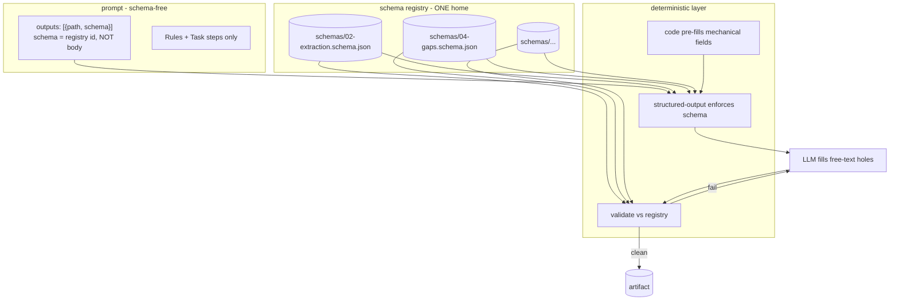

# 01 — Schema Externalization: remove data models from prompts

> Problem: every prompt carries `## Output schema — <path>` inline. Largest block in most prompts. PR2 duplicates it across the chain boundary (output N == input N+1). Schema = structural data the stochastic layer must CONFORM to, never AUTHOR. Conformance + ownership are deterministic → move out of prose into the deterministic layer. Source: [[00-current-state-analysis]].

## Why schema-in-prompt is wrong home

- **Bloat.** Output-schema block = biggest single section in most of the 39 prompts. Token cost paid every run.
- **Duplication (PR2).** `output schema N == input schema N+1`. Same shape lives in producer prompt AND (via AB3 "what THIS prompt reads") the consumer. Two homes for one fact — AB1 violation, tolerated today only because "structural data stays literal."
- **Stochastic layer holds deterministic data.** Schema is fixed. LLM only fills values. Holding the schema in the prompt = spending stochastic tokens on a constant.
- **Validation is "hope".** LLM free-writes JSON, downstream prays it parses. Conformance enforced nowhere in the stochastic step.

## Target: schema registry + enforced fill



### Mechanism 1 — registry (kills bloat + PR2 dup)
- Every output schema → `schemas/<artifact>.schema.json` (JSON Schema draft 2020-12).
- Field docs (today inline `// comment`, AB5) → `description` per property. One machine-readable home, better than comments.
- Prompt frontmatter changes:
  - `outputs: [{path: ".aprd/02-extraction.json", schema: "02-extraction"}]` — `schema` = registry id, no body.
  - `inputs: [{path: ".aprd/02-extraction.json", schema: "02-extraction"}]` — same id ⇒ **PR2 contract proven by id-equality**, not by eyeballing two blobs.
- PR2 restated: `producer.outputs[].schema == consumer.inputs[].schema` (string equality on registry id). Contract becomes a lint check, not a human read.

### Mechanism 2 — structured-output enforcement (validation exits prompt)
- Harness loads `schemas/<id>.schema.json`, constrains model emission (tool-call / structured output). Model FORCED to conform. Schema never enters prose.
- Portable: JSON-Schema + tool-use works on both adapters (Claude + Kiro) → harness-neutrality (D21) intact.
- Conformance moves from hope → enforced. This is the deterministic-machine move: non-stochastic concern leaves stochastic layer.

### Mechanism 3 — code pre-fill (Tier-1/2 from [[00-current-state-analysis]])
- Deterministic fields (ids, counts, `verdict`, `route`, topo-order, coverage tallies) → code writes the shell.
- LLM fills only judgment free-text (`reason`, `finding`, `rationale`).
- Tier-1 steps (BASELINE-MAP, SEQUENCE, DERIVE-TESTS, BUILD-PLAN, VERIFY-OUTPUT, gate verdicts) → code emits WHOLE artifact, no prompt, no schema anywhere in prose.

## Stack by tier

| Tier | Steps | Treatment |
|---|---|---|
| 1 (whole mechanical) | BASELINE-MAP, SEQUENCE, DERIVE-TESTS, BUILD-PLAN, VERIFY-OUTPUT, all gate verdicts | **#3 alone** — code owns artifact end-to-end |
| 2 (liftable substage) | TRIAGE, DIAGNOSE, RE-RANK, SEQUENCE-REVIEW, SYNTHESIZE-ADR, coverage/bijection checks, CLASSIFIER, MODEL-DATA, DEFINE-CONTRACTS | **#1 + #2 + partial #3** — registry + enforce + code pre-fills mechanical fields |
| 3 (stochastic) | EXTRACT, SYNTHESIZE, EVALUATE-DECIDE, IMPLEMENT, CRITIQUE bodies, SLICE-EXTRACT, SKELETON-IDENTIFY, GAP-DETECT, DEMO-GEN, QUESTION-GEN | **#1 + #2** — registry + enforce; LLM still fills values |

## Registry layout

```
schemas/
  _meta.json                     # registry index: {id: {path, version, produced_by[], consumed_by[]}}
  schemas.lock                   # frozen signature (new immutable artifact class)
  00-aprd/
    01-classification.schema.json
    02-extraction.schema.json
    04-gaps.schema.json
    07-assumptions.schema.json
    08-critique.schema.json
  01-roadmap/
    02-slices.schema.json
    ... 08-rerank.schema.json
  02-adr/  03-options.schema.json ... 05-critique.schema.json
  03-hld/  components.schema.json ... test-specs.schema.json
  04-build/ build-plan.schema.json ... demo.schema.json
```

Each `.schema.json`:
```json
{
  "$id": "02-extraction",
  "$schema": "https://json-schema.org/draft/2020-12/schema",
  "title": "structural inventory of one request",
  "type": "object",
  "required": ["entities","explicit_requirements","implied_requirements","stated_constraints","unknowns"],
  "properties": {
    "explicit_requirements": {
      "type": "array",
      "description": "request states it directly. inferred:false. atomic — one capability per entry.",
      "items": {
        "type": "object",
        "required": ["id","text","inferred","source"],
        "properties": {
          "id":       { "type": "string", "pattern": "^R[0-9]+$" },
          "inferred": { "const": false },
          "source":   { "type": "string", "description": "sr_ref or baseline_ref — provenance, no invention" }
        }
      }
    }
  }
}
```
Field docs live in `description` (replaces AB5 inline comments). Constraints unfittable in a comment (reciprocity, walk-to-count) → JSON-Schema constructs (`dependentRequired`, `if/then`, custom `x-walk` annotation read by validator).

`_meta.json` makes PR2 machine-checkable:
```json
{ "02-extraction": { "path": "00-aprd/02-extraction.schema.json", "version": 1,
                     "produced_by": ["EXTRACT"], "consumed_by": ["GAP-DETECT","SYNTHESIZE"] } }
```
Lint: every `produced_by`/`consumed_by` ref resolves; producer.outputs.schema == each consumer.inputs.schema.

## Canon amendments required (frozen → change-request, NOT silent edit)

Schema, skeleton, locks are frozen (CLAUDE.md immutability). Externalization = new version + change request re-triggering affected stages.

### AB5 — rewrite (`.hld/skeleton/coding-canon.md` line 30)
- **Now:** "No Field-rules section. JSON schema inline comments ARE field documentation."
- **To:** "No Field-rules section. Output schema lives in `schemas/<id>.schema.json`; field docs = `description` per property (single home). Prompt names the schema by registry id in `outputs:`, never inlines the body. Constraint unfittable in `description` → JSON-Schema construct or `x-*` annotation, never prose re-list."

### AB3 — extend (line 28)
- Add: "`inputs:` names the schema by registry id; matching producer `outputs:` id IS the PR2 contract. No shape re-doc."

### prompt-skeleton.md — rewrite scaffold (line 24)
- **Now:** `## Output schema — <path>  # JSON/YAML w/ inline comments = SINGLE field documentation (AB5)`
- **To:** drop the section. Frontmatter `outputs: [{path, schema}]` carries the registry id. Schema body never in prompt.
- Frontmatter lines 12–13 gain `schema` key: `inputs/outputs: [{path, format, schema}]`.

### PR2 — restate (line 20)
- Add: "Contract is checkable: `producer.outputs[].schema == consumer.inputs[].schema` (registry id equality), enforced by lint, not human read."

### New frozen artifact class
- `schemas/` + `schemas.lock` join the immutability set (`.aprd .hld .adr` locks). Schema change = new version + downstream change-request. Registry is now source of truth for shape; prompts reference, never re-own (mirrors B11: canon never source of truth).

## Risks / honest tradeoffs

- **Clean-room ergonomics.** Orchestrator = "operator pastes ONE prompt." Schema now external → runner must reach `schemas/` (a read input, like `_test_bench` inputs) OR harness wires structured-output (#2). First is a read, not a context-leak; keeps clean-room. Document the registry path as a standing runner input.
- **Re-author churn.** All 39 prompts edited (drop schema block, add `outputs.schema` id). Frozen → each is a change-request. Big one-time cost; do it as one roadmap wave.
- **Validator becomes load-bearing.** `lint.mjs` gains a JSON-Schema validate pass (it already does structural lint). Add registry-resolve + conformance check. Both-directions selftest extends (reference conforms; planted bad-shape fails).
- **Lost locality.** Inline schema was readable in-prompt. Mitigate: `_meta.json` index + `description` docs; IDE deref by `$id`. Net win (one home > two), but reviewers lose at-a-glance shape — accept.
- **Harness coupling (#2).** Structured-output API differs per harness. Mitigate: JSON-Schema is the portable contract; each adapter maps it to its own constrained-output call. Fallback: registry (#1) alone still removes the bloat even without enforced decoding.

## Net effect

- Every prompt loses its largest block.
- PR2 duplication dies; contract becomes a string-equality lint.
- Conformance: hope → enforced (#2).
- Tier-1 prompts vanish entirely (#3) — code emits artifact.
- Field docs: scattered inline comments → one machine-readable registry.

**Next:** `02-target-machine.md` — code ownership map (which fields code fills vs LLM) + registry build order + the change-request wave that re-authors the 39 prompts.
