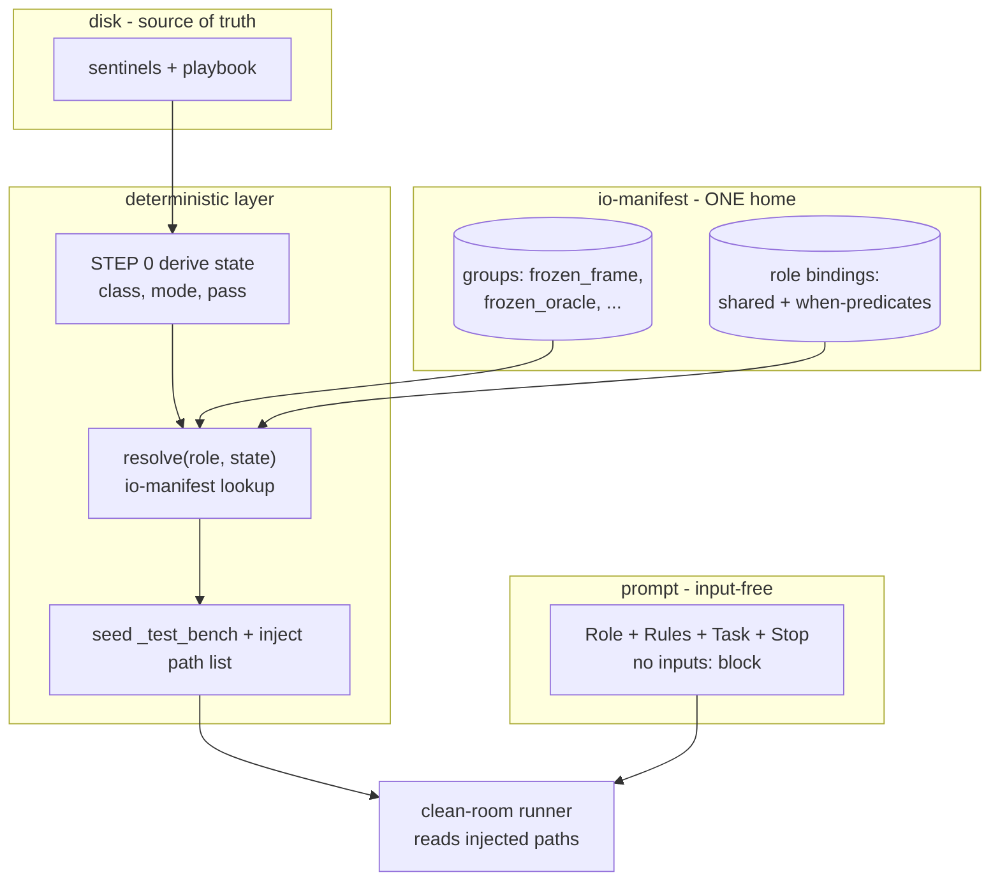

# 02 — Input Injection: remove `inputs:` metadata, resolve + inject by code

> Problem: every prompt's `inputs:` frontmatter is hand-maintained. In 04-build it explodes — IMPLEMENT = 26 input lines in 5 condition groups; INTEGRATE 30; VERIFY-OUTPUT/CRITIQUE 28. Most entries are **conditional ("when")** — gated by `mode`/`class`/`pass`, the exact dispatch the orchestrator ALREADY derives from disk. The prompt re-encodes a dispatch table code owns. Hand-sync per file = drift + waste. Source: [[00-current-state-analysis]], [[01-schema-externalization]].

## The redundancy (grounded)

IMPLEMENT `inputs:` is partitioned by comment-headers:
```
# — shared (both modes) —          ← always
# — skeleton-build —               ← when mode==skeleton-build
# — slice-build —                  ← when mode==slice-build
# — slice-build feature-add —      ← when mode==slice-build AND class==feature-add
# — slice-build bugfix —           ← when mode==slice-build AND class==bugfix
```
Each header = a **"when" predicate over `(mode, class, pass)`**. The orchestrator's STEP 0 already derives `(class, mode, pass)` from disk (sentinels + playbook). So the active input set is a **pure function** `resolve(role, class, mode, pass) → paths`. The prompt holding the tagged union DUPLICATES that function as prose — and must be re-synced by hand on every IO change.

Two failure modes:
- **Drift.** Prompt declares an input it no longer reads, or reads one it didn't declare. Nothing enforces match — `inputs:` is decorative to the runner (runner reads whatever the body tells it).
- **Cross-prompt waste.** The frozen frame (`adr.lock`, `skeleton.lock`, `aprd.lock`, `components.json`, `contracts.json`, `data-model.json`) is re-typed in ~every build prompt. Same fact, many homes (AB1 violation).

## Key insight

Input resolution is NOT stochastic. `(role, state) → input paths` is deterministic — same tuple the orchestrator computes to seed `_test_bench` (orchestrator STEP 4.1: "seed the fixture this build needs … the declared inputs"). Today STEP 4.1 reads the union from the prompt; it should call a resolver. **The IO graph belongs in code, injected into the runner — not held in prose.**

## Target



### Mechanism 1 — io-manifest (logical groups + role bindings, one home)
`io/io-manifest.json` — two parts:

```json
{
  "groups": {
    "frozen_frame": [
      {"path": ".adr/adr.lock", "hint": "frozen gate; class"},
      {"path": ".hld/skeleton.lock"}, {"path": ".aprd/aprd.lock"},
      {"path": ".hld/skeleton/components.json"},
      {"path": ".hld/skeleton/contracts.json"},
      {"path": ".hld/skeleton/data-model.json"}
    ],
    "frozen_oracle": [
      {"path": ".build/{scope}/oracle/oracle.lock"},
      {"path": ".build/{scope}/oracle/oracle.json"}
    ]
  },
  "roles": {
    "IMPLEMENT": {
      "always":   ["frozen_frame"],
      "when": [
        {"if": {"mode": "skeleton-build"}, "read": ["frozen_oracle", ".build/skeleton/build-plan.json"]},
        {"if": {"mode": "slice-build"},    "read": ["frozen_oracle", ".build/slices/{slice}/build-plan.json"]},
        {"if": {"mode": "slice-build", "class": "bugfix"}, "read": [".aprd/diagnosis.json"]}
      ]
    }
  }
}
```
- **Groups** = the recurring frozen-frame / oracle bundles, defined ONCE. Roles reference by id → cross-prompt duplication dies.
- **`when` predicates** = the comment-headers, now machine-evaluable. `{scope}`/`{slice}` are placeholders the resolver fills from derived state.
- `hint` (optional) = the load-bearing part of today's `format` clause (see Mechanism 3).

### Mechanism 2 — resolver + injection
`resolve(role, {class, mode, pass, slice, scope}) → concrete paths`:
1. start with `always` groups, expand to paths.
2. eval each `when` predicate against state; matched → append its `read`.
3. fill `{scope}`/`{slice}` placeholders. Dedupe. Return flat path list.

Orchestrator wires it:
- **STEP 4.1 (verify):** replace "read declared inputs from prompt" → `resolve(role, state)`; seed exactly those into `_test_bench`. Resolver is now the single home that decides what gets seeded.
- **Runner injection (path grade, recommended):** orchestrator prepends resolved paths to the runner message: `Inputs (resolved for this run): <flat list>`. Runner reads disk as today — clean-room intact, no branching in the runner. Prompt body drops `inputs:` entirely.
- Content-injection grade (read files, inline contents) rejected — staleness + context bloat; "disk is source of truth" (D3) prefers path + test-bench seeding, which the engine already does.

### Mechanism 3 — disposition of the `format` clause
Today `format:` does double duty:
- **routing** ("json", which file) → moves to io-manifest `path`. Pure code.
- **grounding hint** ("owns_entities[] = proposed owner to formalize") → load-bearing for the LLM. Split:
  - trivial/derivable → drop (the schema registry's `description` already documents fields — [[01-schema-externalization]]).
  - genuinely load-bearing ("contract is the wall, never re-decide") → **fold into Rules** (AB4 already mandates grounding-in-Rules) or carry as io-manifest `hint` injected beside the path.

Net: routing + "when" → code; the ≤handful of real grounding hints → one Rules bullet or one `hint` field. No condition-tagged input union in prose.

## Integration with schema registry (doc 01)

Together the two docs make the **whole data-flow graph machine-derived**:
- io-manifest = WHICH files a role reads (this doc).
- schema-registry = the SHAPE of each (doc 01), keyed by id.
- PR2 contract = `producer.outputs[].schema == consumer.inputs[].schema`, now checkable because both sides are code-owned, not prose.
- A lint can render the full DAG (role → reads → schema → produced-by) and flag any unresolved/orphaned edge — the contract chain (`.hld/skeleton/contracts.json`) becomes generated, not hand-written.

## Orchestrator change

- STEP 0 already derives `(class, mode, pass)`. Add `slice`/`scope` resolution (already implicit in sentinel paths).
- STEP 4.1: `inputs = resolve(role, state)` instead of parsing prompt frontmatter.
- Hand-pass (manual operator): ship a `resolve` CLI (`node tools/io/resolve.mjs <ROLE>`), prints the input path list for the current disk state. Replaces the operator reading `inputs:` off the prompt.

## Canon amendments (frozen → change-request, not silent edit)

### coding-canon.md line 39 — self-containment rule, rewrite
- **Now:** "Each prompt self-contained for fresh session: role identity + required input artifacts (paths on disk) + task + output schema + where to write + escape rules."
- **To:** "Each prompt self-contained for ROLE LOGIC (identity + rules + task + stop). Input artifact set is resolved + injected by the orchestrator (`io-manifest` + `resolve`), NOT declared in the prompt. Self-containment of inputs is provided by injection, so the prompt never hand-lists or condition-tags them."

### prompt-skeleton.md lines 12 — drop `inputs:` from frontmatter
- Remove `inputs: [...]`. Keep `outputs:` (carries the produced-schema id per doc 01). The orchestrator injects inputs; the prompt declares only what it WRITES.
- The mode/class comment-group headers in the body's input block vanish — the `when` lives in io-manifest.

### AB3 — retire / re-scope (line 28)
- AB3 governed `format:` one-clause for inputs. Inputs gone from prompt → AB3 collapses into io-manifest `hint` discipline + AB4 (grounding folds into Rules). Restate AB3 as: "io-manifest `hint` = one clause, load-bearing grounding only; routing lives in `path`, never prose."

### PR2 — restate (line 20)
- "Contract = io-manifest edge + schema-registry id, machine-resolved. `producer.outputs.schema == resolve-consumer.inputs.schema`, enforced by lint. Prompt declares outputs only."

### New frozen artifact class
- `io/io-manifest.json` + `io.lock` join the immutable set. IO-graph change = new version + downstream change-request (mirrors `schemas.lock` from doc 01). io-manifest becomes source of truth for the read-graph; prompts reference nothing.

## Before / after — IMPLEMENT

**Before:** frontmatter ~30 lines (`role`…`escapes`) of which **26 are input paths in 5 condition groups**, re-synced by hand on any IO change, frozen-frame re-typed from 7 sibling prompts.

**After:**
```
---
role: IMPLEMENT
phase: 04-build
mode: skeleton-build|slice-build|bugfix   # dispatch note stays (drives resolver state)
interactive: false
outputs: [{path, schema: "build-record"}]
escapes: [...]
---
```
Inputs: zero lines. Orchestrator calls `resolve("IMPLEMENT", {mode, class})`, seeds `_test_bench`, injects the path list. io-manifest holds the 5-way `when` table ONCE.

## Risks / tradeoffs

- **"Paste one prompt" ergonomics.** Operator loses self-declared inputs. Mitigate: `resolve` CLI prints them; orchestrator already hand-passes by pointing the next session at files (canon line 40). Net: one command vs hand-maintained prose.
- **Resolver becomes load-bearing + needs both-directions test.** It now decides what seeds the clean-room. Add to selftest: right `(role,state)` → right path set; planted wrong-state → wrong set caught. If resolver is buggy, every verify lies — test it like the linter.
- **Loss of in-prompt locality.** Reviewer no longer sees inputs in the prompt. Mitigate: `resolve --explain <ROLE>` renders the resolved set + which `when` fired. The io-manifest is the readable home.
- **Harness neutrality.** Injection differs Claude vs Kiro. Resolver = shared code module; each adapter calls it + injects in its own way (path-prepend for Claude subagent, resource-wire for Kiro). The contract (path list) is portable.
- **Mode/class still must be derivable.** Resolver depends on STEP-0 state being correct. Already true (orchestrator derives it for picking the frontier). No new dependency, just one more consumer.

## Net effect

- 04-build prompts shed ~26–30 frontmatter lines each; the `when` dispatch table lives once in code.
- Drift killed — the runner reads exactly what the resolver seeds; prompt can't mis-declare because it declares nothing.
- Frozen-frame typed once (group), not in 7 prompts.
- Combined with doc 01: full read-graph + shape-graph machine-derived; PR2 + the contracts chain become generated + lint-checked, not hand-written.

**Next:** `03-io-resolver-spec.md` — resolver algorithm, io-manifest schema, the `when`-predicate grammar, selftest both-directions, and the orchestrator STEP-4.1 swap.
