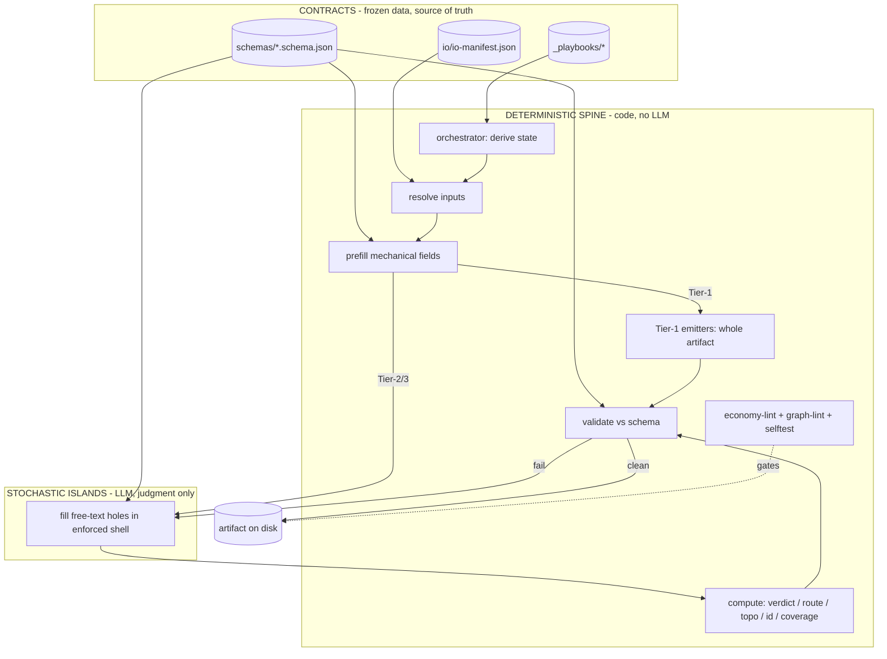
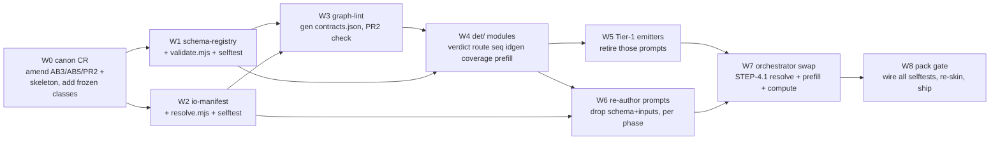

# 04 — Target Machine: code-ownership map + change-request wave

> Capstone. Folds [[00-current-state-analysis]] (what's stochastic), [[01-schema-externalization]] (shape→code), [[02-input-injection]] + [[03-io-resolver-spec]] (read-graph→code) into one target architecture, then sequences the build as a roadmap wave that respects frozen immutability. Goal restated: code owns everything deterministic; LLM scoped to judgment only.

## Architecture — three layers



- **Contracts** — frozen data (io-manifest, schema-registry, playbooks). The only "knowledge" the spine reads. Changing one = change-request (immutability canon).
- **Spine** — pure code. Derives state, resolves inputs, prefills mechanical fields, emits Tier-1 artifacts whole, computes verdicts/routes/ids/coverage, validates, lints. Deterministic + both-directions-tested, like `lint.mjs`/`pack.mjs` today.
- **Islands** — LLM. Receives inputs + a schema-enforced, mechanically-prefilled shell; fills ONLY judgment free-text. Cannot mis-shape (structured output), cannot mis-declare inputs (none in prompt), cannot fake a verdict (code computes it).

## Code-ownership map (per concern, from docs 00–03)

| Concern | Today | Target owner | Source |
|---|---|---|---|
| Output shape (schema) | inline in prompt | **code** — schema-registry + structured-output enforce | 01 |
| Schema validation | LLM implicit / hope | **code** — validate vs registry | 01 |
| Field docs | inline `//` comments | **code** — JSON-Schema `description` | 01 |
| Which inputs to read | hand-listed `inputs:` + `when` groups | **code** — resolve(role,state) | 02·03 |
| Input injection / seeding | parse prompt frontmatter | **code** — resolver → `_test_bench` + path-inject | 03 |
| PR2 contract + `contracts.json` | hand-written, eyeballed | **code** — graph-lint generates + checks | 01·03 |
| Gate verdict (`clean\|blocked`) | LLM emits | **code** — `verdict = f(issue count)` | 00 |
| Routing (TRIAGE/DIAGNOSE) | LLM emits | **code** — `route = f(axes)` | 00 |
| Ordering (SEQUENCE/RE-RANK) | LLM emits | **code** — topo-sort + priority | 00 |
| ID assignment (ADR-NNNN, high-water) | LLM emits | **code** — monotonic / max() | 00 |
| Coverage / bijection / membership | LLM walks | **code** — set ops, walk-to-count | 00 |
| Thresholds (0.80, K=3) | LLM applies | **code** — constant compare | 00 |
| Tier-1 whole steps | LLM prompt | **code** — emitter, no prompt | 00 |
| Fork-finding, AC authoring, scoring, LLD, clustering, defect detection, narration | LLM | **LLM (kept)** — fills free-text into shell | 00 Tier-3 |

## What stays stochastic (the islands — explicit)

Code does NOT touch the judgment in these; it only wraps them (resolve in, prefill shell, validate out):
- **GAP-DETECT / DECISION-EXTRACT** — where do two reasonable builds diverge.
- **EXTRACT** — fact-vs-gap distinction, implication rationale.
- **SYNTHESIZE** — AC authoring (intent → binary test).
- **EVALUATE-DECIDE** — option scoring against forces, pick rationale.
- **OPTION-GEN** — real-vs-strawman option sourcing.
- **SLICE-EXTRACT / SKELETON-IDENTIFY** — capability clustering, seam grounding.
- **IMPLEMENT / INTEGRATE** — LLD internals behind the fixed seam.
- **CRITIQUE bodies (all phases)** — defect detection (the verdict-from-count is code; the *finding* is LLM).
- **DEMO-GEN / QUESTION-GEN** — client-facing narration.

The shell shrinks the LLM's job to exactly these holes — everything around them is computed.

## The LLM call, before vs after

**Before:** prompt = caveman block + role + Rules + Task + **26 input lines + 5 when-groups** + **full output schema block** + Stop. LLM free-writes whole JSON, self-validates, self-counts, self-verdicts.

**After:** prompt = caveman block + role + Rules + Task + Stop. Orchestrator injects resolved input paths + a prefilled shell:
```
Inputs (resolved): <flat path list + load-bearing hints>
Fill these judgment fields (schema-enforced): issues[].finding, rejected[].why_rejected, rationale
(ids, counts, verdict, route, traces-resolution: already filled / will be computed — do not author)
```
LLM emits only the holes. Code computes verdict/route/ids, validates, gates.

## New deterministic modules (idiom = `tools/economy-lint/`)

```
schemas/            registry + schemas.lock                         # 01
io/                 io-manifest.json + io.lock                      # 02·03
tools/io/           resolve.mjs · selftest.mjs · graph-lint.mjs     # 03
tools/det/
  validate.mjs      # JSON-Schema validate vs registry              # 01
  prefill.mjs       # write shell, fill mechanical fields, mark holes
  verdict.mjs       # verdict = f(issues) — all 6 gates             # 00
  route.mjs         # TRIAGE 2-axis · DIAGNOSE 4-gate discriminator # 00
  sequence.mjs      # topo-sort + value×risk/cost priority          # 00 (SEQUENCE/RE-RANK)
  idgen.mjs         # monotonic ADR-NNNN · high-water max()         # 00
  coverage.mjs      # bijection / membership / walk-to-count        # 00
  emit/             # Tier-1 whole-artifact emitters                # 00
    baseline-map.mjs · build-plan.mjs · derive-tests.mjs · verify-output.mjs
```
All zero-dep Node ESM, deterministic, both-directions selftest, wired into the `pack.mjs` gate.

## Invariants preserved (target must not break canon)

- **Clean-room** — path-grade injection only; `when` evaluated by orchestrator, runner still gets a flat list + reads disk. No spine logic leaks into the runner.
- **Disk = source of truth (D3/D20)** — emitters + LLM both write artifacts to declared paths; state re-derived from disk; resume unchanged.
- **Both-directions verify** — every new module (resolver, validator, emitters, verdict/route) ships a known-good-PASS + planted-defect-FAIL selftest, in the pack gate. Same bar as prompts.
- **Harness-neutral (D21)** — spine = shared code modules; Claude + Kiro adapters call them, inject in their own way. JSON-Schema + path-list are the portable contracts.
- **One role = one prompt (D1)** — Tier-3 prompts stay 1:1. Tier-1 roles become emitters but keep their identity/sentinel (a build is still "shipped" by its artifact on disk).
- **FLAG-not-fix** — code computes routes/verdicts; defects still route upstream, never patched. Spine enforces the lane mechanically (can't author a fix it has no field for).
- **Economy (AB1–AB9)** — schema + inputs leave the prompt → prompts get SMALLER, not bloated. One home per fact strengthened (registry, manifest = single homes).

## Change-request wave (sequenced into the roadmap)

Frozen artifacts (`coding-canon.md` AB3/AB5, `prompt-skeleton.md`, PR2, the 39 prompts) → each amendment is a CR + new version (immutability). Sequence respects dependency: contracts before consumers, code before prompt-edits, verify each by the existing self-host loop.



Roadmap-style entries (mirror `08-rerank.json` `done_sentinel` convention):

| Pos | Entry | Done sentinel | Depends |
|---|---|---|---|
| 1 | W0-CANON-CR | `.aprd/change-requests/CR-002.md` + re-signed locks | — |
| 2 | W1-SCHEMA-REGISTRY | `schemas/schemas.lock` + `tools/det/validate.mjs` + selftest green | W0 |
| 3 | W2-IO-MANIFEST | `io/io.lock` + `tools/io/resolve.mjs` + selftest green | W0 |
| 4 | W3-GRAPH-LINT | `tools/io/graph-lint.mjs` green + generated `contracts.json` matches frozen | W1,W2 |
| 5 | W4-DET-MODULES | `tools/det/{verdict,route,sequence,idgen,coverage,prefill}.mjs` + selftests | W1 |
| 6 | W5-TIER1-EMITTERS | `tools/det/emit/*.mjs` + Tier-1 prompts retired (emitter both-directions vs `_fixtures`) | W4 |
| 7 | W6-REAUTHOR-04BUILD | 04-build prompts: no `inputs:`/schema block, verify clean-room both-directions | W2,W4 |
| 8 | W6-REAUTHOR-{03,02,01,00} | per-phase, same | W6-04build |
| 9 | W7-ORCH-SWAP | orchestrator STEP-4.1 = resolve+prefill+compute; e2e self-host loop drains clean | W5,W6 |
| 10 | W8-PACK-GATE | `pack.mjs` runs all selftests; `dist/adp-v<ver>.tgz` ships | W7 |

Build via the **existing self-host loop** (`/self-host`): each entry is one prompt-build/CR, picked by RE-RANK, verified clean-room both-directions, promoted on disk — no new control machinery.

## Net effect (target vs current)

- **Prompts**: lose schema block + 26–30 input lines each → only judgment-bearing prose remains. Token cost per run drops sharply; the biggest blocks gone.
- **Determinism**: ~10 Tier-1 steps become code (no LLM); ~12 Tier-2 substages computed not generated; all 39 schema-validated by code; verdict/route/ordering/ids/coverage code-owned.
- **Reliability**: shape can't drift (registry + structured output), inputs can't drift (resolver, prompt declares none), PR2 + `contracts.json` generated + checked.
- **LLM scope**: exactly the Tier-3 islands — fork-finding, authoring, scoring, LLD, detection, narration. Nothing else spends stochastic tokens.
- **Same bar held**: clean-room, disk-truth, both-directions verify, harness-neutral, one-role-one-prompt, FLAG-not-fix — all preserved; economy strengthened.

## Open decisions for the operator

- **Structured-output grade** — enforce via harness constrained decoding (strongest, mild harness coupling) vs validate-after + retry (portable, weaker). Recommend enforce on Claude, validate-after fallback on Kiro.
- **Tier-1 retirement scope** — retire the prompt entirely (code emitter) vs keep a thin prompt that calls the emitter (audit trail). Recommend retire + keep the role's sentinel + a one-line note in components.json.
- **CR batching** — one mega-CR (W0) amending all canon at once vs per-amendment CRs. Recommend one W0 (atomic canon version bump), then code/prompt waves.

This is the plan. Start at W0 (canon CR) — everything downstream depends on the frozen amendments landing first.
