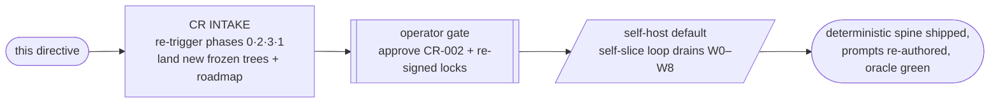
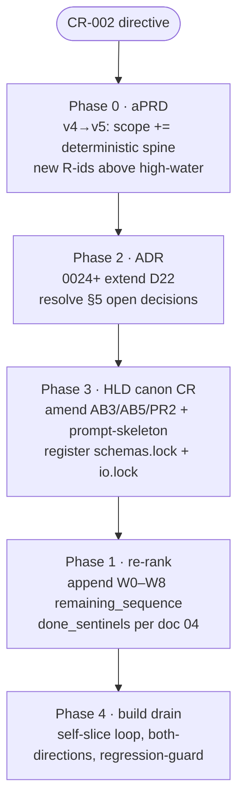
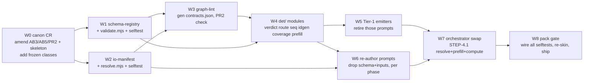

# /self-host — DETERMINISTIC-MACHINE directive (the CR brief that fires the change)

> Pass THIS file to `/self-host`. It = the change-request brief that makes the system build the deterministic-machine change ON ITSELF, through its own canonical process. Not a new mode, not a hand-edit — the reflexive change-request path the canon already promises (workflow §10, immutability canon, D22). Caveman register, literal data/ids/code.

---

## 0. How to fire (operator)

```
/self-host  _deterministic-machine/05-self-host-directive.md
```

This is a **CR intake**, NOT a frontier drain. Default `/self-host` drains `remaining_sequence` (workflow §5). This directive comes FIRST: it re-triggers upstream phases (the sanctioned immutability exception — workflow §4: "change = new version + change request, never hand-edit frozen body") to LAND a new `remaining_sequence`. Then plain `/self-host` drains it with **no new control machinery** (doc 04 close; orchestrator unchanged).

Two stages, one operator gate between:



---

## 1. Ask (the change, grounded)

System today = **100% stochastic**: 39 prompts, every step an LLM clean-room session. Goal: replace stochastic mechanism with deterministic code **where the work is deterministic** — leave LLM only the judgment.

Analysis already done + frozen in this folder. Findings (doc 00):
- **39/39 steps bind a closed schema.** LLM only fills values; schema authoring + validation = pure code today spent on tokens.
- **Deterministic decisions embedded everywhere** — verdict-from-count, route-from-axes, topo-sort, monotonic-id, set-membership, threshold, bijection. All computable; all currently LLM tokens.
- **~10 steps ~whole-mechanical (Tier 1)** · **~12 carry a liftable deterministic substage (Tier 2)** · **~17 stay LLM but gain a code validation wrapper (Tier 3)**.

Target (doc 04): three layers — **frozen contracts** (io-manifest + schema-registry + playbooks) → **deterministic spine** (resolve · prefill · emit · compute · validate · lint, no LLM) → **stochastic islands** (LLM fills judgment holes only).

---

## 2. Design corpus — already authored, do NOT re-derive (P5/B11)

Cheapest-source-first: the WHAT + HOW exist. Ingest as authoritative design contract; specialize, never re-invent.

| Doc | Role in the CR | Feeds phase |
|---|---|---|
| `00-current-state-analysis.md` | what's stochastic vs deterministic (per-step, Tier 1/2/3) | aPRD scope + ADR context |
| `01-schema-externalization.md` | schema-registry + structured-output enforce + code pre-fill | ADR + HLD canon CR (AB5/AB3/PR2) |
| `02-input-injection.md` | drop `inputs:`, resolve+inject by code (io-manifest) | ADR + HLD canon CR (self-containment, AB3) |
| `03-io-resolver-spec.md` | resolver algorithm, io-manifest schema, both-directions selftest, STEP-4.1 swap | HLD components + build slices |
| `04-target-machine.md` | code-ownership map + the W0–W8 change-request wave + roadmap entries | Roadmap re-rank (lift verbatim) |

System reads these like any frozen design input. Doc 04 §"roadmap-style entries" = the `remaining_sequence` to lift (§6 below).

---

## 3. Precedent — this is D22 fired at scale, NOT net-new architecture

`ADR-0022`/**D22** already sanctions **deterministic helper tools as a component CLASS** (disk-in/disk-out, no-LLM, profile-registered, FLAGS-never-authors, both-directions self-proving) and **explicitly anticipates future instances** — `lint.mjs`/`pack.mjs` = the FIRST two. The whole deterministic spine = D22 applied across the spine.

⇒ New ADRs **extend** D22, never re-litigate it. The architecture question ("may code own deterministic work?") = already Accepted. Only the **specific frozen classes + retirement scope** are new decisions (§5).

---

## 4. Class + blast radius — why this re-triggers 0·2·3·1, not just 1

CR-001 was feature-add → re-triggered Phase 1 only (re-rank). THIS is bigger: it **amends frozen canon** (AB3/AB5, PR2, prompt-skeleton), **adds frozen artifact classes** (`schemas.lock`, `io.lock`), **re-authors all 39 prompts**, **swaps the orchestrator**.

- **Class = feature-add** at the product level (adds the deterministic-spine capability to ADP) — reuse-conventions, read-existing-first (BF2), regression-guard mandatory (BF4).
- But canon amendments = **frozen→change-request** path (immutability canon): each amended frozen artifact gets a **new version + CR**, re-triggering its downstream. So intake touches:



Phases 0–3 are normally frozen in self-host (don't re-run). The CR mechanism = the **sanctioned exception**; this directive authorizes exactly that re-trigger, scoped to the delta below.

---

## 5. Open decisions — RESOLVE at ADR stage (defaults chosen; operator may override at gate)

Doc 04 left three for the operator. Directive bakes the recommended defaults so intake is unblocked; confirm/override at the §0 gate.

| Decision | Chosen default | Why |
|---|---|---|
| **Structured-output grade** | **enforce** (constrained decode) on Claude · **validate-after + retry** on Kiro | strongest on the runtime target; JSON-Schema + path-list stay the portable contract → harness-neutral (D21) intact |
| **Tier-1 retirement scope** | **retire the prompt** (code emitter owns artifact) · keep the role's **sentinel** + a one-line note in `components.json` | audit trail preserved; "shipped" still = artifact on disk; one-role-one-prompt (D1) holds via sentinel |
| **CR batching** | **one mega-W0 CR** (atomic canon version bump), then code/prompt waves | avoids half-amended canon; single re-sign event for all frozen locks |

These become ADR bodies (0024+), grounded on D22.

---

## 6. The roadmap wave — lift into `remaining_sequence` (doc 04 verbatim)

Phase-1 re-rank appends these as prompt-builds/CRs. `done_sentinel` = disk path whose presence+validity == that build shipped (orchestrator STEP-0 key; D14/D20). Order respects dependency: contracts before consumers, code before prompt-edits, verify each by the existing self-slice loop.



| Pos | id | done_sentinel | depends |
|---|---|---|---|
| 1 | **W0-CANON-CR** | `.aprd/change-requests/CR-002.md` + re-signed locks (`schemas.lock`,`io.lock`, new skeleton/aprd versions) | — |
| 2 | **W1-SCHEMA-REGISTRY** | `schemas/schemas.lock` + `tools/det/validate.mjs` + selftest green | W0 |
| 3 | **W2-IO-MANIFEST** | `io/io.lock` + `tools/io/resolve.mjs` + selftest green | W0 |
| 4 | **W3-GRAPH-LINT** | `tools/io/graph-lint.mjs` green + generated `contracts.json` matches frozen | W1,W2 |
| 5 | **W4-DET-MODULES** | `tools/det/{verdict,route,sequence,idgen,coverage,prefill}.mjs` + selftests | W1 |
| 6 | **W5-TIER1-EMITTERS** | `tools/det/emit/*.mjs` + Tier-1 prompts retired (emitter both-directions vs `_fixtures`) | W4 |
| 7 | **W6-REAUTHOR-04BUILD** | 04-build prompts: no `inputs:`/schema block, verify clean-room both-directions | W2,W4 |
| 8 | **W6-REAUTHOR-{03,02,01,00}** | per-phase, same | W6-04build |
| 9 | **W7-ORCH-SWAP** | orchestrator STEP-4.1 = resolve+prefill+compute; e2e self-host loop drains clean | W5,W6 |
| 10 | **W8-PACK-GATE** | `pack.mjs` runs all selftests; `dist/adp-v<ver>.tgz` ships | W7 |

Each entry = one self-slice loop pass: RE-RANK picks → design contract → IMPLEMENT authors (code module OR re-authored prompt) → clean-room both-directions verify → operator gate → promote. Re-run harmless (D20).

---

## 7. Per-stage intake instructions

**Phase 0 — aPRD bump (v4→v5).** Write `.aprd/change-requests/CR-002.md` (mirror CR-001 shape: Ask · Scope delta · Out of scope · Class). Scope delta = "deterministic spine: schema-registry + io-manifest + det/ modules + Tier-1 emitters + prompt re-author; LLM scoped to Tier-3 islands." New `R*` ids **above high-water** (BF3). Original `aprd.v4.frozen.md` untouched; new `aprd.v5.frozen.md` + re-signed `aprd.lock` (supersedes v4).

**Phase 2 — ADR (extend D22).** Add ADRs **above 0023** (high-water). Minimum set, each citing D22:
- schema-registry as new frozen artifact class + structured-output enforcement (doc 01).
- io-manifest as new frozen artifact class + resolver injection (docs 02/03).
- deterministic spine: Tier-1 emitters + verdict/route/sequence/idgen/coverage compute (doc 00 Tier 1/2).
- §5 open-decision resolutions (grade · retirement · batching).

**Phase 3 — HLD canon CR (new skeleton version).** Amendments (frozen → versioned, not silent edit):
- **AB5** rewrite — schema lives in `schemas/<id>.schema.json`; field docs = `description`; prompt names schema by registry id, never inlines body (doc 01).
- **AB3** re-scope — inputs leave the prompt; `hint` = one clause, load-bearing grounding only; routing in io-manifest `path` (doc 02).
- **PR2** restate — contract checkable: `producer.outputs[].schema == consumer.inputs[].schema` (registry-id equality), lint-enforced (docs 01/03).
- **prompt-skeleton** — drop `## Output schema` section + `inputs:` frontmatter; `outputs:` carries schema id; self-containment of inputs now provided by injection (doc 02).
- **Register new frozen artifact classes** — `schemas/`+`schemas.lock`, `io/`+`io.lock` join the immutability set (mirror `adr.lock` etc.).

**Phase 1 — re-rank.** Bump `roadmap_version`; reconcile bugfix-spine to `completed[]` (sentinels on disk); append W0–W8 (§6) as `remaining_sequence` with `done_sentinel` + `real_depends_on`. Frontier = first absent sentinel = **W0-CANON-CR**.

---

## 8. Invariants — must hold end-to-end (doc 04; verify each W-entry against them)

- **Clean-room** — path-grade injection only; `when` evaluated by orchestrator, runner gets a flat list + reads disk. No spine logic leaks into the runner.
- **Disk = source of truth (D3/D20)** — emitters + LLM both write to declared paths; state re-derived from disk; resume unchanged.
- **Both-directions verify** — every new module (resolver, validator, emitters, verdict/route) ships known-good-PASS + planted-defect-FAIL selftest, in the `pack.mjs` gate. Same bar as prompts.
- **Harness-neutral (D21)** — spine = shared code modules; Claude + Kiro adapters call them. JSON-Schema + path-list = portable contracts.
- **One role = one prompt (D1)** — Tier-3 prompts stay 1:1; Tier-1 roles become emitters but keep identity + sentinel.
- **FLAG-not-fix** — code computes routes/verdicts; defects route upstream, never patched. Spine can't author a fix it has no field for.
- **Economy (AB1–AB9)** — schema + inputs LEAVE the prompt → prompts shrink, not bloat. One-home-per-fact strengthened (registry + manifest = single homes).

---

## 9. Meta regression guard — LOAD-BEARING (workflow §10)

Adding the spine must not break a prompt that already works. A W-entry ships only when:
1. its own clean-room/selftest is correct (both directions), AND
2. **every already-shipped prompt's both-directions fixture oracle stays green**, AND
3. re-authored prompts conform to the (newly versioned) DRY skeleton + canon — overlay carries ONLY the delta (AB1, never a fork).

W6 (re-author) + W7 (orch swap) are the highest-risk: re-running the full self-host loop e2e against `_fixtures/` after each is the gate. Orchestrator swap (W7) lands LAST among consumers — code + prompts proven first.

---

## 10. Done

Deterministic-machine shipped when:
1. CR-002 + aPRD v5 + ADRs 0024+ + skeleton CR landed, locks re-signed (intake complete);
2. W0–W8 all drained — `done_sentinel`s present, selftests green in `pack.mjs` gate;
3. prompts carry no schema block + no `inputs:`; resolver + validator + emitters + verdict/route/seq/id/coverage code-owned; orchestrator STEP-4.1 = resolve+prefill+compute;
4. full self-host loop drains `_fixtures/` clean e2e (regression-guard green), `dist/adp-v<ver>.tgz` ships.

Net: ~10 Tier-1 steps become code (no LLM) · ~12 Tier-2 substages computed not generated · all 39 schema-validated by code · prompts lose their biggest blocks · LLM scoped to exactly the Tier-3 islands (fork-finding, AC authoring, scoring, LLD, defect detection, narration).

---

## 11. Stop / gates

- **Intake gate (§0):** after Phases 0·2·3·1 land, present CR-002 + re-signed locks + new `remaining_sequence`. Operator approves before any drain. Reject → re-author the intake artifact, never hand-patch a frozen body.
- **Per-W gate:** standard self-host operator gate (value · parity · both-directions). Accept → promote; reject(value)→re-author; reject(spine leak)→fix spine once (P3), re-run.
- **Drain done:** all W sentinels present → "deterministic-machine drained" → STOP.
- Verify failed past retry budget → HALT, report which layer + offending artifact, do not promote.

---

*Start at W0 (canon CR) — everything downstream depends on the frozen amendments landing first. Build it through the same engine that delivers any other product. System builds itself.*
