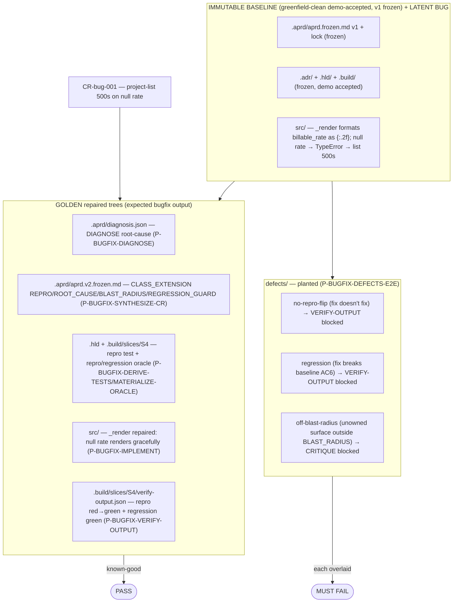

# brownfield-bugfix — both-directions oracle for the bugfix spine

Single oracle the bugfix-spine builds verify against. = a greenfield-built, demo-accepted project (frozen baseline) carrying a **latent defect** + a defect report (CR-bug-001) + the GOLDEN repaired trees, plus planted defects. Golden (repaired) PASSes; each planted defect FAILs. Verifier can't separate golden from defect → verifier broken, fix before trusting any bugfix build.

## What's here

## The defect (CR-bug-001)
`_ProjectManagementAdapter._render` (`src/freelancer_app/wsgi.py`) formats `billable_rate` as `{p['billable_rate']:.2f}`. A project with `billable_rate = null` → `TypeError` → GET `/projects` 500s. Demo never exercised a null rate, so it shipped green. Repair = render null rate gracefully (correct behavior; no new feature). Blast radius = `_render` only. Regression guard = baseline project CRUD + list render for rated projects (AC on slice S4).

## Both-directions oracle — scenario → expected verdict

The golden (this tree as-is) PASSes: `.build/slices/S4/verify-output.json` verdict `verified` (reproduction OREPRO-1 red→green + scoped regression AC6 green), and `.build/slices/S4/critique.json` verdict `clean` (0 issues). Each defect is an overlay onto the clean baseline + golden; running the named role MUST reject. Each `defects/<arm>/` carries the planted overlay + `expected-verdict.json` (the load-bearing assertion) + the authoritative rejecting output of the real prompt.

The three defects each knock out exactly ONE of VERIFY-OUTPUT's three bugfix certify conditions (delta Rule 5: reproduction-green + regression-green + skeleton_fidelity-not-breached), with the off-surface arm handed to CRITIQUE (the backstop a behavior gate can't see — mirrors brownfield-feature `convention-drift`):

| defect dir | invariant | seed overlay → target | run | expected verdict | separates from golden by |
|---|---|---|---|---|---|
| `no-repro-flip` | bugfix Rule 2 — reproduction must flip red→green | `wsgi.norepro.py` → `src/.../wsgi.py` (injected `_render` keeps null-unsafe `float(rate)`) | VERIFY-OUTPUT | **blocked** (reproduction still RED; escape→DIAGNOSE) | `reproduction.now` green→red |
| `regression` | **BF4** — repair must not break baseline AC6 | `wsgi.regressed.py` → `src/.../wsgi.py` (production `_render` drops `float()` coercion) | VERIFY-OUTPUT | **blocked** (regression RED on AC6; escape→DIAGNOSE) | `regression.verdict` green→red |
| `off-blast-radius` | **BF4** — repair stays inside declared BLAST_RADIUS | `wsgi.offradius.py` → `src/.../wsgi.py` (unowned `_view_project_export` + route, additive) | CRITIQUE | **blocked** (gold-plating, routed IMPLEMENT) | critique `clean`→`blocked`, 0→1 issue |

> **e2e-validated (2026-06-11)** — all three exercised clean-room (step-runner, prompts fed verbatim, benches outside `_fixtures/`, static-trace per no-python env). The golden `.build/slices/S4/{verify-output,critique}.json` in this tree ARE the clean-room outputs of the real prompts; each defect's `verify-output.blocked.json` / `critique.flagged.json` ARE the clean-room outputs of the real prompt on the overlaid bench.
>
> - **no-repro-flip — VERIFY-OUTPUT, both directions PROVEN.** Golden→`verified` (OREPRO-1 red→green). Defect→`blocked`: the create_app injected `_render` kept `f"{float(rate):.2f}"` with no null guard → `float(None)` TypeError → OREPRO-1 stays RED. Reproduction never flips; regression not reached (Rule 5).
> - **regression (BF4) — VERIFY-OUTPUT, both directions PROVEN.** Golden→`verified` (AC6 green). Defect→`blocked`: production `_render` dropped `float()` coercion → a string rate `'95.00'` hits `f"{str:.2f}"` → ValueError → AC6 (all 6 visible+held-out) RED. Repro green, regression red — the BF4 invariant isolated.
> - **off-blast-radius (BF4) — CRITIQUE, both directions PROVEN; VERIFY-OUTPUT-blind by design.** The repair is behaviorally correct (repro+regression green) so VERIFY-OUTPUT→`verified` and CRITIQUE runs on the green ladder. Golden→CRITIQUE `clean` (0 issues). Defect→CRITIQUE `blocked`: an unowned CSV-export surface (`_view_project_export` + `projects/export` route) tracing to no R*/AC*, outside BLAST_RADIUS `_ProjectManagementAdapter._render` → 1 gold-plating issue routed IMPLEMENT. ADDITIVE (no frozen-skeleton reshape), so it does NOT trip VERIFY-OUTPUT's own skeleton_fidelity guard — CRITIQUE is the only gate that catches it. (A frozen-skeleton-ROUTE reshape would instead block at VERIFY-OUTPUT skeleton_fidelity / route Phase 2; this arm uses an additive edit to keep the CRITIQUE gate exercised.)

## How to seed a scenario into a bench

1. Copy the clean baseline + golden: everything under `_fixtures/brownfield-bugfix/` EXCEPT `defects/`.
2. Overlay the scenario's planted file onto the path named in its `expected-verdict.json` `seed[]` (each overlay = a full `wsgi.py` variant → `src/freelancer_app/wsgi.py`).
3. Remove the sibling sentinel the role re-derives (VERIFY-OUTPUT → delete `.build/slices/S4/verify-output.json`; CRITIQUE → keep a `verified` verify-output.json, delete `.build/slices/S4/critique.json`).
4. Run the named role clean-room (step-runner, Sonnet/High — prompt verbatim + bench path; never reads `_fixtures/` directly).
5. Assert the role's on-disk output matches the defect's `expected_verdict` / `expected_signal`. The golden (no overlay) must produce `verified` / `clean`.

## Build status (this fixture is filled incrementally by the roadmap loop)
- **P-BUGFIX-FIXTURE-BASELINE** (this build) — baseline + latent bug + CR-bug-001 + this README. ✓
- P-BUGFIX-DIAGNOSE … P-BUGFIX-VERIFY-OUTPUT (12–17) — golden repair artifacts + repaired `src/`. ✓
- **P-BUGFIX-DEFECTS-E2E** (18) — `defects/` (3 arms) + both-directions e2e-validated note. ✓ — bugfix spine drained.

Verify discipline (EMBEDDED CANON): both-directions mandatory · disk is the deliverable · clean-room (no pipeline context leaks) · caveman + economy bind all fixture prose. (No python in env → repro/regression verified by static-trace + golden comparison, as the greenfield fixtures are — DIAGNOSE Rule 5: runtime/harness gap ≠ missing-foundation.)
