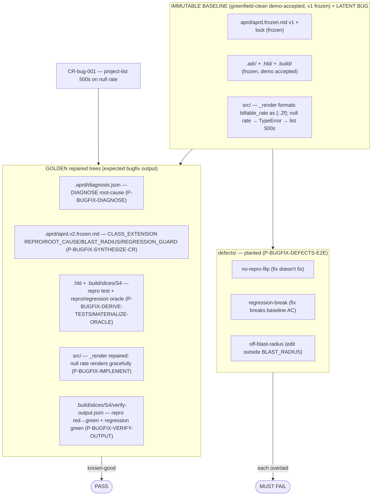

# brownfield-bugfix — both-directions oracle for the bugfix spine

Single oracle the bugfix-spine builds verify against. = a greenfield-built, demo-accepted project (frozen baseline) carrying a **latent defect** + a defect report (CR-bug-001) + the GOLDEN repaired trees, plus planted defects. Golden (repaired) PASSes; each planted defect FAILs. Verifier can't separate golden from defect → verifier broken, fix before trusting any bugfix build.

## What's here

## The defect (CR-bug-001)
`_ProjectManagementAdapter._render` (`src/freelancer_app/wsgi.py`) formats `billable_rate` as `{p['billable_rate']:.2f}`. A project with `billable_rate = null` → `TypeError` → GET `/projects` 500s. Demo never exercised a null rate, so it shipped green. Repair = render null rate gracefully (correct behavior; no new feature). Blast radius = `_render` only. Regression guard = baseline project CRUD + list render for rated projects (AC on slice S4).

## Both-directions oracle — scenario → expected verdict (filled by builds P-BUGFIX-* 12–18)

| direction | seed | run | expected verdict | separates from golden by |
|---|---|---|---|---|
| **golden** (repaired) | `src/.../wsgi.py` _render renders null rate gracefully | VERIFY-OUTPUT | **verified** (repro green + regression green) | repro flips red→green; regression green |
| `no-repro-flip` | fix that doesn't address null rate | VERIFY-OUTPUT | **blocked** (reproduction still RED) | repro red→red |
| `regression-break` | fix that breaks rated-project render | VERIFY-OUTPUT | **blocked** (regression RED, baseline AC) | regression green→red |
| `off-blast-radius` | edit outside `_render` / declared BLAST_RADIUS | CRITIQUE | **blocked** (off-surface edit) | critique clean→blocked |

## Build status (this fixture is filled incrementally by the roadmap loop)
- **P-BUGFIX-FIXTURE-BASELINE** (this build) — baseline + latent bug + CR-bug-001 + this README. ✓
- P-BUGFIX-DIAGNOSE … P-BUGFIX-VERIFY-OUTPUT (12–17) — add the golden repair artifacts + repaired `src/`.
- P-BUGFIX-DEFECTS-E2E (18) — add `defects/` + e2e-validated note.

Verify discipline (EMBEDDED CANON): both-directions mandatory · disk is the deliverable · clean-room (no pipeline context leaks) · caveman + economy bind all fixture prose. (No python in env → repro/regression verified by static-trace + golden comparison, as the greenfield fixtures are — DIAGNOSE Rule 5: runtime/harness gap ≠ missing-foundation.)
