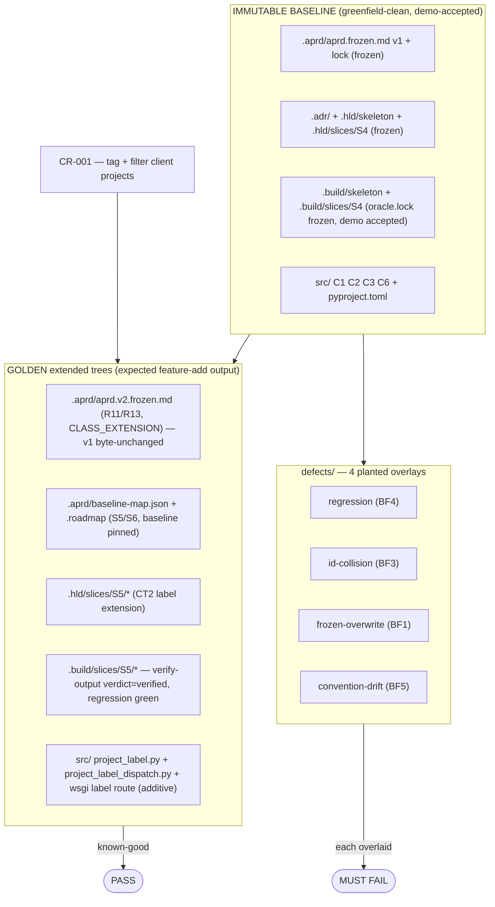

# brownfield-feature — both-directions oracle for the feature-add spine

Single oracle Tasks 02–13 verify against. = a greenfield-built, demo-accepted project (frozen baseline) + a feature change request (CR-001) + the GOLDEN correctly-extended trees, plus 4 planted defects. Known-good golden PASSes; each planted defect FAILs. Verifier can't separate golden from defect → verifier broken, fix before trusting any brownfield build.

## What's here

## The feature (CR-001)

Add a free-text **label** to a client project and filter the project list by tag. Atomic, single-system. Plugs into the EXISTING system at one declared seam: extends persistence contract **CT2** (C3 Project Management → C1 Data Store) with an additive label field on the existing project record (A14). Domain component **C3** (built in baseline slice S4). New slices S5 (set+persist label) and S6 (filter). Regression guard = baseline **AC6** (create + manage projects).

Baseline ID high-water (baseline-map): R10 / AC10 / E7 / C6 / S4 / ADR-0006 / CT11 / A13 / F4. New feature IDs continue strictly above: R11, R13, AC11, AC13, E8, S5, S6, F5.

## Both-directions oracle — scenario → expected verdict

The golden (this tree as-is) PASSes: `.build/slices/S5/verify-output.json` verdict `verified` (5/5 layers, regression green, baseline byte-unchanged, no ID collision). Each defect is an overlay onto the clean baseline + golden; running the named role MUST reject.

| defect | invariant | seed overlay | run | expected verdict | separates from golden by |
|---|---|---|---|---|---|
| `regression` | **BF4** feature breaks an existing AC | `project_store.regressed.py` → `src/.../project_management/project_store.py` | VERIFY-OUTPUT | **blocked** (regression RED, AC6; escape→DIAGNOSE) | `regression.verdict` green→red |
| `id-collision` | **BF3** new R* reuses a baseline R* index | `aprd.v2.collision.frozen.md` → `.aprd/aprd.v2.frozen.md` | SYNTHESIZE / P2+P3 verify | **rejected** (R10/AC10 collide) | new IDs ≤ high-water (R:10/AC:10) |
| `frozen-overwrite` | **BF1** run mutates the frozen baseline | `aprd.frozen.mutated.md` → `.aprd/aprd.frozen.md` | SYNTHESIZE / freeze-gate | **rejected** (immutability breach) | aprd.frozen.md ≠ v1 (lock status frozen) |
| `convention-drift` | **BF5** new code uses canon defaults vs CONVENTION_BASELINE | `tagService.py` → `src/freelancer_app/tags/tagService.py` | CRITIQUE | **blocked** (gold-plating + swallowed-failure) | critique `clean`→`blocked`, 0→2 issues |

Each defect dir carries the planted artifact(s) + `expected-verdict.json` (the load-bearing assertion). The headline regression defect also carries the rejecting `verify-output.blocked.json`; convention-drift carries the blocking `critique.flagged.json` (both = authoritative clean-room outputs of the real prompts).

> **e2e-validated (2026-06-10)** — all four invariants exercised clean-room (step-runner, prompts fed verbatim, benches outside `_fixtures/`). The golden `.build/slices/S5/{verify-output,critique}.json` in this tree ARE the clean-room outputs of the real prompts.
>
> - **BF4 (regression) — runnable judge, both directions PROVEN.** VERIFY-OUTPUT: golden→`verified`/regression green; regression-defect→`blocked`/regression red.
> - **BF5 (convention-drift) — runnable judge, both directions PROVEN.** CRITIQUE: golden→`clean`/0 issues; drift-defect→`blocked`/2 issues (gold-plating + swallowed-failure → IMPLEMENT).
> - **BF1 (frozen-overwrite) — prevention + freeze-gate PROVEN.** SYNTHESIZE golden run left `aprd.frozen.md` byte-identical while emitting `aprd.v2` + re-signing the lock v1→v2; and HALTed (escape #3) when the baseline lock was `status:draft`. Caveat: mechanical detection of a post-hoc mutated-yet-frozen v1 is rule/gate-based, not sha-recompute (locks carry nominal shas). See `defects/frozen-overwrite/expected-verdict.json`.
> - **BF3 (id-collision) — prevention PROVEN at EXTRACT (both directions); owned by EXTRACT, not SYNTHESIZE.** EXTRACT mints strictly above `id_high_water`: golden bench (R:10) → R11/R12/R13 + E8; shifted bench (R:20) → R21/R22/R23 + E16 — high-water-driven, not hardcoded (a hardcoded prompt would collide). SYNTHESIZE is transparent: fed a planted `R10` it REPRODUCED it without catching (carries ids forward unchanged, Rule 1). So BF3 is prevented at EXTRACT + detected at the P2/P3 thread-integrity checkpoint, never adjudicated by SYNTHESIZE. See `defects/id-collision/expected-verdict.json`.

## How to seed a scenario into a bench

1. Copy the clean baseline + golden: everything under `_fixtures/brownfield-feature/` EXCEPT `defects/`.
2. Overlay the scenario's planted file(s) onto the path named in its `expected-verdict.json` `seed[]`.
3. Run the named role clean-room (step-runner, Sonnet/High — prompt verbatim + bench path; never reads `_fixtures/` directly).
4. Assert the role's on-disk output matches the defect's `expected_verdict` / `expected_signal`. The golden (no overlay) must produce `verified` / `clean`.

Verify discipline (EMBEDDED CANON): both-directions mandatory · disk is the deliverable (verify the artifact on disk, not a chat reply) · clean-room (no pipeline context leaks) · caveman + economy bind all fixture prose.
