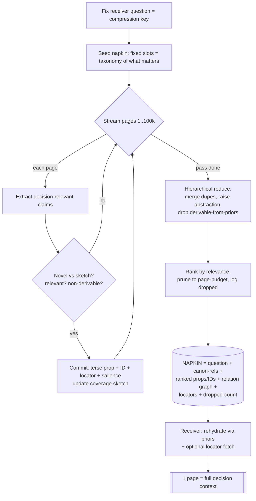

# 01 — Research-Context Handoff Problem

Single-napkin handoff of 100-book research context. Full thought process + solution.

## 1. Decode metaphor → real problem

| Story element | Real meaning |
|---|---|
| 100 books × 1000 pages = 100k pages | source corpus, huge entropy `H_src` |
| read 1 page at a time | bounded working set: 1 chunk in context |
| page closed = forgotten | stateless pass; no memory of prior pages |
| only napkin stays known | napkin = sole persistent store (working mem AND handoff) |
| pass single napkin | one-artifact handoff, fixed small capacity `C_nap` |
| expand → fits 1 book page | deliverable target `C_pg`; reconstruction budget |
| must give "full context" | fidelity target (NOT verbatim — see step 3) |

Problem = **compress 100k pages → 1 napkin, under streaming + amnesia, such that receiver rehydrates → 1 page that carries full DECISION-relevant context.**

## 2. Info-theory frame

- `H_src` ≫ `C_nap`. `C_nap ≤ C_pg` (napkin smaller than the page it expands to).
- Pigeonhole: lossless compress impossible. `C_nap` bits cannot address `2^H_src` states.
- ⇒ lossy mandatory. So "full context" CANNOT mean every byte. Must redefine fidelity.

## 3. Redefine "full" — kill the impossible reading

"Full context" = **everything the receiver needs for their task, nothing derivable, nothing redundant.**
- 100k pages are mostly redundant (repeats, derivable, irrelevant to the question).
- Irreducible signal = the surprises: novel claims, invariants, contradictions, non-derivable specifics.
- Target fidelity = preserve decision-relevant + non-regenerable bits; drop the rest.

## 4. The compression key = the QUESTION

Without a target question, relevant set = whole corpus → unbounded → impossible.
**First act: fix receiver's question.** Question is the codebook that makes "relevant" finite and the page-budget reachable. No question → no solution.

## 5. Decisive insight — shared codebook

Compression bounded by mutual prior. Sender + receiver share priors (language, domain canon, world model). Then napkin carries only the DELTA: bits NOT regenerable from shared priors.
- Transmit irreducible residue; let receiver's priors regenerate the derivable mass.
- This is how 100k → 1 page survives: most of 100k is redundant-or-derivable. Napkin = the residue + a regeneration seed.

## 6. Two regimes (state both — receiver corpus access decides)

- **Regime R (receiver CAN re-open books):** napkin = INDEX. Store pointers `book:page` + retrieval keys + query plan. Max compression. = RAG. Detail fetched on demand; page assembled by retrieval.
- **Regime S (no access):** napkin = SELF-CONTAINED SEED. Store distilled propositions + shared-codebook refs. = distillation. Page regenerated from seed + priors.

Default hybrid: carry seed for irreplaceable signal + locators for recoverable detail.

## 7. Why naive fails

Naive: keep running summary on napkin, rewrite each of 100k pages.
- Fixed napkin + 100k updates = catastrophic forgetting / drift. Early pages diluted, signal washed, order-dependent.
- Amnesia: can't compare new page to forgotten pages → can't detect novelty/dedup → re-commits redundancy until budget blown.

## 8. Fix amnesia — coverage sketch + novelty gate

Napkin must encode a compact "already-seen" signature (topic-coverage sketch / bloom-like slot map), because novelty must be judged against the sketch, not against forgotten memory.
Per page, commit a note ONLY if all hold:
1. decision-relevant to the question,
2. NOT derivable from napkin + shared priors,
3. high-salience (novel / contradicts / invariant).
Else discard. = online importance sampling under bounded memory.

## 9. Structure beats prose — store relations + IDs

Napkin holds STRUCTURE, not text:
- terse propositions, each an ID (threaded, dedup-able),
- a relation graph (relations expand into prose cheaply at receiver),
- locators for recoverable detail,
- shared-codebook refs (cite canon, never restate),
- dropped-count (no silent truncation).
Structure has huge expansion ratio: small graph → full page of prose via priors.

## 10. Budget discipline → guarantee fit

Expanded must fit 1 page. Enforce on napkin:
- rank propositions by decision-relevance,
- keep top-K whose natural expansion ≤ page budget,
- record count + classes dropped.
Napkin carries the budget contract, so receiver's expansion can't overflow.

## 11. Algorithm (end-to-end)



Multi-pass: if re-reading allowed, loop ST→RED until fixed point (slots saturate, no new novelty for K passes). Fixed napkin = converging accumulator.

## 12. Why all constraints met

- 1 page/time + amnesia → streaming pass; napkin = only state; coverage sketch supplies novelty/dedup that memory can't.
- single napkin → it IS both the bounded accumulator and the handoff.
- 100k → 1 page → lossy by design; keeps non-derivable + decision-relevant; drops redundant/derivable; regenerated by shared codebook.
- expand-fits-page → ranking + budget contract on napkin.

## 13. Napkin spec (the deliverable seed)

```
QUESTION:        <receiver target — the compression key>
CANON-REFS:      <pointers into shared priors; cite, don't restate>
PROPS:           <P1..Pk terse claims, decision-relevant, deduped, IDs threaded>
GRAPH:           <relations among P*; expands to prose>
LOCATORS:        <book:page for recoverable detail (Regime R)>
COVERAGE-SKETCH: <topics seen → saturation; supports novelty under amnesia>
DROPPED:         <count + classes pruned; no silent truncation>
```

## Conclusion

Impossible as literal lossless transfer. Solvable as: **fix question → transmit only non-derivable decision-relevant residue as a structured generative seed → receiver regenerates page from seed + shared priors (+ optional locator fetch).** Amnesia handled by a coverage sketch carried on the napkin; fit guaranteed by a ranked budget contract.
