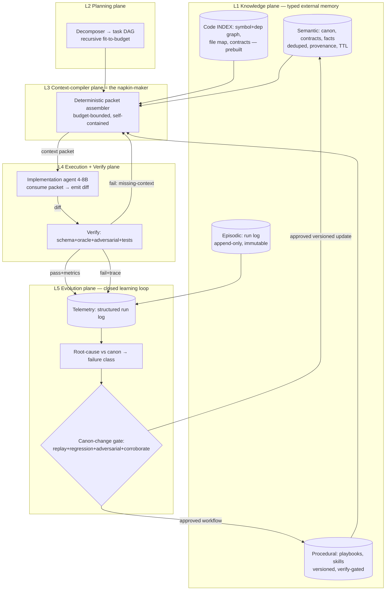
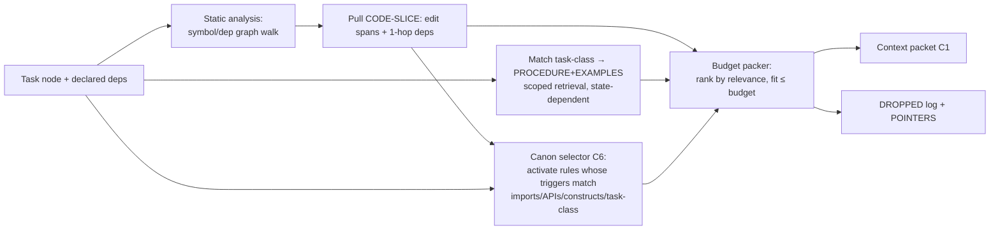
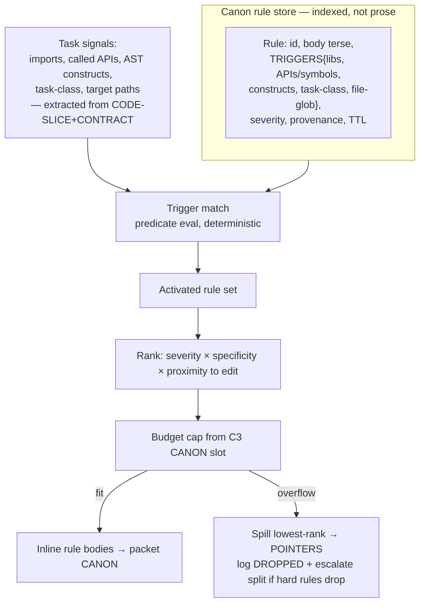
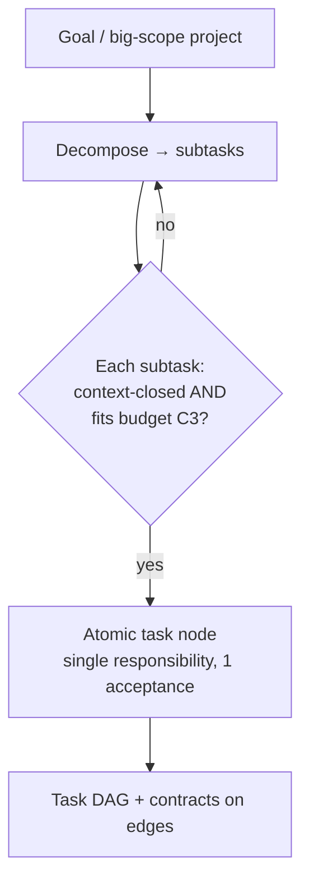
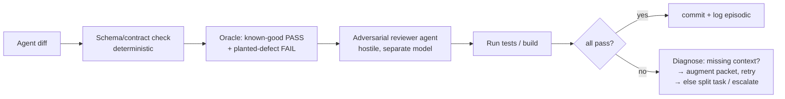
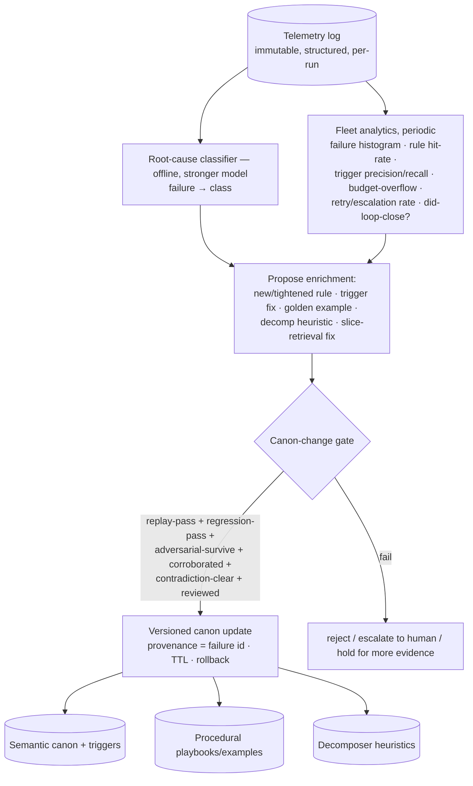

# 02 — Problem-Solution Proposal: Context Engineering for Weak Implementation Agents

> Synthesis of [[00-memory-101]] (memory taxonomy + failure modes) and [[01-research-problem]] (corpus→napkin compression). Target: agentic system delivering big-scope work over large codebases using 4–8B / 32k-context models. Downstream will dissect — sections carry IDs (`P*` principles, `L*` layers, `C*` components, `R*` risks).

## TL;DR — thesis

Weak model = unreliable cognition + tiny window + bad parametric knowledge. So **move ALL cognition into the pipeline**, not the model. Per atomic task, a deterministic **context compiler** assembles a budget-bounded, self-contained **context packet** from typed external memory. Model executes; pipeline verifies. Output untrusted by default. **A failed task = missing context, not a dumb model → fix the packet, not the weights.** Then a **closed evolution loop** turns every failure into gated canon enrichment, so the system accumulates experience and self-improves on disk while weights stay frozen. Model is a cheap, interchangeable executor; engineered (and self-evolving) context is the product.

## 1. Constraints → forced implications

| Constraint | Implication (non-negotiable) |
|---|---|
| 4–8B params, weak reasoning | model cannot plan, cannot choose what to read, cannot self-decompose. Cognition externalized to deterministic tools + decomposition. |
| 32k window | cannot dump codebase. Hard budget partition. Context is *engineered*, not *retrieved-and-hoped*. |
| Parametric knowledge questionable | CANNOT cite-and-trust model recall. Load-bearing knowledge **inlined** into packet from external canon. "Shared codebook" lives on disk, not in weights. |
| Big scope / large codebase (the 100k-page corpus, [[01-research-problem]]) | persistent prebuilt INDEX; per-task retrieval = deterministic lookup, not per-run streaming reasoning. |
| Output unreliable | every task output gated by oracle + adversarial verify before accept. |

**Core inversion:** classic agents stretch the model to fit the task. Here we **shrink the task to fit the model** — decompose until each unit is context-closed within budget, then spoon-feed.

## 2. Design principles (P*)

- **P1 Model executes, pipeline thinks.** No agent-driven "decide what to grep/read." Retrieval + planning deterministic where possible. Weak model only consumes a finished packet + emits a narrow diff.
- **P2 Shrink scope to model, not model to scope.** Recursive decomposition until task context fits budget with margin. Non-fitting task = not-yet-decomposed task.
- **P3 Inline only task-applicable canon; point to the rest.** [[01-research-problem]] codebook insight, adapted twice: (a) weak priors unreliable → inline load-bearing rules, no cite-and-trust on weights; (b) canon corpus is HUGE (whole-company Python + library guidelines) → cannot inline wholesale. Compiler **activates only the rules whose triggers match this task** (see C6), ranks, fits budget; everything else → POINTERS. Selection, not dump.
- **P4 Typed memory, never one blob.** [[00-memory-101]]: separate episodic / semantic / procedural; scope retrieval to task-state. One blob inherits every bias at once.
- **P5 Budget is a contract.** 32k partitioned + hard-enforced. Compiler refuses to emit over-budget packet (drops + logs, no silent truncation).
- **P6 Output untrusted → verify both directions.** Oracle: known-good passes, planted-defect fails. Adversarial reviewer hostile by default.
- **P7 One task = one responsibility = one verifiable acceptance.** Failure isolation. IDs thread `R→AC→S→C→CT→commit`.
- **P8 Failure feeds the compiler.** Recurring miss → new canon fact + fixture + playbook step. System improves *context*, not weights.
- **P9 Closed-loop self-evolution.** System collects own telemetry, root-causes every failure against canon, enriches canon to prevent recurrence — through a hard gate (replay + regression + adversarial + corroboration), never raw auto-write. Weights frozen → ALL learning lands in context-engineering inputs (canon, triggers, examples, decomposition heuristics, retrieval). Canon change = highest-stakes write → governed like a frozen artifact (versioned, provenance, rollback).

## 3. Architecture — four planes (L*)



- **L1 Knowledge plane** = the four [[00-memory-101]] stores + a prebuilt code INDEX. INDEX is the offline answer to the 100k-page streaming problem ([[01-research-problem]] Regime R): build once, query deterministically.
- **L2 Planning** = decomposer emits task DAG; recurses until each node context-closed (P2).
- **L3 Context compiler** = central artifact factory (the "napkin" of [[01-research-problem]]). Deterministic.
- **L4 Execution+Verify** = weak agent + hostile gate. Pass→episodic log; fail→back to compiler (P8).
- **L5 Evolution** = telemetry → root-cause → gated canon enrichment (§9.1, P9). The loop that makes the system accumulate experience and self-improve over time. Closes back onto L1 (canon/playbooks) and L2 (decomposition heuristics).

## 4. The context packet (napkin v2) — central deliverable (C1)

Per atomic task. Self-contained. Fits budget. Structure adapts [[01-research-problem]] §13 + [[00-memory-101]] typing:

```
TASK:        one atomic deliverable + acceptance criteria (IDs threaded)   [from L2]
CONTRACT:    exact interfaces/signatures/types output must satisfy          [semantic]
CANON:       INLINED only task-applicable rules (trigger-matched, C6)        [semantic, P3]
CODE-SLICE:  exact spans to edit + immediate deps only (static-analysis)    [INDEX, not vector]
PROCEDURE:   playbook steps for this task class                             [procedural]
EXAMPLES:    1–2 golden in/out (bounded priming)                            [procedural]
POINTERS:    locators (file:span) for re-fetchable detail omitted           [INDEX]
DROPPED:     count + classes pruned to fit budget (no silent truncation)    [P5]
```

Difference from [[01-research-problem]]: there, receiver had reliable priors → could cite-and-trust. Here weak model priors unreliable → **CANON is inlined**, refs reserved only for what the compiler can deterministically re-inject on demand (POINTERS).

## 5. Context compiler — deterministic retrieval (C2)

Weak model cannot be trusted to pick what to read (P1). Retrieval is tool-driven, not agent-driven.



- Primary retrieval = **static analysis** (deterministic, exact). Vector search = *secondary, verified* augment only (catches semantic links graph misses) — never sole source (kills [[00-memory-101]] priming/poisoning bias).
- Scoped retrieval (state-dependent, [[00-memory-101]] §3): two-pass — task-class scope first (precision), global fallback when empty (recall).

## 5.1 Canon selector (C6) — applicable-rules-only

Company canon = huge corpus (Python style + per-library usage rules + arch guidelines). Inlining all = impossible, blows budget. So canon is not prose-to-dump but a **typed rule store**, each rule carrying machine-checkable **activation triggers**. Compiler activates only rules whose triggers fire for THIS task.



Mechanics:
- **Index canon by trigger, not by topic.** Each rule = `{id, terse body, triggers, severity, provenance, TTL}`. Triggers fire on: imported library (`requests`, `pandas`…), called symbol/API, AST construct (async, context-mgr, decorator, raw SQL…), task-class (new-endpoint, migration, refactor…), file glob. Authored once by canon owners; deterministic to evaluate.
- **Selection deterministic, not model-judged.** Predicate match against task signals extracted by static analysis (P1) — weak model never decides which rules apply.
- **Rank then cap.** `severity × specificity × proximity-to-edit`. Generic style rule loses to a library-specific correctness rule on a touched API. Cap to CANON budget slot (C3).
- **Hard-rule overflow = split signal.** If MUST-rules alone exceed slot, task too broad → kick to L2 to split (P2). Never silently drop a hard rule (P5).
- **No match ≠ no canon.** Always include the small always-on baseline (repo-wide invariants) + activated specifics.
- This is the [[01-research-problem]] "transmit only non-derivable, decision-relevant residue" applied to canon: triggers = the relevance filter; corpus stays on disk (Regime R), only the firing slice rides the packet.

## 6. Budget partition (C3) — the page-size contract

32k window, hard split. Example baseline (tune per task class):

| Segment | Tokens | Role |
|---|---|---|
| System + role + invariants | ~3k | who am I, hard rules |
| TASK + CONTRACT | ~4k | what + acceptance |
| CANON (inlined) | ~6k | trigger-activated applicable rules only (C6) |
| CODE-SLICE | ~8k | code to edit + deps |
| PROCEDURE + EXAMPLES | ~3k | how + priming |
| Output/reasoning headroom | ~8k | the diff + scratch |

Compiler refuses emit if CANON+CODE-SLICE overflow → signals L2 **"split this task"** (P2 feedback). Over-budget = decomposition bug, surfaced not hidden.

## 7. Decomposition — fit-to-budget recursion (C4)



- Contracts on DAG edges = interface between tasks → weak agents never need global view, only their node + neighbor contracts. Isolates error compounding (R4).
- Leaf = solvable by one weak agent in one packet. This is the load-bearing reliability move.

## 8. Verification plane (C5) — output untrusted

Weak model output assumed wrong until proven (P6). Cheap parallel weak models make verify affordable.



Retry policy: first failure → **re-engineer context** (add missing CANON/EXAMPLE/CODE-SLICE), not just re-roll the model (P8). Bounded retries → escalate/split.

## 9. Memory integration — map [[00-memory-101]] stores

| Store | Plane | Role here | Mitigation carried |
|---|---|---|---|
| Episodic (run log) | L1 | every task run, immutable, provenance | derive summaries separately; never overwrite |
| Semantic (canon/facts/contracts) | L1 | source of inlined CANON + CONTRACT | one home per fact, TTL, verify-on-use |
| Procedural (playbooks/skills) | L1 | PROCEDURE + EXAMPLES, the INDEX builders + verify gates | versioned, oracle-gated |
| Priming (working set) | L3 | retrieved packet itself | bounded budget (C3), decay, provenance-gated |
| State-dependent (scope) | C2 | task-class scoped retrieval | scope tags + global fallback |

Promotion loop (P8): episodic win → semantic fact + procedural playbook; recurring failure → new fixture + canon rule. System learns by improving the **compiler's inputs**, since weights are frozen/weak.

## 9.1 Self-evolution plane (L5) — telemetry → root-cause → gated canon enrichment

Weights frozen + weak → the ONLY way the system gets smarter is by improving its context-engineering inputs. So learning = a closed loop over canon, triggers, examples, decomposition, retrieval. Experience accumulates on disk, not in weights.



### Telemetry (write at every run — feeds everything)
Structured record appended to immutable episodic log:
- task: id, class, DAG position, model id/version.
- packet composition: activated rule-ids (C6), code-slice symbols, examples used, budget usage per C3 segment.
- outcome: pass/fail, which verify gate failed (schema/oracle/adversarial/test), retry count, what was added on each retry.
- cost: tokens, wall-time.

This is the [[00-memory-101]] episodic store made machine-analyzable. Immutable raw (no drift); analytics are derived views.

### Failure root-cause taxonomy (analyze every failure against canon)
Offline classifier (use a stronger model here — NOT the weak executor) buckets each failure → drives a specific enrichment:

| Class | Meaning | Enrichment |
|---|---|---|
| C-ABSENT | no canon rule covered this failure | author new rule + triggers + fixture |
| C-MISS | applicable rule existed but trigger didn't fire | tighten/add trigger (C6) |
| C-WRONG | canon rule itself wrong/stale | correct rule, bump version, reset TTL |
| D-SPLIT | decomposition too coarse (overflow/multi-concern) | update decomposer heuristic / task-class |
| R-SLICE | code-slice missed a dependency | improve static-analysis retrieval (C2) |
| X-EXAMPLE | missing/weak golden example | add example |
| M-LIMIT | genuine model-capability ceiling | escalate: bigger model / finer split — flag, NOT auto-fixable |

Most failures resolve to a context bug (P9). M-LIMIT is the honest exception: surfaced, not papered over.

### Canon-change gate — the highest-stakes write
Auto-evolving canon risks poisoning ([[00-memory-101]] §2): one bad auto-authored rule contaminates EVERY future task that triggers it. So no proposal merges raw. Gate (all must hold):
1. **Replay** — the originating failure now passes with the change.
2. **Regression** — full oracle/fixture suite still passes both directions; no known-good broken.
3. **Adversarial survive** — hostile agent tries to refute / find over-reach of the rule.
4. **Corroboration** — promote on N occurrences or human sign-off (high-severity) — not first sighting ([[00-memory-101]] promotion gate).
5. **Contradiction check** — conflict with existing canon → flag, don't silently dual-store.
6. **Governed write** — canon is frozen-artifact class: change = new version via change-request, provenance = failure id, TTL, rollback path. Never in-place edit.
7. **Human-in-loop initially** — auto-propose, human-approve; graduate to auto-merge per low-severity class once the loop demonstrates precision.

### Fleet analytics → structural evolution (beyond per-failure)
Periodic, over the telemetry corpus:
- **failure-class histogram** → prioritize canon/decomp work where it pays.
- **rule hit-rate** → dead rules (never fire) pruned; hot rules promoted to always-on baseline.
- **trigger precision/recall** → over-tag (rule fires irrelevantly, noise+budget) vs under-tag (should-have-fired miss) → retune C6.
- **budget-overflow rate per task-class** → rebalance C3 or split the class.
- **retry/escalation rate** → decomposition tuning.
- **loop-closure check** → after a canon change, did that failure class actually drop in subsequent runs? If not, revert (rule didn't help). This measures the learning works, not just that it ran.

### Anti-ossification (procedural risk, [[00-memory-101]] §2.3)
Self-reinforcing canon can bake in a wrong-but-passing rule. Guards: TTL forces re-validation; loop-closure check reverts non-helping rules; adversarial gate + regression catch over-reach; provenance lets any rule be traced to and killed at its originating failure.

## 10. How [[01-research-problem]] maps (corpus→napkin, adapted)

| [[01-research-problem]] move | Here |
|---|---|
| fix the question = compression key | task node + acceptance = the key (C4) |
| transmit non-derivable residue | trigger-activate applicable canon (C6); POINTERS for rest (P3) |
| shared codebook regenerates rest | codebook EXTERNALIZED to disk (weak priors can't be the codebook) |
| coverage sketch under amnesia | prebuilt code INDEX (no per-run streaming reasoning) |
| budget contract → fits one page | 32k partition (C3) |
| no silent truncation | DROPPED log |
| Regime R (receiver re-opens books) | static-analysis INDEX fetch on POINTERS |

## 11. Risks / tradeoffs (R*)

| ID | Risk | Tradeoff | Mitigation |
|---|---|---|---|
| R1 | Decomposition overhead (many tiny tasks, DAG cost) | reliability ↔ throughput | amortize: cache packets per task-class; parallelize leaves |
| R2 | Huge canon corpus, inlining all impossible | coverage ↔ budget | trigger-activate applicable rules only (C6); rank severity×specificity×proximity; spill to POINTERS; split if hard-rules overflow |
| R2b | Canon trigger gaps — applicable rule never fires (under-tag) or irrelevant rule floods (over-tag) | precision ↔ recall on rules | curate triggers as canon artifact; promote misses from failed-verify into new/tighter triggers (P8); always-on baseline as safety net |
| R3 | Deterministic retrieval misses semantic links | precision ↔ recall | verified vector as secondary augment (C2); never sole |
| R4 | Error compounding across DAG | autonomy ↔ correctness | edge contracts + per-node verify gate (C5) isolate |
| R5 | Verify cost (multiple model calls per task) | speed ↔ trust | cheap weak models, run parallel; oracle is deterministic+free |
| R6 | Context staleness (code drifts under INDEX) | freshness ↔ rebuild cost | TTL + incremental index rebuild on diff (write-path) |
| R7 | Compiler complexity becomes the new bottleneck | determinism ↔ engineering load | start static-analysis-only; add complexity only on measured miss |
| R8 | Self-evolving canon poisons fleet (one bad auto-rule contaminates all triggering tasks) | learning speed ↔ safety | hard gate §9.1 (replay+regression+adversarial+corroborate+contradiction); human-in-loop until precision proven; provenance + rollback |
| R9 | Canon ossifies / self-reinforcing wrong rule | stability ↔ adaptability | TTL re-validation; loop-closure check reverts non-helping rules; trace-to-origin kill path |
| R10 | Telemetry accretes secrets/PII, unbounded growth | observability ↔ cost/privacy | redact at write; tiered compaction; immutable raw + derived analytics ([[00-memory-101]] §1) |

## 12. Open questions for downstream dissection

1. Decomposer model: can a 4–8B do DAG decomposition reliably, or does planning need a stronger model / deterministic AST-driven splitter? (Likely hybrid: tool-driven split + small-model labeling.)
2. Canon trigger authoring: who tags rules + at what granularity? Cost of maintaining triggers as canon evolves? Can a linter/AST pass auto-derive some triggers vs hand-tag?
2b. Activated-canon vs budget: after trigger-filtering, does the firing rule set still overflow 6k for dense tasks (many libs touched)? If routinely yes → decompose by library/concern.
3. Vector augment trust: how to verify a vector hit before it enters a packet (poisoning, [[00-memory-101]] §2)? Same question for fuzzy/semantic canon triggers vs exact predicate triggers.
4. Cross-task global invariants that don't fit any single packet — where enforced? (Likely L4 integration tests, not per-node.)
5. Retry vs split decision boundary: when is failure "missing context" vs "task too big"?
6. Root-cause classifier reliability: can it bucket failures accurately enough to drive auto-enrichment, or is human triage mandatory at first? What corroboration count N per severity?
7. Auto-merge graduation: which failure classes / severities ever earn no-human-in-loop, and what precision threshold over how many cycles justifies it?
8. Loop-closure metric: cleanest way to attribute a later failure-rate drop to a specific canon change vs confounders (model swap, codebase drift)?

## Thesis (one line)

Weak small models can deliver big-scope work IF the system stops asking them to think: **decompose to fit, deterministically compile a budget-bounded self-contained context packet per atomic task — pulling exact code by static analysis and only the trigger-applicable slice of a huge canon — execute, and adversarially verify, treating every failure as a context-engineering bug, not a model bug. Then close the loop: telemetry root-causes each failure against canon and enriches canon through a hard gate, so the system accumulates experience and self-evolves on disk while the weights stay frozen.**
