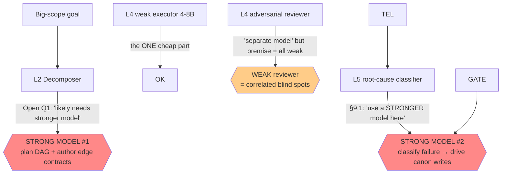

# 02a — Hostile Critique: Context-Engineering Proposal

> Adversarial review of [[02-problem-solution-proposal]]. Reviewer stance: hostile CTO, 10+ yr shipping AI/ML. Job = find where this breaks in production, not admire the diagrams. IDs: `H*` findings (severity S1 kill-shot / S2 serious / S3 fixable). Cross-refs proposal `P*/C*/L*/R*`.

## Verdict (read first)

Elegant on paper, three load-bearing lies underneath. Proposal's thesis — "move ALL cognition into pipeline, weak model = cheap interchangeable executor" — **does not eliminate the hard cognition. It relocates it into three places where the doc quietly requires a STRONG model, then never counts the cost.** Strip those and the premise (4–8B delivers big scope) is unproven. Add them and the economic case (weak = cheap) is unaudited and probably false vs the obvious baseline.

Plus: verification story only works for regression-shaped tasks (oracle exists), collapses on greenfield. Static analysis on **Python** (their own target corpus) is the worst-case for sound slicing. Self-evolution loop is a research bet sold as architecture.

This is fundable as a research program. It is NOT yet an architecture you build against. Below: why.

---

## The central fraud — smuggled strong models (S1)

Doc says weak executor everywhere. Count the places it silently swaps in a strong model:

- **H1 (S1) Decomposer needs strong model → premise dies.** Decomposition IS the hard cognition: understand codebase, plan DAG, freeze interfaces. Doc's own Open Q1 concedes "likely hybrid / stronger model." If true, you didn't remove the strong model — you moved it from execution to **planning, where errors compound worst** (your own R4). A wrong split poisons every downstream leaf. You optimized the cheap stage and left the expensive, highest-leverage stage hand-waved.
- **H2 (S1) Root-cause classifier = second strong model.** §9.1 explicitly: "use a stronger model — NOT the weak executor." The entire self-evolution loop's value = classifier accuracy (Open Q6 admits unproven). So the "self-improving on disk while weights frozen" claim runs on a strong model you're paying for continuously.
- **H3 (S1) No cost model, no baseline.** The killer question the doc never asks: **why not one strong model (Sonnet/Opus-class) + good RAG, skip the entire edifice?** TCO of THIS = weak-exec tokens + 2 strong models (plan + RCA) + N-way verify fleet (multiple calls/task) + retry amplification + decomposition overhead + **a permanent human canon/trigger team** (H10). "Weak = cheap" counts only the executor token line. Unquantified ⇒ unfalsifiable ⇒ not an engineering proposal yet.

---

## Decomposition is not free, not always possible (S1–S2)

- **H4 (S1) Context-closed leaves may not exist.** P2 "recursively decompose until each unit context-closed" assumes such a partition exists. Big-codebase reality has **irreducible coupling**: rename a widely-used symbol, change a shared type, thread a new param through 40 call sites, cross-cutting refactor. Every "leaf" still needs the global view. You cannot shrink-to-fit a task whose essence is global. Doc treats decomposition as always-terminating; it isn't. When it can't close, the system has no defined behavior except "split forever" or "escalate" — i.e. fall back to the strong model you said you removed.
- **H5 (S2) Edge contracts = waterfall fallacy in agent clothing.** C4 freezes interfaces on DAG edges BEFORE leaves are implemented. Real interfaces emerge during implementation. Either the planner already solved the problem (then why the leaves?) or it guesses wrong contracts → forced re-decomposition cascade. Freezing the interface upfront is the exact assumption that killed waterfall.
- **H6 (S2) Runtime re-decomposition thrashes the DAG.** Retry policy (§8): bounded retries → split. Splitting a node at runtime mutates the DAG → invalidates **sibling edge contracts** → cascade re-plan. No stability analysis. Can loop: add-context → fail → split → new contracts → sibling fails → split. Token bonfire with no convergence proof.

---

## Verification is weaker than advertised (S1–S2)

- **H7 (S1) Oracle assumes a known-good exists — greenfield has none.** P6/C5 "known-good PASS + planted-defect FAIL" is a **regression** oracle. For new functionality, ambiguous requirements — the actual hard part of big-scope delivery — there is no known-good to diff against. Verification is strong exactly where the task is easy (test-covered change) and absent exactly where it's hard (novel behavior). Doc presents oracle-gating as universal. It is not.
- **H8 (S1) Weak verifier can't certify what a weak author can't produce.** "Adversarial reviewer, separate model" — but premise = ALL models weak, bad priors. A weak reviewer misses subtle bugs at ~the author's error rate. Worse: **LLM errors are correlated, not independent** — same training blind spots, same failure modes. N cheap weak models catch *independent* errors; they do NOT catch the *correlated* hard ones. You cannot bootstrap strong correctness from a committee of weak reasoners. "Cheap parallel weak models make verify affordable" hides a statistical impossibility.
- **H9 (S2) Contracts check shape, not behavior → compounding survives.** R4 mitigation = edge contracts + per-node verify. Contracts verify signatures/types. A leaf can satisfy its contract perfectly and be **semantically wrong** (right shape, wrong logic). Across 200 leaves, correct-shape-wrong-behavior integrates into a system that compiles, type-checks, honors every contract, and does the wrong thing. Edge contracts catch zero of this. Per-node verify would — but see H7/H8.

---

## Static analysis claim contradicts the target stack (S1–S2)

- **H10 (S1) Python is the worst case for the "deterministic static slice" they lean on.** C2 makes static analysis the PRIMARY, "deterministic, exact" retrieval. Their canon corpus is explicitly **whole-company Python**. Python defeats sound static slicing: duck typing, `getattr`/`setattr`, monkeypatching, dynamic imports, decorators, metaclasses, DI frameworks, `**kwargs` plumbing, runtime reflection. The call/dep graph is *unsound* in exactly the language they target. "Deterministic and exact" is false here. Self-contradiction at the core retrieval claim.
- **H11 (S2) 1-hop dep closure is both too small and too big.** Fixed "edit spans + 1-hop deps" misses the load-bearing config 3 hops out AND explodes to hundreds of files when the edit touches a hub module. There is no single radius that's right. Relevance ≠ graph distance. (Doc R-SLICE failure class admits this happens — i.e. it's expected to fail and be patched reactively per-incident. That's not retrieval, that's whack-a-mole.)
- **H12 (S3) "Deterministic" ≠ correct, and isn't even deterministic.** Ranking = `severity × specificity × proximity` + vector augment (C2) + task-class match. The moment vector/learned ranking enters, determinism is gone. And a deterministic wrong slice is *reliably* wrong — determinism buys reproducibility, not correctness. Doc conflates the two as if determinism were a quality guarantee.

---

## Budget partition is fantasy math (S2)

- **H13 (S2) Effective context ≪ 32k on a 4-8B model.** Small models suffer severe lost-in-the-middle; reliable-attention zone is far below advertised window. A packet filling 24k of 32k on an 8B model is likely past the reliable zone. The whole C3 table assumes 32k is *usable*. It isn't — and the doc never distinguishes window size from effective reasoning context.
- **H14 (S2) Partition starves the model's weakest faculty.** 8k "output/reasoning headroom" as the **leftover** slot. Weak models need MORE scratch to reason, not less. C3 maximizes input richness (canon+slice = 14k) and gives the already-bad reasoning the scraps. Backwards for a model whose bottleneck is reasoning.
- **H15 (S3) CANON 6k overflows on realistic tasks.** Task touching pandas + requests + async + raw SQL fires many rules even after trigger-filter. Doc's own Open Q2b admits this. The proposed answer ("decompose by library/concern") collides with H4: you can't always split a coherent task along library lines.

---

## Self-evolution loop = research bet sold as architecture (S2)

- **H16 (S2) Loop value = classifier accuracy = unproven (Open Q6).** Garbage classification → garbage canon → fleet poisoning (R8). Every gate stage is itself fallible: adversarial gate = weak model (H8); corroboration needs volume you may never reach for rare failures; replay/regression only guard *known* oracles (H7).
- **H17 (S2) Loop-closure attribution is an unsolved causal-inference problem (Open Q8).** "Did this canon change drop that failure class?" — confounded by model swaps + codebase drift. Without clean attribution, "revert non-helping rules" can't fire reliably ⇒ R9 ossification is **named, not mitigated**. The anti-ossification guard depends on the one metric the doc admits it can't compute.
- **H18 (S2) "Failed task = missing context, not dumb model" is faith, baked into retry policy.** When true cause is M-LIMIT (capability ceiling — common for the hard parts), the architecture is *biased to exhaust every other class first*: add context, re-roll, split, re-roll — max token waste before admitting the wall. The taxonomy lists M-LIMIT politely; the control flow fights it.

---

## Hidden human-labor tax (S2)

- **H19 (S2) Canon + trigger curation is a permanent expert-human cost that scales with corpus × churn.** "Authored once by canon owners" — false. Triggers rot as libs upgrade, APIs deprecate, code moves. Someone maintains the typed rule store + activation predicates forever. The system claims to cut reliance on expensive intelligence; it front-loads and *perpetuates* it as human canon labor. This is the real TCO and it's invisible in the doc.

---

## Consistency / concurrency gap (S2)

- **H20 (S2) Parallel leaves mutate the codebase the INDEX describes.** R1 parallelizes leaves; R6 rebuilds index on diff. But the fleet is editing the target *concurrently*. Two leaves touching overlapping deps → stale slices → contract violations surfacing only at integration. This is a read-your-own-writes / distributed-consistency problem. Doc treats the index as a static read; under its own parallelism it's a moving target with no consistency model.

---

## Claim → attack map

| Proposal claim | Where | Hostile reality |
|---|---|---|
| Move ALL cognition to pipeline | TL;DR, P1 | Relocates, not removes. 2 strong models smuggled (H1,H2) |
| Weak model = cheap executor | TL;DR | No TCO, no baseline vs 1 strong+RAG (H3) |
| Decompose until context-closed | P2,C4 | Irreducibly-coupled tasks have no closed leaf (H4) |
| Edge contracts isolate error | C4,R4 | Waterfall interface-freeze (H5); shape≠behavior (H9) |
| Static analysis = deterministic exact retrieval | C2 | Unsound on Python, the target stack (H10) |
| Oracle verifies output | P6,C5 | Only regression-shaped; greenfield has no oracle (H7) |
| Adversarial reviewer catches bugs | C5 | Weak+correlated → misses the hard ones (H8) |
| 32k budget partition | C3 | Effective ctx ≪32k on 4-8B; reasoning starved (H13,H14) |
| Self-evolves on disk, weights frozen | L5,§9.1 | Runs on strong classifier; attribution unsolved (H16,H17) |
| Failure = context bug | thesis,§9.1 | Faith; fights M-LIMIT reality (H18) |
| Canon authored once | C6 | Perpetual human curation tax (H19) |

---

## Kill-experiments — prove these 3 cheap before building anything

Hostile reviewer doesn't just complain. Falsify the premise for <2 weeks of work:

1. **Decomposer reality check (attacks H1,H4,H5).** Take 10 REAL big-scope tickets from a large Python repo. Can a 4–8B produce a context-closed DAG with correct edge contracts? Measure: % tasks that admit a closed leaf partition at all; contract-rework rate. If you need a strong model OR >X% can't close → premise broken, stop.
2. **Verifier ceiling (attacks H7,H8).** Plant 50 subtle semantic bugs (correct shape, wrong logic) in passing diffs. Run the weak adversarial gate. Measure catch rate vs a single strong reviewer. If weak fleet catch ≪ strong → verification can't gate quality, the whole "output untrusted but we'll catch it" story fails.
3. **TCO bake-off (attacks H3,H19).** Deliver ONE medium feature two ways: (a) full pipeline (weak exec + strong planner + strong RCA + verify fleet + canon labor) vs (b) one strong model + RAG + tests. Total $ incl human canon time. If (a) ≥ (b) → there is no reason to build this.

If all 3 pass, it's real. If any fails, the doc is a nice essay.

---

## What survives (credit where due)

Not all wrong. These hold independent of the above:
- **Typed memory, not one blob** (P4) — correct, well-grounded in [[00-memory-101]].
- **No silent truncation / DROPPED log** (P5) — good discipline regardless.
- **Inline load-bearing canon vs cite-and-trust weak priors** (P3) — right instinct; weak priors genuinely can't be the codebook.
- **Trigger-indexed canon over prose-dump** (C6) — sound *idea*; cost (H19) and overflow (H15) unaddressed.
- **Provenance + immutable episodic + governed canon writes** — correct hygiene.

The *memory-design half* (from [[00-memory-101]]) is solid. The *weak-model-delivers-big-scope half* is the unproven leap. The proposal's strength is borrowed from the parts that don't depend on its central bet.

## One-line hostile thesis

**You didn't make weak models deliver big scope — you built an expensive pipeline around the claim that they can, with the two hardest cognition steps quietly outsourced to strong models, verification that only works where the task is already easy, on a static-analysis foundation that doesn't hold in your own target language — and you never priced it against just using a strong model. Prove the 3 kill-experiments or don't build it.**
