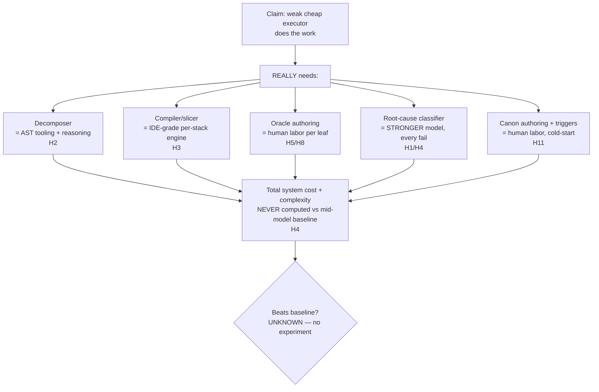

# 02b — Hostile Critique: Context Engineering Proposal 2

> Adversarial review of [[02-problem-solution-proposal]]. Reviewer stance: hostile CTO, 10+ yr shipping AI/ML. Job = find what kills the thesis, not admire it. Findings IDed `H*` (hostile finding), ranked by severity. Each: claim → why breaks → fix. References proposal's `P*/C*/L*/R*`.

## Verdict (one line)

Elegant theory, derived from two metaphors, **zero evidence, no kill-criterion, and a cost premise never checked**. Core architecture instinct (externalize cognition, decompose-to-fit, verify-untrusted) is sound. But proposal hides its hardest problems inside three words — "deterministic," "decompose," "oracle" — each of which is an unsolved system, not a given. As written: **not fundable without a falsification experiment + honest cost model.** Below = why.

## What's load-bearing-right (conceded, so teardown is credible)

- P1 (model executes, pipeline thinks) + P5 (budget = hard contract, no silent truncation) — correct, non-negotiable, well-stated.
- P6 (output untrusted, verify both directions) — right instinct.
- Typed memory over one blob (P4) — correct, follows [[00-memory-101]] cleanly.
- Treating canon as trigger-indexed rule store, not prose-dump (C6) — genuinely good. Best idea in the doc.
- Immutability + provenance + DROPPED log — disciplined.

Everything above is necessary. None of it is sufficient. The doc spends its energy on the parts that already work and waves at the parts that don't.

## FATAL findings (any one sinks the thesis if unanswered)

### H1 — "Failed task = missing context, not dumb model" is UNFALSIFIABLE + hides the model ceiling
- **Claim:** TL;DR + §8 retry policy + P9. Every failure → re-engineer packet. M-LIMIT is the lone escape hatch.
- **Why breaks:** circular. You only *know* it was missing-context AFTER adding context fixes it. Before that, C-ABSENT and M-LIMIT are **indistinguishable**. So the retry loop has no principled stop: it adds context forever on tasks a 4–8B cannot do at ANY packet quality. The axiom is convenient precisely because it makes the system always-blamed-on-context — i.e. always "our fault, fixable" — which feels virtuous but is epistemically a trap. It guarantees thrash.
- **The hard call you skipped:** the root-cause classifier (§9.1) must separate C-ABSENT from M-LIMIT. That is the single hardest judgment in the whole system and the doc gives it one table row and a "stronger model" hand-wave.
- **Fix:** make M-LIMIT *measurable, not residual*. Define a model-capability probe per task-class (curated tasks of known difficulty the 4–8B is run against → capability envelope). A failing task whose complexity exceeds the envelope is M-LIMIT BY MEASUREMENT, before infinite retry. Bound retries hard (≤2) and require the SPLIT-or-escalate decision to cite envelope data, not vibes.

### H2 — Decomposition is THE load-bearing move and you hand it to the weak model
- **Claim:** P2 + C4. "Shrink task to fit model." Recursion until context-closed leaf.
- **Why breaks:** if decomposition is wrong, every downstream stage is flawless execution of garbage. A mis-scoped "context-closed" leaf is the worst failure: it PASSES local verify (oracle is scoped to the leaf) and is globally wrong. Your own Open-Q1 admits you don't know if a 4–8B can decompose. So your reliability rests on the one step you're least sure of.
- **Worse — termination not guaranteed:** some work does NOT decompose into context-closed leaves. Cross-cutting refactor, perf work needing whole-system view, deadlock/race fix, anything with implicit global coupling. "Decompose until it fits" can loop forever or emit leaves that are individually-coherent and jointly-wrong. Large LEGACY codebases (your stated target) are defined by implicit coupling and side effects — exactly where "contracts on DAG edges" is a fiction. Clean edge contracts assume clean interfaces exist; in a 100k-page corpus they often don't.
- **Fix:** decomposition must be **tool-driven (AST/call-graph/module-boundary), small-model only LABELS** (Open-Q1's own hedge — promote it from open-question to spec). Add an explicit **non-decomposable class**: tasks the splitter refuses → escalate to bigger model, don't pretend. Add a **leaf-soundness check** distinct from leaf-fit: prove the leaf's contract actually covers its real (transitive) coupling, or flag it.

### H3 — "Deterministic compiler" relocates the intelligence, doesn't remove it
- **Claim:** C2. Static analysis = "exact" retrieval. "1-hop deps." R7 waves: "start static-only."
- **Why breaks:** picking the right code slice IS the hard problem and you asserted it solved by fiat. "1-hop deps" is arbitrary — real dependency closure is transitive, often unbounded; 1-hop misses the dep two calls down that breaks the build (your own R-SLICE failure class admits this happens). To slice correctly you need near-whole-program understanding — which is intelligence. You didn't eliminate cognition; you **moved it into a non-LLM system you now must build and maintain per-language, per-framework, per-build-system.** That's years of compiler/IDE-grade engineering, not pipeline config. Multi-stack shops multiply it.
- **Fix:** be honest that the compiler is a major engineering deliverable, budget it as such. Scope to ONE language first. Treat slice-correctness as a measured metric (R-SLICE rate) with a target, not an assumption. Accept iterative slice expansion on verify-fail as the *normal* path, not the exception.

### H4 — Cost premise (weak model = cheap) is NEVER validated and is probably false at the system level
- **Claim:** whole thesis — "model is cheap interchangeable executor." R5: "cheap weak models, run parallel."
- **Why breaks:** count the real per-task bill. Compiler run + decomposer + execution + schema-check + oracle + adversarial reviewer agent + test/build run + telemetry write. On fail: **a STRONGER model** for root-cause (§9.1 says so explicitly) + gate replay + full regression suite. With weak models, failures are COMMON, so the expensive path is the common path. The "stronger model for root-cause/classification" quietly **re-imports the very model you were avoiding** — for every failure, fleet-wide. Multiply by R1's "many tiny tasks." There is no back-of-envelope anywhere comparing total system cost vs. just running a mid-size (e.g. 30–70B) model end-to-end with light scaffolding. **The entire economic justification is asserted, never computed.** It may be net-negative.
- **Fix:** mandatory cost model BEFORE building. Baseline = "decent mid model + simple harness" on the same tasks. Thesis must beat it on $/passed-task, not on architectural elegance. If it can't, the project is theater.

### H5 — The oracle is assumed to exist, be correct, and be cheap. For novel big-scope work it is none of these.
- **Claim:** P6, C5. "Oracle: known-good PASS + planted-defect FAIL."
- **Why breaks:** that requires per-task golden fixtures. For brand-new features in a big-scope project **there is no known-good** — that's what you're building. Who authors the oracle? If a human does, per leaf, across thousands of leaves (H2/H8), that's the real cost center and it's unmodeled. The adversarial reviewer is *also* a weak model (else H4 worsens): a 4–8B grading a 4–8B's diff = blind grading blind, shared blind spots. Tests/build catch syntactic + contract violations, NOT semantic correctness on novel logic — and weak agents won't author good tests either.
- **Fix:** separate the gate tiers honestly: deterministic checks (schema/contract/build/existing-tests) are cheap+trustworthy — lean on those. STOP claiming the adversarial-LLM gate is reliable; treat it as a weak signal that raises human-review priority, not an accept/reject authority. Budget human oracle-authoring as a first-class cost.

## SERIOUS findings

### H6 — Integration / global-invariant correctness is punted to a footnote
- Open-Q4: cross-task invariants "likely L4 integration tests." That's the deferral of the single hardest part of decomposed software. A change in leaf A violates an assumption in leaf Z captured in NO edge contract → both leaves pass local verify, system is broken. No plane OWNS assembly/integration of leaf diffs into a coherent whole. R4 "edge contracts isolate" is wishful; contracts only catch what someone foresaw to write down.
- **Fix:** add an explicit **integration plane** (L6) that owns: merge-order, cross-leaf invariant tests, and a global re-verify after assembly. Make global invariants first-class canon artifacts with their own triggers, not an afterthought.

### H7 — Parallel leaf diffs collide; the moving tree invalidates caching
- DAG leaves touching overlapping code → merge conflicts + semantic interference, unaddressed. R1's "cache packets per task-class" contradicts R6 (code drifts): on a moving tree, packets stale the instant a sibling leaf commits. "Incremental index rebuild on diff" on a large repo, per micro-commit, is itself heavy and serializes the parallelism you claimed.
- **Fix:** define a write-serialization / locking model for overlapping leaves (you already have file-locking discipline in this repo — reuse it). State the reindex cost model. Cache packet *templates*, not packets.

### H8 — Contract-authoring blows up super-linearly with leaf count
- Margin-driven tiny leaves → big feature = thousands of leaves → edge contracts between them grow toward quadratic, plus the cognitive cost of a coherent 1000-node DAG. R1's "amortize/parallelize" addresses runtime, NOT the authoring/coherence blowup. Who writes/maintains thousands of edge contracts?
- **Fix:** contracts must be DERIVED from types/interfaces (static analysis), not hand-authored. Cap DAG width per feature; if a feature needs >N leaves, that's a design smell to surface, not absorb.

### H9 — Self-evolution loop: by design repeats known mistakes, and you can't tell if it works
- Gate corroboration = "N occurrences" → you must let the SAME failure recur N times before fixing it. By construction the fleet re-commits known errors. Loop-closure attribution (Open-Q8) is genuinely unsolved (confounded by model swap + code drift) — so you **cannot measure whether learning helps**, which means you can't justify the loop's cost (full regression per canon change, unbounded fixture growth). Risk: loop cost > canon-delta value, and you can't prove otherwise.
- **Fix:** N=1 + human-approve for high-severity (don't wait for recurrence on things that matter). For loop-closure, use a held-out frozen replay set run before/after each canon change in a controlled harness (no model/code drift between the two runs) — that's the ONLY way to attribute. If you can't attribute, don't auto-evolve; keep canon human-authored and drop L5's auto path until measurable.

### H10 — Canon inlining is a fleet-wide prompt-injection vector you under-rate
- Inlined CANON is trusted instruction injected into every triggering packet. One poisoned rule (auto-authored OR human-authored OR via a compromised dep's "library guideline") contaminates EVERY task that triggers it (you note R8 for auto-rules only). Also: the CODE-SLICE itself is untrusted repo content inlined into the prompt — classic injection surface, unaddressed. Redaction at write (R10) is never reliable; secrets WILL leak into immutable telemetry, which by design you can't delete.
- **Fix:** provenance-gate ALL inlined content (canon + code-slice) — untrusted content primes, never authorizes (lift [[00-memory-101]] §4 mitigation). Sandbox/escape code-slice as data, not instruction. Telemetry: tokenize/vault secrets, don't "redact"; and reconcile "immutable" with deletion law (GDPR/right-to-erasure) — immutable PII log is a liability.

## Unvalidated assumptions (each one, if false, breaks a plane)

| # | Assumption | If false |
|---|---|---|
| A1 | 4–8B can decompose, or AST can | L2 collapses → H2 |
| A2 | Code slice is determinable cheaply+correctly | L3 collapses → H3 |
| A3 | Per-leaf oracle exists / is affordable | L4 verify is theater → H5 |
| A4 | Weak-executor total cost < mid-model baseline | whole thesis → H4 |
| A5 | Big-scope work decomposes into context-closed leaves | premise → H2/H6 |
| A6 | Root-cause classifier separates C-ABSENT from M-LIMIT | L5 + retry loop → H1 |
| A7 | Canon can be hand-authored+trigger-tagged at company scale, cold-start survivable | C6 + L5 → H11 |

## Other gaps

- **H11 cold-start:** empty canon → every task C-ABSENT → humans author everything slowly. The "self-improving" loop is, at launch, "humans write canon forever." Bootstrap cost unmodeled. Who tags triggers, at what granularity, maintained as canon drifts (Open-Q2 admits unknown)?
- **H12 the WHAT is assumed solved:** system needs a clean goal + crisp per-leaf acceptance + stable contracts as INPUT. Requirements ambiguity / churn — the actual hard part of big software — is entirely outside the model. You solved "feed code to weak model," not "deliver big-scope project."
- **H13 no success metric / kill-criterion:** nothing numeric. No target pass-rate, no baseline, no experiment that could FALSIFY the thesis. A project with no kill-criterion absorbs infinite effort.
- **H14 metaphor ≠ validation:** architecture derived from two analogies ([[00]], [[01]]). "Adapted from [[01]]" is cited as if it proves the design. Analogies motivate; they don't validate. No empirical grounding anywhere.

## Where the hidden intelligence + cost actually concentrate

Proposal sells "cognition out of the model." Reality — cognition + $ relocate, don't vanish:

## Minimum to make this fundable (do these or don't build)

1. **Falsification experiment (H13/H4):** smallest end-to-end slice on ONE language, ONE task-class, real codebase. Metric = $/passed-task vs a mid-model+simple-harness baseline. Kill thesis if it loses.
2. **Honest cost model (H4):** count every per-task call incl. fail path + stronger-model root-cause. Publish the number.
3. **Capability envelope (H1):** measure what the 4–8B can/can't do per task-class → make M-LIMIT measurable, kill the unfalsifiable axiom, bound retries.
4. **Tool-driven decomposition + non-decomposable class (H2):** demote weak-model to labeler. Prove leaf-soundness, not just leaf-fit.
5. **Integration plane L6 (H6):** own assembly + global invariants. Stop punting to "integration tests."
6. **Demote LLM-adversarial gate to advisory (H5):** trust deterministic gates; budget human oracle authoring.
7. **Provenance-gate ALL inlined content; vault secrets (H10).**

## Bottom line

The good ideas (typed memory, trigger-indexed canon, budget-as-contract, verify-untrusted) are real and worth keeping. But the proposal **mistakes naming a hard problem for solving it** — "deterministic compiler," "decompose to fit," "oracle" each hide an unsolved system. And it never does the one thing a CTO must see: **prove the cheap-weak-model premise actually pays once you add the orchestration tax.** Build the falsification experiment first. If it can't beat a mid-model baseline on $/passed-task, the elegance is irrelevant.
