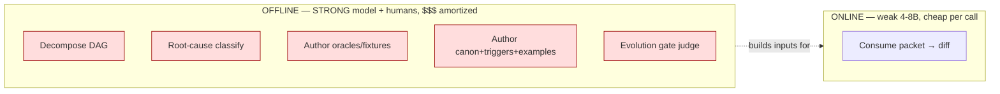
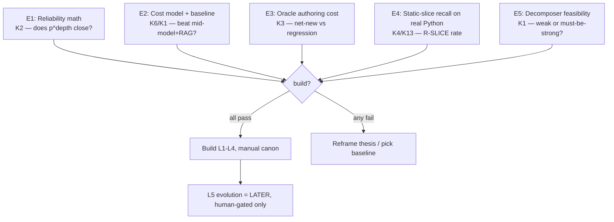

# 02c — Hostile Critique: Problem-Solution Proposal 3

> Adversarial review of [[02-problem-solution-proposal]]. Stance: hostile reviewer, find where it dies in production, not where it reads well on paper. Findings carry IDs (`K*`). Each: [claim] [attack] [fix]. Cross-refs proposal `P*/L*/C*/R*/Q*`.

## Verdict

Architecture coherent, internally consistent, well-mapped to priors. BUT thesis oversells. Headline "weak model + deterministic pipeline" is **false advertising**: design smuggles strong models into planning, root-cause, verify, and oracle-authoring — the expensive cognition just moved offline + got renamed "deterministic." Real system = strong-model-heavy build-and-maintain layer wrapping a cheap weak executor. That may still win, but the proposal never proves it, never costs it, never compares to the obvious baseline (one mid model + good RAG). Three load-bearing pieces (decomposer, oracle-per-task, self-evolution gate) are asserted, not de-risked — and they are exactly the pieces that decide whether the thing works. Proposal presents research-grade unknowns (L5, contracts, integration) with same confidence as solved pieces (static slice, budget pack). Ship blocker: no reliability math, no cost model, no cold-start plan.

## Severity map

| ID | Finding | Severity | Hits |
|---|---|---|---|
| K1 | "Weak model" thesis false — strong models smuggled everywhere | **CRITICAL** | TL;DR, P1, §9.1, Q1 |
| K2 | No reliability math — DAG compounding kills big-scope | **CRITICAL** | P7, C4, R4 |
| K3 | Oracle-per-atomic-task = hidden infinite cost | **CRITICAL** | P6, C5, §8 |
| K4 | Static-analysis "deterministic/exact" false for Python | HIGH | C2, P1, R-SLICE |
| K5 | Verifier is also weak — who verifies verifier | HIGH | P6, §8 |
| K6 | No cost/TCO model + no baseline comparison | HIGH | TL;DR economics |
| K7 | Cold-start: empty canon → C-ABSENT storm | HIGH | L5, bootstrap |
| K8 | Contracts on edges unauthored; integration unsolved | HIGH | C4, Q4 |
| K9 | L5 self-evolution = research, dressed as feature | MED | §9.1, Q6-8 |
| K10 | Budget numbers asserted, unmeasured | MED | C3 |
| K11 | "Failure = missing context" axiom unfalsifiable / loop trap | MED | TL;DR, P8, Q5 |
| K12 | Memory taxonomy = metaphor overfit, complexity unjustified | MED | L1, §9 |
| K13 | 1-hop dep slice arbitrary + insufficient | MED | C1, C2 |
| K14 | Packet caching (R1) doesn't work as claimed | LOW | R1 |

---

## K1 — CRITICAL: "weak model" thesis is false advertising

Claim (TL;DR, P1): "move ALL cognition into the pipeline, not the model... model is cheap interchangeable executor."

Attack: pipeline isn't a model-free oracle. Cognition didn't vanish — it relocated to:
- **Decomposer** (L2): Q1 itself admits "can 4-8B do DAG decomposition reliably?" → "likely hybrid." Decomposition into context-closed budget-fitting nodes IS the hardest reasoning in the whole system. If it needs a strong model, premise collapses — strong model just runs at plan-time instead of exec-time.
- **Root-cause classifier** (§9.1): explicitly "use a stronger model here — NOT the weak executor."
- **Adversarial reviewer** (P6, §8): if weak → K5. If strong → smuggled again.
- **Canon/trigger/oracle/example authoring**: human or strong-model cognition, just offline.

So honest framing = **strong-model (offline, build + plan + judge) + weak-model (online, narrow exec)** hybrid. That's a defensible architecture! But it's a DIFFERENT thesis with DIFFERENT economics. The "model is cheap interchangeable" line is then wrong: the irreplaceable expensive asset is now the strong-model-built pipeline + canon, bespoke per codebase.

Fix: restate thesis honestly as offline-strong / online-weak split. Draw where each tier runs. Re-derive cost under that truth. Drop "ALL cognition in pipeline" — replace with "online cognition minimized; offline cognition amortized."

Red = cognition the proposal calls "deterministic pipeline" but which actually needs intelligence. That's most of it.

## K2 — CRITICAL: no reliability math; compounding eats big-scope

Claim (P7/C4): atomize → one weak agent per leaf → reliable. R4 "error compounding" mitigated by "edge contracts + per-node verify."

Attack: do the arithmetic the proposal refuses to. Big-scope project = N leaf tasks on a DAG. Per-leaf net success after verify+bounded-retry = p. End-to-end (serial dependency chains) ≈ p^depth, and any unrecovered leaf can poison downstream.
- p=0.95, 50 nodes → 0.95^50 ≈ **8%** clean.
- p=0.99, 200 nodes → ≈ **13%**.
Atomizing INCREASES node count → MORE compounding, not less. The reliability move (shrink tasks) fights itself: smaller tasks = more tasks = more joints = more compounding. Verify gate raises p but never to 1 (verifier weak, K5; oracle incomplete, K3).

Fix: add explicit reliability budget. Define target end-to-end success, back out required per-node p and max DAG depth, show verify lifts p enough. If math doesn't close, the answer is FEWER bigger nodes (bigger model per node) — which attacks K1/K6. Prove compounding is bounded by checkpointing + integration gates, not just per-node verify.

## K3 — CRITICAL: oracle-per-atomic-task is the buried infinite cost

Claim (P6/§8): "Oracle: known-good PASS + planted-defect FAIL" gates every task. Called deterministic + free (R5).

Attack: oracle is free to RUN, brutal to AUTHOR. For EVERY atomic leaf you need a known-good reference + a planted-defect that the oracle distinguishes. For thousands of leaves on a novel big-scope project, who writes thousands of oracles? If a human → that's the whole engineering cost, undeclared. If a strong model → K1 again + who verifies the oracle is correct (a wrong oracle passes bad diffs or blocks good ones, silently). For genuinely novel code there IS no known-good — that's why you're building it. Oracle works great for regression (golden exists); it's circular for net-new (golden is the thing under construction).

Fix: separate task classes by oracle-availability. Regression/refactor/migration → golden exists, oracle cheap, approach strong. Net-new feature → no oracle → fall back to contract-check + tests + adversarial only; admit weaker gate there and size the residual risk. Cost the oracle-authoring labor explicitly. Don't call oracle "free."

## K4 — HIGH: "deterministic, exact" static analysis is false for the named language

Claim (C2/P1): primary retrieval = static analysis, "deterministic, exact"; vector only secondary.

Attack: stated canon target = "whole-company Python" (§5.1). Python static dep graphs are **notoriously incomplete**: duck typing, dynamic imports, `getattr`/`__import__`, monkeypatching, decorators, metaclasses, DI containers, runtime config, `**kwargs` passthrough. "Exact spans + 1-hop deps via static analysis" leaks on real Python. R-SLICE (missing-dependency failure) won't be a tail case — it'll be a dominant failure class on dynamic code. The proposal's most-trusted, most-deterministic component is the least reliable on its own stated stack.

Fix: state language assumptions. For Python, augment static with runtime traces / type stubs / import-time instrumentation, and treat slice as best-effort+verified, not exact. Budget for R-SLICE as common. Reconsider vector-as-secondary — on dynamic langs semantic retrieval may need to be co-primary.

## K5 — HIGH: the verifier is also weak — infinite regress

Claim (P6/§8): "adversarial reviewer agent, hostile, separate model."

Attack: if reviewer is also 4-8B with "questionable parametric knowledge," its hostility is noise — it hallucinates defects (false reject → wasted retries) and misses real ones (false accept → poison downstream). Separate-instance ≠ smarter. Only the deterministic gates (schema, contract, tests, oracle-when-it-exists) are trustworthy; the LLM-judge gate inherits the exact weakness the whole design exists to route around. "Cheap weak models in parallel" (R5) = averaging unreliable judges, not getting a reliable one.

Fix: rank gates by trust. Lean on deterministic gates (schema/contract/compile/test). Use LLM-judge only as advisory or for classes where deterministic gates can't reach, and measure its precision/recall before trusting it to gate. If LLM-judge must gate, it's a job for a STRONG model (K1). Quantify verifier reliability — an unmeasured judge is not a gate.

## K6 — HIGH: no cost model, no baseline comparison

Attack: entire premise "must use 4-8B / 32k" is a stated constraint, never justified, never costed. Hostile question: **why?** Per-token cheapness of 4-8B is irrelevant if the SYSTEM (compiler + index + oracle authoring + canon curation + evolution loop + multi-call verify + retries) costs 10× to build/run. No TCO. No comparison vs the obvious alternative: one 14-32B model + good RAG + tests, far less bespoke machinery. The proposal optimizes the cheap variable (model) and ignores the expensive one (the pipeline + human curation it demands).

Fix: build a cost model: $/delivered-task incl build amortization, curation labor, verify fan-out, retry tax, wall-clock. Compare head-to-head with mid-model+RAG baseline on the same task set. If weak-model-pipeline doesn't beat baseline on $ AND reliability, the constraint is wrong, not the world.

## K7 — HIGH: cold-start canon storm

Attack: L5 makes the system "self-improve" by mining failures into canon. Day 1 canon is thin/empty → most tasks hit C-ABSENT → failure → human triage (§9.1 "human-in-loop initially"). "Initially" hides possibly months of hand-authoring canon + triggers + oracles + examples + decomposition heuristics before the loop pays off. Self-evolution is a long-tail optimizer, NOT a starting capability. Proposal reads as if the loop bootstraps the system; it doesn't — humans bootstrap it, loop only maintains.

Fix: separate "bootstrap canon" (manual, big up-front cost, declare it) from "evolution" (maintenance). Plan the cold-start: seed canon from existing linters/style guides/typed contracts before any run. State the human-quarter cost honestly.

## K8 — HIGH: edge contracts unauthored; integration is where big-scope dies

Claim (C4): "contracts on DAG edges → weak agents never need global view." Q4 admits cross-task global invariants "where enforced? likely integration tests."

Attack: who AUTHORS the edge contracts? The decomposer (K1 — weak/hybrid). Wrong contract → every downstream leaf builds correctly to a WRONG interface, each passes local verify, integration explodes. Big-scope projects fail at integration/global-invariant level, not leaf level — and that's exactly the proposal's thinnest coverage (one Q, "likely integration tests"). Per-node verify gives false confidence: green leaves, red system.

Fix: treat contract authoring as a first-class verified artifact (strong model + human sign-off + consistency check across the DAG). Add an explicit integration plane with global-invariant gates, not a parenthetical. Most reliability risk lives here — fund it accordingly.

## K9 — MED: L5 is research masquerading as a shipped plane

Attack: §9.1 presented with same confidence as L1-L4, but Q6/Q7/Q8 admit its core is unsolved: can root-cause classifier bucket accurately (Q6)? which classes ever earn auto-merge (Q7)? **can you even attribute a failure-rate drop to a canon change vs confounders (Q8)?** Loop-closure (the metric that proves learning works) is a known-hard causal-inference problem with model-swap + code-drift confounders. Until Q8 is solved you can't tell if the loop helps or just churns canon.

Fix: stage it. Ship L1-L4 + manual canon. Run L5 as offline analytics + human-approved enrichment ONLY. Treat auto-merge as a research track gated on a working loop-closure metric. Don't market self-evolution until Q8 has an answer.

## K10 — MED: budget partition is a guess

Attack: C3 table ("~6k CANON, ~8k CODE-SLICE...") flagged "example baseline, tune per task class" = unmeasured. Whole approach rests on "tasks decompose to fit 32k with margin." No data on what fraction of real tasks fit, or whether fit-forcing produces incoherent micro-tasks (too small to be a meaningful change). 8k headroom assumes small diffs.

Fix: measure on a real corpus: task-size distribution after decomposition, fit rate, overflow rate per class, diff-size distribution. Show fit is achievable without shredding tasks into meaningless fragments.

## K11 — MED: "failure = missing context" axiom is a trap

Claim (TL;DR/P8): "a failed task = missing context, not a dumb model → fix the packet."

Attack: M-LIMIT class (§9.1) admits model-capability ceilings exist — so the axiom is false as stated; truth is "MOST failures are context." But the retry policy (§8) re-engineers context first, and the retry-vs-split boundary (Q5) is unsolved. Misclassify an M-LIMIT failure as missing-context → add canon/examples/slice that CAN'T help → burn retries → eventually escalate after waste. Unfalsifiable axiom + unsolved boundary = systematic waste on hard tasks.

Fix: solve Q5 before relying on the loop. Add a fast M-LIMIT detector (e.g. n-sample agreement / capability probe) to short-circuit context-re-engineering on genuinely-too-hard tasks. Reframe axiom as empirical hypothesis with a measured context-vs-limit split.

## K12 — MED: memory taxonomy is metaphor overfit

Attack: whole L1 + §9 derived from [[00-memory-101]] — a human-mnemonics blog's cognitive-psych taxonomy. Analogy "agent memory should copy biology" is suggestive, not engineering evidence. Five typed stores add real complexity (K7 curation cost). No measurement that typed-split beats a well-engineered single store with metadata/scope filters (standard, much cheaper) FOR THIS TASK. "One blob inherits every bias" is asserted; a structured single store with provenance+TTL+scope tags may capture 90% of the benefit at 30% of the complexity. Cargo-cult risk: architecture shaped by metaphor, not by measured failure.

Fix: justify the split empirically or collapse it. Start with one store + rich metadata + scoped retrieval; promote to physically-separate stores only where a measured failure mode demands it. Let complexity follow evidence (mirrors proposal's own R7).

## K13 — MED: 1-hop slice is arbitrary

Attack: C1/C2 take "edit spans + immediate (1-hop) deps." Real correctness often needs transitive context: base class 2 levels up, the contract of a dep's dep, a type defined 3 imports away. 1-hop = arbitrary cutoff: too shallow → R-SLICE misses; walk deeper → blow 8k. No principled depth selection.

Fix: make slice depth relevance-driven, not fixed-hop — follow the dep edges the contract/types actually require, bounded by budget, log what got cut. Tie to K4 (dynamic-lang dep discovery).

## K14 — LOW: packet caching mitigation is hollow

Attack: R1 mitigates decomposition overhead by "cache packets per task-class." Packets are task-SPECIFIC (exact spans, this task's contract). Cross-task packet reuse is near-zero. Only sub-components (canon rules, examples, templates) cache.

Fix: drop "cache packets"; say cache the reusable INPUTS (activated-rule sets per signal-set, examples, index queries). Honest and still useful.

---

## What's actually good (so critique is credible)

- Inversion "shrink task to model" is the right instinct for weak models — directionally correct.
- Budget-as-contract + no-silent-truncation (P5, DROPPED log) = genuinely good discipline.
- Canon-by-trigger not canon-by-dump (C6) = the strongest, most novel, most defensible idea here. Keep it.
- Inline-don't-cite for unreliable priors (P3) correctly follows from the constraint.
- Risk table (R*) + open questions (Q*) are honest — the proposal already points at most of its own wounds. Critique mostly = "you flagged it as a Q, now treat it as a ship blocker, not a footnote."

## Prioritized fixes (what to PROVE before building)

1. **E1 reliability math** (K2) — cheapest, most decisive. Spreadsheet, an afternoon. If compounding doesn't close, stop.
2. **E2 cost + baseline** (K6, K1) — bench weak-pipeline vs one mid model+RAG on identical tasks. Decides if premise survives.
3. **E3 oracle cost** (K3) — author oracles for 20 real net-new tasks; measure hours. Extrapolate.
4. **E4 slice recall** (K4) — run static slicer on real Python module, measure missed deps vs runtime trace.
5. **E5 decomposer** (K1) — can a 4-8B decompose a real feature to fitting context-closed leaves? If no → thesis is hybrid, rewrite TL;DR.

## Kill-criteria (be honest up front)

- E1: target end-to-end success unreachable at feasible per-node p → **architecture wrong for big-scope**; need fewer/bigger nodes.
- E2: baseline mid-model+RAG matches reliability at lower TCO → **build the baseline, shelve this**.
- E5: decomposition needs a strong model → **drop "weak model" framing**, own the hybrid, recost.

## One-line counter-thesis

Proposal is a strong sound design for an **offline-strong / online-weak hybrid with manual-bootstrapped canon** — but it's marketed as a self-evolving weak-model system, and the three pieces that decide success (decomposer, oracle-per-task, evolution loop) are asserted not proven. Fix the framing, do the five experiments, gate the build on E1+E2, and ship L5 last.
